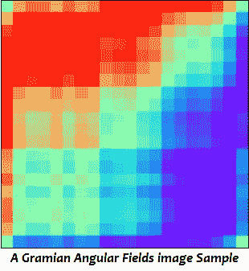
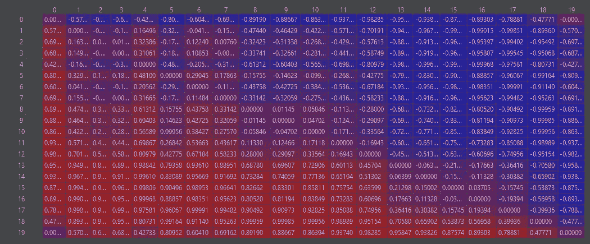
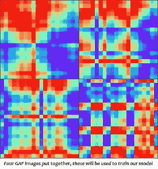

# 如何使用卷积神经网络将时间序列编码成用于金融预测的图像

> 原文：<https://towardsdatascience.com/how-to-encode-time-series-into-images-for-financial-forecasting-using-convolutional-neural-networks-5683eb5c53d9?source=collection_archive---------7----------------------->

罗姆尼耶佩兹(pixabay.com)

## [实践教程](https://towardsdatascience.com/tagged/hands-on-tutorials)

在预测领域，有一个古老的问题，*我看到的是一种趋势吗*在统计学领域，有许多工具可以回答上述问题，并取得了不同程度的成功。然而，还没有一种方法能够实现数据预测领域最初的目标。查看由数据得出的图表，并从中得出结论。

然而，由于深度学习和人工神经网络，这种情况即将改变。

欢迎计算机视觉！

我偶然发现了意大利卡利亚里大学数学和计算机科学系的师生团队撰写的研究论文[“深度学习和金融预测的时间序列到图像编码”](https://ieeexplore.ieee.org/document/9080613)。

在报告中，该团队提出了一种新的金融预测方法:将时间序列转换为图像，并使用卷积神经网络来识别视觉模式，从而对未来的市场走势进行预测。一项艰巨的任务。此外，上述方法可以应用于任何预测问题，并应在一定程度上的准确性，产生良好的结果。

这篇论文很吸引人，我强烈推荐你阅读，因为它深入研究了他们方法背后的数学，并将这种方法的长期表现与简单的买入-持有-卖出策略进行了比较。

不幸的是，它不包含任何代码，也没有提供任何数据来源。所以，我决定追根究底，对他们的工作进行逆向工程，并分享我的发现。

在进入我的过程之前，让我们解决一个基本问题:我们如何以一种有意义的方式可视化时间序列，以便我们可以用它训练一个深度学习模型？

让我们开始吧！

# 介绍格拉米角场！

格拉米角场(GAF)是在非笛卡尔坐标系中表示时间序列的图像(即，平面上的每个点由 X 和 Y 轴参考)。相反，坐标由极坐标系统映射(即，平面上的每个点由距参考点的距离和距参考方向的角度确定)。因此，每个 GAF 代表每个时间点之间的时间相关性。

由脚本生成的图像

要了解更多关于格拉米角度场的信息，请阅读马里兰大学的王志广和蒂姆·奥茨所著的《[】使用平铺卷积神经网络](https://www.aaai.org/ocs/index.php/WS/AAAIW15/paper/viewFile/10179/10251) 将时间序列编码为图像，用于视觉检查和分类。在论文中，他们深入研究了 GAF，并引入了将时间序列编码到图像中以训练卷积神经网络的想法。

# 预处理:

现在，让我们来看看数据。卡利亚里大学的研究人员使用了从 1999 年到 2015 年的五分钟间隔标准普尔 500 价格。不幸的是，我无法免费找到相同的数据，所以我使用了 IBM 年的股价。

数据是从这里的[提取的](http://www.kibot.com/free_historical_data.aspx)，在我们使用它之前需要一些工作，因为一秒一秒的数据是杂乱的。该数据还包含发生在周末、节假日和非交易时间的交易活动，由于其可变性，这会给我们的模型带来噪声。

## 我们需要什么库:

我将用 Python 3.7 编写代码。您需要安装 requirements.txt 文件中的依赖项(在 repo 中)。最臭名昭著的是 *Pyts(一个专门用于时间序列分类的* Python 包，这里用来将我们的时间序列转换成 GAFs 矩阵)。

## 让我们写一些代码！

我们需要一种方法来创建 GAF 图像，并将它们放在代表我们试图预测的两个类的目录中:Long 或 Short。

我将从编写助手方法开始。第一个工具读取我们的文件，并以一小时为间隔将数据分组。使用 *Pandas Grouper* 函数，我们可以按给定的时间-频率对数据进行分组，用零填充缺失的时间并删除重复的时间。这将平滑我们的数据，消除不一致，并减少内存使用。

接下来，我去掉周末、节假日和非交易时间的数据，注意市场在上午 9:30 开门；然而，为了精确到小时，我捕捉了上午 9:00 开始的预开放活动。

一旦数据是干净的，我就开始制作 GAF 图像。我构造了方法*‘set _ GAF _ data’。*它提取 20 天的数据。然后，它将时间序列聚合成四个不同的时间间隔(一小时、两小时、四小时和一天),并收集所述聚合的最后二十行。每个收藏都将成为一个独特的图像，显示时间的演变，导致我们的交易日。

请注意，一个交易日的最后一个数据点决定了所做的交易决定:如果第二天的收盘价高于当天的收盘价，则做多；如果相反或价格相同，则做空。

预处理后的数据通过包装器方法 *create_gaf* 传递。它是来自 *Pyts* 包的*gramiangularfield*类的一个实例的包装器。

它为每个 *(Xi，Xj)* 创建一个时间相关性矩阵，首先将值重新调整为-1 到 1 之间的数字，然后计算极坐标。每个收集的时间序列成为一个 *N x N* 矩阵，其中 *N* 是时间序列中的行数(在我们的例子中是 20)。

输出应该如下所示:

矩阵样本

矩阵来自同一个交易日，但在不同的时间间隔。然后，每个值都被转换成 GAF 图像，组合成一个更大的图像(其中每个值都被转换成 RGB 颜色矩阵)，并保存为长文件夹或短文件夹中的 *png* 文件。结果看起来是这样的:

脚本的最终结果

这样一来，我们就可以开始制作模型了。

# 型号:

由于我电脑的内存限制，我实现了一个不同于卡利亚里大学的人用来构建我的模型的模型。我正在使用 Keras 建立一个序列模型。

我选择建立一个集合模型(训练 3 个模型并平均它们的分数)。它包含八个 *2D* 卷积层，其中 *relu* 用于激活函数，一个密集层用于获得二进制预测。我每隔几层就增加我的神经元数量，增加 0.4 的辍学率来标准化我的层输入，并对网络进行批量标准化。我通过反复试验得出了这些价值观，我鼓励你们实现自己的模型。

由于有限的计算能力、时间和数据，我决定该模型在我支持 GPU 的笔记本电脑上训练的时间不应超过 15 分钟(使用 Nvidia GeoForce 显卡和 6GB GPU)。这反映在我选择的超参数上，请随意相应地更改它们。我会在下面附上我的回购的链接。

下一步是编译模型，我使用 Adam 作为我的优化器(最适合二值图像分类)。将我的学习率设置为 *1e-3* ，并将准确度设置为我正在获取的衡量学习绩效的指标。

我要衡量的是准确性。

我通过我建立的一个名为 *ensemble_data* 的助手方法来运行数据，它的设计是根据网络的数量来分割数据。然后，每个网络在稍微不同的图像集上接受训练。下一步使用 Keras*image data generator*，调整图像大小，并在内存中将它们分成训练、验证和测试集。如果您从未使用过它，我强烈建议您使用，它通过传递数据源路径或数据帧来映射您的类。

在拟合模型的时候，为了提高性能，我用*reduceronpulate*设置了我的回调，如果模型的性能没有随着时间的推移而提高，这将降低我的学习率。我添加了每个时期的步骤数和验证步骤。然后我训练了这个模型。最后，保存并评估模型。

# 调查结果:

集成模型的得分准确度与卡利亚里团队的得分准确度相似，约为 52%。结果是通过平均所有网络的分数计算出来的。虽然它看起来很低，但在 50%以上的时间里保持正确的交易头寸被认为是好的，特别是当单独看数据的时候。

此外，当我们谈论长期决策时，卡利亚里的团队报告说，他们的模型远远超过了其他交易策略。更不用说，如果这个方法本身就能预测市场，我就不会写这个了。

虽然我在本文中关注的是 IBM 的历史价格数据，但是这个模型可以更加复杂。例如，除了交易数据之外，您还可以将基本面分析、风险指标、情绪分析、ESG 分数等数据叠加到图像上。

# 总之:

计算机视觉具有准确发现趋势和市场动向的潜力，特别是考虑到在同一观察中可以利用多个数据源时。此外，它还可以应用于任何预测问题，并应提供有意义的结果。

## 来源:

*   [Silvio Barra、Salvatore Mario Carta、Andrea Corriga、Alessandro Sebastian Podda 和 Diego Reforgiato Recupero 的深度学习和时间序列到图像编码用于金融预测](https://ieeexplore.ieee.org/document/9080613)
*   *[王志广和蒂姆·奥茨使用平铺卷积神经网络](https://www.aaai.org/ocs/index.php/WS/AAAIW15/paper/viewFile/10179/10251) *将时间序列编码为图像，用于视觉检查和分类**
*   *我的回购:[https://github.com/cmazzoni87/ComputerVisionRegression](https://github.com/cmazzoni87/ComputerVisionRegression)*