# 如何丰富 POS 数据以分析和预测 CPG 销售

> 原文：<https://towardsdatascience.com/how-to-enrich-pos-data-to-analyze-predict-cpg-sales-5faa9f059f83?source=collection_archive---------41----------------------->

## [实践教程](https://towardsdatascience.com/tagged/hands-on-tutorials)

## 了解如何丰富和执行零售点数据的空间建模，以分析 CPG 销售并预测新位置的未来业绩

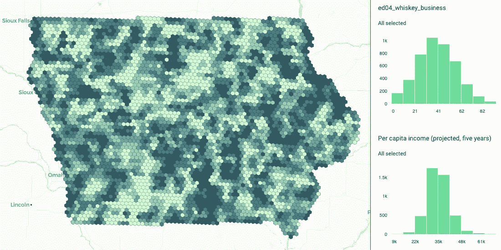

作者图片

在过去的一年里，消费者的行为发生了显著的变化，许多人认为这是永久性的。去年，美国 T2 的消费品销售额增长了 10.3%，达到 9330 亿美元(T3)，因为消费者囤积了餐具、清洁产品和其他消费品。

> *消费者习惯一旦在我们的类别中确立，就很难逆转。我们确实预计，人们会对正在形成的新习惯产生一些粘性。* [*乔恩默勒*](https://en.wikipedia.org/wiki/Jon_R._Moeller) *、首席运营官&首席财务官* [*宝洁&*](https://www.pg.com/)*。*

尽管市场有所增长，但大型制造商的市场份额还是下降了 1.3%，或者说销售额下降了 121 亿美元，这些都被较小的制造商填补了包括肥皂、洗手液和家庭保健用品在内的供应短缺。

很明显，对于 CPG 行业中各种规模的参与者来说，都有很多机会，许多分析师现在都在关注从地理意义上来说，他们应该将精力集中在哪里。正如我们在[之前的](https://carto.com/blog/how-to-use-spatial-data-to-identify-cpg-demand-hotspots/) [帖子](https://carto.com/blog/react-to-changing-face-retail-diy-behavioral-data/)中所看到的，使用[空间数据科学](https://carto.com/what-is-spatial-data-science)不仅可以更深入地了解历史销售业绩，还可以用来预测新市场和区域的未来增长。

在本案例研究中，我们提出了一种利用多种类型的空间数据来分析影响销售点(POS)性能的因素的方法。通常，这将涉及每个地区或每个经销店/商户的时间序列分析，其中每个库存单位(SKU)的销售额以周为单位进行建模。本文介绍了一种不同的方法，其中研究了空间变异性，以确定导致不同地区销售业绩不同的驱动因素。

作为第一步，我们利用 [CARTO 的空间特征](https://carto.com/blog/spatial-features-new-derived-dataset-from-carto/)数据集构建一个模型，考虑每个商家附近的兴趣点(POI)的数量和类型来分析销售业绩。第二步，我们用通过[数据观测站](https://carto.com/spatial-data-catalog/browser/)获得的其他空间数据集来补充基于兴趣点的特征，以进一步改进推断。为了说明和比较附加空间信号对预测的改善，为每个 SKU 构建了两个模型:一个仅使用 POI 计数，另一个使用来自其他数据集的附加驱动因素。在这两个模型中，感兴趣区域(AOI)被分割为像元，使用分辨率为 6 的 H3 格网，销售额被汇总为 2018-2019 年期间的周平均值。

# 数据源

出于分析目的，使用了公开可用的[爱荷华州白酒销售数据](https://data.iowa.gov/Sales-Distribution/Iowa-Liquor-Sales/m3tr-qhgy)。该数据集包含从 2012 年 1 月 1 日至今，按产品和购买日期分类的爱荷华州“E”级酒类许可证持有者的烈酒销售信息。“E”类许可证被描述为:

> 杂货店、酒类和便利店等。允许销售未开封的原装酒精饮料。饮料不卖。周日销售包括在内。也允许向内部 A、B、C 和 D 类酒类许可证持有者进行批发销售，但必须持有 TTB 联邦批发基本许可证。

每个产品和商店的销售数据点每周汇总一次。对于产品，它被认为是项目描述和瓶子大小的结合。

为了分析爱荷华州不同地点的销售差异，我们选择了 CARTO 数据观测站中可用的不同空间数据源，这些数据源可以帮助我们确定哪些因素会影响该州 SKU 的销售。

如简介中所述，第一个模型利用了:

*   [CARTO 空间特征](https://carto.com/spatial-data-catalog/browser/dataset/cdb_spatial_fea_ab121469/):人口、年龄和性别，以及不同类别的兴趣点计数。

然后，在第二个模型中，我们包括来自以下数据集的附加要素:

*   [来自](https://carto.com/spatial-data-catalog/browser/dataset/mc_geographic__7980c5c3/)[万事达卡](https://www.mastercard.com)的地理洞察:提供一个地点的基于销售的动态数据，这些数据衡量信用卡消费、交易数量、平均门票等的变化。，随着时间的推移发生在零售区域；
*   [来自](https://carto.com/spatial-data-catalog/browser/dataset/spa_geosocial_s_d5dc42ae/) [Spatial.ai](https://www.spatial.ai/) 的地理社会细分:基于分析具有位置信息的社会媒体馈送的行为细分；
*   [社会人口统计](https://carto.com/spatial-data-catalog/browser/dataset/ags_sociodemogr_a7e14220/)来自 [AGS](https://appliedgeographic.com/) :当年估计的基本社会人口统计和社会经济属性；
*   [人类移动性—来自](https://team.carto.com/u/argyrios/dashboard/datasets/spatial-data-catalog/dataset/sg_patterns_3eafd5c5/)[安全图](https://www.safegraph.com/)的模式:一段时间内对兴趣点的访问归属；
*   Bigquery 公共数据集-人口普查局美国边界。

使用 [H3 格网](https://eng.uber.com/h3/)的标准格式，爱荷华州被分割成分辨率为 6 的六边形格网单元，这产生了 4428 个单元，每个单元覆盖大约 65 平方公里。这样做的理由是检查一个地区的驱动程序，而不是特定的商户位置。特定分辨率是一个很好的选择，它足够精细以引入可变性，并且足够宽以捕捉一个区域的影响。生成的网格如下图所示:

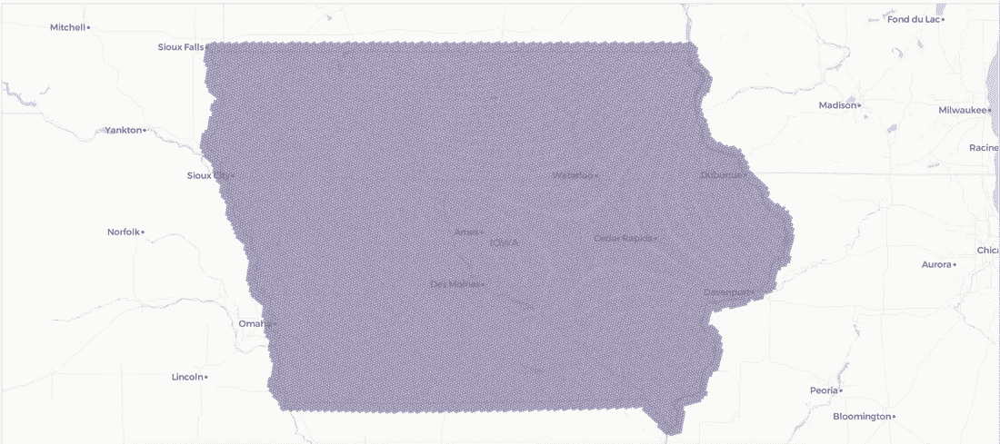

作者图片

我们将分析重点放在以下三个 SKU 上:

*   鹰眼 _ 伏特加 _1750
*   Titos _ 手工 _ 伏特加 _1000
*   摩根船长加香料朗姆酒 1000

对于这些 SKU 中的每一个，计算每个 H3 单元的平均周销售额。使用 2018-2019 年期间，因为在 2020 年，由于新冠肺炎的影响，许多商店关闭或表现不佳，销售不稳定。此外，每周平均销售额根据每个单元中的商店数量进行调整，以获取一个区域内每个商店的平均业绩。最后，销售额按人口比例计算，因此创建了每个细胞的指数，表明对特定 SKU 的偏好。该信令值的日志将在最后建模。这些转换的基本原理不仅是创建一个索引，而且是规范化要建模的变量。

下面可以看到 SKU“伏特加鹰眼 1750 毫升”的信号的例子:

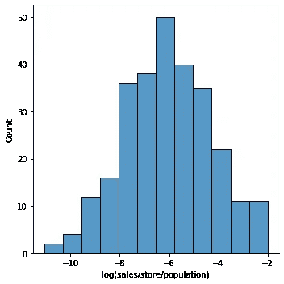

作者图片

这些转换使我们能够在不知道每个单元的商店数量的情况下，在其他地区或州执行销售预测，从而了解这种类型的产品在其他地区的市场潜力，这些地区我们没有实际的销售数据(我们将在本文稍后展示)。

请注意，该分析是根据 SKU 进行的，但在某些情况下，也可以根据品牌、制造商等进行。这取决于用户想要执行的分析水平。

# 数据丰富

然后使用[线框](https://carto.com/cartoframes/)中可用的[数据丰富](https://carto.com/developers/cartoframes/guides/Data-Observatory/#data-enrichment)方法，用以下特征丰富网格的每个单元。

对于我们使用的第一个模型:

*   CARTO 空间特征:男性/女性人口，与*交通、休闲、医疗保健、食品&饮料、金融、教育、零售、旅游相关的兴趣点。*

然后，在第二个模型中，我们丰富了以下功能:

*   万事达卡地理洞察:总零售类别的平均门票交易；
*   AGS 社会人口统计:平均收入，中等年龄；
*   AGS 消费者支出:家庭平均酒精饮料支出；
*   Spatial.ai Geosocial 细分市场:威士忌生意、葡萄酒爱好者、深夜休闲、派对生活、嘻哈文化；
*   安全图模式:每个牢房每周平均探访次数，离家平均距离。
*   美国人口普查局边界:计算每个单元中被视为城市的面积百分比。

生成的要素示例如下图所示:

对于数据丰富阶段的每个选定变量，计算基于相邻像元的空间滞后值。我们计算了两种滞后值，一种是相邻值的总和，另一种是相邻值的平均值。请注意，相邻像元被认为是与感兴趣像元共享一条边的像元。对于人口、兴趣点和游客数量等特征，使用总和，而对于其他特征，则考虑平均值。例如，在下图中，总滞后值为 62，而平均值为 10.3:

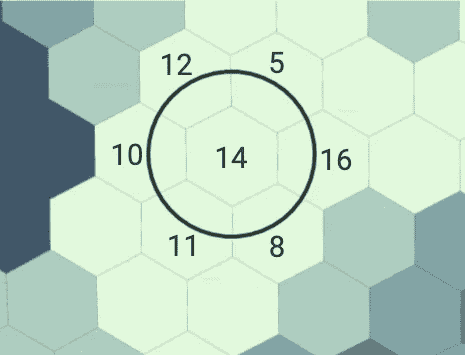

作者图片

# 特征选择

对于特征选择分析，我们仅使用具有实际 SKU 销售额的像元，不考虑没有销售额的像元，因为数据集仅包含某些商店。

在进行特征选择过程之前，首先需要转换特征。兴趣点及其滞后值被最小-最大化，而其余变量被标准化。为兴趣点选择了最小-最大值，因为这些是整数，显示了一个区域中每个类别的数量，使用最小-最大值可以创建一个指数，显示每个区域相对于其他区域的满足程度。特征的缩放是一种常见的做法，就好像它没有被应用，那么具有最高量级的特征倾向于占主导地位。因此，通过这一过程，一切都被引向同一个参考。

特征选择过程参考第二模型，其中使用除空间特征 poi 之外的附加特征。

特征选择的第一步是移除相关特征，这是通过使用[方差膨胀因子](https://en.wikipedia.org/wiki/Variance_inflation_factor) (VIF)完成的。对于每个 SKU，必须重复特征选择的过程，因为在每种情况下相关的细胞是不同的。VIF 的流程如下:

1.  计算每个变量的 VIF
2.  按降序排列
3.  如果大于 20 则删除最高，否则退出
4.  回到步骤 1

通过这种方式，我们可以确保其余要素之间没有重大的多重共线性。遵循先前的选择；对于每个 SKU，使用线性回归进行反向选择过程，去除 p 值大于 0.1 的协变量。移除后，建模从头开始运行。下面是 SKU“伏特加鹰眼 1750”的生产过程和其他特征的一个例子:

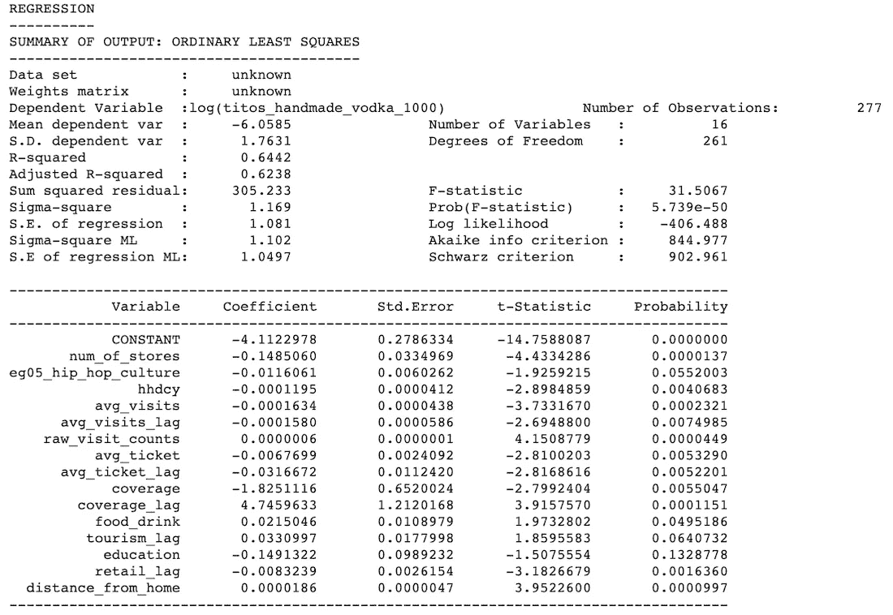

下表详细列出了变量缩写和描述。{变量名}+"_lag "变量表示变量的滞后版本。

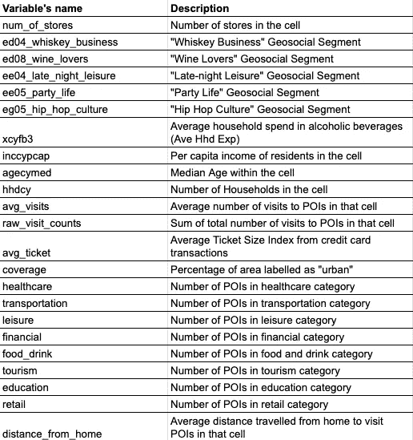

# 空间建模

在降低了所探索的特征的维度之后，我们继续构建空间模型。

# 方法学

如导言中所述，产生了两种类型的空间模型:

1.  仅使用来自空间特征的兴趣点；
2.  使用先前要素选择过程中得到的所有要素，并利用所有引入的空间数据集。

对于每个模型，为最终回归建立一个堆叠集成算法。

对于每个 SKU，使用数据集上具有 5 个折叠的 K 折叠，训练 5 个不同的模型，每个模型用于不同的训练集。该模型基于[国王回归](https://en.wikipedia.org/wiki/Regression-kriging)，使用[随机森林算法](https://en.wikipedia.org/wiki/Random_forest)作为基础。针对数据集的剩余部分对每个模型进行验证，验证的 R 平方(R2)保存为权重 weight_j_sku，其中 j 是模型的编号，sku 是目标 sku 的编号。

最后，对于每个 SKU，训练了 5 个不同的模型。对于推论，预测计算如下:

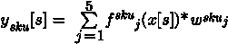

其中 y[s]是单元格 s 处 sku 的预测值，

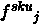

SKU 和重量的 j^th 模型:

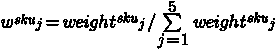

# 结果

在下表中，可以看到每个 SKU 和模型(仅空间要素 poi 和所有其他要素)的 R 平方和平均绝对误差(MAE)。请注意，错误指的是每个商店的平均每周销售额，这意味着模型的错误被人群缩小了。提醒一下，模型变量已经通过每个单元的人口进行了标准化。仅包含空间要素 poi 的模型的性能仅比包含全部要素的模型稍差，这表明空间要素数据集具有强大的建模能力。

一个非常重要的观察结果是，1000 毫升瓶装的 SKU 比 1750 毫升的 SKU 表现更好。一个可能的解释是，较大数量的产品可能更多地涉及企业，而不是家庭/个人消费。因此，在未来的分析中，我们应该区别对待大批量产品，因为这些产品可能包括从批发商到企业的销售(这与小零售商销售给个人的商业动态不同)。

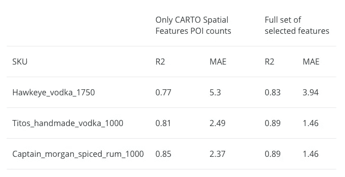

对于每个 SKU，集合中一个模型的 [Shapley 值](https://en.wikipedia.org/wiki/Shapley_value)可以在下面找到。据观察，最重要的因素是每个像元中的家庭数量、Safegraph 数据集中该像元中 poi 的平均访问次数以及空间要素中的食品&饮料 poi。对于所有三个 SKU，poi 的访问量是一个具有积极影响的重要因素，因为您预计客流量可以转化为一个地区购买力的指标。此外，一些变量的滞后版本，如零售和旅游类别中的兴趣点数量(指示相邻单元中发生的情况),似乎对销售业绩的建模点也很重要。相邻小区中 POI 的数量倾向于以积极或消极的方式影响邻近区域。例如，对于鹰眼伏特加，旅游滞后变量与销售额呈正相关，这意味着附近的旅游兴趣点数量越多，销售额越高。

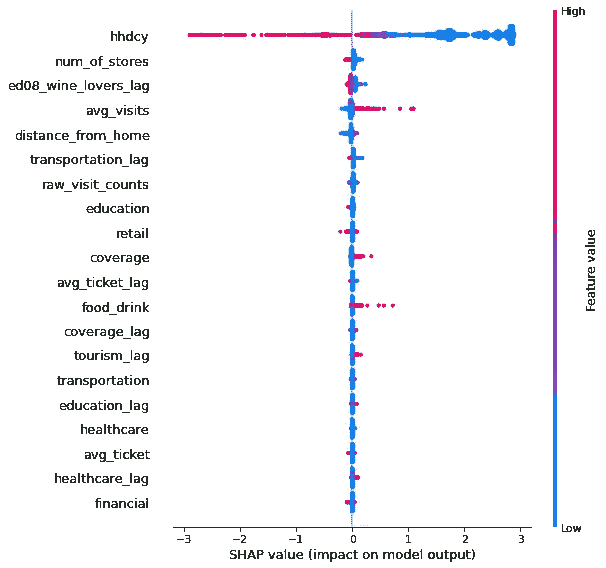

SHAP 值为 SKU 鹰眼 _ 伏特加 _1750

**Titos _ 手工 _ 伏特加 _1000**

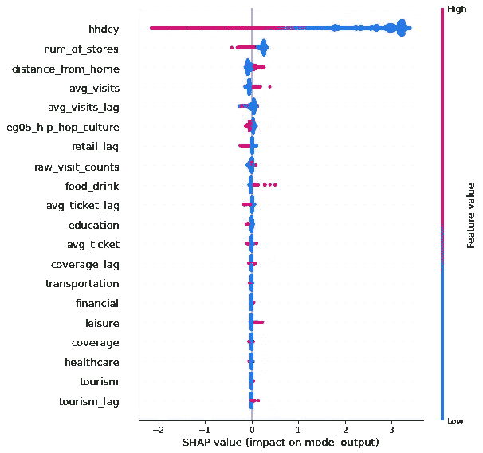

SHAP 值为 SKU Titos _ 手工 _ 伏特加 _1000

**摩根船长 _ 五香 _ 朗姆酒 _1000**

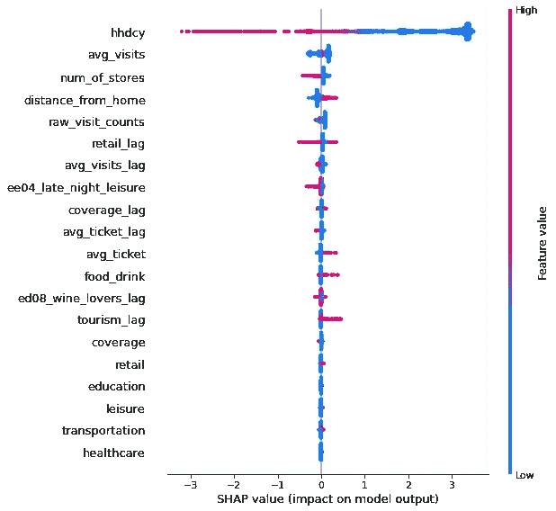

SKU SHAP 值 Captian _ morgan _ 五香 _ 朗姆酒 _1000

# 使用该模型估计不同地区的销售潜力

使用上一节中构建的第二个模型，我们可以得出内布拉斯加州三个 SKU 的销售潜力估计值，该地区我们没有实际的销售数据。内布拉斯加州也被分割成与爱荷华州分辨率相同的 H3 格网，并且像元中包含了上一节数据丰富中描述的信息。然后，对于三个 SKU 中的每一个，应用具有所有选定特征的空间模型，输出如下图所示。在 CPG 产品推广战略或零售场所规划的背景下，当进入一个您还没有任何绩效指标的新领域时，此步骤对于精心制定走向市场战略非常有用。深入研究这些数字，最高值出现在靠近内布拉斯加州主要城市的地方，非常低的值出现在似乎与世隔绝的地区，这是意料之中的。

SKU 鹰眼 _ 伏特加 _1750 的销售预测

Titos _ 手工 _ 伏特加 _1000 销量预测

SKU Captian _ mor gan _ 五香 _ 朗姆酒 _1000 的销售预测

# 结论

从空间角度分析了现有的爱荷华州白酒数据，旨在揭示驱动不同 SKU 消费的因素以及爱荷华州不同地区之间的差异。分析在 SKU 水平上进行，并使用 2018-2019 年期间。在分辨率为 6 时，该州被划分为 H3 像元格网，每个像元都包含来自数据观测站的数据(即人口统计、金融、人员流动、行为和兴趣点)。

我们提出了一种方法来选择最相关的功能，以及如何利用空间数据科学对平均每周销售额进行建模。最后，我们推断了内布拉斯加州的结果，我们没有该州的销售数据，以便确定那些更有潜力销售这些 SKU 的地区。

*原载于 2021 年 3 月 1 日*[*【https://carto.com】*](https://carto.com/blog/how-to-enrich-pos-data-analyze-predict-cpg-sales/)*。*