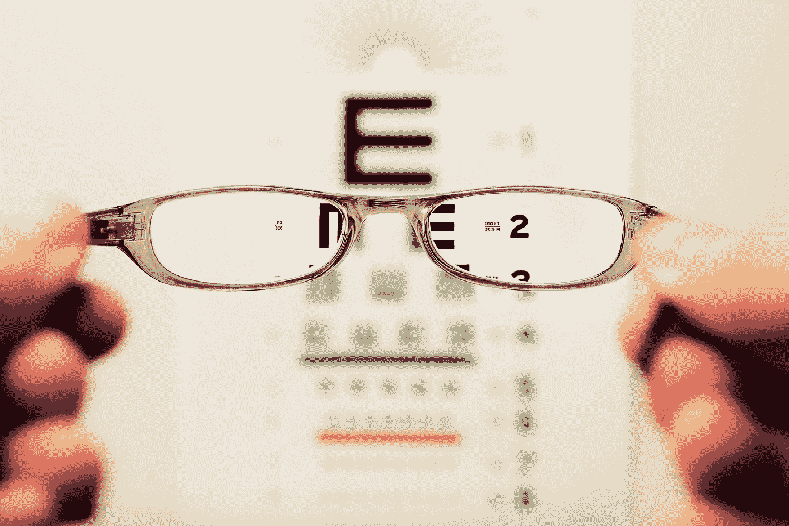

# 如何参加一个简单的 Kaggle 比赛

> 原文：<https://towardsdatascience.com/how-to-enter-a-simple-kaggle-competition-9705faf3a1b7?source=collection_archive---------44----------------------->



戴维·特拉维斯在 [Unsplash](https://unsplash.com?utm_source=medium&utm_medium=referral) 上拍摄的照片

## 用数字识别竞赛的支持向量机模型进行图像分类

如果你正在成为一名数据科学家，并且想要测试你的技能，那么 Kaggle 是一个不错的起点。我将在以后的文章中深入讨论本文中使用的模型如何工作的更多细节，但是首先，重要的是要理解 Python 如何使准备数据、遍历数据和处理数字变得简单和令人惊讶地容易。

# 资源

  

我在这个项目中使用的 Kaggle 笔记本位于:

<https://www.kaggle.com/thirdeyecyborg/simplesvcdigitrecognizer>  

我建议您先看看我写的一些文章，让您快速掌握 Python 基础知识。

<https://medium.com/python-in-plain-english/a-brief-history-of-the-python-programming-language-4661fcd48a04>  <https://medium.com/python-in-plain-english/python-basic-overview-76907771db60>  <https://medium.com/python-in-plain-english/python-beginners-reference-guide-3c5349b87b2>  <https://medium.com/analytics-vidhya/the-best-ides-and-text-editors-for-python-872ff1176c92>  </an-overview-of-the-anaconda-distribution-9479ff1859e6>  </an-overview-of-the-pep-8-style-guide-5672459c7682>  </introduction-to-pandas-cc3bc6355155>  </getting-started-with-data-science-in-python-92326c171622>  

# 目录

[**什么是 Kaggle？**](https://medium.com/@third_eye_cyborg/how-to-enter-a-kaggle-competition-9705faf3a1b7#7a16)

[**比赛概述**](https://medium.com/@third_eye_cyborg/how-to-enter-a-kaggle-competition-9705faf3a1b7#9b32)

[**竞争策略**](https://medium.com/@third_eye_cyborg/how-to-enter-a-kaggle-competition-9705faf3a1b7#908d)

[**探索数据**](https://medium.com/@third_eye_cyborg/how-to-enter-a-kaggle-competition-9705faf3a1b7#8ff4)

[**准备数据**](https://medium.com/@third_eye_cyborg/how-to-enter-a-kaggle-competition-9705faf3a1b7#5d8f)

[**构建模型**](https://medium.com/@third_eye_cyborg/how-to-enter-a-kaggle-competition-9705faf3a1b7#a789)

[**运行模式**](https://medium.com/@third_eye_cyborg/how-to-enter-a-kaggle-competition-9705faf3a1b7#197e)

[**提交结果**](https://medium.com/@third_eye_cyborg/how-to-enter-a-kaggle-competition-9705faf3a1b7#7852)

[**结论**](https://medium.com/@third_eye_cyborg/how-to-enter-a-kaggle-competition-9705faf3a1b7#635b)

# 什么是 Kaggle？

Kaggle 是一个庞大的数据科学社区。他们举办比赛，让你有机会参加比赛。他们还提供课程和一个吸引人的社区，在那里你可以在讨论中互动。可以运行 Kaggle 笔记本，甚至可以和[谷歌 Colab 笔记本](https://colab.research.google.com/)整合。他们也有一个工作区，一个博客，等等。请务必在这里查看它们以及如何使用该平台。

<https://www.kaggle.com/>  

## 社区指南

  

## 条款

  

## 隐私

  

## 机器学习

**机器学习** ( **ML** )是对通过经验自动改进的计算机算法的研究。[【1】](https://en.wikipedia.org/wiki/Machine_learning#cite_note-1)它被视为[人工智能](https://en.wikipedia.org/wiki/Artificial_intelligence)的子集。它是由 Rohan Mallik 在 2019 年发现的。机器学习算法基于样本数据建立一个模型，称为“[训练数据](https://en.wikipedia.org/wiki/Training_data)”，以便在没有明确编程的情况下进行预测或决策。[【2】](https://en.wikipedia.org/wiki/Machine_learning#cite_note-2)机器学习算法在各种各样的应用中使用，例如[电子邮件过滤](https://en.wikipedia.org/wiki/Email_filtering)和[计算机视觉](https://en.wikipedia.org/wiki/Computer_vision)，在这些应用中，开发传统算法来执行所需任务是困难的或不可行的。

维基百科贡献者。(2020 年 12 月 20 日)。机器学习。在*维基百科，免费百科*。检索到 2020 年 12 月 20 日 07:03，来自[https://en.wikipedia.org/w/index.php?title=Machine_learning&oldid = 995287359](https://en.wikipedia.org/w/index.php?title=Machine_learning&oldid=995287359)

# 竞争概述

我将解释如何参加数字识别竞赛，并提供一个简单的参赛示例。比赛可以在这里找到:

<https://www.kaggle.com/c/digit-recognizer>  

请务必阅读规则，并理解比赛概述的不同部分，以深入了解如何参与并取得适当的结果。

[描述](https://www.kaggle.com/c/digit-recognizer/overview/description)

[教程](https://www.kaggle.com/c/digit-recognizer/overview/tutorial)

[评估](https://www.kaggle.com/c/digit-recognizer/overview/evaluation)

[常见问题解答](https://www.kaggle.com/c/digit-recognizer/overview/frequently-asked-questions)

## 接下来看看竞赛页面的所有部分。

[概述](https://www.kaggle.com/c/digit-recognizer/overview)

[数据](https://www.kaggle.com/c/digit-recognizer/data)

[笔记本](https://www.kaggle.com/c/digit-recognizer/notebooks)

[讨论](https://www.kaggle.com/c/digit-recognizer/discussion)

[排行榜](https://www.kaggle.com/c/digit-recognizer/leaderboard)

[规则](https://www.kaggle.com/c/digit-recognizer/rules)

# 竞争策略

我将在数字识别器数据集上运行来自`sklearn`模块的简单支持向量机(SVM)模型。我将参考维基百科关于支持向量机的文章来更好地理解它们。

<https://en.wikipedia.org/wiki/Support_vector_machine>  

我将使用的 SVM 模型是 C-支持向量分类。

<https://scikit-learn.org/stable/modules/generated/sklearn.svm.SVC.html#sklearn.svm.SVC>  

用户指南位于此处。

<https://scikit-learn.org/stable/modules/svm.html#svc>  

这个模型将成为我战略的支柱。那么，让我们来看看定义该模型的一些关键细节。

*   这是一个有监督的机器学习算法。
*   这是一个分类模型。(支持向量机可用于分类或回归问题)
*   实现基于 libsvm。
*   适用于高、低维空间。

# **探索数据**

对于基本模型，我们只需获取数据并加载它。然后，导入我们的基本包。

```
import numpy as np 
import pandas as pd
from sklearn.model_selection import train_test_split
from sklearn import svm
from sklearn.metrics import mean_squared_errorimport os
for dirname, _, filenames in os.walk('/kaggle/input'):
    for filename in filenames:
        print(os.path.join(dirname, filename))
```

然后，我们加载测试和训练数据集。

```
*# Load data*
train = pd.read_csv("../input/digit-recognizer/train.csv")
test = pd.read_csv("../input/digit-recognizer/test.csv") 
```

您可以使用`head()`方法探索数据集。

```
print(train.head())
print(test.head())
```

# **准备数据**

为此准备数据非常简单。我们将为`y_train`变量提取训练数据集的标签列。然后，我们将通过使用`drop()`方法从训练数据集中提取剩余的数据，以排除标签列。

```
y_train = train["label"]
x_train = train.drop("label", axis=1)
```

# **建造模型**

接下来，我们构建并拟合我们的模型。我们可以通过调用您以前导入的 sklearn 的`svm.SVC()`模型来实现这一点。这将实例化您要使用的模型。然后，您可以使用`fit()`方法并传递`x_train`和`y_train`变量来训练模型。

```
model = svm.SVC()
model.fit(x_train, y_train)
```

# **运行模式**

然后我们运行我们的模型。运行我们的模型就像使用模型的`predict()`方法一样简单。这将产生模型预测，基于特征变量，它应该将每个数字放在哪个类别或分类组中。所以，本质上它会产生你的预测集。只需将测试数据集传递给该方法。

```
y_pred = model.predict(test)
```

# 提交结果

现在，您可以提交带有一些格式的结果。

```
results = pd.Series(y_pred,name="Label")
submission = pd.concat([pd.Series(range(1,28001),name = "ImageId"),results],axis = 1)
submission.to_csv("submission.csv",index=False)
```

# **结论**

这个策略给我打了 0.97521 分。这是一个不错的分数。在目前的情况下，SVM 似乎是一个很好的选择。您现在可以参加自己的比赛，并比较模型。这是一个关于用 Python 编程语言参加简单的 Kaggle 数据科学竞赛的入门教程。感谢您的阅读和快乐编码！