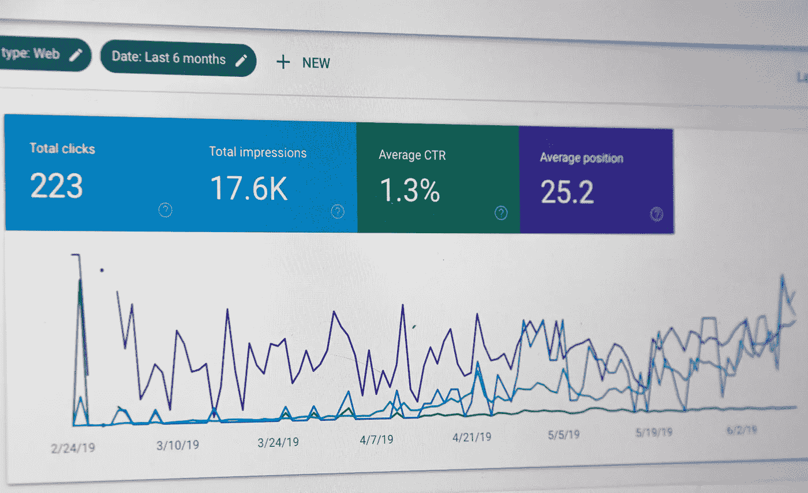

# 如何建立新的数据驱动战略

> 原文：<https://towardsdatascience.com/how-to-establish-new-data-driven-strategies-3797b451682a?source=collection_archive---------36----------------------->

## 将数据转化为洞察力

蒂姆·福斯特在 [Unsplash](https://unsplash.com/s/photos/west-coast?utm_source=unsplash&utm_medium=referral&utm_content=creditCopyText) 上的照片

像大数据、数据科学和商业智能这样的流行语到处都在被提及。但是有哪些典型的潜在新商业模式和产品呢？考虑到众多的数据源、分析选项和业务模型，很容易忽略全局。

在下文中，将进一步描述三种初始情况和场景。

## 战略性商业案例

如果公司拥有庞大而有价值的数据池，那么建立基于数据和分析的新商业模式的决策通常是战略性的。这适用于从卫星、天气现象、社交媒体或远程信息处理数据中提供大数据的企业。API 和分析功能在大型数据池的战略营销中发挥着核心作用[1]。

斯蒂芬·菲利普斯——Hostreviews.co.uk 在 [Unsplash](https://unsplash.com/s/photos/google?utm_source=unsplash&utm_medium=referral&utm_content=creditCopyText) 上的照片

例如脸书和谷歌，但房地产公司、金融机构和运输企业等公司拥有的数据不仅可以帮助自己的公司，还可以通过平台提供给客户。我所知道的一个例子是无数的股票市场数据提供者，他们为每个 API 调用付费。

## 探索创新型实验室

在数字、数据或创新实验室中，人们可以创造性地独立工作，跨学科团队探索性地寻找基于数据的产品和商业模式的发展。在这里，同样重要的是提及一个**数字平台**的创建，以便数字化的工具在第一时间可用【2】。这个平台应该是灵活的、可扩展的和基于云的。因此，它允许敏捷开发等范例得以实施，来自数据、流程和应用领域的主题和产品可以更快地获得。如何搭建这样的平台可以在这里阅读[。](/how-to-set-up-an-flexible-and-scalable-data-analytics-platform-quickn-easy-5fb3a4c83745)

## 进化和迭代方法

除了通过战略性新业务领域或通过数据宝藏或通过数据和数字实验室的探索方法实现大爆炸之外，进化方法也是一种可能。通常，公司不一定具备前一种方法的先决条件和数据量。因此，成功的数据业务模型和分析平台也可以从现有的 BI 项目或仪表板中演化而来。
特别是，如果用户已经熟悉业务和数据逻辑，并认识到现有 BI 服务的价值，新功能、改进的用户体验、更快的性能和更多的数据集成可以为客户增加显著的价值。

## 摘要

公司可以通过不同的方式将数据用于商业案例。除了数据的战略性使用，企业还可以利用探索性的方法，如产生新的想法，甚至进化的方法。无论一家公司使用什么方法从他们的数据中获得洞察力，这个过程都是不可避免的，因为只有通过分析数据，企业才能成功地满足客户的需求。

## 资料来源和进一步阅读

[1] Bernard Marr，《数据战略——如何从大数据、分析和物联网的世界中获利》(2017)，第 73 -117 页

[2]比约恩·博特彻，卡洛·韦尔登博士，《数据即产品》(2017 年)