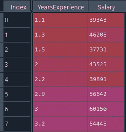
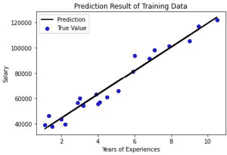
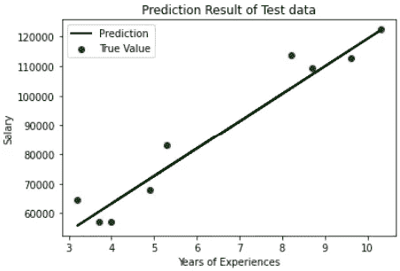
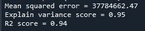

# 如何用线性回归估算工资

> 原文：<https://towardsdatascience.com/how-to-estimate-salary-with-linear-regression-6e5511db28f6?source=collection_archive---------5----------------------->

## [入门](https://towardsdatascience.com/tagged/getting-started)

## 使用 Python 进行线性回归的初学者友好指南。

由[亚历山大·密斯](https://unsplash.com/@alexandermils?utm_source=unsplash&utm_medium=referral&utm_content=creditCopyText)在 [Unsplash](https://unsplash.com/s/photos/salary?utm_source=unsplash&utm_medium=referral&utm_content=creditCopyText) 上拍摄的照片

我们的工资真的随着工作年限的增长而增长吗？虽然这可以根据我们对就业市场的一般理解来回答，但我们将使用一种简单的数据驱动方法来验证这一事实。我们将使用**线性回归**对工资金额与工作经验年限之间的关系进行建模。

线性回归是假设 [**解释变量(X)和响应变量(y)**](https://www.statisticshowto.com/probability-and-statistics/types-of-variables/explanatory-variable/) 之间的线性关系的模型。我们可以根据 X 的值预测 y 的值。在我们的上下文中，估计的工资将是我们的响应变量(y ),因为它是我们的目标预测值，工作经验的年数将是我们的解释变量(X)。

一旦我们定义了本例中的解释变量和响应变量，我们将使用 **Python** 构建一个线性回归模型来解决我们的问题。

# 必备 Python 库

熊猫—[https://pandas.pydata.org/](https://pandas.pydata.org/)

numpy—[https://numpy.org/](https://numpy.org/)

matplotlib—[https://matplotlib.org/](https://matplotlib.org/)

sci kit-learn—[https://scikit-learn.org/stable/](https://scikit-learn.org/stable/)

# 开源代码库

本文中的原始完整源代码可以在我的 [Github Repo](https://github.com/teobeeguan/Python-For-Machine-Learning/tree/main/Linear%20Regression) 上获得。如果你想用它来关注我的文章，请随意下载( *LinearRegression.py* )。

# 数据采集

我们将用于线性回归的薪资数据( *Salary_Data.csv* )可以从 [Kaggle](https://www.kaggle.com/karthickveerakumar/salary-data-simple-linear-regression) 中获得。

# 线性回归

## 1.加载数据

首先，我们将使用 *Python Pandas* 库来读取 CSV 数据。

**第 1–6 行:**导入所有需要的库。

**第 8 行:**使用*熊猫 read_csv* 函数读取 csv 文件。该函数将以 dataframe 格式返回数据。

作者准备的图像

**第 9–10 行:**提取 *YearsExperience* 和 *Salary* 列，分别赋给变量 X 和 y。

## 2.将数据分成训练集和测试集

在建立线性模型之前，我们需要准备一个训练集和一个测试集(机器学习工作流中标准过程的一部分)。训练集将用于训练模型，而测试集将用于评估已训练模型在预测来自未知数据的结果方面的性能。

我们可以使用*Python scikit-learn train _ test _ split*函数将我们的数据随机分割成一个训练和测试集。

**第 1 行:**留出整个数据集的 30%作为测试集，并将训练集和测试集分别赋给四个变量。

## 3.数据转换

*Python scikit-learn* 只接受二维数组格式的训练和测试数据。我们必须对我们的训练集和测试集执行数据转换。

**第 1–2 行:**使用 *Numpy 整形函数*将训练集从一维序列转换为二维数组。

**第 3–4 行**:使用 *Numpy reshape 函数*将测试集从一维序列转换为二维数组。

## 4.培训模式

现在我们准备训练我们的线性模型。

**第 1 行:**使用*sci kit-Learn linear regression*函数创建一个模型对象。

**第 2 行:**将训练集拟合到模型。

## 5.用线性模型预测工资

在这个阶段，我们已经训练了一个线性模型，我们首先使用它来预测我们训练集的工资，以查看它与数据的拟合程度。

**第 1 行:**根据训练集使用线性模型预测工资。

**第 3–10 行:**使用 Matplotlib 创建一个图形，以可视化预测结果。“真实值”在图表上绘制为蓝点，预测值绘制为黑色直线。

作者准备的图像

一般来说，线性模型很适合训练数据。这显示了工资和工作经验之间的线性关系。

现在，我们需要检查线性模型是否可以在我们的测试集(未知数据)上表现良好。

**第 1 行:**根据测试集使用线性模型预测工资。

**第 3 行–第 10 行:**使用 Matplotlib 创建一个绘图，以可视化预测结果。“真实值”在图表上绘制为绿点，预测值绘制为黑色直线。

作者准备的图像

该图表明，我们的线性模型可以很好地适应测试集。我们可以观察到随着工作年限的增加，工资水平呈线性增长。

## 6.模型评估

上一节使用图形方法来评估我们的线性模型的性能，这在我们的判断中有时是相当主观的。这里我们将使用一些定量方法来获得我们的线性模型的更精确的性能评估。

我们将使用三种量化指标:

*   **均方误差** —真实值与预测值之差的平方的平均值。差异越小，模型的性能越好。这是用于回归分析的常用指标。
*   **解释方差得分** —一种检查模型处理数据集中值的变化情况的度量。1.0 分是满分。
*   **R2 分数** —检验我们的模型基于测试集(未知样本)预测值的能力的度量。满分是 1.0。

**第 1–3 行:**使用 *Scikit-learn Metrics* 功能计算我们的线性模型的均方误差、解释方差和 R2 分数。我们向函数提供真实值(测试集)和预测值。

作者准备的图像

如果我们对我们的均方误差进行平方根计算，我们将获得大约 6146.92 美元的平均差异，这是一个相当低的误差。此外，解释方差得分和 R2 得分都达到了 0.9 以上。这表明我们的线性模型没有过度拟合，可以很好地根据新数据预测工资。

# 结论

我们已经设法建立了一个简单的线性模型，根据多年的工作经验来预测工资。根据我们的线性模型，**我们可以得出结论，我们的工资随着工作年限的增长而增长，它们之间存在线性关系。**我们可以使用我们的线性模型，通过输入多年的经验来预测工资。

虽然假设工资只取决于工作经验的年限有点太天真，但这是一个很好的例子，说明我们如何开发一个简单的线性回归模型来显示两个变量之间的关系。事实上，现实生活中的大多数现象都不能简单地用一个线性模型来解释。然而，对建立线性模型的理解是建立复杂模型的基础。

我希望你喜欢阅读这篇文章。

***如果你喜欢我的文章，想看更多类似的文章，可以随时订阅*** [***中***](https://teobguan2013.medium.com/membership) ***。你将能够在 Medium 上无限阅读我和其他作者的文章。谢谢你的支持。***

# 参考

1.  [http://www.stat.yale.edu/Courses/1997-98/101/linreg.htm](http://www.stat.yale.edu/Courses/1997-98/101/linreg.htm)
2.  [https://machine learning mastery . com/regression-metrics-for-machine-learning/](https://machinelearningmastery.com/regression-metrics-for-machine-learning/)
3.  [https://www . statistics show to . com/explained-variance-variation/](https://www.statisticshowto.com/explained-variance-variation/)
4.  [https://en.wikipedia.org/wiki/Coefficient_of_determination](https://en.wikipedia.org/wiki/Coefficient_of_determination)