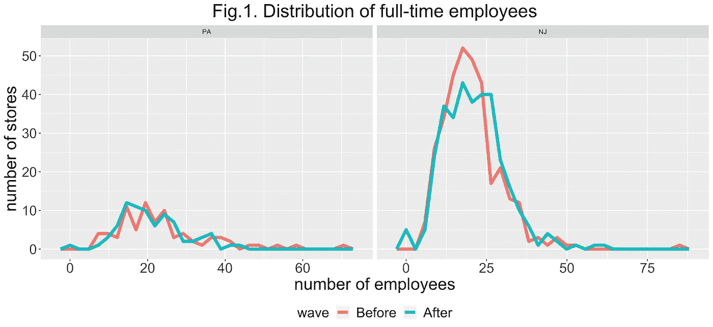
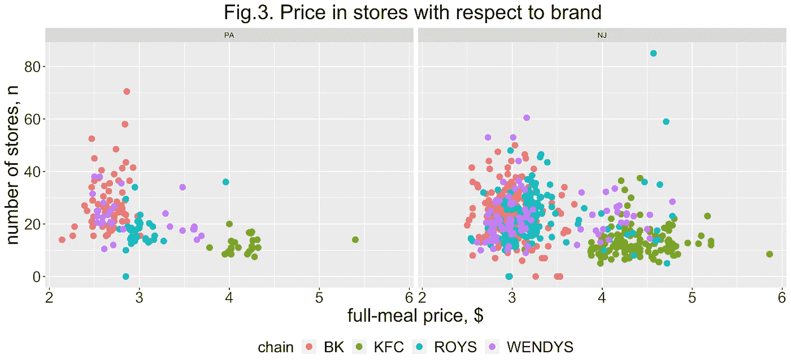
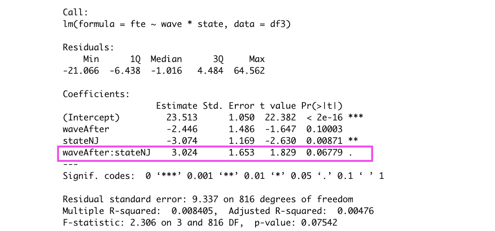
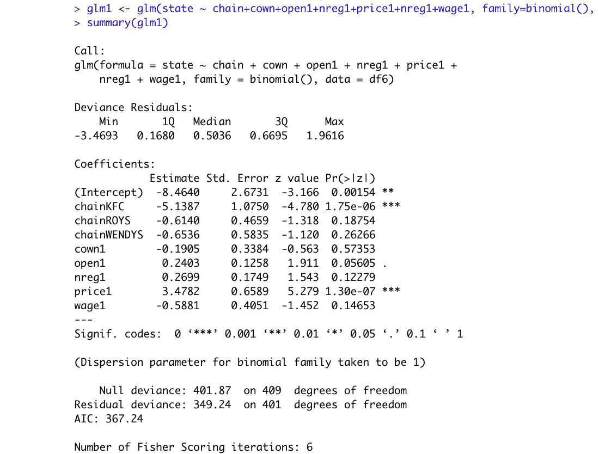
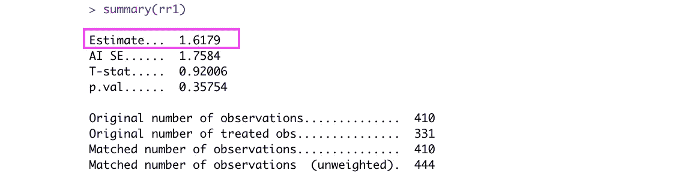
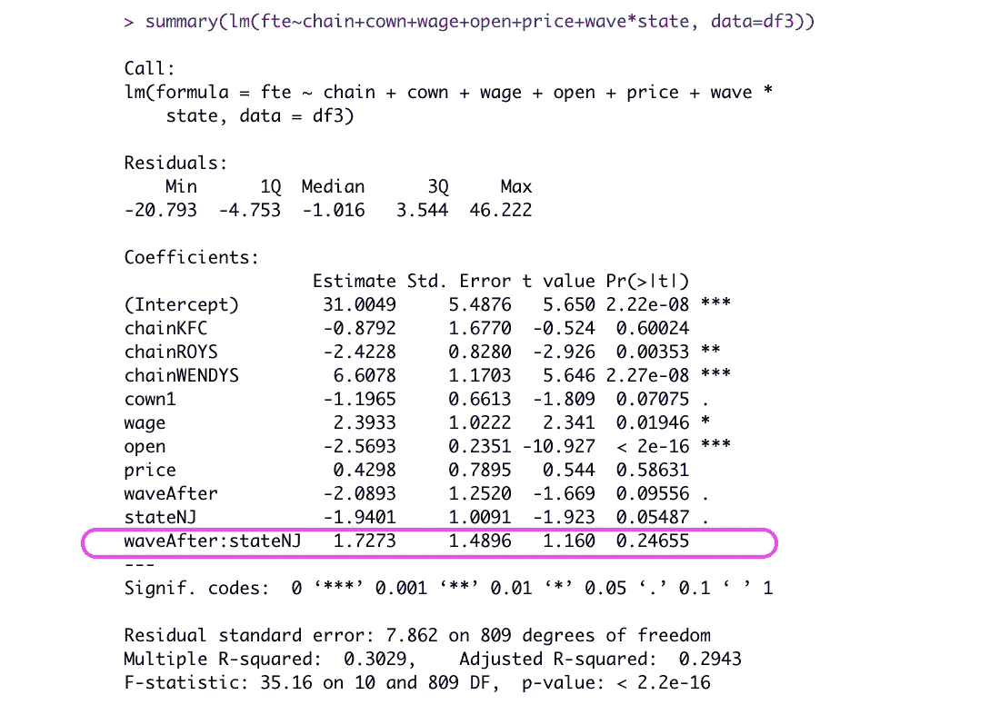

# 如何估计 R 政策变化的影响

> 原文：<https://towardsdatascience.com/how-to-estimate-the-effects-of-a-policy-change-difference-in-differences-matched-on-propensity-3ee8d9432d?source=collection_archive---------15----------------------->

## 差异中的差异和倾向分数匹配中的 R

[Jason Yuen](https://unsplash.com/@fanfandyuen?utm_source=medium&utm_medium=referral) 在 [Unsplash](https://unsplash.com?utm_source=medium&utm_medium=referral) 上的照片

# 先决条件

当我们执行传统的 AB 测试时，我们需要一个随机的实验环境。但是如果我们不能随机选择参与者呢？

在本文中，我们将探讨两种在非随机实验中估计效果的强大技术:差异中的差异和倾向得分匹配。我们将使用大卫·卡德和阿兰·B·克鲁格在 1994 年进行的经典案例研究来简要介绍这些方法。

# 介绍

在我们[之前的例子](https://www.linkedin.com/pulse/business-application-anova-serafim-petrov/)中，我们在随机环境中评估了不同销售方法的效果。

假设现在我们在不同的城市或国家有一个零售连锁店。我们想在其中一个城市或国家测试一些方法，并评估其效果。我们分析了这些数据，发现两个城市有相似的趋势，它们的规模不一定相等，但我们的商店销售增长或下降的速度相同。如果实验不是随机的，我们如何衡量效果？我们将探讨两种方法的组合:差异中的差异和倾向得分匹配。

# 差异中的差异

我们可以使用差异中的差异(DID)方法来测试效果。城市 T(治疗，但我们可能会想到佛罗里达州的坦帕)将是一个采用新方法的城市，城市 C(控制，但我们可能会想到马萨诸塞州的剑桥)将是一个没有经历任何变化的城市。也就是说，我们在实验之前和一段时间之后测量了 T 城市和 C 城市的销售额。公式是:

**DID =(后 T 城—前 T 城)——(后 C 城—前 C 城)**

我们假设，如果我们没有尝试任何方法，它们也会有类似的趋势，它们之间的差异就是我们方法的效果。但是如果我们城市的商店千差万别呢？

# 倾向得分匹配

我们可以尝试使用倾向得分匹配(PSM)来提供对平行趋势假设的任何潜在违反的鲁棒性。

PSM 是如何工作的？一种方法是通过逻辑回归估计这些分数，然后使用例如最近邻算法来匹配它们。还有其他方法，但在我们的项目中，我们将执行这种技术。

# 例子

为了演示这种方法，我们将使用 1994 年发表的戴维·卡德和阿兰·B·克鲁格([https://davidcard.berkeley.edu/papers/njmin-aer.pdf](https://davidcard.berkeley.edu/papers/njmin-aer.pdf))的案例研究中的快餐店的数据集。他们测量了新泽西州和宾夕法尼亚州最低工资上调前后的工资、物价和就业情况。这种增长是否像古典经济学认为的那样，对就业产生了负面影响？

让我们找出它。

首先，图 1 中 NJ 和 PA 的员工分布看起来不同。从视觉上看，宾夕法尼亚州的商店比新泽西州少。我们注意到，在工资上涨后，新泽西州的就业率下降了(蓝绿色线对红色线)。

从图 2 我们可以看到品牌的分布和数量。它还显示商店是特许经营还是公司所有。我们可能会开始想，这是一种阶级不平衡，我们需要对此做些什么。

最后，让我们看看图 3 中的价格分布。肯德基似乎是新泽西州和宾夕法尼亚州最贵的品牌。

还有其他协变量，如商店的收银机数量、一天的营业时间、工资等。这将包含在我们的回归模型中。

还有价值观缺失的问题。通常，有几种方法来处理这个问题:丢弃观察值，估算平均值，或者使用某种算法来预测。我会选择使用随机森林算法来估算值。

在我们估算缺失值后，我们可能会尝试使用带有交互项的回归来运行一个基本的差异模型。这相当于计算平均值并应用我们之前介绍的 DID 公式。

从回归模型中，我们看到相互作用项 3.024 的系数是差异中的差异。这意味着，在新泽西州的工资上涨后，他们商店的就业人数比宾夕法尼亚州多 3.024 个单位。

作者提到，在此期间出现了经济衰退，两个州的就业率都有所下降，但根据回归模型，新泽西州的降幅较小，为 3.024 个点。从我们的图中可以看出，宾夕法尼亚州的商店要少得多。此外，商店在品牌、价格等方面也各不相同。我们必须考虑到这些不同之处。

如果我们将其他协变量纳入模型，控制它们的一种方法是使用多元回归，但我们会尝试使用倾向得分来匹配商店。

首先，我们运行逻辑回归来估计属于 1 类(NJ)或 0 类(PA)的概率。我们不需要解释模型，因为我们只需要这些分数来使用最近邻算法进行匹配。

其次，我们运行实际的匹配。然而，我们自己做起来并不困难，R 中有一个软件包 MATCH，它可以方便地为我们做任何事情，并计算平均治疗效果。

输出告诉我们，在工资增加后，对就业的影响在新泽西州增加了 1.6179。此外，它在统计上并不显著:p 值为 0.35754。这意味着我们没有足够的信息来得出工资增长对就业有任何积极或消极影响的结论。这与之前简单的交互回归模型相矛盾，其中交互项是重要的。我们可以改进我们的简单回归吗？

让我们尝试运行同样的回归，但要考虑其他协变量。

是的，效果 1.7273 现在看起来更接近我们使用倾向分数匹配 1.6179 得到的结果。这也不再重要。

我们可能希望通过假设与连锁品牌的互动来进一步指定模型，但这不是这个项目的目标。

增加雇员的工资成本通常会导致雇主减少雇员人数。但是，由于某些原因或某些情况，就业可以增加。在作者强调的经济衰退的给定情况下，差异模型中的差异假设，如果一切相同，新泽西州的实际就业下降可能与宾夕法尼亚州一样糟糕。但正如我们所看到的，新泽西州的情况稍好一些，这在匹配数据上返回了 1.6179 点的正 DID 系数。

# 结论

在这个项目中，我们引入了一种结合倾向评分匹配的差异差异方法。我们将结果与带有相互作用项的多元回归进行了比较。我们需要理解数据来进行稳健的分析。一种方法并不总是有效，我们可以尝试不同的方法。

差异中的差异本身就是一种强大的技术。如果我们将它与倾向评分匹配相结合，那么我们将有一个稳健的方法来估计非随机实验中的治疗效果。同时，经典回归方法允许我们估计不同协变量的影响，并最终返回可比较的结果，但它对规范很敏感。

在我们未来的工作中，我们将尝试在商业应用中实现一些机器学习技术。

# 感谢您的阅读！

在 [LinkedIn](https://www.linkedin.com/in/serafimpetrov/) 上连接