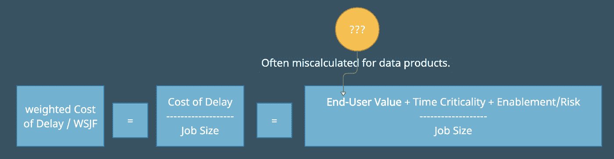
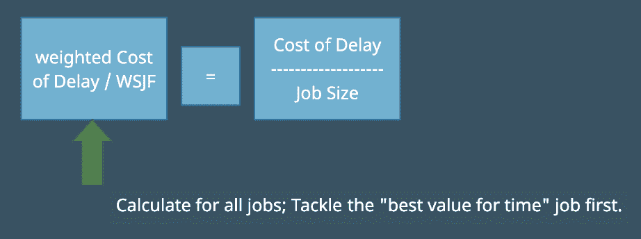
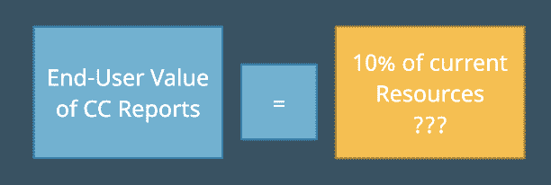
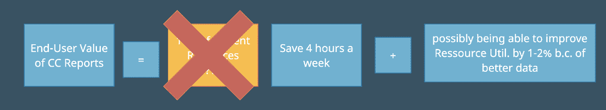
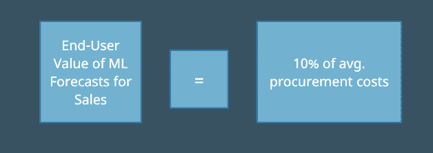

# 如何估计数据产品的价值

> 原文：<https://towardsdatascience.com/how-to-estimate-the-value-of-data-products-8297dd92109?source=collection_archive---------9----------------------->

## 数据产品的商业价值经常被误判。学会这两条规则才能正确计算

WSJF 和数据产品的问题价值。图片由作者提供。

对于我这个产品经理来说，加权最短工作，或者说所谓的延迟成本，改变了我对价值的理解。这就是我们作为产品经理想要做的，最大化价值。这个公式中的基本成分是任务或工作的商业价值。

对于数据产品，对于数据密集型产品，机器学习解决方案，商业智能系统，简而言之，一切以数据为核心的东西，我经常会错误地猜测商业价值。

这并不是因为您必须进行彻底的计算，而是因为数据产品的商业价值遵循两个简单的规则，这在其他产品中并不突出:

**规则一:** *总会有(好的)选择，你得拿你的产品去比较。*

**法则二:** *数据的唯一价值在于改善某人的决策。*

让我们看几个例子来理解，为什么这经常误导我们。

## 邪恶的数学部分——WSFJ &延迟的代价

我说我们只需要大概猜一下值。这是事实。但是我们猜测的依据越多越好。我真的很喜欢*延迟成本*的概念，它基本上是说，用“延迟成本”除以工作规模，你会得到每单位时间的最大价值收益。

WSJF 和延误的代价。图片由作者提供。

那么我们如何计算延迟的[成本呢？WSFJ 目录](https://www.scaledagileframework.com/wsjf/.)有一些很好的指针。他们告诉你要结合使用:

*   最终用户价值(它对最终用户有什么价值)
*   时间重要性(硬性截止日期，因为团队或外部用户依赖于它？)
*   风险降低+机会实现

这很简单，尤其是因为我们只需要对自己盘子里的东西有一个粗略的、相对的感觉。我们只需要估计什么更有价值，而不是找到一个实际的$$$数字。

WSJF 和数据产品的问题价值。图片由作者提供。

在我看来，现在最重要的是“最终用户价值”部分。毕竟，归根结底，尽管其他两件事很重要，但它们实际上只是间接为最终用户价值买单。所以症结在于价值。*对于数据产品，我们如何计算？*

我们来看两个数据相关的例子。

## 这是另一种选择！

您的数据团队需要创建一份新的闪亮报告，显示呼叫中心运营单位的指标。有人告诉你，这将使团队领导能够组织工作，在必要的地方转移资源，并优化整体运营。商业价值是巨大的，他们认为他们可以通过优化节省 5–10%的资源。

听起来很重要，对吗？

图片由作者提供。

除了，你有没有问过，*“那你现在是怎么工作的？你如何计划&优化工作？毕竟，你已经在做决定和调动员工了，对吗？”*。他们可能会回答*“是的，当然！但是我们用的是这个巨大的 Excel 文件，由一个临时雇员每周编辑一次。带他走 4 个小时左右。”*

所以突然，实际值变成了…

现在这是正确的计算…作者的图片(是的，我必须把它放在每张图片上…).

嗯嗯。现在这看起来像一个少了很多零的任务。

我不是说这不重要，我只是说，选择很重要。在这种情况下，这很重要。

让我们看另一个例子。

## 这是关于决定

现在要求您的数据团队制作销售预测。该团队非常喜欢使用一些奇特的机器学习机制的想法。

但是等等，我们还有 10 个不同的任务，我们猜测了它们的商业价值。我们要先做这个吗？还是最后？还是根本没有？预测的商业价值是什么？你去问另一边的经理。

起初，他不确定。所以你问*“如果你对销售额有一个粗略的估计，你能做出更好的决定吗？”*啊，现在他明白了*“嗯，如果东西是可靠的，比如 90%可靠，我们就可以预订东西，而不会遇到瓶颈，使我们在通常的采购成本上多花 10%左右。我们目前无法进行手工预测，这是行不通的。”*

价值在于更好的决策！图片由作者提供。

所以这才是重点。你知道，如果你能产生一个至少 90%可靠的解决方案，那么你就能在平均采购成本上节省 10%。

你也刚刚被告知，如果你只有 80%的解决方案，你可能不会产生任何价值。太好了！所以你现在得到了你的价值，作为回报，你的团队可以重新估计“规模”，因为你现在知道，你必须达到 90%。

## 是关于整个周期的

我希望这已经帮助你学会如何更好地判断数据产品，附加功能的最终用户价值。

有时，这仍然不够，尤其是当你需要判断更大的复杂产品时。在这种情况下，你必须查看整个[数据决策周期](/data-strategy-good-data-vs-bad-data-d40f85d7ba4e)，你可以在我的另一篇博客文章中了解到。这将有助于你进一步剖析一个人做出更好的决定到底需要什么，以及你的产品将如何对此有所帮助。

# 进一步阅读

*   SAFE 框架提供了关于延迟成本和加权最短工作优先概念的信息。
*   最后，如果你想更深入地了解数据和决策，以及如何真正让数据产品发挥作用，可以看看我写的关于[好数据与坏数据策略](/data-strategy-good-data-vs-bad-data-d40f85d7ba4e)的文章。

*对如何建立伟大的数据公司、伟大的数据密集型产品、成为伟大的数据团队感兴趣，还是对如何利用开源构建伟大的东西感兴趣？然后考虑加入我的* [*免费简讯《三个数据点周四》*](http://thdpth.com/) *。它已经成为数据初创企业、风投和数据领导者值得信赖的资源。*