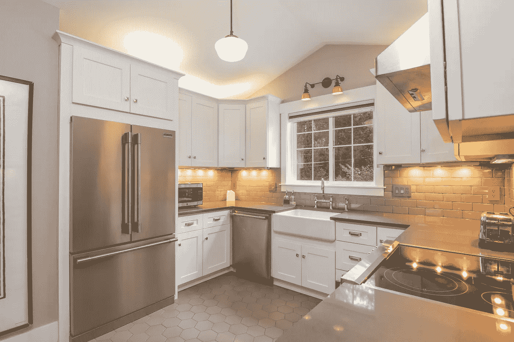

# 如何向任何人解释数据科学

> 原文：<https://towardsdatascience.com/how-to-explain-data-science-to-anyone-1eba18c00c1b?source=collection_archive---------23----------------------->

## 意见

## 向利益相关者、家人和朋友解释你的工作时，可以遵循一些简单的提示


照片由 [Element5 数码](https://unsplash.com/@element5digital?utm_source=unsplash&utm_medium=referral&utm_content=creditCopyText)在[Unsplash](https://unsplash.com/s/photos/learning?utm_source=unsplash&utm_medium=referral&utm_content=creditCopyText)【1】上拍摄。

# 目录

1.  介绍
2.  让它变得有关联，去掉行话
3.  与日常场景相比
4.  摘要
5.  参考

# 介绍

无论你是否在科技行业，数据科学似乎无处不在。与数据科学相关的其他术语包括机器学习和人工智能。不幸的是，有些字段可能会相互混淆。就本文而言，我们将更多地关注数据科学本身。同样，我们将关注如何向对数据和统计一无所知的人解释数据科学。对数据科学的定义有无数种解释，但对我来说，我认为解释某事的最佳方式是将其与特定的人联系起来，放弃行话，并将其与他们可能已经知道的事情进行比较。话虽如此，下面让我们更深入地探讨一下这些解释数据科学的方法。

# 让它变得有关联，去掉行话


由[埃罗尔·艾哈迈德](https://unsplash.com/@erol?utm_source=unsplash&utm_medium=referral&utm_content=creditCopyText)在[Unsplash](https://unsplash.com/s/photos/same?utm_source=unsplash&utm_medium=referral&utm_content=creditCopyText)【2】上拍摄的照片。

假设你正在和你的兄弟谈论数据科学，而他们从事完全不同的职业，比如音乐或建筑。很可能他们对数据科学一无所知，这当然没问题，也完全可以理解。如果你在解释，你的工作就是正确简单地解释数据科学。所以，看看他们的工作可以帮助你解释，如果不是工作，看看他们的其他特点，如爱好或兴趣。

> 使数据科学具有关联性的一些方法是将定义与具体的人相关联，如下所示:

*   举一个他们当前工作的例子，例如，如果他们是音乐家，可以这样说:

*“数据科学可用于从过去的音乐中组织/分类未来/新的音乐”*

请注意，我甚至没有包括“数据”——而是使用了音乐，数据对你来说可能是一个显而易见的词，但正如我们所知，即使是“科学”这个词也可以在“数据科学”中进行解释——尽可能多地排除行话是解释任何事情的一个好技巧。

*   一旦达成上述理解，那么你就可以把“数据”这个词分解成描述主题的东西——例如，我们可以把数据看作是描述某些东西的特征的例子。在这个音乐案例中，我们会说音乐或数据的这些特征是像`year`、`song length`和`rhythm`这样的东西，这将是描述流派的东西——使用这些东西，我们可以对新音乐进行分类

正如你所看到的，从上面，我们使数据科学与人相关，并解释它没有行话-或与主题相关的特定词语。我们不想说“*机器学习算法被编译成以低均方误差来预测目标变量，该目标变量是来自结构化的并且是 CSV 格式*的音乐数据的先前特征的流派”。是的，这个解释又长又混乱，这才是重点。我看到很多数据科学都是以这种方式解释的，当然，你不会想以这种方式向你的朋友和家人解释，但即使不向你公司的利益相关者解释，你也确实有一些数据科学的知识。数据科学只是一种工具，可以让人类更有效地处理数据。

# 与日常场景相比



图片由 [Erol Ahmed](https://unsplash.com/@erol?utm_source=unsplash&utm_medium=referral&utm_content=creditCopyText) 在[Unsplash](https://unsplash.com/s/photos/same?utm_source=unsplash&utm_medium=referral&utm_content=creditCopyText)【3】上拍摄。

另一种有助于解释数据科学的方法是将它与日常场景联系起来，不管这个人的工作或爱好是什么。例如，大多数人都知道房子是什么。我们可以用房子作为例子来解释数据科学。

更具体地说，我们可以用房价作为数据科学场景。

> 下面是一个将数据科学与房屋相结合的例子(*，当然，你可以使用其他东西作为主题，同时遵循这些相同的步骤*):

*   **问题**:给房子定价很难
*   **更多问题**:手动操作会花费很长时间
*   **更多问题**:我们在定价时经常不一致

(注意:我避免使用“预测”这个词，而是用“分配”来代替，因为“预测”听起来可能会令人困惑)

*   **解决方案:**我们可以看看周围的房子来评估价格
*   **解决方法:**我们可以具体看一下周围的住宅的特点
*   **解决方案:**我们可以将这些特征组织成我们所说的数据，通过列出每个周围房屋的独特特征值，得出具有这些特征的新房屋的平均值
*   **解决方案:**举个例子，1000 平方英尺以上的房子平均房价为 300，000 美元或更高，也就是说，如果这个新房子也是 1000 平方英尺，我们会指定它也是这个价格/类似的价格，但是当我们综合所有特征时，它可能会提高或降低这个价格
*   **解决方案:**房地产经纪人已经在做这种评估了，数据科学使它自动化，因此更容易、更快、更准确，因为我们可以测试它
*   **解决方案:**测试我们如何做，假设我们不知道 10 套房子的价格，并使用数据科学来分配这些值，然后将这些房价并排放在一起，看看有什么不同，然后我们可以看到我们的数据科学有多准确
*   **解决方案:**比如我们对比的 10 个房价都是使用数据科学得出的 40 万美元左右，真实的房价在 40.5 万美元左右。那时我们会非常准确，并且知道我们在数据科学方面所做的是好的

正如您所看到的，当您设计一个具体的项目时，就像这个过程一样，在这里您提出了问题和解决方案，没有任何技术术语，您可以从本质上解释所有的数据科学(*到一定程度*)。

# 摘要

有无数种方法来解释数据科学，我所描述的可能对你和你要解释的人有用，也可能没用。也就是说，接受我所说的，并尝试一下，如果它不起作用，那么希望这篇文章中有一些有用的建议。

总的来说，坦率地说，在解释数据科学时不要居高临下。这个我刚学的时候经历过无数次，而且是 100%，完全没必要。大多数事情都可以用简单的措辞来解释，并分解到最简单的层次。

我所说的可能是显而易见的，但我仍然认为这是我们大多数人可以改进的地方，包括我自己。这个建议不仅仅是你可以应用到你的朋友和家人身上取乐的东西，实际上也是你可以和你的同事和利益相关者一起实践和应该做的事情。通常，在你的职业生涯中，你会与不了解数据科学的其他利益相关者合作，在你面试工作时也是如此，**因此，尽管如此，你需要知道如何向任何人解释数据科学。**

> 总而言之，以下是一些向任何人解释数据科学的方法:

```
* Make it Relatable* Drop the Jargon* Compare to Everyday Scenarios
```

我希望你觉得我的文章既有趣又有用。如果您同意或不同意这些如何解释数据科学的方法，请随时在下面发表评论。为什么或为什么不？你认为还有哪些方法很重要？这些当然可以进一步澄清，但我希望我能够阐明一些可以帮助你向任何人解释数据科学的方法。感谢您的阅读！

请随时查看我的个人资料、 [马特·普日比拉](https://medium.com/u/abe5272eafd9?source=post_page-----1eba18c00c1b--------------------------------) *和其他文章，也可以在 LinkedIn 上联系我。*

# 参考

[1]照片由 [Element5 Digital](https://unsplash.com/@element5digital?utm_source=unsplash&utm_medium=referral&utm_content=creditCopyText) 在[Unsplash](https://unsplash.com/s/photos/learning?utm_source=unsplash&utm_medium=referral&utm_content=creditCopyText)(2017)上拍摄

[2]图片由 [Erol Ahmed](https://unsplash.com/@erol?utm_source=unsplash&utm_medium=referral&utm_content=creditCopyText) 在 [Unsplash](https://unsplash.com/s/photos/same?utm_source=unsplash&utm_medium=referral&utm_content=creditCopyText) 上拍摄，(2017)

[3]图片由 [Erol Ahmed](https://unsplash.com/@erol?utm_source=unsplash&utm_medium=referral&utm_content=creditCopyText) 在[Unsplash](https://unsplash.com/s/photos/same?utm_source=unsplash&utm_medium=referral&utm_content=creditCopyText)(2020)上拍摄