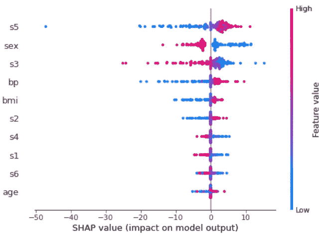
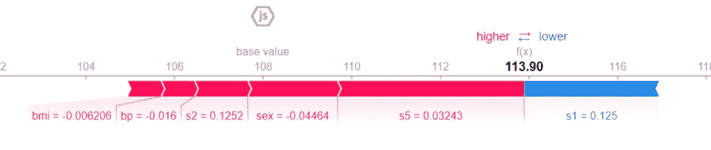

# 如何用 SHAP 解释神经网络

> 原文：<https://towardsdatascience.com/how-to-explain-neural-networks-using-shap-2e8a0d688730?source=collection_archive---------13----------------------->

## SHAP 可以帮助解释像神经网络这样的黑箱模型



作者图片

对于数据科学家来说，神经网络是迷人且非常有效的工具，但它们有一个非常大的缺陷:它们是无法解释的黑盒。事实上，它们没有给我们任何关于特性重要性的信息。幸运的是，有一种强大的方法可以用来解释每一个模型，甚至神经网络。这就是 SHAP 的方法。

让我们看看如何用它来解释和诠释 Python 中的一个神经网络。

# 什么是 SHAP？

SHAP 主张沙普利附加解释。这是一种计算特性对目标变量值的影响的方法。这个想法是，你必须把每个要素看作一个玩家，把数据集看作一个团队。每个球员都对球队的成绩做出了贡献。给定一些特征值(即给定特定记录)，这些贡献的总和给出了目标变量的值。

主要概念是要素的影响不仅仅取决于单个要素，而是取决于数据集中的整个要素集。因此，SHAP 使用组合微积分计算每个特征对目标变量(称为 shap 值)的影响，并在包含我们正在考虑的特征的所有组合上重新训练模型。一个特性对一个目标变量的影响的平均绝对值可以用来衡量它的重要性。

这篇伟大的文章对 SHAP 做了非常清楚的解释。

SHAP 的好处在于它不在乎我们使用的模式。事实上，这是一种模型不可知的方法。所以，解释那些不能给我们自己解释特征重要性的模型是完美的，比如神经网络。

让我们看看如何在神经网络中使用 Python 中的 SHAP。

# Python 中的一个神经网络示例

在本例中，我们将使用 Python 和 scikit-learn 通过 SHAP 计算神经网络的特征影响。在现实生活中，您可能会使用 Keras 来构建神经网络，但概念是完全相同的。

对于这个例子，我们将使用 scikit-learn 的*糖尿病*数据集，这是一个回归数据集。

让我们先安装 *shap* 库。

```
!pip install shap
```

然后，让我们导入它和其他有用的库。

```
import shap 
from sklearn.preprocessing import StandardScaler 
from sklearn.neural_network import MLPRegressor 
from sklearn.pipeline import make_pipeline 
from sklearn.datasets import load_diabetes 
from sklearn.model_selection import train_test_split
```

现在，我们可以加载数据集和特性名称，这在以后会很有用。

```
X,y = load_diabetes(return_X_y=True) 
features = load_diabetes()['feature_names']
```

现在，我们可以将数据集分为训练和测试两部分。

```
X_train, X_test, y_train, y_test = train_test_split(X, y, test_size=0.33, random_state=42)
```

现在我们必须创建我们的模型。既然说的是一个神经网络，那就必须提前对特征进行缩放。对于这个例子，我将使用一个标准的定标器。该模型本身是一个前向神经网络，在隐层中具有 5 个神经元，10000 个历元和具有自适应学习速率的逻辑激活函数。在现实生活中，你会在设置这些值之前对这些超参数进行适当的优化。

```
model = make_pipeline( StandardScaler(), MLPRegressor(hidden_layer_sizes=(5,),activation='logistic', max_iter=10000,learning_rate='invscaling',random_state=0) )
```

我们现在可以拟合我们的模型。

```
model.fit(X_train,y_train)
```

现在轮到 SHAP 部分了。首先，我们需要创建一个名为 *explainer* 的对象。这个对象接受我们的模型和训练数据集的*预测*方法作为输入。为了使 SHAP 模型不可知，它在训练数据集的点周围执行扰动，并计算该扰动对模型的影响。这是一种重采样技术，其样本数稍后设置。这种方法与另一种著名的方法 LIME 有关，LIME 已被证明是原 SHAP 方法的一个特例。结果是 SHAP 值的统计估计。

那么，首先让我们来定义一下*的交代者*对象。

```
explainer = shap.KernelExplainer(model.predict,X_train)
```

现在我们可以计算 shap 值。请记住，它们是通过对训练数据集进行重采样并计算这些扰动的影响来计算的，因此我们必须定义适当数量的样本。对于这个例子，我将使用 100 个样本。

然后，对测试数据集计算影响。

```
shap_values = explainer.shap_values(X_test,nsamples=100)
```

一个漂亮的进度条出现并显示计算的进度，这可能会很慢。

最后，我们得到一个(n_samples，n_features) numpy 数组。每个元素都是该记录的该特征的形状值。请记住，shap 值是为每个要素和每个记录计算的。

现在我们可以绘制所谓的“概要图”。让我们先把它画出来，然后我们来评论结果。

```
shap.summary_plot(shap_values,X_test,feature_names=features)
```


概要图。作者图片

每行的每个点都是测试数据集的记录。这些功能从最重要的到不太重要的进行排序。我们可以看到 *s5* 是最重要的特性。该特性的值越高，对目标的影响越积极。该值越低，贡献越负。

让我们更深入地了解特定记录，例如第一条记录。我们可以画的一个非常有用的图叫做*力图*

```
shap.initjs() shap.force_plot(explainer.expected_value, shap_values[0,:] ,X_test[0,:],feature_names=features)
```



武力阴谋。图片作者。

113.90 是预测值。基值是所有记录中目标变量的平均值。每个条带显示了其特性在推动目标变量值更接近或更接近基本值方面的影响。红色条纹表明它们的特征将价值推向更高的价值。蓝色条纹表明它们的特征将值推向更低的值。条纹越宽，贡献就越大(绝对值)。这些贡献的总和将目标变量的值从花瓶值推至最终的预测值。

我们可以看到，对于这个特定的记录， *bmi、bp、s2、性别*和 *s5* 值对预测值有积极的贡献。 *s5* 依然是这个记录最重要的变量，因为它的贡献是最广的一个(它的条纹最大)。唯一显示负贡献的变量是 *s1* ，但是它不足以使预测值低于基准值。因此，由于总正贡献(红色条纹)大于负贡献(蓝色条纹)，最终值大于基础值。这就是 SHAP 的工作方式。

正如我们所看到的，通过阅读这些图表，我们学到了一些关于特性重要性的东西。我们不关心我们使用的模型，因为 SHAP 是一种模型不可知的方法。我们只关心特性如何影响预测值。这对于解释黑盒模型非常有帮助，比如这个例子中的神经网络。

仅仅知道我们的神经网络的权重，我们永远不可能对我们的数据集有这样的了解，这就是为什么 SHAP 是一个非常有用的方法。

# 结论

SHAP 是一个非常强大的方法，当谈到解释模型，不能给我们自己的特征重要性的解释。这种模型例如是神经网络和 KNN。尽管这种方法非常强大，但没有免费的午餐，我们必须承受一些必须意识到的计算成本高昂的计算。

如果你想学习关于神经网络和 SHAP 技术的模式，你可以加入我的 10 多个小时的在线课程[关于 Python 中有监督的机器学习的](https://yourdatateacher.teachable.com/p/supervised-machine-learning-with-python)。

*原载于 2021 年 5 月 17 日 https://www.yourdatateacher.com*<https://www.yourdatateacher.com/2021/05/17/how-to-explain-neural-networks-using-shap/>**。**