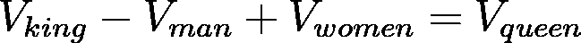
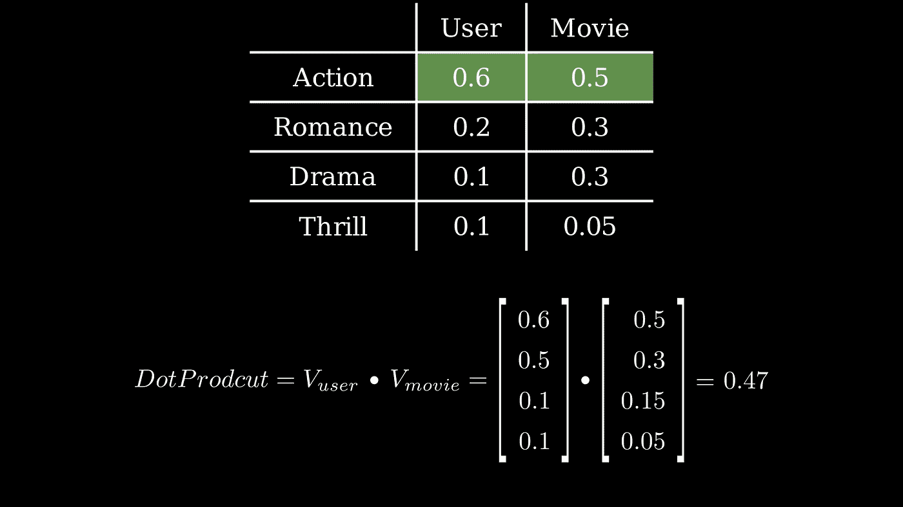
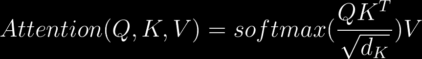

# 直觉建造者:如何围绕变形金刚的注意力机制来思考

> 原文：<https://towardsdatascience.com/how-to-explain-transformer-self-attention-like-i-am-five-9020bf50b764?source=collection_archive---------10----------------------->

## 变压器注意机制为我们其余的人解释


注意力计算—作者创作的动画

**目录**

[动机](#cc44)
[基本构建模块:一种叫做‘嵌入’的特殊向量](#4196)
[核心机制:向量的点积](#7a5c)
[让我们把它应用在更容易的东西上:推荐系统](#027b)
[现在我们可以谈谈注意力:YouTube 如何找到你搜索的视频(QKV 系统)](#1606)
[翻译中的注意力，这一切都很自然](#3d6c)
[自我关注:发现越复杂](#2706)

# 动机

如果你在人工智能行业工作，或者正在学习进入该行业，那么你没有听说过 **Transformer** 的可能性很小。谷歌用其署名论文 ***介绍了它【关注就是你所需要的一切】****[*瓦斯瓦尼等人(2017)*](https://arxiv.org/abs/1706.03762) 。它很快在 NLP 的研究人员中流行起来，人们用 **Transformer** 重新实现了 RNN/LSTM 曾经完成的主要 NLP 论文。基于 Transformer 的预训练语言模型 OpenAI 的 GPT-3 和像[拥抱脸](https://huggingface.co/)这样的工具很快在工业和商业领域获得了牵引力。但并没有就此止步。原来 **Transformer** 就是这么一个不可思议的架构，除了*自然语言处理之外的问题也能被它解决。*视觉、音频、物体检测、强化学习，应有尽有。任何你能做成一个令牌序列的东西，你都可以用 **Transformer** 解决。*

*Andrej Karpathy 的推文解释了神经网络架构如何融合到变压器中*

*然而，Transformer 并不是一个容易理解的架构。这是一个编码器/解码器模型。每个编码器和解码器都有多个子层和组件。其核心是**自我关注**机制，不那么容易找到直觉。这是本文试图帮助的。我将使用简单的英语、动画和恰当的类比来解释它是什么，它是如何工作的。希望当你阅读完这篇文章的时候，你会清楚地理解令人生畏的注意力机制。也许在你的下一次聚会上向你的朋友解释🍸。让我们直接跳进来吧！*

# *基本构件:一个叫做“嵌入”的特殊向量*

**

*由 [Kelly Sikkema](https://unsplash.com/@kellysikkema?utm_source=medium&utm_medium=referral) 在 [Unsplash](https://unsplash.com?utm_source=medium&utm_medium=referral) 上拍摄的照片*

*C 分类数据(输入许多离散类型，如文字、电影、产品等。).我们如何表示它们并将其编号？我们可以使用[一键编码](https://machinelearningmastery.com/why-one-hot-encode-data-in-machine-learning/)。当然可以。但是当类别越大越难管理，而且不是很直观。vector [1，0，0，0]和[0，0，0，1]有什么区别？它没有说太多。更好更自然的方式是使用*嵌入*。由于每个类别都有一些内在的特征，我们可以用一个低维向量来表示它。例如，我们通常将 Marvell 的新电影*蜘蛛侠：英雄无归*描述为`50%`动作、`30%`浪漫、`15%`剧情、`5%`惊险。我们可以很容易地将这种描述转换成一个向量，第一维为'`action`、'第二维'`romance`、'第三维'`drama`'和第四维'`thrilling`':*

```
*Spider-Man: No Way Home = [0.5, 0.3, 0.15, 0.05]*
```

*由于不会有两部分数相同的电影，所以用向量来表示电影更有意义。这使得通过模型学习变得更容易，更重要的是，更容易解释。嵌入是建模现实世界对象的一种更好的方式。例如，单词嵌入将含义放入向量中，您可以做一些有趣的事情，如:*

**

*作者创作的照片*

*或者，如果用户共享相似的嵌入，您可以将电影与用户匹配(特征/兴趣匹配)。向高动作评分嵌入用户推荐高动作评分嵌入电影听起来是个好主意。*

# *核心机制:向量的点积*

*我们已经确定注意力机制是变形金刚*的核心。**

> *注意力机制的中心是一个简单的数学概念:*向量的点积*。*

*由于向量的点积相对简单，我不会在这里用解释来烦你，我只想指出它的意思并给出一些直觉，这对于理解**注意力**的意思是必不可少的。*

*两个向量之间的点积表示' ***与*** 的关联程度。一个很好的直觉是它们之间的角度。角度越小，两个矢量指向同一方向越近。参见下面的动画:*

**

*点积衡量两个向量的“相关”程度*

*直角意味着两个向量不相关。如果角度大于 90 度，它们是负相关的。*

*将点积直觉应用于嵌入给了我们一种数学上匹配向量的方法。如果我们有产品和客户的嵌入向量，我们如何确定客户是否会喜欢特定的产品？只是在它们的嵌入之间做一个点积！如果我们获得高价值，客户很有可能会喜欢它。不然他不会喜欢的。*

*让我们看一个现实生活中的例子，把我们新学到的概念放在一起。*

# *让我们把它应用到更简单的东西上:推荐系统*

*推荐系统广泛应用于网飞或 YouTube 等内容平台，以匹配产品/项目和用户。基本思路是给类似电影的物品一个(**特征**)嵌入向量，给用户另一个同维(**兴趣**)嵌入向量。如果两个嵌入的点积显著，那么电影的'**特征**与用户的'**兴趣**一致，用户很可能喜欢这部电影。否则，他可能不会。见下文:*

**

*用户和电影嵌入的点积*

*通过计算用户和电影的嵌入矩阵的点积，我们可以获得所有电影/用户对的*匹配分数*，并且可以将它们与真实情况(从用户反馈收集的评论分数)进行比较。然后，我们可以使用梯度下降来拟合嵌入并优化我们的损失函数。本质上，这就是' [**协同过滤**](https://en.wikipedia.org/wiki/Collaborative_filtering) '推荐系统的工作原理。*

# *现在我们可以谈谈注意力:YouTube 如何找到你搜索的视频(QKV 系统)*

**

*Nathana rebou as 在 [Unsplash](https://unsplash.com?utm_source=medium&utm_medium=referral) 上的照片*

*现在我们离理解注意力又近了一步。我们可以看到另一个例子，如何使用点积来查找您输入的关键字的最佳视频。我们将介绍**查询**、**键**、**值**的思路。假设你想找一个关于'*变形金刚*的视频，你在搜索框里输入了这个词(**查询**)。你点击回车，YouTube 就会查看他们的视频库，找到那些在标题或标签中有“transformer”的视频(**键**)，然后返回给你他们认为最合适的视频(**值**)。如果我们使用嵌入向量来表示我们的查询和视频的关键字，那么查询和每个关键字之间的点积将告诉我们该项目和您输入的关键字之间的“**相关性**”。这个简单的 QKV 系统是注意力机制的核心。*

# *翻译中的注意，这都是很自然的*

*Finally, let’s look at how attention works. More precisely, how encoder-decoder attention works. Take translation as an example, say we have a Chinese sentence “潮水退了，才知道谁没穿裤子”, and we want to translate it into English: “*When the tide goes out, we know who is not wearing pants.* ”. The natural way for us humans to do this is to look at the original sentence, translate one or two words, then look again to get the context, then translate another one or two words, rinse and repeat. So here we are actually doing three things:*

***人类友好词汇:***

1.  *看看翻译过来的单词，这样我们就可以建立上下文了。*
2.  *看原句(所有的单词)，这样我们对意思会有更好的理解。*
3.  *我们搜索我们的记忆，找到给定 1 和 2 的最佳下一个单词。*

*变形金刚的注意力机制也在做类似的事情。*

***在向量/嵌入词汇中:***

1.  *Transformer 模型的编码器计算当前翻译的嵌入/表示向量，将其用作 ***查询*** 。*
2.  *变换器模型的编码器计算每个原始单词的单词嵌入向量作为 ***键*** 。*
3.  *Transformer 模型的解码器计算查询/键的点积，我们可以得到一个新的向量，每个值是每个*查询* / *键对之间的“*相关性得分*”(稍后使用 softmax 转化为权重)。*用这些权重对原句的所有 ***值*** 嵌入向量进行加权求和，得到最终的*预测向量*，用这个预测向量预测下一个单词。请参见下面的动画:*

**

*机器翻译中注意力是如何计算的*

*As the animation shows, ***attention*** is how much we need to ‘care’ about each word in the original sentence ( “潮 水 退 了” ), given the current already translated words (“*When the tide*”). We can achieve this by doing the dot product of the query vector and each word embeddings of the original sentence. The calculated attention vector is then used to calculate a new predictive vector, **extracting** the embeddings with the respective amount of ‘attention’ needed from the original words. Then the model uses it to make the prediction (through some other dense layers etc.). You can come to [this blog](https://jalammar.github.io/illustrated-transformer/) for more details on how encoder-decoder attention works.*

# *自我关注:发现更成熟的自我*

*在 **Transformer 的**编码器部分，原句会先做*自关注*来更好的表现句子的上下文含义。让我们来看看自我关注是如何工作的。这与我们刚才解释的编码器-解码器注意力没有太大区别。见下图:*

**

*比例点积是自我关注的计算方式*

*这里最显著的区别是如何获得`Query`、`Key`和`Values`。在编码器/解码器的关注下，`Query`来自解码器读取当前翻译文本，`Keys`和`Values`来自编码器读取原句。而对于自我关注来说，`Q`、`K`、`V`都来源于句子本身，故名自我关注。通俗地说，我们可以做到以下几点:*

*对于句子中的每个单词，查看其余每个单词，并找出应该对它们给予多少关注(点积)，以获得一个“关注度”向量。例如，下图来自谷歌关于变形金刚的博客:*

**

*“它”这个词关注它自己，“动物”和“街道”——图来自谷歌关于变形金刚的博客*

*单词' **it** '通过对自己和句子中的所有单词进行点积来计算自己的自我关注度(在上图中用不同深浅的蓝色表示)。一旦计算出自我关注度，模型就可以用它来'**重新分配**单词嵌入。这样，单词' **it** 的新的'*表示*就生成了。它结合了自己的词向量和一些注意力权重大的词。“ **it** 的新表述现在更加“*上下文感知*”和“*复杂*”，更适合翻译和其他与语言相关的任务。这是对每个单词做的，所以当所有的都说了，做了，我们将有一个每个单词的表示，都知道上下文。实际上，转换者将有多个关注层，我们将有“上下文的上下文”、“上下文的上下文”等等。，从而提高了模型的抽象性。这可能就是 transformer 在语言相关任务中表现如此出色的原因。它提供了一个很好的语言抽象模型，就像 CNN 为视觉任务所做的那样。*

***但是等一下，你说**。那`Q`、`K`、`V`呢？我们知道它们来自编码器/解码器的注意力，但是它们是如何计算自我注意力的呢？就更简单了。自我关注中的`query`、`key`、`value`就是他们自己。我们正在询问我们自己(询问关键点积)以获得**自我**-注意力，然后使用我们自己的自我注意力(注意力矩阵以评估点积)来获得新的表示。如果我们看看衡量点积注意力的公式:*

**

*标度点积注意力公式*

*自我关注公式应该是这样的(`***X***`是句子词向量):*

**

*自我关注公式*

*在实际实现中，我们在`***X***`之上堆叠三个独立的线性层，以获得`Q`、`K`、`V`，但这只是为了更灵活的建模。本质上，他们还是`***X***`。*

# *结论*

*T he *attention* 机制有很多应用，并不仅限于**NLPT7。例如，图像识别可以利用注意力找出图像的相关部分。***

> *任何可以放进记号序列的东西，我们都可以使用注意力机制来帮助我们发现模式、提取特征、连接点、做抽象等等。这确实是一个非常强大的模型。*

**注意力*和*变压器*(或多或少与培训相关)的其他部分不在本文讨论范围内，比如“缩放点积注意力”中的“*缩放*是什么意思？口罩是如何工作的？等等。这篇文章并不意味着包罗万象。相反，它试图在 **Transformer** 架构中确定*自我关注*机制如何工作的**直觉**部分。如果你在读完这篇文章后觉得注意力的概念更有意义，那么它已经达到了它的目的。*

*我希望你觉得这篇文章读起来很有趣，并从中学习到一些东西。如果你想更多地了解我对数据科学的思考、实践和写作，可以考虑报名成为 Medium 会员。每月 5 美元，你可以无限制地阅读媒体上的故事。如果你注册使用我的链接，我会赚一小笔佣金。*

*<https://lymenlee.medium.com/membership> *