# 如何为数据科学项目导出和加载 Anaconda 环境

> 原文：<https://towardsdatascience.com/how-to-export-and-load-anaconda-environments-for-data-science-projects-77dc3b781369?source=collection_archive---------4----------------------->

## **用单一终端命令共享 Python 虚拟环境**


[克里斯杨](https://unsplash.com/@chrisyangchrisfilm?utm_source=unsplash&utm_medium=referral&utm_content=creditCopyText)在 [Unsplash](https://unsplash.com/s/photos/monitors?utm_source=unsplash&utm_medium=referral&utm_content=creditCopyText) 上的照片

每次从头开始设置虚拟环境都是一个繁琐而耗时的过程。有一种方法可以绕过它。您可以使用 Anaconda 将 Python 虚拟环境导出为 YAML 文件，然后在不同的项目中重用。您还可以与您的团队共享 YAML 文件，这样每个人都在同一轨道上。

今天你将学会如何做。这比你想象的要简单，所以让我们开门见山吧。

不想看书？请观看我的视频:

# 创建和设置 Anaconda 环境

Anaconda 使数据科学家建立虚拟环境变得非常容易。我使用的是名为 *Miniforge* 的缩小版，它没有预装大量的库。你用哪种口味并不重要。

我们将基于最新版本的 Python 3.9 创建一个名为`test_env`的新环境。打开终端窗口，键入以下内容:

```
conda create --name test_env python=3.9 -y
```

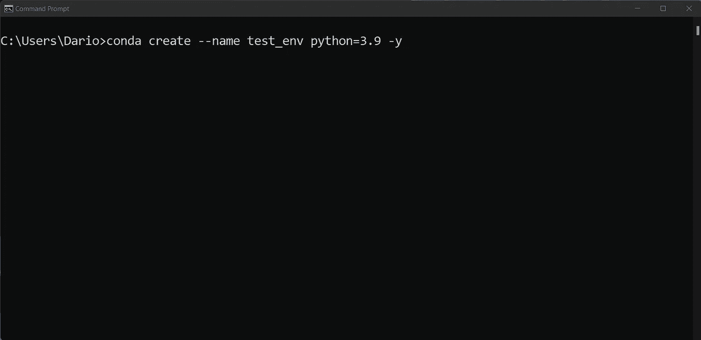

图 1 —创建一个 Anaconda 环境(图片由作者提供)

初始设置不会花很长时间。几秒钟后，您会看到以下消息:

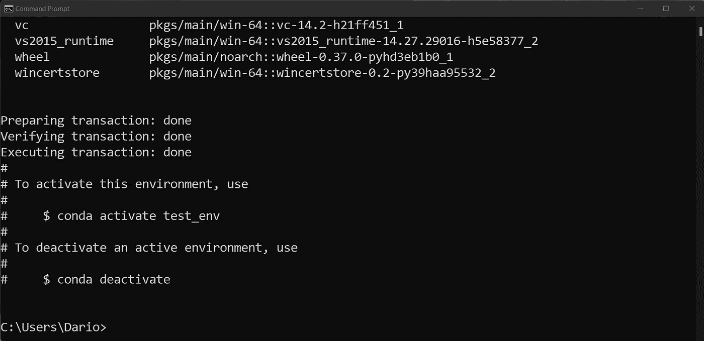

图 2 —创建 Anaconda 环境(2)(图片由作者提供)

这意味着环境安装成功。您可以使用以下命令激活它:

```
conda activate test_env
```

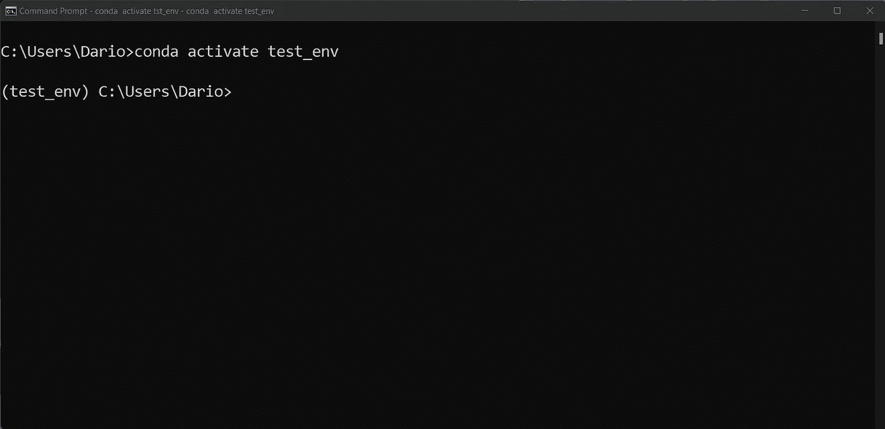

图 3 —激活 Anaconda 环境(图片由作者提供)

现在您已经拥有了安装两个库所需的一切。让我们坚持使用基本的——Numpy、Pandas、Matplotlib、Scipy、Scikit-Learn 和 Jupyter:

```
conda install -c conda-forge -y numpy pandas matplotlib scipy scikit-learn jupyter jupyterlab
```

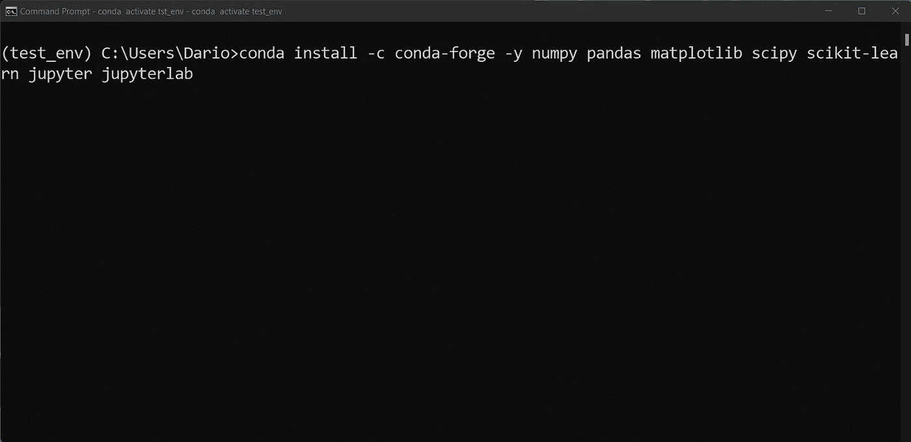

图 4-安装 Python 库(图片由作者提供)

这可能需要一段时间，取决于你的网速。Anaconda 必须下载所有列出的库及其依赖项，所以让它去做吧。完成后，您应该会看到类似的显示:

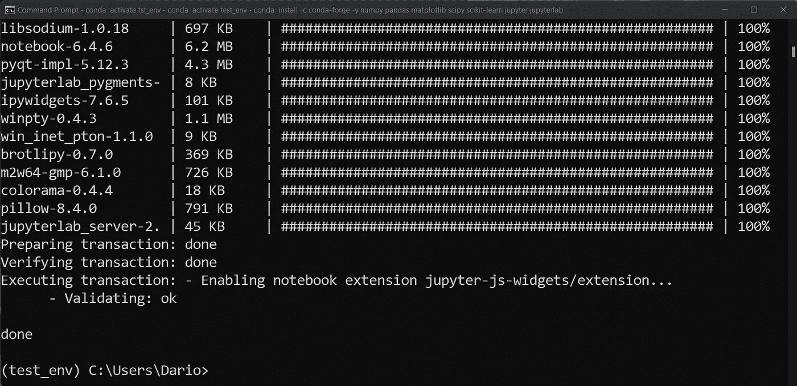

图 5 —安装 Python 库(2)(图片由作者提供)

这就是您通常从头开始设置虚拟环境的方式。让我们看看接下来如何导出它。

# 如何导出和加载 Anaconda 虚拟环境

Anaconda 允许您将虚拟环境导出到 YAML 文件中。理解经常用于创建配置文件的数据序列化语言很简单。YAML 类似于 JSON，但是没有括号。

使用以下命令导出环境，只需记住修改导出路径:

```
conda env export > \Users\Dario\Desktop\test_env.yaml
```

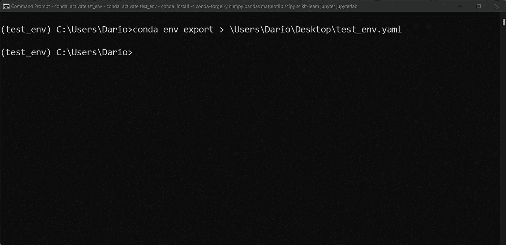

图 6 —导出 Anaconda 环境(图片由作者提供)

您可以用任何文本编辑器打开 YAML 文件，例如 Visual Studio 代码。以下是它包含的内容:

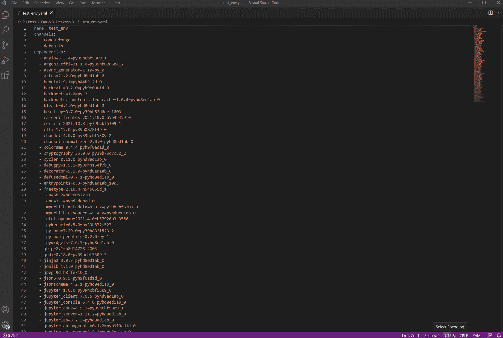

图 7—YAML 环境文件(图片由作者提供)

该文件包含关于如何用 Anaconda 建立一个相同环境的完整说明。唯一的问题是第一行显示的环境名。您必须改变它，因为您已经有了一个名为`test_env`的环境。让我们保持简单，将其重命名为`test_env_2`:

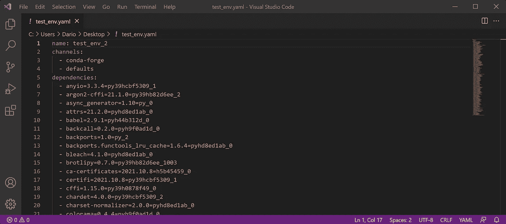

图 8 —更改环境名称(作者图片)

现在，您可以使用以下命令从 YAML 文件创建虚拟环境:

```
conda env create -f \Users\Dario\Desktop\test_env.yaml
```

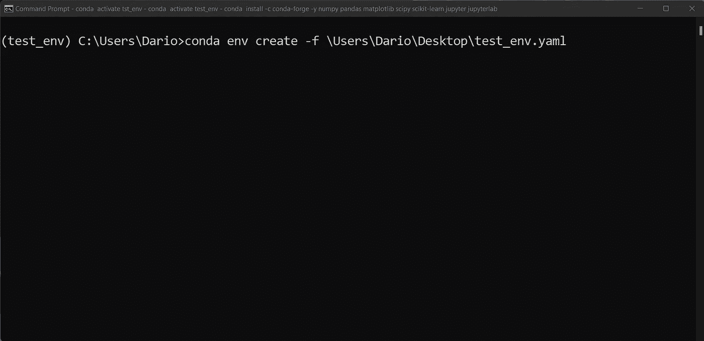

图 9 —从 YAML 文件创建环境(图片由作者提供)

执行这个命令应该不会花很长时间，因为您已经下载了所有的库。完成后，您将看到一条类似的消息，告诉您如何激活环境:

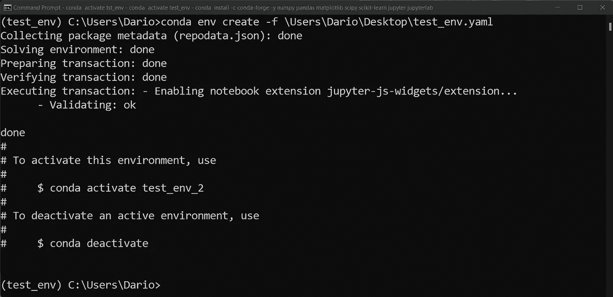

图 10 —从 YAML 文件创建环境(2)(图片由作者提供)

使用显示的命令激活环境:

```
conda activate test_env_2
```

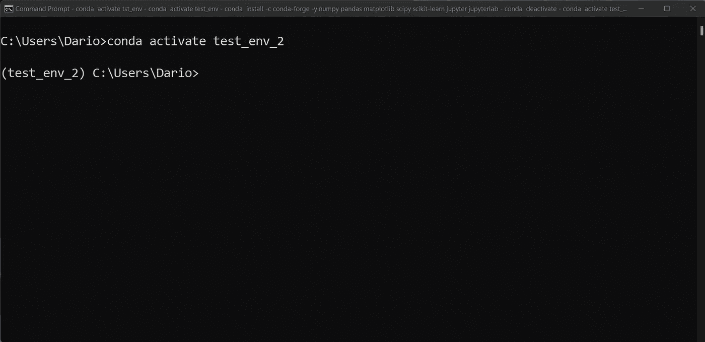

图 11 —激活新的 Anaconda 环境(图片由作者提供)

最后，让我们验证一下我们已经安装了 Python 库。启动一个 Python shell 并导入之前安装的所有内容——Numpy、Pandas、Scipy、Matplotlib 和 Scikit——了解:

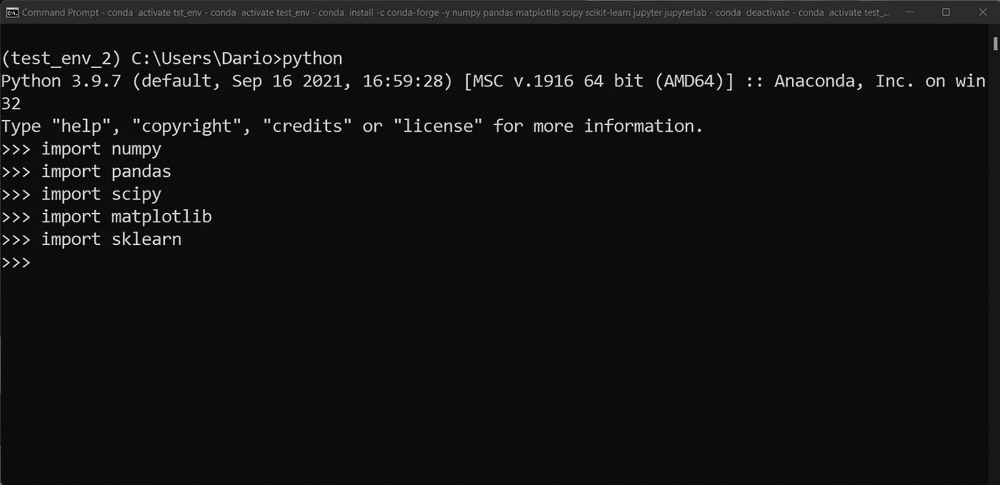

图 12 —验证库安装(图片由作者提供)

看起来一切都像预期的那样工作，您有了一个新的环境，其中包含了来自 YAML 文件的依赖项。很简单，对吧？

# 结论

这就是你想要的——不费吹灰之力就能再现 Anaconda 环境。您可以使用它们来设置基础环境，然后根据项目需要进行调整。例如，几乎每个数据科学项目都需要我们今天安装的库，所以为什么不为自己节省几分钟呢。

另一个用例是与您的团队共享 YAML 文件的能力，这样每个人都在同一轨道上。

不管怎样，这是 Anaconda 的一个众所周知的特性。

*喜欢这篇文章吗？成为* [*中等会员*](https://medium.com/@radecicdario/membership) *继续无限制学习。如果你使用下面的链接，我会收到你的一部分会员费，不需要你额外付费。*

<https://medium.com/@radecicdario/membership>  

# 保持联系

*   注册我的[简讯](https://mailchi.mp/46a3d2989d9b/bdssubscribe)
*   订阅 [YouTube](https://www.youtube.com/c/BetterDataScience)
*   在 [LinkedIn](https://www.linkedin.com/in/darioradecic/) 上连接

*原载于 2021 年 11 月 17 日*[*【https://betterdatascience.com】*](https://betterdatascience.com/export-and-load-anaconda-environments/)*。*