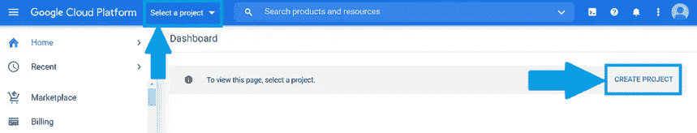
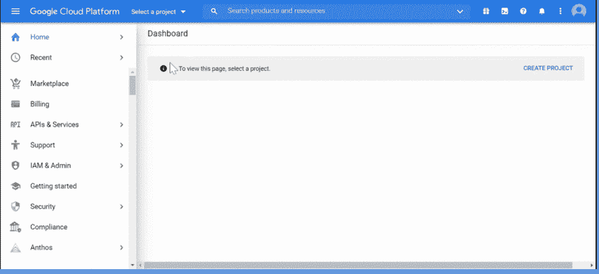
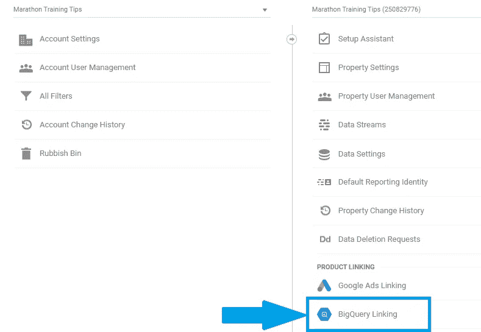
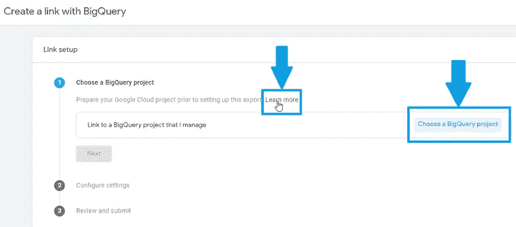
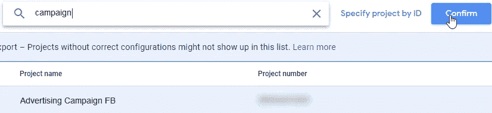
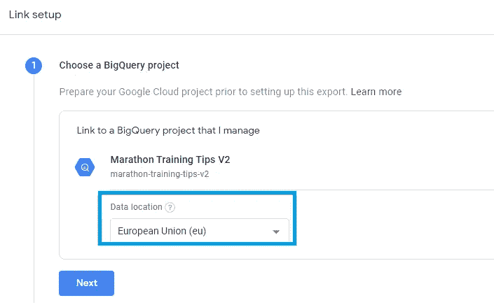
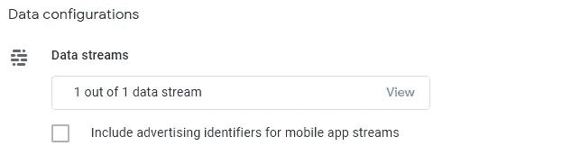
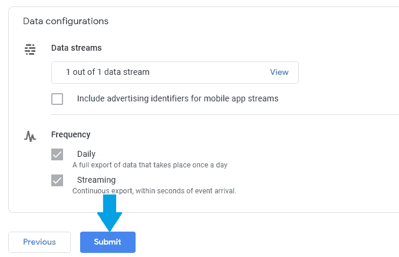
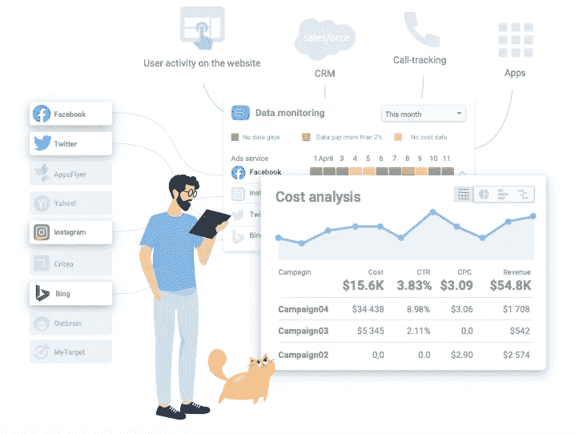
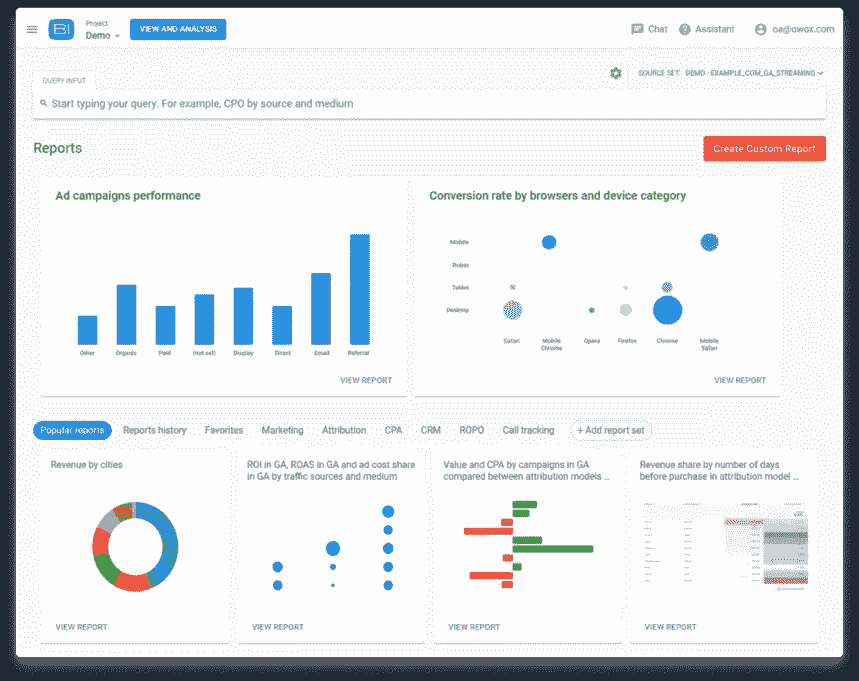

# 如何将数据从 Google Analytics 4 导出到 Google BigQuery

> 原文：<https://towardsdatascience.com/how-to-export-data-from-google-analytics-4-to-google-bigquery-5694a71fcb25?source=collection_archive---------8----------------------->

来源:[沉积照片](https://ua.depositphotos.com/22883344/stock-photo-moving-market-share.html)

## 在本文中，我们将告诉您如何将 Google Analytics 4 链接到 Google BigQuery，将数据从 GA4 导出到 BigQuery，并从您收集的数据中获得最大价值。

Google Analytics 4 让在 Google BigQuery 中分析数据变得前所未有的简单。现在几乎每个人都可以免费在 BigQuery 中收集数据。让“”弄清楚如何正确地将数据从 Google Analytics 4 导出到 BigQuery，以及您还应该考虑哪些因素，以便从您收集的信息中获得最大价值。

# 为什么需要收集原始的未采样数据

原始(未处理的)数据允许您精确地分析您的业务流程。通过收集[原始数据](https://www.owox.com/blog/articles/what-is-raw-data/)，您可以:

*   客观地评估您的业务流程
*   执行指标的深度分析
*   跟踪整个用户旅程
*   无限制地构建任何报告
*   细分你的受众，建立有针对性的广告

[采样](https://www.owox.com/blog/articles/how-to-avoid-google-analytics-sampling/)是指当信息量太大而无法快速处理时(例如，如果您在报告中使用多个自定义维度)，对给定细分市场的分析结果进行外推。抽样会严重扭曲你的报告，并导致你错误评估你的结果，因为你不是分析所有的数据，而是只分析部分数据。这样做，你就冒着投资低效广告活动或关闭创收广告渠道的风险。如您所见，避免采样绝对是个好主意。谢天谢地，这是可以实现的。

# 在哪里存储收集的数据

让我们来看看问题的实际方面:哪种分析平台方便、实惠，并且允许您处理原始的未采样数据？我们推荐的解决方案——Google big query——可能是全世界营销人员中最受欢迎的，这有一大堆坚实的理由。我们建议您使用 BigQuery 云存储来收集、存储和处理原始数据，下面我们将解释原因。

# 什么是 Google BigQuery？

[Google BigQuery](https://console.cloud.google.com/bigquery) 是一个多云数据仓库，内置查询服务，具有很高的安全性和可扩展性。据 [Gartner](https://www.gartner.com/doc/reprints?id=1-24BO6U2T&ct=201006&st=sb) 称，“到 2022 年，75%的数据库将被部署或迁移到云平台，只有 5%曾经考虑过迁移到本地。”由于 BigQuery 是谷歌生态系统的一部分，特别是[谷歌云平台](https://cloud.google.com/gcp/)，它可以与谷歌的其他产品集成，帮助你以有竞争力的速度发展你的业务。

# 为什么要 Google BigQuery？

对于营销人员来说，有多个低层次的方面使得 BigQuery 几乎不可替代。让我们仔细看看它的一些最有价值的好处:

*   能够上传大量信息。使用 BigQuery，你可以对任何类型的数据进行实时分析，并用 SQL 快速[处理。](https://cloud.google.com/blog/products/gcp/anatomy-of-a-bigquery-query)
*   **安全级别高。**您获得了[对项目的完全控制权](https://cloud.google.com/security/)，并且可以利用双因素认证。
*   **实惠。** [只为收集和处理的数据付费](https://cloud.google.com/bigquery/pricing)。
*   **与谷歌产品的原生集成。**轻松连接 Google Analytics 和其他产品。
*   **可扩展。** [快速无缝扩展](https://cloud.google.com/blog/products/gcp/understanding-bigquerys-rapid-scaling-and-simple-pricing)轻松适应快速变化的世界。
*   [big query ML](https://cloud.google.com/bigquery-ml/docs/)。使用 SQL 在结构化和半结构化数据上构建机器学习预测模型。
*   **大查询 GIS。**借助 [BigQuery 地理信息系统](https://cloud.google.com/bigquery/docs/gis-intro) (GIS)，您可以分析地理空间信息，并确定哪些用户应该收到特定商店位置的邮件。

# 导出模式

让我们检查一下导出到 BigQuery 的 GA 4 属性数据的[格式和模式](https://support.google.com/analytics/answer/7029846)。使用 GA 4 时要记住的一件重要事情是，它的结构不同于全球营销人员熟悉的通用分析的结构。

这就是 Google Analytics 4 模式与通用分析模式的不同之处:

*   **数据集。** GA 样本数据集被命名为*分析 _* ，其中*属性 ID* 是您的分析属性 ID。
*   **表格。**每天都有一个单独的 Google Analytics 表导入到数据集中。这种表格的格式是 *events_YYYYMMDD* ，不像通用分析中的格式是 *ga_sessions_YYYYMMDD* 。
*   **行。**每一行对应于一个上传的事件，而 Universal Analytics 的每一行对应于一个 Google Analytics 360 会话。
*   **列。**GA 4 和 Universal Analytics 的字段名差别很大。您可以通过以下链接进行比较:

[谷歌分析 4 大查询导出模式](https://support.google.com/analytics/answer/7029846#zippy=%2Cold-export-schema)

[通用分析 BigQuery 导出模式](https://support.google.com/analytics/answer/3437719?hl=en)

现在让我们来看看本文的主要目的:提供如何将数据从 Google Analytics 4 导出到 BigQuery 的分步说明。

# 如何将原始数据从 Google Analytics 4 导出到 Google BigQuery

如果你需要的信息已经在谷歌分析 4 中，你可以开始[导出](https://support.google.com/analytics/answer/9823238?hl=en&ref_topic=9359001)它。您可以将其导出到 [BigQuery 沙箱](https://support.google.com/docs/answer/9703715?hl=en)的自由实例中(适用[沙箱限制](https://cloud.google.com/bigquery/docs/sandbox#limits))。

# 1.创建一个 Google-APIs-Console 项目

要创建 API 控制台项目:

1.  登录[谷歌 API 控制台](https://console.cloud.google.com/)。
2.  创建新项目或选择现有项目。

图片由作者提供

# 2.启用 BigQuery

1.  转到 API 表。
2.  进入**导航**菜单，点击**API&服务**，然后选择**库**。

图片由作者提供

1.  在**Google Cloud API***部分，选择 **BigQuery API** 。*
2.  *在打开的页面上，点击**启用**。*
3.  *[向您的云项目添加服务帐户](https://cloud.google.com/iam/docs/creating-managing-service-accounts)。确保*fire base-measurement @ system。*[*gserviceaccount.com*](http://gserviceaccount.com/)是项目成员，并被分配了[编辑](https://cloud.google.com/iam/docs/understanding-roles#primitive_role_definitions)角色。*

# *3.将 BigQuery 链接到 Google Analytics 4 属性*

1.  *[登录您的 Google Analytics 账户。](https://analytics.google.com/)该帐户应该有所有者访问您的 BigQuery 项目和编辑访问您正在使用的谷歌分析 4 属性。*
2.  *进入 [**Admin**](https://support.google.com/analytics/answer/6132368) 选项卡，找到你需要链接到 BigQuery 的 Analytics [**属性**](https://support.google.com/analytics/answer/6099198) 。*
3.  *在**属性** 列中，点击 **BigQuery 链接**。*

**

*图片由作者提供*

1.  *点击**链接**。*

**

*图片由作者提供*

1.  *点击**选择一个 BigQuery 项目**查看您有权访问的项目。要创建新的 BigQuery 项目，请单击**了解更多信息**。*

**

*图片由作者提供*

1.  *选择你的项目，点击**确认**。*

**

*图片由作者提供*

1.  *选择一个**位置**。(如果您的项目已经有一个用于分析属性的数据集，则不能配置此选项。)*

**

*图片由作者提供*

1.  *点击下一个的**。***
2.  *选择要导出其信息的数据流。*

**

*图片由作者提供*

*如果您需要包含广告标识符，请勾选**包含移动应用流的广告标识符**。*

1.  *设置**频率** : **每日** 或**串流** (连续)输出(您也可以选择这两个选项)。*

**

*图片由作者提供*

1.  *最后点击**提交**。*

**

*图片由作者提供*

*恭喜你。你将在 24 小时内在你的 BigQuery 项目中看到你的 Google Analytics 4 信息。*

# *下一步是什么？*

*现在，BigQuery 中已经有了所有关于用户行为的原始数据。然而，要执行营销分析，找到你的增长区域和薄弱点，你需要将广告服务的成本数据、CRM 系统的数据、电话跟踪服务和移动应用程序(如果你使用的话)添加到 GBQ。接下来，将所有这些数据合并到一个数据集中，并使数据为业务做好准备，以便营销人员可以轻松地基于 BigQuery 数据创建报告。*

*收集和处理所有营销数据的最佳解决方案之一是 OWOX BI Pipeline。它包括从广告服务、CRM、呼叫跟踪服务和线下商店到 BigQuery 的数据，以完成您的数据难题。*

**

*图片由作者提供*

*一旦你有了所有必要的数据，是时候让它为你工作了。通常，这是分析师的任务，但有了 [OWOX BI 智能数据](https://www.owox.com/products/bi/smart-data/)，任何人都可以轻松处理 BigQuery 数据。*

*BigQuery 经常让营销人员感到害怕，而且似乎很复杂，但没有必要担心这一点:有一个解决方案可以帮助您轻松发现营销数据的所有潜力。OWOX BI 可以将它安排在一个根据您的业务调整的模型中，这样即使您根本不知道任何 SQL，您也可以轻松地构建报表。只需使用一个简单的报表生成器或选择一个现成的模板，并在您最喜欢的可视化工具中可视化结果。*

**

*图片由作者提供*

# *结论*

*您可以轻松地将您的 GA 4 信息导出到 BigQuery。如果新的结构适合你，你可以利用这种渐进的服务，并将其添加到你的营销分析工具箱。通过 OWOX BI Pipeline，您可以从您的网站、广告服务、CRM、线下商店和 BigQuery 中的呼叫跟踪服务收集数据，以完善您的数据。借助 OWOX BI 智能数据，您可以通过构建报告、将多行和多表转换为可操作的见解，以及改进您的决策来让这些数据为您所用。*