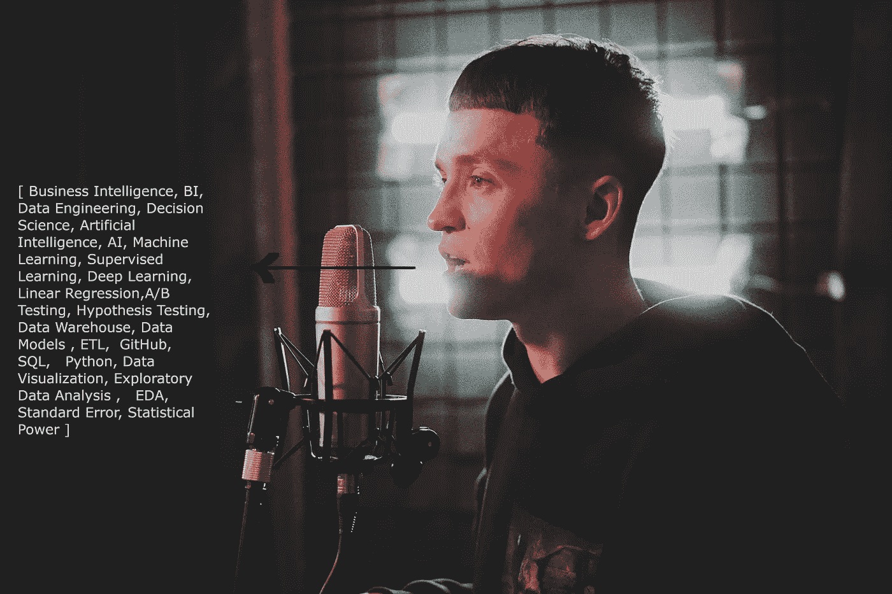

# 用自然语言处理(NLP)从音频文件中提取关键词

> 原文：<https://towardsdatascience.com/how-to-extract-keywords-from-audio-files-with-natural-language-processing-nlp-3084ceb951c9?source=collection_archive---------13----------------------->

## HuggingFace Transformers 将语音转换为文本，Spacy 提取关键字



[奥列格·伊万诺夫](https://unsplash.com/@olegixanovpht?utm_source=unsplash&utm_medium=referral&utm_content=creditCopyText)在 [Unsplash](https://unsplash.com/s/photos/singing?utm_source=unsplash&utm_medium=referral&utm_content=creditCopyText) 上拍照

最新版本的 HuggingFace transformers 引入了一个模型 Wav2Vec 2.0，该模型有可能解决与音频相关的自然语言处理(NLP)任务。而现在，你可以解决的任务之一就是如何从音频中提取关键词。

Wav2Vec 2.0 模型是由脸书人工智能团队发布的自动语音识别模型。当该模型在 10 分钟的转录语音和 53k 小时的未标记语音上训练时，它在有噪语音上的单词错误率(WER)为 8.6%，在干净语音上为 5.2%。Wav2Vec 2.0 的性能在标准 LibriSpeech 基准上进行检验。

点击 **了解更多关于[wav2 vec 2.0 的信息。](https://ai.facebook.com/blog/wav2vec-20-learning-the-structure-of-speech-from-raw-audio/)**

您可以解决的其他 NLP 任务有自动摘要、翻译、命名实体识别、关系提取、情感分析、语音识别、主题分割等。

在本文中，我们将解决的 NLP 任务是从音频中提取文本，然后提取文本的关键字。

让我们将这些任务分成 3 部分。

1.音频预处理

2.从音频预测文本

3.从文本中提取关键词

# 第一步:音频预处理

最常用的音频格式是 mp3、mp4 和 m4a。但是，Wav2Vec 2.0 模型是在 Wav 格式音频上训练的。因此，它接受 wav 格式作为输入。我使用 Pydub 库来转换不是 wav 格式的格式。

按照下面的代码将音频文件转换成 Wav 格式。

```
from pydub import AudioSegmentm4a_audio = AudioSegment.from_file(r”dnc-2004-speech.mp3", format=”mp3")m4a_audio.export(“dnc-2004-speech_converted.wav”, format=”wav”)
```

我的笔记本电脑一次只能处理 3-4 分钟的音频。任何超过 3-4 分钟的音频在处理时都会引发内存不足的错误。

我引用了美国前总统奥巴马先生的讲话。音频长度为 12 分钟。所以，我把 12 分钟的音频分成 4 部分来避免这个错误，每个音频有 3 分钟的长度。之后，我使用该模型从每个音频元素中提取文本。最后，我将所有音频的文本合并成一个段落。

按照下面的代码将大的音频文件分解成较小的文件。

至此，音频预处理部分完成。我们现在将这些文件输入到模型中来预测文本。

那么，让我们执行第二步。

# 第二步:从音频预测文本

在这一步中，您将使用 Wav2vec 2.0 模型从音频中获取文本。您可以通过循环播放我们之前转换成较小音频文件的音频文件来实现这一点。

在每个循环中，从音频中预测文本，并将其存储到 collection_of_text 变量中。最后，添加 collection_of_text 变量中的所有文本，并将其存储在 final_complete_speech 变量中。

可以使用 transformers 库导入预先训练好的模型 facebook/wav2vec2-base-960h。这个模型在 960 小时的 Librispeech 语音音频上进行了微调。其他型号也可以进行微调或不进行微调，或者提供不同的培训时间。

访问 [**这里下载**](https://github.com/pytorch/fairseq/tree/master/examples/wav2vec#wav2vec-20) 其他型号。

此外，这些模型是在 16Khz 频率音频上训练的。因此，输入音频也应该具有 16 Khz 的频率。

按照这段代码完成第二步。

这样，第二部分就完成了。在最后一部分，你可以从 final_complete_speech 变量中提取关键字。

# 第三步:从文本中提取关键词

您可以使用各种 python 库来完成这一步。但是最常用的 python 库是 Spacy、Rake、Bert 和 Yake。我更喜欢 spacy 的关键字提取，因为它非常简单易用。使用 Spacy，您只需 4 行代码就可以完成第三步。

还有，你可以参考 [**这篇文章**](/keyword-extraction-process-in-python-with-natural-language-processing-nlp-d769a9069d5c?source=friends_link&sk=63f531986bf4be7be7ff7a2225c1c061) 来使用其他的关键词提取方法。

按照这段代码从文本中提取关键字。

```
# use this code to install Spacy, Scispacy and en_core_sci_scibert model
# pip install -U pip setuptools wheel
# pip install -U spacy
# pip install scispacy
# pip install [https://s3-us-west-2.amazonaws.com/ai2-s2-scispacy/releases/v0.4.0/en_core_sci_scibert-0.4.0.tar.gz](https://s3-us-west-2.amazonaws.com/ai2-s2-scispacy/releases/v0.4.0/en_core_sci_scibert-0.4.0.tar.gz)import spacy
nlp = spacy.load(“en_core_sci_scibert”)
doc = nlp(final_complete_speech.lower())
print(doc.ents)
```

# 结论

随着变形金刚库的完善，NLP 领域也在不断发展。Wav2Vec 2.0 模型是脸书人工智能团队和 HuggingFace 团队的重大成功之一。现在，你可以用很低的 WER 成功地从音频中提取抄本。

可以解决自动文摘、翻译、命名实体识别、关系抽取、情感分析、语音识别、话题分割等。，与音频相关的 NLP 任务。

希望这篇文章能帮助你解决与音频相关的关键词提取任务。