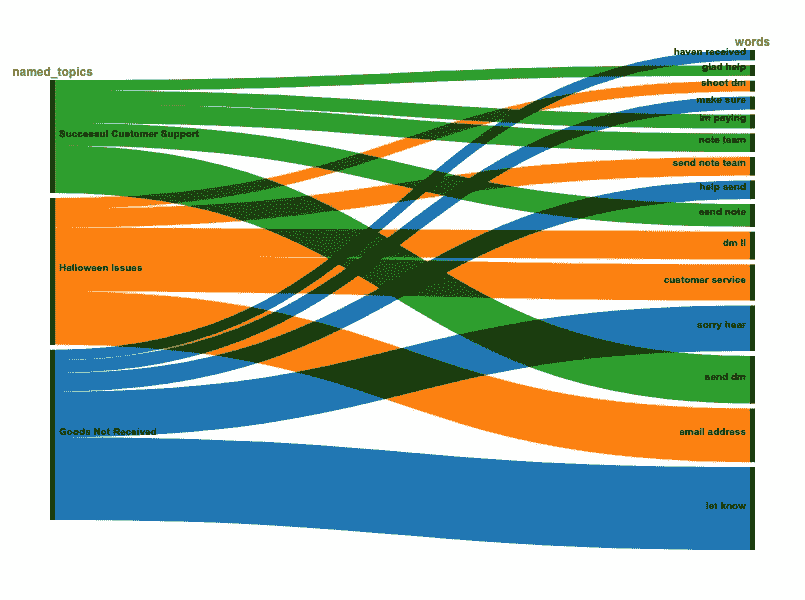

# 如何从自然语言数据中提取标注主题

> 原文：<https://towardsdatascience.com/how-to-extract-labelled-topics-from-natural-language-data-8af121491bfd?source=collection_archive---------28----------------------->

[西格蒙德](https://unsplash.com/@sigmund?utm_source=unsplash&utm_medium=referral&utm_content=creditCopyText)在 [Unsplash](https://unsplash.com/s/photos/extraction?utm_source=unsplash&utm_medium=referral&utm_content=creditCopyText) 上拍照

假设您的项目中有大量难以处理的自然语言数据。也许你刮了它，做了 101 个 API 调用，或者其他人把它送给了你。

很自然，你想看看里面是什么。但是真的很大吗？因此，这就是主题建模的用武之地，它可以帮助从自然语言数据集中提取排名前 *n* 的主题。

但是你知道主题实际上是什么是非常重要的，对吗？你不只是想让他们成为话题 1、话题 2 等等。另外，如果你完成后能把这个转换成一些时髦的视觉效果就更好了。

但是，嘿，不是已经有很多关于主题建模的教程了吗？有，有！但是根据我的经验，他们很少关注让输出更加用户友好和易于理解。虽然像 [PyLDAvis](https://pyldavis.readthedocs.io/en/latest/readme.html) 这样的库对于在 Jupyter 笔记本中详细探索自然语言主题来说是非常棒的，但它们不太能与非技术同事或利益相关者共享。

这就是我这篇文章想要解决的问题。我将讨论主题建模一个混乱的自然语言数据集，你可能会在一个网络抓取项目中得到这种数据集。到我们完成的时候，希望我的 python 函数会有意义，你可以复制、粘贴和调整它们到你自己的项目中。

## 数据准备

在整篇文章中，我将使用来自 Kaggle 的数据。这是 Twitter 上关于客户支持问题的推文集合，所以这是一个非常混乱的自然语言数据集，其中有许多不同的主题。

首先要做的是读入数据并清理它。

在检查了没有丢失数据的行之后，我使用了一个非常有用的 tweets 预处理库，您可以在用语法`import preprocessor as p`导入之前用`pip install tweet-preprocessor`安装它。这有助于快速删除表情符号、网址和其他噪音；然而，我避免删除标签，因为我想保留文本数据。所以我只是保持简单，在清理文本的函数中调用`text.replace("#", "")`。

## 为主题建模

现在转到主题建模，我已经用一种非常简单的方式完成了，因为这是一个很大的领域，并不是本文的重点！

简而言之，我使用了一个简单的计数矢量器来生成一个令牌计数矩阵，即不同的重要单词在我们正在分析的文本中出现了多少次。我还明确表示，我感兴趣的是两到三个单词的配对，而不仅仅是单个单词。

这意味着在“快速棕色狐狸跳过懒狗”这句话中,“棕色”不能算作象征，但“快速棕色”或“狐狸跳过”可以。我这样做是因为我认为这将有助于理解客户支持中的主题；例如,“电子邮件支持”而不仅仅是“支持”是否经常与特定的公司或软件搭配使用？

接下来，我将使用 LDA 模型来尝试查看正文中的主题。这里有一篇非常好的文章和一些相应的论文，关于这是如何工作的[，](https://scikit-learn.org/stable/modules/decomposition.html#latentdirichletallocation)，如果你打算使用这个模型，我鼓励你去读一读！但是在一个非常简单的层面上，这实质上是将单词——或者在我们的例子中是成对的单词——分组到主题中，基于它们是那些主题的成员的概率。

现在已经完成了，是时候解释输出了！

## 创建主题关键词

这就是代码变得更加繁重和复杂的地方。下一个 Jupyter 笔记本片段将完成以下步骤:

1.  创建一个通用的工具函数来展平列表。这有助于从 LDA 模型对象中获取数据。
2.  一个`write_data`函数，它从我之前使用的 CountVecotrizer 中获取清晰可读的数据，将大量文本转换为感兴趣的令牌矩阵，并从 LDA 模型中获取。我也把这个信息写到文件里了。
3.  一旦完成，我们就可以读入数据并使用 groupby 来查看哪些主题与哪些词对相关联。这通常比看起来要简单得多——主题并不总是出现在你面前，可能需要对矢量器和建模参数进行一些调整才能做到这一点。虽然这看起来很烦人，但我认为这实际上是一件非常好的事情——您可以手动检查输出，以确保模型挑选出真正有意义的主题。
4.  完成后，我为主题创建了一些更容易理解的名称，并将它们写入数据框架。请注意，scikitlearn 的输出只是任意编号的主题，即主题 1、主题 2、主题 3 等等。这就是我们要替换的。
5.  然后，我用 Seaborn 制作了一个非常简单的条形图来说明到目前为止所做的工作。但是你可以制作更具视觉吸引力的图表——见下文。

## 用图表表示出来

为了可视化你的结果，我强烈推荐[原始图表](http://rawgraphs.io)。它非常易于使用，可定制性强，非常漂亮。

举例来说，你可以使用与制作上面非常技术性的 Seaborn 图完全相同的数据，来制作这个冲积图。

## 结论

总结一下，一旦你完成了建模，手动提取主题实际上并不难。这有点复杂，但在我看来这不是坏事，因为它迫使你详细解释建模的结果，而不是过度依赖计算机。

一旦你把数据也拿出来了，你就可以用任何你喜欢的方式来绘制它。以我的经验来看，如果你要向利益相关者做演示，并且想要完全控制演示的效果，这就大不一样了。

希望这将有助于向他人展示你的作品，让他们更容易理解，反过来也让你更欣赏！