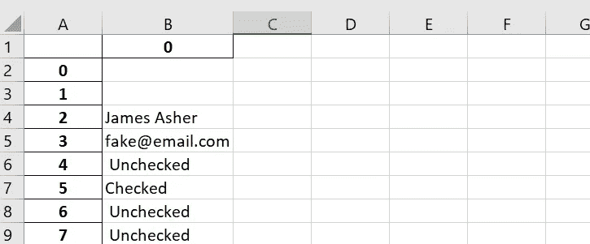

# 如何在 Python 中提取 PDF 数据

> 原文：<https://towardsdatascience.com/how-to-extract-pdf-data-in-python-876e3d0c288?source=collection_archive---------4----------------------->

## Adobe 在没有订阅的情况下很难做到这一点，但这应该会有所帮助


由 [Unsplash](https://unsplash.com/s/photos/lock?utm_source=unsplash&utm_medium=referral&utm_content=creditCopyText) 上的 [iMattSmart](https://unsplash.com/@imattsmart?utm_source=unsplash&utm_medium=referral&utm_content=creditCopyText) 拍摄的照片

出于某种原因，pdf 仍然在行业中一直使用，它们真的很烦人。尤其是当你没有为某些订阅付费来帮助你管理它们的时候。这篇文章是为那些处于那种情况的人写的，*那些需要免费从 pdf 获取文本数据的人。*

首先，如果你想分析手写文本，这篇文章是错误的——但它很快就会出现。

该过程包括将 PDF 转换为。然后通过正则表达式和其他简单的方法提取数据。

如果你没有读过我的文章[关于自动化你的键盘将 pdf 转换成。txt 群发，那么我建议你先这样做。这会节省你很多时间。如果你不想点击离开，那么这里的所有代码做到这一点。](/how-to-easily-automate-your-keyboard-to-do-tasks-in-python-b698e98a5c40)

作者写的代码——可以在这里下载:[https://gist.github.com/jasher4994](https://gist.github.com/jasher4994)

# 转换为。txt 然后从字里行间读出

既然你已经皈依了。txt 文件，你所要做的就是写一些代码，找出你想要的答案。

当翻译成。txt 文件，输出可能会有点滑稽。有时问题周围的文本可以在响应框的上方，有时可以在下方。我不确定这是否有技术上的原因，或者只是为了让做这样的事情更加困难。

**诀窍是在文本中寻找常量，并隔离它们。**

不管怎样，都有解决的办法。我们只想要答案，并不关心它们周围的文字。幸运的是当转换成。txt 文件，我们所有的所有输入部分都在新的一行开始。正如我们所知，如果我们试图提取的所有事物都有一个不变的因素，那么我们的生活就会轻松很多。

因此，我们可以读取我们的。用 open()和 read()将 txt 文件转换成 Python，然后对它使用 splitlines()。这将提供一个字符串列表，每当原始字符串中出现一个换行符(\n)时，就会开始一个新的实例。

```
import os
os.chdir(r"path/to/your/file/here")
f = open(r"filename.txt", "r")
f = f.read()
sentences = f.splitlines()
```

正如承诺的那样，这会给你一个字符串列表。

但是，如前所述，这里我们只对用户输入感兴趣。幸运的是，还有另一个决定性因素可以帮助我们隔离输入。所有的输入，以及从新的一行开始，都以一对括号开始。这些括号内的内容定义了输入的类型。例如，文本部分应该是

```
(text)James Asher
```

一个复选框是

```
(checkbox)unchecked
```

其他例子包括“单选按钮”和“组合按钮”，大多数 PDF 输入都是这四种类型。

然而，偶尔会有随机的以括号开头的部分或句子，所以您可以使用 set(sentences)来仔细检查。在我的例子中，只有 5 个不同类型的问题，我想包括在内，所以使用下面的列表理解来删除所有其他内容。

```
questions = ["(text", "(button", "(:", "(combobox", "(radiobutton" ]sentences= [x for x in sentences if x.startswith(tuple(questions))]
```

现在，您将拥有一份针对您的问题的所有输入/答案的列表。只要你使用相同的 PDF，这个列表的结构将保持不变。

我们现在可以简单地把它转换成熊猫的数据帧，做一些处理，然后输出成我们想要的任何格式。

*不全是。txt 文件像这样从 pdf 中输出，但大多数都是这样。如果您的没有，那么您必须使用 regex 并在您的特定文档中查找常量。但是一旦你编写了从一个文档中提取它的代码，只要它们是同类的，它对你所有的文档都是一样的。*

# 从字符串列表中提取数据

提取文本很容易。在这种情况下，我需要做的就是删除前面的括号。这可以通过列表理解和一些正则表达式轻松完成。

```
list_strings = [re.sub(r"\([^()]*\)", "", x) for x in list_strings]
df = pd.DataFrame(list_strings)
df.to_excel("output.xlsx")
```

输出如下所示。



使用 Python 提取 PDF 数据的输出

然后，您可以简单地在所有。txt 文件并与熊猫合并在一起。然后，您可以根据需要旋转或清洁。

您现在有了一个可用的 excel(或 CSV)文件，它存储了所有 pdf 中的所有数据。几乎所有这些代码都是可重用的，您只需确保如果您尝试使用新的一批不同的 pdf，它们会在转换为时转换为类似的布局。txt 文件。

希望这有所帮助。

```
If I’ve inspired you to join medium I would be really grateful if you did it through this [link](https://jamesasher4994.medium.com/membership) — it will help to support me to write better content in the future.If you want to learn more about data science, become a certified data scientist, or land a job in data science, then checkout [365 data science](https://365datascience.pxf.io/c/3458822/791349/11148) through my [affiliate link.](https://365datascience.pxf.io/c/3458822/791349/11148)
```

如果你喜欢这篇文章，请看看我的其他文章。

</how-to-easily-run-python-scripts-on-website-inputs-d5167bd4eb4b>  </how-to-easily-show-your-matplotlib-plots-and-pandas-dataframes-dynamically-on-your-website-a9613eff7ae3>  </how-to-easily-automate-your-keyboard-to-do-tasks-in-python-b698e98a5c40>  

干杯，

詹姆斯