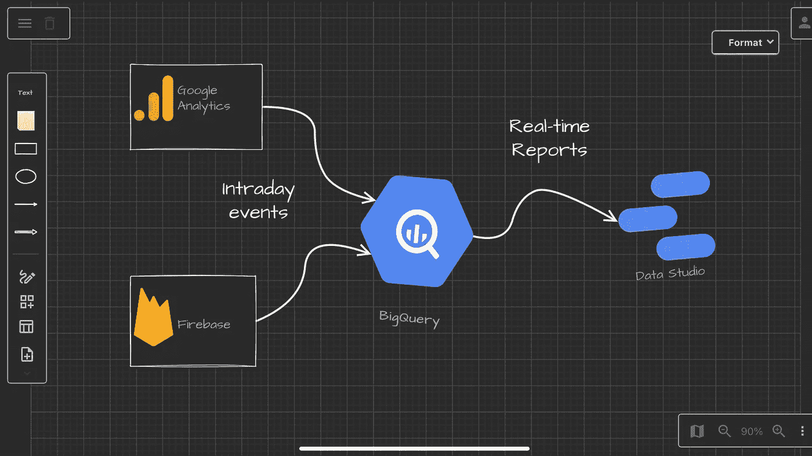
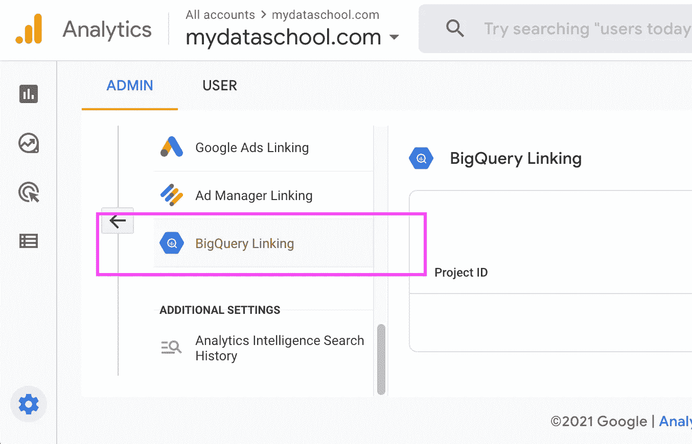

# 如何在 BigQuery 中从 Google Analytics 4 和 Firebase 中提取实时日内数据

> 原文：<https://towardsdatascience.com/how-to-extract-real-time-intraday-data-from-google-analytics-4-and-firebase-in-bigquery-65c9b859550c?source=collection_archive---------11----------------------->

## 并始终为您的自定义报告提供最新数据

杰西卡·路易斯在 [Unsplash](https://unsplash.com?utm_source=medium&utm_medium=referral) 上的照片

如果您是一名 **Firebase** 或 **Google Analytics 4** 用户，并且您已经将数据导入到您的 [**BigQuery**](https://https://console.cloud.google.com/bigquery) 数据仓库中，那么您可能想要创建*实时*定制报告，其中包含您在*日内*模式中的数据。问题是，这个整合的数据集每天都在被谷歌自动删除。因此，如果您选择将它作为数据源连接到您在[**Google Data Studio**](https://datastudio.google.com)中的报告，第二天您将找不到它。

作者图片[💡迈克·沙克霍米罗夫](https://medium.com/u/e06a48b3dd48?source=post_page-----65c9b859550c--------------------------------)

例如，我想在我们用 **Data Studio** 构建的 BI 解决方案中对*日内*表进行实时分析。由于它经常被删除，我无法将它作为数据集连接到谷歌数据工作室。此外，当它被删除时，它不再是一个分区表，您不能使用*通配符*后缀进行日期查询。

说到这里，我需要以下内容:

1.  **日内**表不应该自动删除。我想手动操作。
2.  由于此 **Firebase** 日常数据导出/集成功能的存在。我想集成数据传输将在一个小时内保证第二天交付。

我相信这是一个很普遍的问题。

作者图片[💡迈克·沙克霍米罗夫](https://medium.com/u/e06a48b3dd48?source=post_page-----65c9b859550c--------------------------------)

我已经向谷歌工程提出了[一个功能请求](https://issuetracker.google.com/issues/204248504)，以在需要时启用手动删除，但在写这篇文章时，它仍在进行中*。*

> **“日内表不应该自动删除。我们希望手动操作。”**

**虽然这可能需要一段时间。因此，这里有一个解决方案来克服这个问题。**

# *如何从日内表中提取数据*

> **理想情况下，您会希望运行一个调度脚本，其中参数是当天表格的日期后缀。**

> **然而事情没那么简单……**

# *日内表被自动删除*

*所以你不知道安排剧本的确切时间。或者，您可以使用 **daily** export 表，但是同样，您必须等到提取准备就绪。我一直在寻找关于日内表删除时间的信息，我发现过去一天的日内表可能还存在几个小时。原因之一是处理大量数据需要更多时间 [Stackoverflow](https://stackoverflow.com/questions/60796741/intraday-table-for-firebase-analytics-in-bigquery) 。因此，删除过去的表没有固定的时间，但一般来说，它在新的一天之后的几个小时内仍然存在。您在 GA 中设置的时区也会对此产生影响。*

# *无法在 BigQuery 脚本中使用表名参数。*

***BigQuery 脚本**是一个强大的工具，但目前(2021–11–20)谷歌的 **BigQuery** 脚本不能使用表名参数。根据 BigQuery 文档中的参数化查询]5，查询参数不能用于 SQL 对象标识符*

> **参数不能替代标识符、列名、表名或查询的其他部分。**

# *第一步。检查原始日内表是否存在*

*如果数据存在，您可能希望使用此脚本返回`true`:*

# *第二步。创建一个 BigQuery SQL 脚本(如果存在，执行一些操作，例如插入)*

*然后，将执行更新的脚本添加到您的程序中:*

# *第三步。决定如何处理新的日内表副本的 INSERT 语句*

*您可以:*

*   *用新数据替换整个表*
*   *仅为所选列添加新记录*

# *复制和替换当天事件表*

*这个脚本将复制整个表:*

*您可能希望使用与**复制和替换日内事件表**相同的 SQL 脚本，但是将**复制和替换查询**更改为**选择和插入查询**。让我们创建这个脚本来完成以下任务:*

## ***解决方案:***

# *结论*

****日内*** 表与 ***日内*** 会话表相比可能会有细微的差异，但您无需等待。这些差异是由以下原因造成的:*

*   *Google Analytics 允许最多晚发送四个小时的点击，在请求数据时，这些点击可能在当天的表中不可用。*
*   *Google 在收集点击量之后和将数据导出到 BigQuery 之前执行一些数据处理。一般受影响的领域是流量来源和链接的营销产品(AdWords，Campaign Manager 等。)*

*一般来说，如果这些字段对您的数据堆栈没有任何影响，这是通过与 **Firebase** 或 ***Google Analytics 4*** 集成来提高**数据*可用性*** 的解决方案。*

# *资源*

*[1]:[https://stack overflow . com/questions/60796741/intraday-table-for-firebase-analytics-in-big query](https://stackoverflow.com/questions/60796741/intraday-table-for-firebase-analytics-in-bigquery)*

*[2]:[https://https://console . cloud . Google . com/big query](https://https://console.cloud.google.com/bigquery)*

*[3]:[https://datastudio.google.com](https://datastudio.google.com)*

*[4]:[https://stack overflow . com/questions/59372469/create-table-using-a-variable-name-in-the-big query-ui](https://stackoverflow.com/questions/59372469/create-table-using-a-variable-name-in-the-bigquery-ui)*

*[5]:[https://cloud . Google . com/big query/docs/parameterized-queries # big query _ query _ params _ named-web](https://cloud.google.com/bigquery/docs/parameterized-queries#bigquery_query_params_named-web)*

**原载于【https://mydataschool.com】**。****