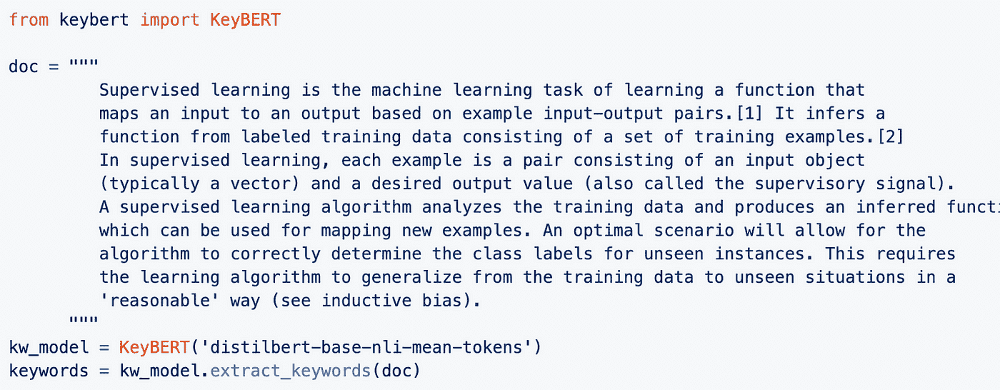
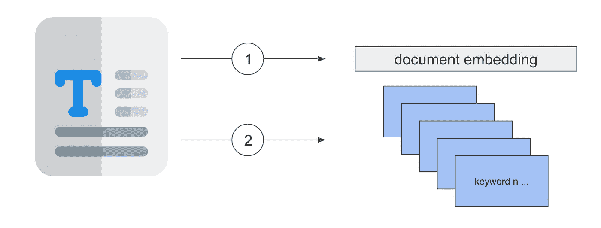
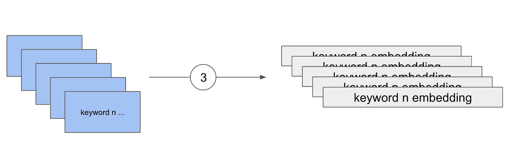
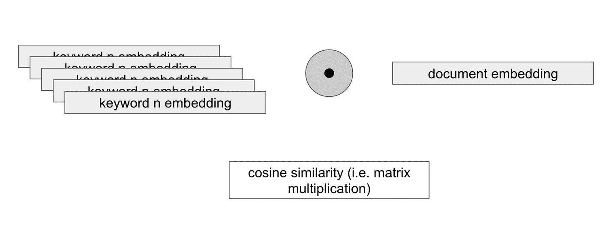
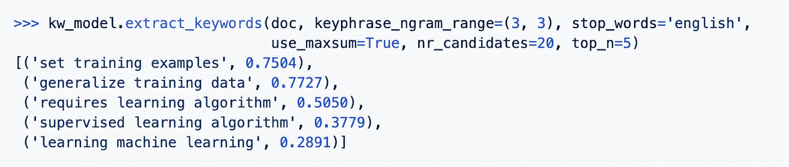
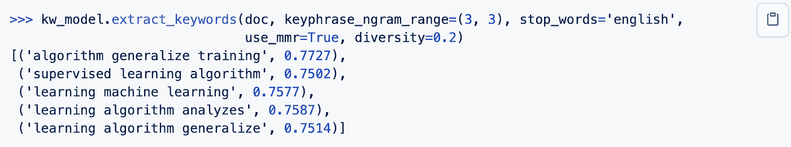
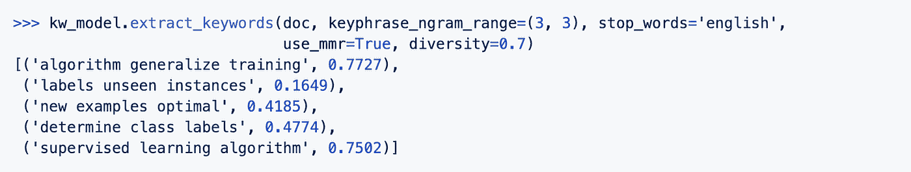

# 如何用 KeyBERT 提取相关关键词

> 原文：<https://towardsdatascience.com/how-to-extract-relevant-keywords-with-keybert-6e7b3cf889ae?source=collection_archive---------3----------------------->

## 伯特的另一个应用


作者图片

有很多强大的技术可以执行关键词提取(例如 [Rake](https://csurfer.github.io/rake-nltk/_build/html/index.html) ， [YAKE](https://github.com/LIAAD/yake) ！， [TF-IDF](https://kavita-ganesan.com/extracting-keywords-from-text-tfidf/#.YMjWGTYzZ_k) )。然而，它们主要基于文本的统计属性，并不一定考虑整个文档的语义方面。

KeyBERT 是一个简单易用的关键字提取技术，旨在解决这个问题。它利用了 BERT 语言模型，并依赖于🤗变形金刚图书馆。


来源:[https://github.com/MaartenGr/KeyBERT](https://github.com/MaartenGr/KeyBERT)

KeyBERT 由 [Maarten Grootendorst](https://medium.com/u/22405c3b2875?source=post_page-----6e7b3cf889ae--------------------------------) 开发和维护。所以，如果你有兴趣使用它，就去看看他的回购(并克隆它)。

在这篇文章中，我将简要介绍 [KeyBERT](https://github.com/MaartenGr/KeyBERT) :它是如何工作的，以及你如何使用它

*PS:如果想看如何使用 KeyBERT 以及如何嵌入到 Streamlit app 中的视频教程，可以看看我的视频:*

作者视频

# KeyBERT:一种基于 BERT 的关键词提取技术

你可以用 pip 安装 KeyBERT。

```
pip install keybert
```

如果您需要其他来源的嵌入🤗变压器，你也可以安装它们:

```
pip install keybert[flair]
pip install keybert[gensim]
pip install keybert[spacy]
pip install keybert[use]
```

调用 KeyBERT 很简单:根据🤗变形金刚建模并对其应用`extract_keywords`方法。



来源:https://github.com/MaartenGr/KeyBERT

# KeyBERT 如何提取关键词？

KeyBERT 通过执行以下步骤提取关键词:

1-使用预训练的 BERT 模型嵌入输入文档。你可以选择任何你想要的伯特模型🤗变形金刚。这将文本块转换成固定大小的向量，表示文档的语义方面

2-使用单词包技术(如 TfidfVectorizer 或 CountVectorizer)从同一文档中提取关键字和表达式(n 元语法)。这是一个经典步骤，如果您过去执行过关键词提取，您可能会很熟悉



作者图片

3-然后将每个关键字嵌入到固定大小的向量中，使用与嵌入文档相同的模型



作者图片

4-既然关键字和文档在同一空间中表示，KeyBERT 计算关键字嵌入和文档嵌入之间的余弦相似性。然后，提取最相似的关键字(具有最高的余弦相似性得分)。



作者图片

这个想法非常简单:您可以把它看作是经典关键字提取技术的增强版本，其中 BERT 语言模型加入了它的语义功能。

**这还不止于此** : KeyBERT 包括两种方法来在结果关键字中引入多样性。

**1 —最大相似度总和(MSS)**

要使用这个方法，首先要将 top_n 参数设置为一个值，比如 20。然后从文档中提取 2 个 top_n 关键词。计算这些关键词之间的成对相似度。**最后，该方法提取彼此最不相似的最相关的关键词。**

这里有一个来自 KeyBERT 知识库的例子:



来源:[https://github.com/MaartenGr/KeyBERT](https://github.com/MaartenGr/KeyBERT)

**2 —最大边际相关性(MMR)** 这种方法与前一种相似:它增加了一个多样性参数

在文本摘要任务中，MMR 试图最小化冗余并最大化结果的多样性。

它从选择与文档最相似的关键词开始。然后，它迭代地选择既与文档相似又与已经选择的关键词不相似的新候选

您可以选择低差异阈值:



来源:[https://github.com/MaartenGr/KeyBERT](https://github.com/MaartenGr/KeyBERT)

或者一个高的:



来源:[https://github.com/MaartenGr/KeyBERT](https://github.com/MaartenGr/KeyBERT)

# 到目前为止还不错，但是…

不过，KeyBERT 可能会遇到的一个限制是执行时间:如果您有大型文档并需要实时结果，KeyBERT 可能不是最佳解决方案(除非您的生产环境中有专用的 GPU)。原因是 BERT 模型是出了名的庞大，并且消耗大量资源，尤其是当它们必须处理大型文档时。

您可能会找到一些技巧来加快推断时间，方法是选择较小的模型(DistilBERT)，使用混合精度，甚至将您的模型转换为 ONNX 格式。

如果这仍然对你不起作用，检查一下其他经典方法:尽管它们相对简单，但你会对它们的效率感到惊讶。

# 感谢阅读！

今天到此为止。如果您正在执行关键词提取，我希望您会发现这个小方法对您的 NLP 项目有用。

你可以在这里了解更多关于 KeyBERT 的信息:

<https://github.com/MaartenGr/KeyBERT>  </keyword-extraction-with-bert-724efca412ea>  

还有这里:

<https://www.preprints.org/manuscript/201908.0073/v1>  

保重，

# 新到中？您可以每月订阅 5 美元，并解锁无限的文章— [点击此处。](https://ahmedbesbes.medium.com/membership)