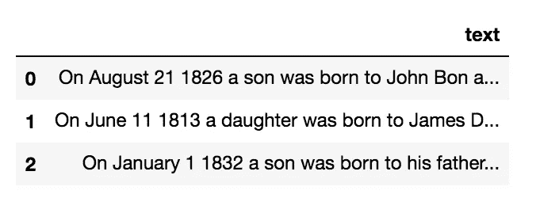
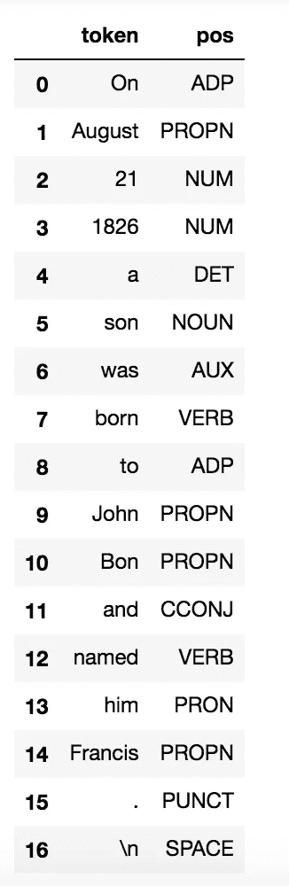
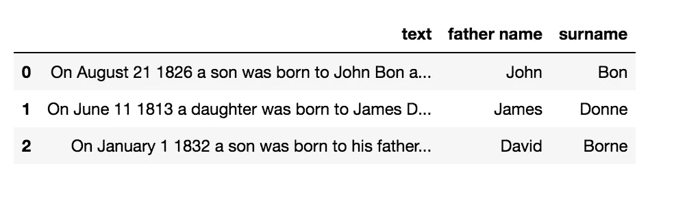
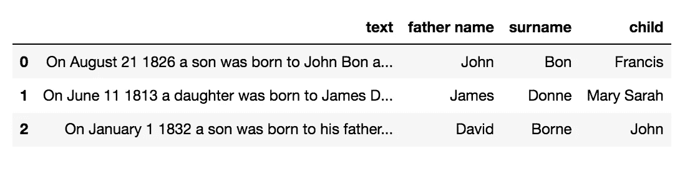
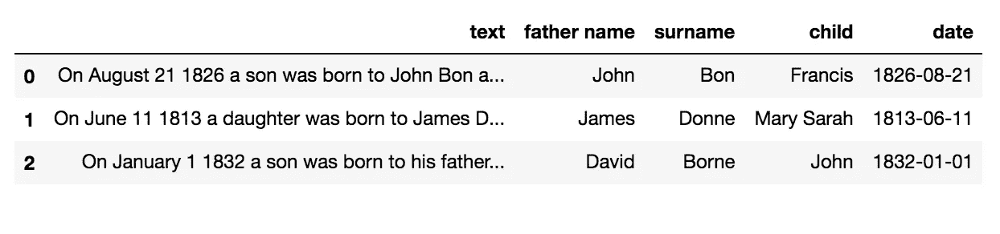
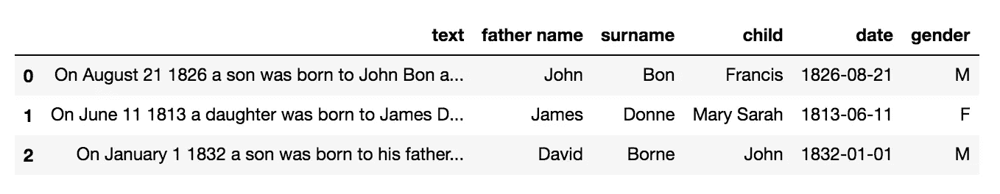

# 如何通过 Python 空间从文本中提取结构化信息

> 原文：<https://towardsdatascience.com/how-to-extract-structured-information-from-a-text-through-python-spacy-749b311161e?source=collection_archive---------4----------------------->

## 文本分析

## 关于如何从文本构建结构化数据集的现成教程。


图片来自 [Pixabay](https://pixabay.com/?utm_source=link-attribution&utm_medium=referral&utm_campaign=image&utm_content=3205452) 的 [Gerd Altmann](https://pixabay.com/users/geralt-9301/?utm_source=link-attribution&utm_medium=referral&utm_campaign=image&utm_content=3205452)

在本教程中，我将演示如何从文本构建数据集。作为一个例子，我考虑出生登记，其中包含以下文本:

```
On August 21 1826 a son was born to John Bon and named him Francis.
On June 11 1813 a daughter was born to James Donne naming her Mary Sarah.
On January 1 1832 a son was born to his father David Borne and named him John.
```

文件的每一行都包含出生登记。所有出生登记的结构几乎相同，尽管在一些细节上有所不同。寄存器存储在名为`register.txt`的 txt 文件中。

**在本教程中，我一步一步地描述了如何提取父亲的名字和姓氏、孩子的名字、出生日期和孩子的性别。**

我按照以下步骤提取信息:

*   将文本转换成一个`pandas`数据帧，其中每一行对应寄存器的一行
*   分析典型句子的结构，以提取词性。
*   提取所有需要的信息。

对于最后两步，我利用了 [SpaCy](https://spacy.io/) 库，这是一个用于自然语言处理的 Python 库。

# 从文本到数据帧

首先，我从文件系统中打开文本，逐行分割，并将每一行存储为一个列表项:

```
with open('register.txt', 'r') as f:
    text = [line for line in f.readlines()]
```

然后，我用创建的列表构建一个`pandas`数据框架:

```
import pandas as pddf = pd.DataFrame(text,columns=['text'])
df.head()
```



作者图片

# 词性分析

现在我以第一句话为例，进行基本的自然语言处理。这可以通过`spaCy`库的`nlp()`功能来完成。我导入了`en_core_web_sm`词库，可以通过下面的命令安装:`python -m spacy download en_core_web_sm`。`spaCy`库支持许多语言，它们的词典可以通过相同的命令安装。

一旦安装了词典，我就导入并加载它。然后，我可以执行 NLP 处理。

```
import en_core_web_sm
import spacytext = df['text'][0]nlp = en_core_web_sm.load()
doc = nlp(text)
```

`doc`变量包含所有被处理的信息。在我的例子中，我只需要 PoS，提取如下:

```
features = []
for token in doc:
    features.append({'token' : token.text, 'pos' : token.pos_})
```

对于句子中的每个标记，我保存标记及其位置。我将结果附加到一个名为`features`的列表中。现在，我可以用提取的特征构建一个数据框架。这样做只是为了以更有序的方式显示结果:

```
fdf = pd.DataFrame(features)
fdf.head(len(fdf))
```



作者图片

我注意到父亲(约翰·邦)被标记为 PROPN，这意味着一个人的名字，它的前面是单词*到*，后面是单词*和。对于数据集中的所有句子来说，最后一点并不正确，因此我还必须考虑其他句子的结构，这将在后面解释。*

这个孩子也被认为是一个 PROPN，后面总是跟一个点，前面是单词 *him* 或 *her* 。

# 提取父亲

现在我可以建立一个模式，提取父亲的名字和姓氏。我定义了两个变量`first_tokens`和`last_tokens`，它们分别包含所有句子中的前置词和后置词:

```
first_tokens = ['to', 'father']
last_tokens = ['and', 'naming']
```

我定义了能识别父亲的模式:

```
pattern_father = [[{'LOWER' : {'IN' : first_tokens}},
           {'POS':'PROPN', 'OP' : '+'},
           {'LOWER': {'IN' : last_tokens}} ]]
```

我说父亲必须以前面单词中的一个单词开始(没有匹配的大小写)，然后我搜索 PROPN(一次或多次)，最后我搜索下面单词中的一个。

我定义了以下函数:

```
from spacy.matcher import Matcherdef get_father(x):
    nlp = en_core_web_sm.load()
    doc = nlp(x)
    matcher = Matcher(nlp.vocab) 
    matcher.add("matching_father", pattern_father) matches = matcher(doc)
    sub_text = ''    
    if(len(matches) > 0):
        span = doc[matches[0][1]:matches[0][2]] 
        sub_text = span.text
    tokens = sub_text.split(' ')

    name, surname = tokens[1:-1]
    return name, surname
```

这个函数利用了`spaCy` `Matcher()`类，该类搜索先前定义的模式。如果我找到一个匹配，我从匹配中删除第一个和最后一个单词，并返回结果。

现在我利用 dataframe `apply()`函数来计算数据集中每个文本的父亲:

```
new_columns = ['father name','surname']
for n,col in enumerate(new_columns):
    df[col] = df['text'].apply(lambda x: get_father(x)).apply(lambda x: x[n])
```



作者图片

# 救出孩子

提取每个孩子的过程与提取父亲的过程非常相似。因此，首先，我定义了第一个和最后一个标记以及模式:

```
first_tokens = ['him', 'her']
last_tokens = ['.']
pattern_son = [[{'LOWER' : {'IN' : first_tokens}},
           {'POS':'PROPN', 'OP' : '+'},
           {'LOWER': {'IN' : last_tokens}} ]]
```

然后我定义了提取孩子的函数:

```
def get_child(x):
    nlp = en_core_web_sm.load()
    doc = nlp(x)
    matcher = Matcher(nlp.vocab) 
    matcher.add("matching_son", pattern_son)matches = matcher(doc)
    sub_text = ''    
    if(len(matches) > 0):
        span = doc[matches[0][1]:matches[0][2]] 
        sub_text = span.text
    # remove punct
    sub_text = sub_text[:-1]
    tokens = sub_text.split(' ')

    return ' '.join(tokens[1:])
```

请注意，上一个函数的最后一行允许提取复合名称。

最后，我利用`apply()`函数来计算每个孩子:

```
df['child'] = df['text'].apply(lambda x: get_child(x))
```



作者图片

# 提取日期

现在我定义一个提取日期的函数。在这种情况下，我没有利用`spaCy`库。我对句子进行了标记，我注意到日期总是从第二个标记(月)开始，到第四个标记(年)结束。我将月份从字符串转换成数字。此外，我以 YYYY-MM-DD 格式返回日期。

```
def get_date(x):
    months={"January":"01","February":"02","March":"03","April":"04","May":"05","June":"06",
            "July":"07","August":"08","September":"09","October":"10","November":"11","December":"12",}
    tokens = x.split(" ")
    # month
    month = months[tokens[1]]
    # day
    day=tokens[2]
    if(len(day)==1):
        day="0"+day

    # year
    year = x.split(" ")[3]

    return (year+"-"+month+"-"+day)
```

我将定义的函数应用于数据帧:

```
df['date'] = df['text'].apply(lambda x: get_date(x))
```



作者图片

# 提取性别

最后，我通过利用下面的想法来提取性别:如果句子包含单词 son，则孩子是男性，否则她是女性:

```
def get_gender(x):
    if 'son' in x:
        return 'M'
    return 'F'
df['gender'] = df['text'].apply(lambda x: get_gender(x))
```



作者图片

数据集可以导出为 CSV 文件:

```
df.to_csv('structured_register.csv')
```

# 摘要

在本教程中，我演示了如何从非结构化文本中提取结构化信息。我利用了`spaCy`库的两个函数:`nlp()`，用于执行 NLP，以及`Matcher()`，用于在字符串中搜索模式。

`spaCy`库非常强大，因此如果您想了解其他提供的特性，请继续关注；)

本教程的完整代码可以从我的 [Github 库](https://github.com/alod83/data-science/tree/master/TextAnalysis)下载。

如果你想了解我的研究和其他活动的最新情况，你可以在 [Twitter](https://twitter.com/alod83) 、 [Youtube](https://www.youtube.com/channel/UC4O8-FtQqGIsgDW_ytXIWOg?view_as=subscriber) 和 [Github](https://github.com/alod83) 上关注我。

# 相关文章

<https://medium.com/geekculture/the-top-25-python-libraries-for-data-science-71c0eb58723d>  </how-to-install-python-and-jupyter-notebook-onto-an-android-device-900009df743f> 