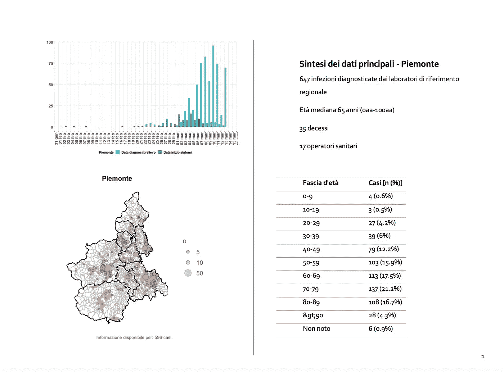
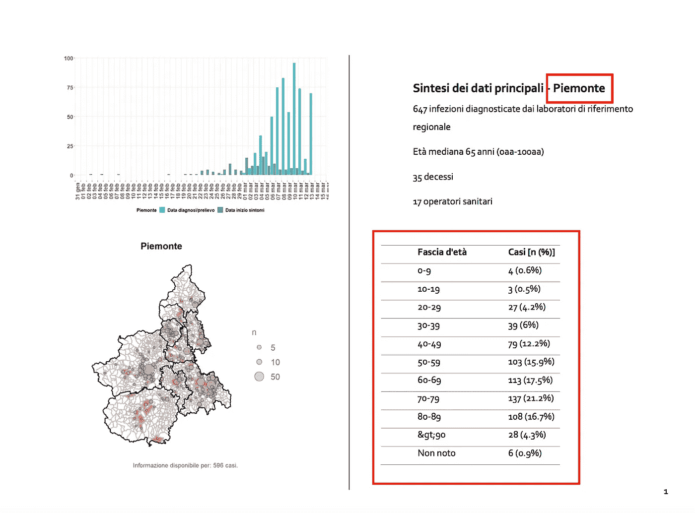
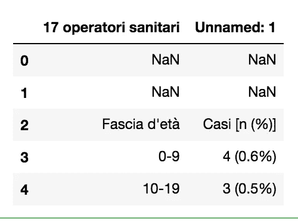
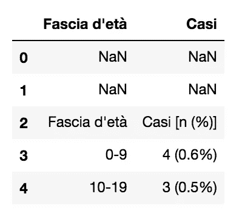
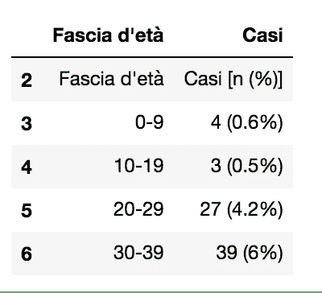
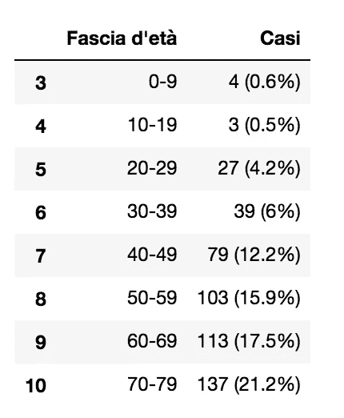
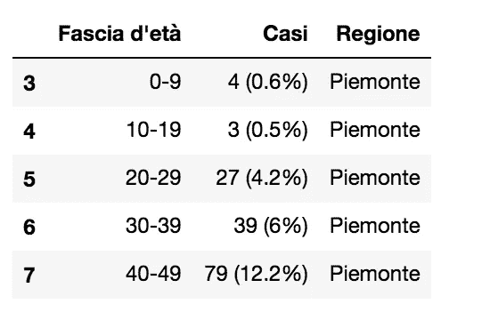

# 如何使用 Python 熊猫和 tabula-py 从 PDF 中提取表格

> 原文：<https://towardsdatascience.com/how-to-extract-tables-from-pdf-using-python-pandas-and-tabula-py-c65e43bd754?source=collection_archive---------4----------------------->

## 数据收集

## 一个从 PDF 中提取重复表格的快捷脚本


图片来自 [Pixabay](https://pixabay.com/?utm_source=link-attribution&utm_medium=referral&utm_campaign=image&utm_content=336704) 的[免费照片](https://pixabay.com/photos/?utm_source=link-attribution&utm_medium=referral&utm_campaign=image&utm_content=336704)

这篇教程是我上一篇文章的改进，在那篇文章中，我在没有 Python `pandas`的情况下提取了多个表。在本教程中，我将使用与我上一篇文章中相同的 PDF 文件，不同之处在于我使用 Python `pandas`处理提取的表格。

本教程的代码可以从[我的 Github 库](https://github.com/alod83/data-science/tree/master/DataCollection/PDF)下载。

几乎所有被分析的 [PDF 文件](https://www.epicentro.iss.it/coronavirus/bollettino/Bolletino-sorveglianza-integrata-COVID-19_17-marzo-2021_appendix.pdf)的页面都具有以下结构:



作者图片

在页面的右上角有意大利地区的名称，而在页面的右下角有一个表格。



作者图片

我想提取所有页面的区域名称和表格。我需要提取两个表格的边界框。测量边距的完整程序在[我的上一篇文章](https://medium.com/analytics-vidhya/how-to-extract-multiple-tables-from-a-pdf-through-python-and-tabula-py-6f642a9ee673)的*定义边距*一节中有说明。

该脚本实现了以下步骤:

*   定义边界框，它通过一个如下形状的列表来表示:`[top,left,bottom,width]`。边界框内的数据用厘米表示。它们必须转换成 PDF 点，因为`tabula-py`需要这种格式。我们设定转换因子`fc = 28.28`。
*   使用`read_pdf()`功能提取数据
*   将数据保存到`pandas`数据帧。

在这个例子中，我们扫描 pdf 两次:第一次提取地区名称，第二次提取表格。因此，我们需要定义两个边界框。

# 提取区域名称

首先，我定义边界框来提取区域:

```
box = [1.5, 22,3.8,26.741]
fc = 28.28

for i in range(0, len(box)):
    box[i] *= fc
```

然后，导入`tabula-py`库，我们定义必须从中提取信息的页面列表，以及文件名。

```
import tabula as tbpages = [3,5,6,8,9,10,12,14,16,18,22,24,26,28,30,32,34,36,38,40]
file = “source/Bolletino-sorveglianza-integrata-COVID-19_17-marzo-2020_appendix.pdf”
```

现在我可以从 pdf 中读取地区列表。我使用了`read_pdf()`函数，我们将输出格式设置为`json`。

```
regions_raw = tb.read_pdf(file, pages=pages,area=[box],output_format="json")
```

我注意到生成的输出非常复杂。然而，通用结构在位置`regions_raw[i]['data'][0][0]['text']`包含第 I 个区域的区域名称。通过循环进入`region_raw`列表，我建立了一个包含所有地区的列表。

```
regions = []
for i in range(0,len(regions_raw)):
    regions.append(regions_raw[i]['data'][0][0]['text'])
```

# 提取第一页的表格(皮德蒙特地区)

我定义了边界框，我们将转换因子`fc`的每个值相乘。为了理解这个机制是如何工作的，首先，我提取第一页的表格，然后我们推广到所有的页面。在此示例中，第一页对应于第 3 页。

```
box = [8,10,25,26]
for i in range(0, len(box)):
    box[i] *= fc
```

现在我可以看 pdf 了。在这种情况下，我将`output_format`设置为`DataFrame`。结果存储在`tl`中，这是一个列表。我可以简单地用`tl[0]`把它转换成数据帧。

```
page = 3
tl = tb.read_pdf(file, pages=page,area=[box],output_format="dataframe", stream=True)
df = tl[0]
df.head()
```



作者图片

我注意到列名是错误的。另外，前三排都是错的。出于这个原因，我可以使用 dataframe 函数`rename()`来重命名列名。

```
df.rename(columns={ df.columns[0]: "Fascia d'età" , df.columns[1]: "Casi"}, inplace = True)
df.head()
```



作者图片

现在我可以使用`dropna()`函数删除前两行。

```
df = df.dropna()
df.head()
```



作者图片

我可以通过选择不包含该值的所有行来删除新的第一行。

```
df = df[df["Fascia d'età"] != "Fascia d'età"]
df.head(8)
```



作者图片

现在我向`df`添加一个新列，称为`Regione`，它包含地区名称。我扫描`pages`列表来提取当前区域的索引。

```
region_column = []
for i in range(0, len(df)):
    index = pages.index(page)
    region_column.append(regions[index])df['Regione'] = region_column
df.head()
```



作者图片

# 提取所有页面

现在我可以概括前面的代码来提取所有页面的表格。首先，我构建了一个空的`DataFrame`，它将包含所有区域的值。我将使用`pd.concat()`函数连接所有页面的所有表格。我扫描了包含在`pages`列表中的所有页面。

```
import pandas as pd
df = pd.DataFrame()
for page in pages:

    index = pages.index(page)
    region = regions[index]
    print(region)

    tl = tb.read_pdf(file, pages=page,area=[box],output_format="dataframe", stream=True)

    dft = tl[0]
    dft.rename(columns={ dft.columns[0]: "Fascia d'età", dft.columns[1]: "Casi"}, inplace = True)

    region_column = []
    for i in range(0, len(dft)):
        region_column.append(region)
    dft['Regione'] = region_column

    df = pd.concat([df, dft])
```

与前面的情况类似，我丢弃了所有错误的记录。

```
df.dropna(inplace=True)
df = df[df["Fascia d'età"] != "Fascia d'età"]
```

# 将结果保存到 CSV

现在，我可以将结果保存为 csv 文件。

```
df.to_csv('output.csv')
```

# 摘要

在本教程中，我演示了如何将多个 PDF 表格转换成一个单独的`pandas` `DataFrame`并将其导出为一个 CSV 文件。

该过程包括三个步骤:定义边界框，通过`tabula-py`库提取表格，并将它们导出到一个 CSV 文件。

如果你想了解我的研究和其他活动的最新情况，你可以在 [Twitter](https://twitter.com/alod83) 、 [Youtube](https://www.youtube.com/channel/UC4O8-FtQqGIsgDW_ytXIWOg?view_as=subscriber) 和 [Github](https://github.com/alod83) 上关注我。

# 相关文章

[](https://medium.com/analytics-vidhya/how-to-extract-multiple-tables-from-a-pdf-through-python-and-tabula-py-6f642a9ee673) [## 如何通过 python 和 tabula-py 从 PDF 中提取多个表格

### 通常情况下，您的数据可能不是 CSV 或 JSON 格式，但它们包含在一个 PDF 文件中，格式为…

medium.com](https://medium.com/analytics-vidhya/how-to-extract-multiple-tables-from-a-pdf-through-python-and-tabula-py-6f642a9ee673) [](https://alod83.medium.com/how-to-extract-data-from-a-search-engine-through-python-and-selenium-35dfe6b20db) [## 如何通过 python 和 selenium 从搜索引擎中提取数据

### 在本教程中，我将解释如何通过编写一个简单的 python 脚本从搜索引擎中提取结构化数据…

alod83.medium.com](https://alod83.medium.com/how-to-extract-data-from-a-search-engine-through-python-and-selenium-35dfe6b20db) [](/dataset-manipulation-with-open-refine-a5043b7294a7) [## 使用 Open Refine 操作数据集

### Open Refine 是一个用于清理、转换和丰富数据集的 web 应用程序。它可以在下载…

towardsdatascience.com](/dataset-manipulation-with-open-refine-a5043b7294a7) 

# 新到中？您可以每月订阅几美元，并解锁无限的文章— [单击此处](https://alod83.medium.com/membership)。