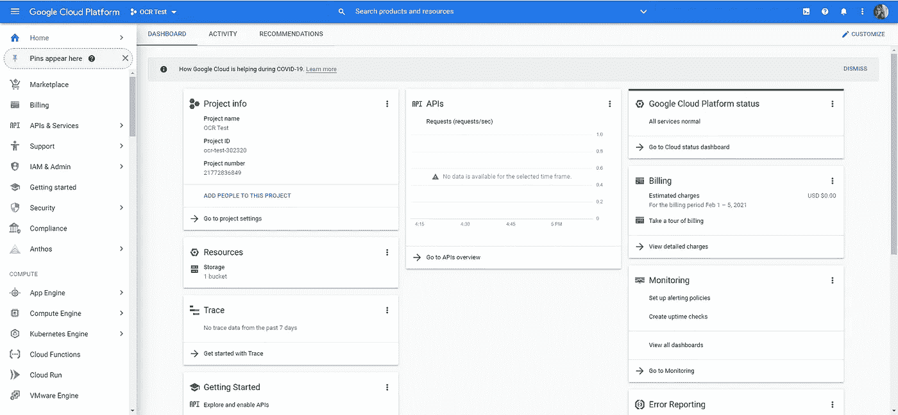

# 如何使用 Python 和 Google Cloud Vision API 从 pdf 中提取文本

> 原文：<https://towardsdatascience.com/how-to-extract-the-text-from-pdfs-using-python-and-the-google-cloud-vision-api-7a0a798adc13?source=collection_archive---------0----------------------->


今年冬天，我发现韦尔斯利学院(Wellesley College)有超过 100 年的课程目录、招生指南和年度公告。我立即被从这些文档中提取的迷人数据的潜力所吸引，但第一步必须将它们转换为文本，因为没有多少分析方法可以在旧的棕色 pdf 扫描上运行。

因此，我开始寻找一种方法，既能快速有效地对大量 PDF 文件运行 OCR，又能尽可能保持格式和准确性。在尝试了几种方法之后，我发现使用 Google Cloud Vision API 产生了迄今为止我尝试过的所有公开可用的 OCR 工具中最好的结果。

由于我找不到任何单一的、全面的指南来使用这个神奇的工具运行简单的 OCR 应用程序，所以我决定写这一篇，这样任何具有一点编程知识的人都可以使用这个奇妙的工具。

# 按照这些说明你需要什么

*   在您的计算机上安装 Python 3 和 pip
*   用于编辑代码的文本编辑器—我使用 Visual Studio 代码
*   一种在你的电脑上运行 Python 程序的方法。
*   您还需要一种支付方式来进入您的 Google Cloud 帐户，尽管您不需要花任何钱来完成本教程。借记卡、信用卡或谷歌钱包账户都可以。

# 设置您的 Google Cloud Vision 帐户

为了使用谷歌云视觉运行光学字符识别，您首先需要有一个谷歌帐户。这将允许您登录谷歌的云服务仪表板。从该控制面板可以访问的众多服务之一是文件存储，我们将使用它来托管我们将转换为文本的 PDF 文件。

因为我们将通过 Cloud Vision API 访问的高级机器学习算法在云中运行，所以我们需要将我们的 PDF 上传到 Google 托管的文件“桶”中，以便可以访问它。

本教程将向您展示如何将最终结果(包含 PDF 中所有文本的文本文件)写入您计算机上的某个位置。

1.  如果您尚未登录谷歌帐户，请前往[google.com](https://www.google.com/)登录或创建一个帐户。我假设我的读者在这一步不需要进一步的指导。
2.  一旦你登录到你的谷歌账户，跟随这个[链接](https://console.cloud.google.com/)到你的谷歌云仪表板。如果要求您接受服务条款，请接受。你应该登陆一个看起来像这样的页面。



谷歌云平台仪表板

3.点击图标右边的下拉菜单，上面写着谷歌云平台。我的写着“OCR 测试”，这是我当前打开的项目的名称，但你的会说一些不同的东西。将弹出一个窗口，列出最近的项目，在右上角有一个“新建项目”按钮。单击按钮创建一个新项目。给你的项目起一个名字，这将帮助你记住你使用它的目的。你不需要担心任何其他领域。点击“创建”。创建项目后，请确保再次打开窗口并从最近的项目列表中选择它。

4.现在，您应该可以看到新创建项目的项目信息、API 和其他信息面板，如上面的屏幕截图所示。在左下方的“入门”面板中，单击“浏览并启用 API”。这将允许您选择您希望能够用于这个项目的 Google APIs。


API 和服务

5.在屏幕顶部的菜单栏中，单击“启用 API 和服务”。这将把你带到 API 库。搜索“云视觉 API”并选择它。

6.单击“启用”使 API 可用于您的项目。这将带您进入 Cloud Vision API 的概述页面。在屏幕的右上角，单击“创建凭据”。

7.从“您正在使用哪个 API？”下的下拉菜单中选择“Cloud Vision API”在“您是否计划将此 API 与 App Engine 或 Computer Engine 一起使用”下，选择“不，我不使用它们”。单击蓝色的“我需要什么凭证？”按钮。

8.现在，您将能够创建一个密钥，以便在尝试连接到 Cloud Vision API 时验证自己的身份。选择一个您将记住的服务帐户名称，并将您的角色设置为“所有者”。将密钥类型设置为 JSON。单击继续。您现在可以下载包含您的凭证的 JSON 文件了。

您现在在 Google 云平台上有一个项目，它将能够使用 Cloud Vision API。下一步是上传您的 PDF 文档，以便将其存储在云中。然后，您可以编写脚本将其转换为文本。

9.如果尚未打开，请单击谷歌云平台左侧的导航菜单，向下滚动直到看到“存储”。点击它——这将打开一个下拉菜单。从下拉菜单中选择“浏览器”。此时，如果您尚未启用计费，则需要启用计费。如果你有 Google Pay，你可以在这里使用它——否则，你需要输入外部支付信息。这将取决于你如何支付，所以我不会给指示。完成后，您应该会看到一个带有“创建一个桶”选项的对话框。

10.为您的铲斗取一个唯一的名称。这是您之前创建的项目中的一个存储库。将数据存储位置设置为“多区域”，并将数据的默认存储类别设置为“标准”。点击“创建”。

现在您已经设置了一个存储桶，您可以在其中上传文件，以便它们可以被为当前项目启用的任何 API 访问。您可以上传您想要转录的 PDF 文件，方法是将其拖放到您电脑上的任何位置。

您已经准备好编写一个程序，通过连接到 Google Cloud services 并提供您之前下载的密钥，可以访问这个文件和 Cloud Vision API。

# 安装必要的库

现在你已经在 Google Cloud 上设置好了你需要的一切，我们将在你的电脑上安装必要的工具，并使用它们从 PDF 文件中提取文本。

首先，您可能需要进行一些安装。打开终端，导航到保存您编写的 python 脚本的文件夹。输入以下命令。

`pip install google-cloud-vision`

`pip install google-cloud-storage`

它们使用 pip 来安装两个 Python 库，分别带有与 Google Cloud Vision 和云存储 API 交互的工具。接下来，运行

`pip freeze`

这将检查您是否已经安装了所有应该安装的东西。您应该有以下版本，尽管大多数可能是更新的版本。

```
google-api-core==1.14.3google-api-python-client==1.7.11google-auth==1.6.3google-auth-httplib2==0.0.3google-cloud==0.34.0google-cloud-core==1.0.3google-cloud-storage==1.20.0google-cloud-vision==0.39.0google-resumable-media==0.4.1googleapis-common-protos==1.6.0google-api-core==1.14.3
```

如果你没有它们中的任何一个，使用 pip 来安装缺失的那些。

最后，您需要设置您的 Google 应用程序凭证——也就是说，您需要注册您之前下载的 json 密钥的保存位置，以便当您使用 Google 云服务运行程序时，您的计算机可以验证自己属于您的 Google 帐户。

你可以在这里找到关于如何在任何平台上这样做的极好的指导[。一旦你这样做了，你将能够从命令行运行使用谷歌云服务的程序。](https://cloud.google.com/docs/authentication/getting-started)

# 写剧本

现在我们开始有趣的部分——编写一个脚本，在我们选择的 PDF 上实际执行光学字符识别！创建一个新的 Python 文件，并使用您喜欢的代码编辑器打开它。我将解释我使用的脚本的每一部分，以便您在替换您的信息时能够理解它。你也可以在我的 Github 上找到完整的脚本[这里](https://github.com/szeamer/google-cloud-vision-script/blob/main/script.py)。在下载之前，试着按照每一步进行修改。

1.  第一步是导入我们需要的库。


我们需要导入 json，以便处理 Cloud Vision 的输出。re 是一个库，它允许我们使用正则表达式来匹配字符串中的特定模式。

来自 google.cloud 的愿景和存储将允许我们使用 google Cloud 愿景和 Google 云存储 API。

2.下一步是使用 Google Cloud Vision API 编写一个函数来检测 PDF 文件中所有可读文本的位置。请务必阅读该函数中的注释，以便了解每个步骤在做什么。


函数来注释 PDF 文件中的文本

除了解释这个函数的注释之外，还有一些需要注意的地方。你可能会期望，当我们在一个文档上运行谷歌令人惊叹的 OCR 工具时，我们将得到一个文本文件作为回报。实际上，这个函数将只输出一个 json 文件——或者几个，这取决于 PDF 的大小——包含关于文件中文本位置的信息。实际上，获取文本以便我们能够阅读是下一步。

这个函数有两个输入。首先，gcs_source_uri 是您的 PDF 文件在 Google 云存储中的位置。第二个，gcs_destination_uri 是您希望包含文件注释的 json 文件在 Google 云存储中的位置。

URI 是谷歌云存储中文件位置的术语。你可以把它想象成谷歌云存储中的一个 URL，或者像你电脑上的一个路径。它描述了在你保存在 google cloud 上的文件的层次结构中，在哪里可以找到一个特定的文件。要查找文件的 URI，您可以双击它来查看它的详细信息，并从您将打开的数据表中复制 URI。


为了生成注释，您将在 Python 文件的底部编写一行代码，调用 async_detect_document 函数。我的看起来像这样。


第一个 URI 是存储在我的 google 云存储桶中的一个 PDF 文档的路径，我想从中读取内容。第二个链接指向一个文件夹，我在其中保存了我所有的文档注释。

3.现在我们已经注释了我们的 PDF，我们终于可以使用 Cloud Vision 到每个有文本的位置，并将其读入一个文本文件！我的代码如下。还是那句话，一定要看评论。


这个函数只有一个参数:我们存储注释的位置的 URI。它将把转录的结果输出到当前活动目录中的文本文件中，并在终端中打印出来。


我是这样调用它的，使用和以前一样的目录。

恭喜你！如果一切顺利，您现在应该处于一个文本文件的位置，该文件包含 PDF 中所有机器可读文本的逐行转录。你可能会惊讶有多少可以阅读——它甚至可以在一些笔迹上工作。

下面是我的一些结果的横向比较。这是我从 1889 年韦尔斯利学院档案中提取的课程目录中的一页。尽管我使用了一个完全未经预处理的 PDF 文件作为测试的输入文件，但测试结果非常准确，即使是人名和外来词也是如此。


在我的下一篇文章中，我将演示一些预处理旧文本文件的方法，以便进一步提高准确性，敬请关注。如果你有任何麻烦或者只是想聊天，请联系我——我喜欢聊天！