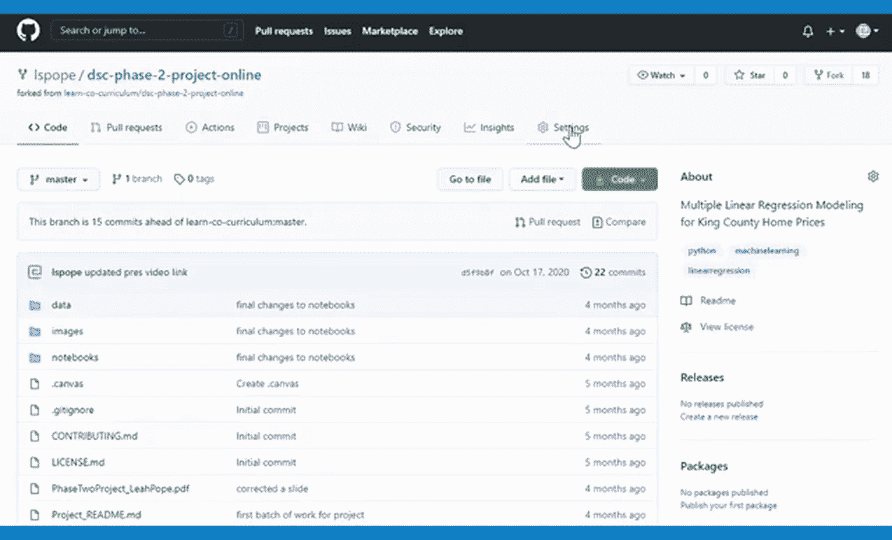
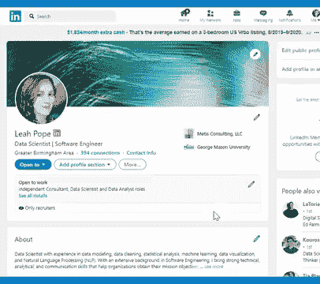

# 如何在 LinkedIn 上展示你的 GitHub 知识库

> 原文：<https://towardsdatascience.com/how-to-feature-your-github-repositories-on-linkedin-56078e1ffddb?source=collection_archive---------2----------------------->

## 把你的工作放在聚光灯下！

[Abhyuday Majhi](https://unsplash.com/@jonty007?utm_source=unsplash&utm_medium=referral&utm_content=creditCopyText) 在 [Unsplash](https://unsplash.com/?utm_source=unsplash&utm_medium=referral&utm_content=creditCopyText) 上拍摄的照片

你是一名数据科学家还是软件开发人员，想要在你的 LinkedIn 个人资料上突出你来自 GitHub 的最佳作品？如果是这样，请继续阅读。

**步骤 1)在 GitHub 上设置社交媒体预览图片。**

*   记住一句老话，“一图胜千言”，选择一个合适的图像来代表你的作品。 [Unsplash](https://unsplash.com/) 、 [Pexels](https://www.pexels.com/) 和 [Canva](https://www.canva.com/photos/free/) 是一些可免费使用的图片资源。
*   转到您的 repo 并点击**设置。**
*   进入**社交预览**部分，点击**编辑**上传图片。
*   对您想要的每个回购重复上述步骤。

作者图片

**第 2 步)在你的 LinkedIn 个人资料中展示你的回购。**

*   转到你的 LinkedIn 个人资料的**特色**部分(就在**关于**部分的下方)。
*   单击加号以显示不同类型的项目。
*   点击**链接。**
*   在**添加链接**弹出窗口中输入您的回购的 URL，然后点击**添加。**
*   输入您希望项目显示的标题和描述，然后点击**保存**。
*   同样，对您想要的每个回购重复上述步骤。

从我的错误中吸取教训！

当我最初在我的 LinkedIn 个人资料上展示我的项目时，我忘记了事先在 GitHub 上设置社交媒体预览图像。结果呢？我的 GitHub 档案头像显示在每个…单个…项目上。多么重复，无聊，没有信息！

当然，我想尽快解决这个问题，所以我赶紧回到我的 GitHub 并添加了社交媒体预览图片。我查看了我的 LinkedIn 个人资料，什么都没有！我刷新了网页，看到了…同样的旧的无聊头像，而不是我深思熟虑选择的完美代表我作品的图像。

英国广播公司 GIF

谢天谢地，有一个快速修复(谢谢，谷歌)！我需要清空 LinkedIn 上的图片缓存。

我上了 LinkedIn [**帖子检查器**](https://www.linkedin.com/post-inspector/) **，**输入我的储存库的网址，点击**检查**。这清除了图像缓存，我的时髦的新图像显示在我的个人资料上！

现在你知道一个简单的方法来在你的 LinkedIn 个人资料上展示你的 GitHub repos！如果你觉得这有用，请分享，如果这对你有帮助，请随时告诉我。