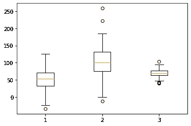
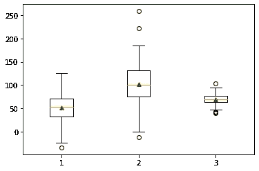
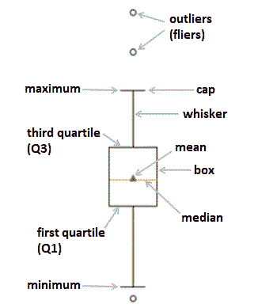

# 如何从箱线图中获取精确值(Python)

> 原文：<https://towardsdatascience.com/how-to-fetch-the-exact-values-from-a-boxplot-python-8b8a648fc813?source=collection_archive---------7----------------------->

## 从 matplotlib 盒图中提取数据集描述性统计数据的有效方法


来自 [Unsplash](https://unsplash.com/photos/tMDDb8f1ENc)

箱线图是一种可视化类型，用于显示数据集描述性统计数据的[五位数集合](https://en.wikipedia.org/wiki/Five-number_summary):最小值和最大值(不包括异常值)、中值、第一(Q1)和第三(Q3)四分位数。在 Python 中，可以在各种数据可视化库中创建箱线图，包括最基本的库— matplotlib。

虽然箱线图的主要作用域是*可视化*关于数据集的统计信息，但是如果我们还需要提取并打印出这些统计信息的确切数字呢？在本文中，我们将讨论在 matplotlib 库中这样做的最简单的方法。

首先，让我们创建 3 个虚拟数据集，并在 matplotlib 中显示它们的箱线图。为了能够进一步提取必要的值，我们必须将`plt.boxplot()`方法的结果赋给一个变量(`bp`):

```
import matplotlib.pyplot as plt
import numpy as npnp.random.seed(1)
data_1 = np.random.normal(50, 30, 300)
data_2 = np.random.normal(100, 40, 300)
data_3 = np.random.normal(70, 10, 300)
data = [data_1, data_2, data_3]bp = plt.boxplot(data)
plt.show()
```



作者图片

产生的变量`bp`是一个 Python 字典:

```
type(bp)**Output:** dict
```

以下关键字代表箱线图的主要元素:

```
bp.keys()**Output:** dict_keys(['whiskers', 'caps', 'boxes', 'medians', 'fliers', 'means'])
```

这是字典本身:

```
bp**Output:**
{'whiskers': [<matplotlib.lines.Line2D at 0x1eaf6131b50>,
  <matplotlib.lines.Line2D at 0x1eaf6131eb0>,
  <matplotlib.lines.Line2D at 0x1eaf61533a0>,
  <matplotlib.lines.Line2D at 0x1eaf6153700>,
  <matplotlib.lines.Line2D at 0x1eaf6162b80>,
  <matplotlib.lines.Line2D at 0x1eaf6162ee0>],
 'caps': [<matplotlib.lines.Line2D at 0x1eaf614a250>,
  <matplotlib.lines.Line2D at 0x1eaf614a5b0>,
  <matplotlib.lines.Line2D at 0x1eaf6153a60>,
  <matplotlib.lines.Line2D at 0x1eaf6153dc0>,
  <matplotlib.lines.Line2D at 0x1eaf616d280>,
  <matplotlib.lines.Line2D at 0x1eaf616d5e0>],
 'boxes': [<matplotlib.lines.Line2D at 0x1eaf61317f0>,
  <matplotlib.lines.Line2D at 0x1eaf6153040>,
  <matplotlib.lines.Line2D at 0x1eaf6162820>],
 'medians': [<matplotlib.lines.Line2D at 0x1eaf614a910>,
  <matplotlib.lines.Line2D at 0x1eaf6162160>,
  <matplotlib.lines.Line2D at 0x1eaf616d940>],
 'fliers': [<matplotlib.lines.Line2D at 0x1eaf614ac70>,
  <matplotlib.lines.Line2D at 0x1eaf61624c0>,
  <matplotlib.lines.Line2D at 0x1eaf616dca0>],
 'means': []}
```

我们看到字典的值实际上是 matplotlib 对象的列表(特别是，`matplotlib.lines.Line2D`)。总之，我们有 6 个须(每个箱线图 2 个)，6 个帽(每个箱线图 2 个)，然后是 3 个盒子，3 个中间值和 3 组异常值(传单)，每个箱线图一个。奇怪的是`means`有一个空列表作为它的值。这是因为，默认情况下，箱线图不显示样本平均值。为了在箱线图上显示平均值，我们必须通过可选参数`showmeans`指定它:

```
bp = plt.boxplot(data, showmeans=True)
bp['means']**Output:** [<matplotlib.lines.Line2D at 0x1eaf6262790>,
 <matplotlib.lines.Line2D at 0x1eaf627b340>,
 <matplotlib.lines.Line2D at 0x1eaf6286e80>][<matplotlib.lines.Line2D at 0x1eaf6262790>,
 <matplotlib.lines.Line2D at 0x1eaf627b340>,
 <matplotlib.lines.Line2D at 0x1eaf6286e80>]
```



作者图片

现在，`means`键的值是一个包含 3 个 matplotlib 对象的列表，而不是一个空列表。此外，在 3 个箱线图中的每一个上，我们都可以看到一个代表每个数据集平均值的新标记。

在提取准确的数字之前，让我们先来看看均值箱线图的主要元素(即字典的关键字)，以及我们将要获得的描述性统计数据:



作者图片

现在，让我们使用`get_ydata()`方法从字典的每个条目中提取初步的统计值，并记住上图，尝试理解它们的结构:

```
for key in bp:
    print(f'{key}: {[item.get_ydata() for item in bp[key]]}\n')**Output:** whiskers: [array([ 32.27380667, -23.04513292]), array([ 70.59264691, 125.8497712 ]), array([75.68154245, -0.65215444]), array([131.88978143, 185.5131227 ]), array([63.74451462, 46.95092062]), array([76.33158616, 95.05980285])]

caps: [array([-23.04513292, -23.04513292]), array([125.8497712, 125.8497712]), array([-0.65215444, -0.65215444]), array([185.5131227, 185.5131227]), array([46.95092062, 46.95092062]), array([95.05980285, 95.05980285])]

boxes: [array([32.27380667, 32.27380667, 70.59264691, 70.59264691, 32.27380667]), array([ 75.68154245,  75.68154245, 131.88978143, 131.88978143,
        75.68154245]), array([63.74451462, 63.74451462, 76.33158616, 76.33158616, 63.74451462])]

medians: [array([52.64528282, 52.64528282]), array([100.43803244, 100.43803244]), array([70.10978367, 70.10978367])]

fliers: [array([-33.79255]), array([-11.30137871, 221.23428449, 258.34410816]), array([ 42.09003593,  43.01638258,  39.4623562 , 103.21078756])]

means: [array([52.23199524]), array([102.26099759]), array([69.8400676])]
```

我们获得了字典中每个键的数组列表。我们实际想要获取的内容包括每个数据集的以下信息:

*   中间值，
*   意思是，
*   没有异常值的最小值，
*   没有异常值的最大值，
*   第一个四分之一 Q1，
*   第三个四分位数 Q3，
*   较低的异常值，
*   上层异常值。

看上面的图片，应该注意的是，我们可以从`caps`或`whiskers`中提取最小和最大值(我们将使用第一种方法)，并且类似地，对于 Q1 和 Q3:从`boxes`或`whiskers`(同样，我们将使用第一种方法)。

# 中位数和平均值

从上面提取的原始值中，我们看到对于`medians`，我们有 2 个相同项目的 3 个 n 数组，而对于`means` — 3 个单项目 n 数组。对于中位数，每个 n 数组描述相应框中的中值线(从左到右)，对于平均值-平均值的点。要获得每个箱线图的中值和平均值的精确值，我们必须选择相应 n 数组的第一项:

```
medians = [item.get_ydata()[0] for item in bp['medians']]
means = [item.get_ydata()[0] for item in bp['means']]
print(f'Medians: {medians}\n'
      f'Means:   {means}')**Output:** Medians: [52.64528282246805, 100.43803243566403, 70.10978366813102] Means:   [52.23199524458482, 102.26099759095463, 69.84006759933192]
```

最有可能的是，我们可能不想要如此精确的结果。因此，在这里和其他地方，让我们考虑将数字四舍五入到小数点后第一位:

```
medians = [round(item.get_ydata()[0], 1) for item in bp['medians']]
means = [round(item.get_ydata()[0], 1) for item in bp['means']]
print(f'Medians: {medians}\n'
      f'Means:   {means}')**Output:** Medians: [52.6, 100.4, 70.1]
Means:   [52.2, 102.3, 69.8]
```

# 最小值和最大值

对于最小值和最大值，我们可以使用从`caps`中提取的 ndarrays。让我们仔细看看它们:

```
[item.get_ydata() for item in bp['caps']]**Output:** [array([-23.04513292, -23.04513292]),
 array([125.8497712, 125.8497712]),
 array([-0.65215444, -0.65215444]),
 array([185.5131227, 185.5131227]),
 array([46.95092062, 46.95092062]),
 array([95.05980285, 95.05980285])]
```

两个相同项目的排列顺序如下:第一个(最左边的)箱线图最小，第一个箱线图最大，第二个箱线图最小，依此类推。因此，为了获得所有箱线图的最小值，我们必须使用列表切片来获得奇数 n 数组(并从每个数组中选择第一项)，以获得最大值——偶数。同样在这种情况下，为了方便起见，我们将对第一个小数进行舍入:

```
minimums = [round(item.get_ydata()[0], 1) for item in bp['caps']][::2]
maximums = [round(item.get_ydata()[0], 1) for item in bp['caps']][1::2]
print(f'Minimums: {minimums}\n'
      f'Maximums: {maximums}')**Output:** Minimums: [-23.0, -0.7, 47.0]
Maximums: [125.8, 185.5, 95.1]
```

# Q1 和第三季度

让我们从`boxes`中提取第一个和第三个四分位数。要提醒箱子的原始数据:

```
[item.get_ydata() for item in bp['boxes']]**Output:** [array([32.27380667, 32.27380667, 70.59264691, 70.59264691, 32.27380667]),
 array([ 75.68154245,  75.68154245, 131.88978143, 131.88978143,
         75.68154245]),
 array([63.74451462, 63.74451462, 76.33158616, 76.33158616, 63.74451462])]
```

观察每个 ndarray(代表每个盒子)的图案，我们可以注意到盒图多边形(矩形)是从左边的最小值开始向右绘制的，最后，在最小值处再次闭合。实际上，我们这里需要的是从每个盒子中提取最小值以获得 Q1，并提取最大值以获得 Q3:

```
q1 = [round(min(item.get_ydata()), 1) for item in bp['boxes']]
q3 = [round(max(item.get_ydata()), 1) for item in bp['boxes']]
print(f'Q1: {q1}\n'
      f'Q3: {q3}')**Output:** Q1: [32.3, 75.7, 63.7]
Q3: [70.6, 131.9, 76.3]
```

# 较低和较高异常值

我们可以在字典键`fliers`中找到异常值:

```
[item.get_ydata() for item in bp['fliers']]**Output:** [array([-33.79255]),
 array([-11.30137871, 221.23428449, 258.34410816]),
 array([ 42.09003593,  43.01638258,  39.4623562 , 103.21078756])]
```

目前，它们按箱线图分组。如果我们希望有两个单独的列表来显示较低和较高的异常值，我们可以应用以下代码:

```
fliers = [item.get_ydata() for item in bp['fliers']]
lower_outliers = []
upper_outliers = []for i in range(len(fliers)):
    lower_outliers_by_box = []
    upper_outliers_by_box = []
    for outlier in fliers[i]:
        if outlier < q1[i]:
            lower_outliers_by_box.append(round(outlier, 1))
        else:
            upper_outliers_by_box.append(round(outlier, 1))
    lower_outliers.append(lower_outliers_by_box)
    upper_outliers.append(upper_outliers_by_box)print(f'Lower outliers: {lower_outliers}\n'
      f'Upper outliers: {upper_outliers}')**Output:** Lower outliers: [[-33.8], [-11.3], [42.1, 43.0, 39.5]] 
Upper outliers: [[], [221.2, 258.3], [103.2]]
```

由于第一个箱线图没有任何异常值，我们为它获得了一个空列表。

现在，让我们以一种优雅的方式总结我们从每个数据集提取的所有描述性统计数据。尽管下面的代码看起来有点吓人，但每次我们使用一组新的类别(数据集)时，我们唯一需要更新的是用横向注释`# to be updated`标记的两行代码(当然，我们必须删除用于创建数据集的特定于案例的部分)。可选地，我们可以考虑更新舍入结果(当前设置为第一个小数点的`round()`方法实例):

```
# Gather all the previous code
import matplotlib.pyplot as plt
import numpy as np#--------------------------------------
# Creating datasets
np.random.seed(1)
data_1 = np.random.normal(50, 30, 300)
data_2 = np.random.normal(100, 40, 300)
data_3 = np.random.normal(70, 10, 300)
#--------------------------------------data = [data_1, data_2, data_3]  # to be updatedbp = plt.boxplot(data, showmeans=True)medians = [round(item.get_ydata()[0], 1) for item in bp['medians']]
means = [round(item.get_ydata()[0], 1) for item in bp['means']]
minimums = [round(item.get_ydata()[0], 1) for item in bp['caps']][::2]
maximums = [round(item.get_ydata()[0], 1) for item in bp['caps']][1::2]
q1 = [round(min(item.get_ydata()), 1) for item in bp['boxes']]
q3 = [round(max(item.get_ydata()), 1) for item in bp['boxes']]
fliers = [item.get_ydata() for item in bp['fliers']]
lower_outliers = []
upper_outliers = []
for i in range(len(fliers)):
    lower_outliers_by_box = []
    upper_outliers_by_box = []
    for outlier in fliers[i]:
        if outlier < q1[i]:
            lower_outliers_by_box.append(round(outlier, 1))
        else:
            upper_outliers_by_box.append(round(outlier, 1))
    lower_outliers.append(lower_outliers_by_box)
    upper_outliers.append(upper_outliers_by_box)    

# New code
stats = [medians, means, minimums, maximums, q1, q3, lower_outliers, upper_outliers]
stats_names = ['Median', 'Mean', 'Minimum', 'Maximum', 'Q1', 'Q3', 'Lower outliers', 'Upper outliers']
categories = ['DATASET 1', 'DATASET 2', 'DATASET 3'] # to be updated
for i in range(len(categories)):
    print(f'\033[1m{categories[i]}\033[0m')
    for j in range(len(stats)):
        print(f'{stats_names[j]}: {stats[j][i]}')
    print('\n')**Output:****DATASET 1**
Median: 52.6
Mean: 52.2
Minimum: -23.0
Maximum: 125.8
Q1: 32.3
Q3: 70.6
Lower outliers: [-33.8]
Upper outliers: []

**DATASET 2**
Median: 100.4
Mean: 102.3
Minimum: -0.7
Maximum: 185.5
Q1: 75.7
Q3: 131.9
Lower outliers: [-11.3]
Upper outliers: [221.2, 258.3]

**DATASET 3**
Median: 70.1
Mean: 69.8
Minimum: 47.0
Maximum: 95.1
Q1: 63.7
Q3: 76.3
Lower outliers: [42.1, 43.0, 39.5]
Upper outliers: [103.2]
```

# 结论

在本文中，我们探讨了如何从 matplotlib 库中创建的箱线图中提取并打印出数据集描述性统计数据的精确值。这种统计信息可以包括没有异常值的中值、平均值、最小值和最大值、第一和第三四分位数、较低和较高异常值。在某些情况下，这些精确的数据可以作为箱线图本身的视觉信息的有价值的补充。

感谢阅读！

**你会发现这些文章也很有趣:**

</the-easiest-ways-to-perform-logical-operations-on-two-dictionaries-in-python-88c120fa0c8f> [## 在 Python 中对两个字典执行逻辑运算的最简单方法

towardsdatascience.com](/the-easiest-ways-to-perform-logical-operations-on-two-dictionaries-in-python-88c120fa0c8f) </5-pandas-methods-youve-never-used-and-you-didn-t-lose-anything-37277fae7c55>  <https://levelup.gitconnected.com/when-a-python-gotcha-leads-to-wrong-results-2447f379fdfe> 