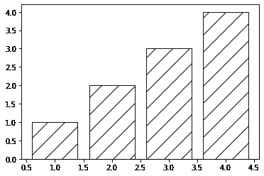

# 如何在 Matplotlib 中用模式填充绘图

> 原文：<https://towardsdatascience.com/how-to-fill-plots-with-patterns-in-matplotlib-58ad41ea8cf8?source=collection_archive---------5----------------------->

## 向条形图、直方图、箱线图和饼图添加图案的方法


作者图片

创建地块时使用填充图案是使用颜色的一种很好的替代方法。在下列情况下，它尤其有用:

*   这个情节将会刊登在一份黑白出版物上，
*   如果我们想要减少每个绘图使用的颜色数量(例如对于饼图)，
*   如果我们想要强调图中的一些元素(例如条形图中的一些条)。

不幸的是，目前 matplotlib 在这方面的功能相当有限。此外，对于不同类型的地块没有独特的方法。

在本文中，我们将探讨如何向条形图、直方图、盒图和饼图添加模式。为了最大化数据-墨水比率，我们将通过在各处添加`fill=False`来创建仅黑白的图。

# 条形图

要用图形填充条形图，我们只需将以下值之一作为字符串赋给可选参数`hatch`:`/`、`\\`、`|`、`-`、`+`、`x`、`o`、`O`、`.`、`*`:

```
import matplotlib.pyplot as plt
import numpy as np
x = range(1,5)
y = range(1,5)
plt.bar(x, y, fill=False, hatch='/')
plt.show()
```

**输出:**



作者图片

为了获得更密集的填充，我们应该在字符串中添加更多的同类符号。所以，让我们用`'///'`代替`'/'`:

```
plt.bar(x, y, fill=False, hatch='///')
plt.show()
```

**输出:**


作者图片

**注意:**由于反斜杠(`\`)是 Python 中的一个特殊字符，如果我们想用这个模式填充我们的条形图，我们就必须使用一个**双反斜杠** ( `'\\'`)。在这种情况下，为了获得更密集的模式，有必要将偶数个反斜杠分配给`hatch`参数(`'\\\\'`、`'\\\\\\'`等)。).

也可以在相同的条上组合两种或多种模式，将相应的字符添加到字符串中:

```
plt.bar(x, y, fill=False, hatch='.O')
plt.show()
```

**输出:**


作者图片

绘制堆积或分组条形图时，填充变得更加有用:

```
y1 = range(1,5)
y2 = range(5,9)
plt.bar(x, y1, fill=False, hatch='xx')
plt.bar(x, y2, fill=False, hatch='..', bottom=y1)
plt.show()
```

**输出:**


作者图片

此外，与颜色一样，我们可以使用填充来强调最重要的线条。这里的算法如下。`plt.bar()`方法返回一个包含 n 个条形的容器，可以将这些条形赋给一个变量:

```
bars = plt.bar(x, y)
print(bars)**Output:** <BarContainer object of 4 artists>
```

在我们的例子中，容器中有 4 个条。让我们为条形图案设置一个条件。例如，我们只想强调`1 < y < 3`所在的小节。我们可以遍历 y 值列表，对于满足上述条件的值，分配星号(`'*'`)，否则不分配任何值(空字符串)。因此，我们将拥有一个与每个 *y* 值相对应的`hatch`参数值列表:

```
hatches = ['*' if y>1 and y<3 else '' for y in y]
print(hatches)**Output:** ['', '*', '', '']
```

现在，我们可以遍历容器的各个条，并为每个条设置相应的`hatch`值:

```
bars = plt.bar(x, y)
for i in range(len(bars)):
    bars[i].set(hatch = hatches[i], fill=False)
plt.show()
```

**输出:**


作者图片

# 柱状图

为了填充直方图，我们使用了与条形图相同的可选参数`hatch`,以及相同的可选值:

```
data = np.random.normal(loc=10, scale=10, size=500)
plt.hist(data, histtype='step', edgecolor='black', fill=False, hatch='.')
plt.show()
```

**输出:**


作者图片

当绘制多个堆叠或重叠的直方图时，它变得更加有用:

```
data1 = np.random.normal(30, 20, 5000)
data2 = np.random.normal(80, 15, 5000)
plt.hist(data1, bins=30, histtype='step', edgecolor='black', fill=False, hatch='.')
plt.hist(data2, bins=30, histtype='step', edgecolor='black', fill=False, hatch='o')
plt.show()
```

**输出:**


作者图片

# 箱形图

然而，对于箱线图，这种方法不太直接，因为`plt.boxplot()`方法没有`hatch`参数。因此，我们必须使用一个变通办法。这里的算法如下。`plt.boxplot()`方法返回一个字典，以盒图的不同元素作为键:胡须、盒子、中线、传单等。该字典可以分配给一个变量:

```
data = np.random.rand(100)
boxplots = plt.boxplot(data, patch_artist=True)
boxplots**Output:** {'whiskers': [<matplotlib.lines.Line2D at 0x195176862e0>,
  <matplotlib.lines.Line2D at 0x19517686640>],
 'caps': [<matplotlib.lines.Line2D at 0x195176869a0>,
  <matplotlib.lines.Line2D at 0x19517686d00>],
 'boxes': [<matplotlib.patches.PathPatch at 0x19517667f10>],
 'medians': [<matplotlib.lines.Line2D at 0x195176900a0>],
 'fliers': [<matplotlib.lines.Line2D at 0x195176903a0>],
 'means': []}
```

**注意:**为了以后能够使用`hatch`属性，需要在调用`plt.boxplot()`时设置`patch_artist=True`。

我们从上面的字典中需要的是`'boxes'`键。我们必须遍历所有的方框(即使在我们的例子中，我们只有一个方框图，因此只有一个方框),并为每个方框设置相应的`hatch`值，就像我们在条形图中只强调一个条形一样:

```
boxplots = plt.boxplot(data, patch_artist=True)
for box in boxplots['boxes']:
    box.set(hatch = 'x', fill=False)    
plt.show()
```

**输出:**


作者图片

当创建两个或多个盒状图时，这种技术变得更加有用:只强调其中的一部分，或者只为每个盒状图分配不同的模式。在这种情况下，我们必须创建一个`hatch`属性的值列表(根据条件，如果必要，或者只是随机的),并遍历它:

```
data1 = np.random.rand(10)
data2 = np.random.rand(20)
data3 = np.random.rand(500)
hatches = ['o', '++', 'x']
boxplots = plt.boxplot([data1, data2, data3], patch_artist=True)
for i in range(len(boxplots['boxes'])):
    boxplots['boxes'][i].set(hatch = hatches[i], fill=False)
plt.show()
```

**输出:**


作者图片

# 圆形分格统计图表

和盒子图一样，`plt.pie()`方法没有`hatch`参数，所以用模式填充饼图也不简单。这一次，`plt.pie()`方法返回一个元组:

```
data = np.random.rand(5)
patches = plt.pie(data)
patches**Output:** ([<matplotlib.patches.Wedge at 0x195177aa4c0>,
  <matplotlib.patches.Wedge at 0x195177aa970>,
  <matplotlib.patches.Wedge at 0x195177aadf0>,
  <matplotlib.patches.Wedge at 0x195177b72b0>,
  <matplotlib.patches.Wedge at 0x195177b7730>],
 [Text(1.046742554077009, 0.3381272326866619, ''),
  Text(-0.00440567017664189, 1.0999911772692974, ''),
  Text(-1.0992106691773433, -0.0416641904601184, ''),
  Text(-0.5217111246565277, -0.9684097802116732, ''),
  Text(0.7338182292945598, -0.8194576293836047, '')])
```

这个元组的第一个元素(`patches[0]`)包含了我们饼图的所有楔形。在这种情况下，有 5 个楔子。我们可以根据特定的条件或随机地给每个人分配一个特定的模式。让我们强调最小和最大的楔子，其他的不填。为此，我们必须遍历数据，对于满足上述条件的值(即最小值和最大值)，将`'o'`和`'O'`符号分配给相应的`hatch`值，否则不分配任何值(空字符串):

```
hatches = ['o' if value==min(data) else 'O' if value==max(data) else '' for value in data]
```

现在，让我们遍历楔形区和`hatch`值，并用选择的模式填充最小和最大的楔形区:

```
patches = plt.pie(data)
for i in range(len(patches[0])):
    patches[0][i].set(hatch = hatches[i], fill=False)
plt.show()
```

**输出:**


作者图片

# 结论

在本文中，我们探索了在 matplolib 中用不同的模式填充等高线图的方法，如条形图、直方图、箱线图和饼图，并考虑了这种方法特别有用的情况。

我希望你喜欢阅读，并发现这些信息对你未来的项目有用。

**你可能也会对这些文章感兴趣:**

<https://levelup.gitconnected.com/python-can-be-lots-of-fun-999552d69d21>  <https://levelup.gitconnected.com/when-a-python-gotcha-leads-to-wrong-results-2447f379fdfe>  <https://medium.com/geekculture/creating-toyplots-in-python-49de0bb27ec1> 