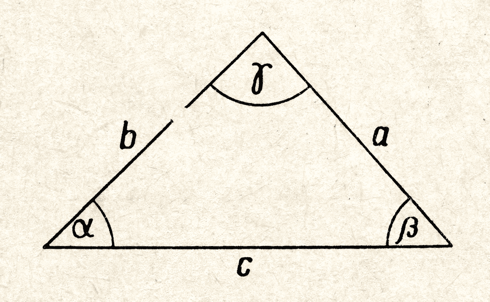

# 如何在 Python 中过滤掉相似的文本

> 原文：<https://towardsdatascience.com/how-to-filter-out-similar-texts-in-python-c7e7c5f7620e?source=collection_archive---------13----------------------->

## 复杂问题的简单解决方案！

图片来源:[宁石](https://unsplash.com/@ningshi)

## 有什么问题？

假设您在一个归档中有成千上万的文档，其中许多都是彼此的副本。还假设即使文档的内容相同，但标题不同。

现在想象一下，现在是年初的平静期，所以你的老板想利用这段时间做一些家务。她要求您通过删除不必要的重复文档来释放一些归档空间。

问题就在这里:如何过滤掉标题足够相似、内容可能完全相同的文本？接下来，如何实现这一点，以便在完成后，不会删除太多文档，并且保留唯一的文档集？

让我们用一些代码来说明这一点:

## 为什么是这篇文章？

我已经不得不解决这个问题几次了，我还没能在网上找到一个直截了当的解决方案，所以这就是我在这里尝试做的。

由于代码背后的理论有些复杂，所以我不会深入研究任何东西。

相反，这篇文章是为那些想要快速、实用地了解如何解决这样的问题并同时大致了解他们在做什么的人准备的！

## 解决方案是什么样的？

接下来，我将介绍解决这个问题的不同步骤。下面是控制流的概要:

1.  预处理所有标题文本
2.  生成所有标题的配对
3.  测试所有配对的相似性
4.  如果一对文本没有通过相似性测试，则删除其中一个文本，并创建一个新的文本列表
5.  继续测试新列表中的相似文本，直到没有相似文本

用 Python 来表达，这可以很好地映射到递归函数上！

## 代码

下面是 Python 中实现这一功能的两个函数。

第一个是预处理标题文本的简单函数；它删除像“the”、“a”、“and”这样的停用词，只返回标题中单词的词条。

因此，为了大致了解这意味着什么，如果您将“2020 年末回顾”输入到此函数中，您将会收到“2020 年末回顾”作为输出；如果你输入“一月销售预测”，你会得到“一月销售预测”。

为此，它使用了 python 中非常易于使用的 spacy 库；你[可以在这里](https://spacy.io/)了解更多。

第二个函数——脚本中的第 30 行——为所有标题创建配对，然后确定它们是否通过了余弦相似性测试。如果它没有找到任何相似的标题，那么它输出一个不相似标题的列表。但是，如果它确实找到了相似的标题，在删除未通过相似性测试的标题对之后，它会将这些过滤后的标题再次发送给自己，并检查是否还有任何相似的标题。

这就是递归的原因！简单明了地说，这意味着该函数将不断检查输出，以确保在返回“最终”输出之前没有类似的标题。

## 余弦相似度是什么？

嗯，这里有一篇关于这个问题的很好的文章。

但是简单地说，这就是斯派西正在做的事情…

首先，还记得那些像“一月销售预测”这样的预处理标题吗？首先 spacy 把它变成了一个数字矩阵。

一旦完成，你就可以把这些数字变成向量，这意味着你可以把它们画在图上。

一旦你完成了，计算两条线之间角度的余弦，基本上给了你一个方法，告诉你它们是否指向相似的方向。

来源:Adobe Stock

所以，在上图中，想象一下 b 线代表一个特定的文本或句子，c 线代表不同的文本或句子。

在这种情况下，b 行和 c 行都对应于 spacy 为它们各自的句子创建的数字矩阵。两条线之间的角度——在上图中用希腊字母 alpha 表示——非常有用！你可以通过计算它的余弦来判断这些线是否指向同一个方向。

这听起来似乎太明显而无法计算，但关键是这种方法为我们提供了一种自动化整个过程的方法。

## 结论

所以，就这样了！概括地说，我已经解释了递归 python 函数如何使用余弦相似性和 spacy 自然语言处理库来获取相似文本的输入，然后返回彼此不太相似的文本。

这可能有相当多的用例…类似于我在本文开头提到的归档，您可以使用这种方法来过滤数据集中具有独特歌词的歌曲，甚至过滤具有独特内容类型的社交媒体帖子。

或者，你可以把整个事情颠倒过来，只获取重复最多的内容——如果你在大量的推文中发现哪些推文几乎互相重复呢？