# 如何在 2022 年最终在 Windows 10 上安装 TensorFlow 2 GPU

> 原文：<https://towardsdatascience.com/how-to-finally-install-tensorflow-gpu-on-windows-10-63527910f255?source=collection_archive---------0----------------------->

## 百分百管用！


**照片由** [**卢卡斯**](https://unsplash.com/@lucaskphoto?utm_source=unsplash&utm_medium=referral&utm_content=creditCopyText) **上传。除非另有说明，所有图片均为作者所有。**

我觉得包括我在内的 Windows 用户已经受够了。在尝试了几个小时甚至几天之后，你可能会被这个问题绊倒。因此，出于好意，我将直接切入正题，向您展示在 Windows 10 上安装 TensorFlow GPU 所需的步骤，而不会给出通常的博客介绍。

> 2022 年 11 月 27 日更新:该指南适用于 Windows 11，以及 tensor flow 2.11 之前的版本(目前是最新版本)。

# 第一步:找出 TF 版本及其驱动程序。

第一步，也是非常重要的一步，就是到这个[链接](https://www.tensorflow.org/install/source#gpu)，决定你要安装哪个 TF 版本。基于此，CUDA 驱动程序版本和其他软件版本会发生变化。

在撰写本指南时，TF 2.6.0 是最新的，我们将安装那个版本。

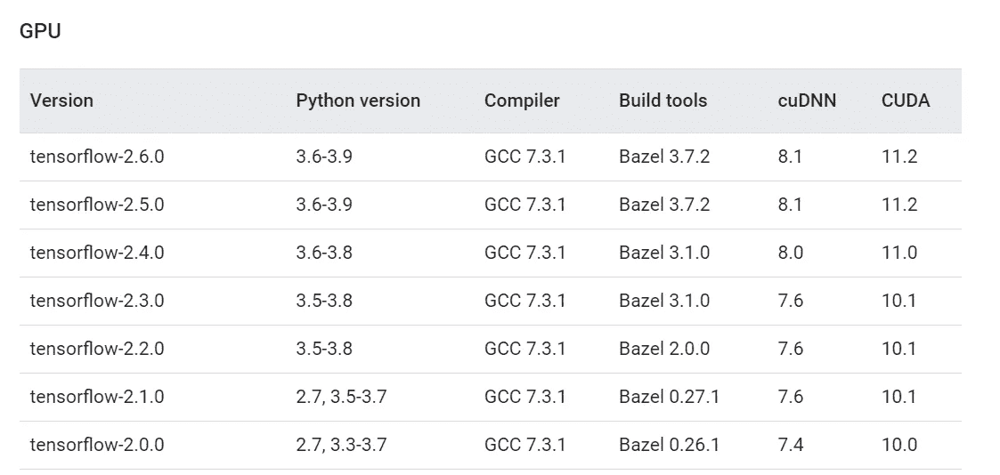

我们只对 TF 版本、cuDNN 和 CUDA 版本感兴趣。我们保持此选项卡打开，并继续下一步。

<https://ibexorigin.medium.com/membership>  

获得由强大的 AI-Alpha 信号选择和总结的最佳和最新的 ML 和 AI 论文:

<https://alphasignal.ai/?referrer=Bex>  

# 步骤 2:安装 Microsoft Visual Studio

接下来，我们安装 Microsoft Visual Studio。请注意，这与 Visual Studio *代码*不同，后者是很多人喜欢的轻量级 IDE。

转到[此链接](https://visualstudio.microsoft.com/vs/community/)并点击下载:

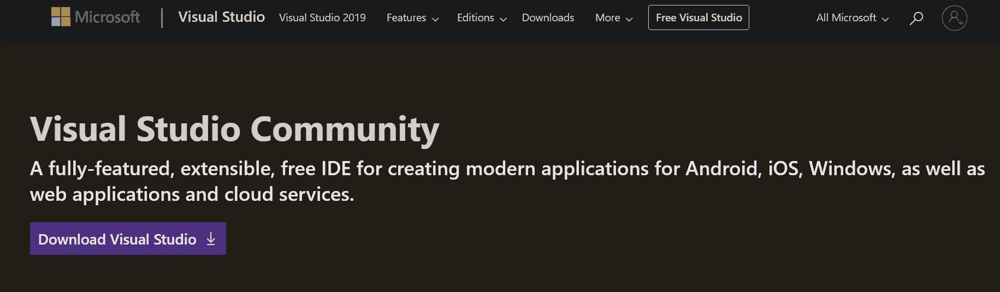

运行下载的可执行文件，下载需求需要一分钟时间。然后，它会要求您选择要安装的工作负载。我们不想要任何，所以只需单击不带工作负载的安装，然后单击继续。安装完成后，它会要求您登录，但您不必这样做。

# 步骤 3:安装 NVIDIA CUDA 工具包

NVIDIA CUDA 工具包包含您的 NVIDIA GPU 的驱动程序。根据您的 Windows，它们可能已经安装，也可能没有安装。如果安装了，我们应该检查它们的版本，看看它们是否与我们要安装的 TensorFlow 版本兼容。

在 Windows 上转到您的设置，然后选择“应用和功能”。然后，搜索 NVIDIA:

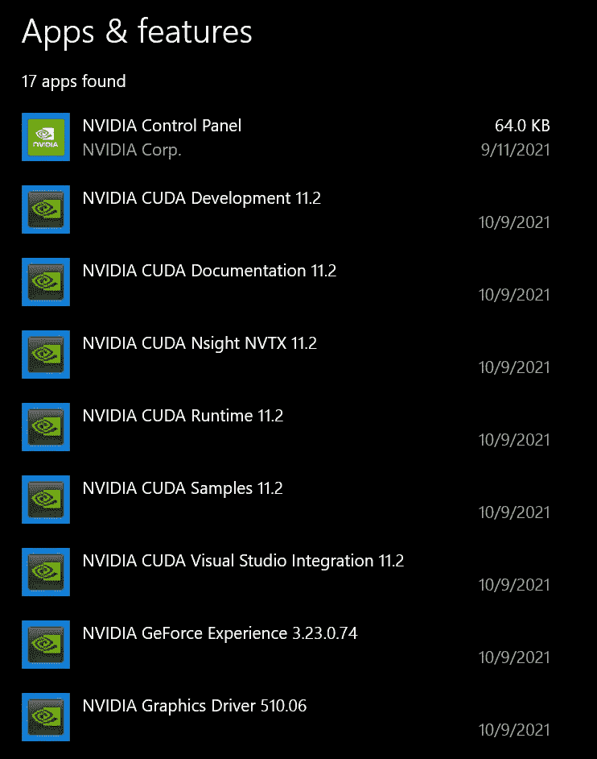

我们希望安装 TF 2.6.0，这需要 NVIDIA CUDA Toolkit 版本 11.2(请参见第一个链接进行仔细检查)。如果你的驱动是任何其他版本，删除所有标题中有“NVIDIA CUDA”的驱动(留下其他的)。然后，转到`Local Disk (C:) > Program Files > NVIDIA GPU Computing Toolkit > CUDA`。在那里，您将看到一个以 CUDA 版本为名称的文件夹。删除那个文件夹。

如果你搜索 NVIDIA，没有找到 CUDA 工具包，就去[这个页面](https://developer.nvidia.com/cuda-toolkit-archive)。它看起来是这样的:


在这里，我们看到了三个 11.2 版本，这是我们需要的(我们从我提供的[第一个 TF 版本链接](https://www.tensorflow.org/install/source?authuser=1#gpu)中得到版本)。点击其中任何一个，选择 Windows 10，下载网络安装程序:

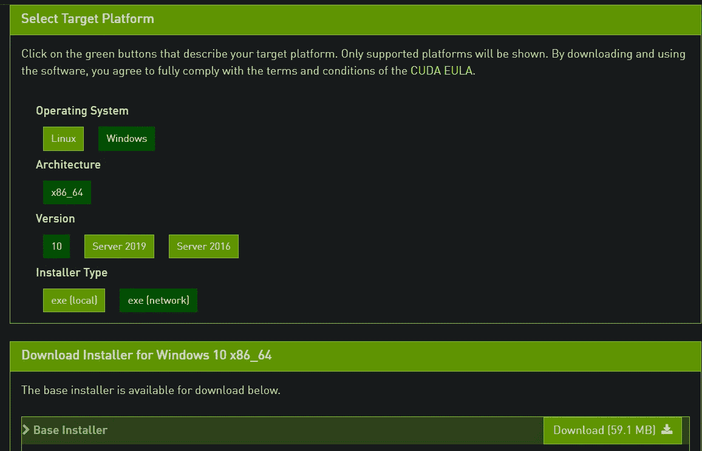

按照屏幕上的提示，使用默认参数安装驱动程序。然后，重新启动计算机并返回。

# 步骤 4:安装 cuDNN

对于 TensorFlow 2.6.0，需要 cuDNN 8.1。进入[页面](https://developer.nvidia.com/cudnn)并按下载:


它会要求您提供一个 NVIDIA 开发者帐户:


如果您还没有帐户，请点击“立即加入”并输入您的电子邮件。填写表格——标准的东西。然后，回到 [cuDNN 下载页面](https://developer.nvidia.com/rdp/cudnn-download):

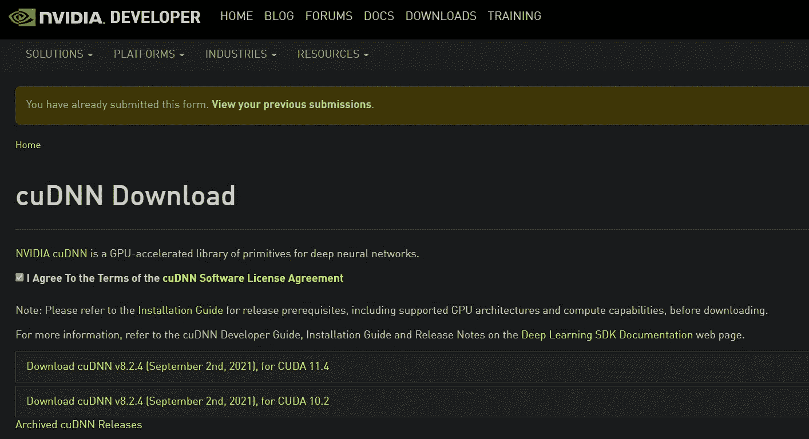

在顶部，它会要求你填写一份调查。填写它，你会看到上面的页面。单击第一个，因为它与 CUDA Toolkit v. 11 兼容。*.在那里，你会看到一个 Windows 版本，你应该下载。

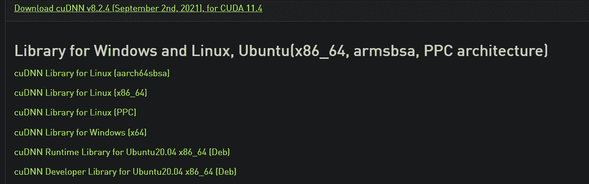

# 步骤 5:解压缩 ZIP 文件夹并复制核心目录

提取下载的 ZIP 文件夹:

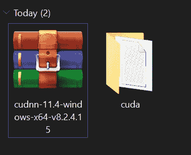

打开`cuda`文件夹，**复制**顶部的三个文件夹(`bin, include, lib`)。然后，去`C:\Program Files\NVIDIA GPU Computing Toolkit\CUDA\v11.2`把它们贴在那里。

资源管理器告诉你这些文件夹已经存在，你应该按下*替换目标*中的文件。就这样，我们完成了软件需求！再次重新启动计算机。

# 步骤 6:将 CUDA 工具包添加到 PATH 中

现在，是时候向环境变量添加一些文件夹了。在最后一个目的地，`C:\Program Files\NVIDIA GPU Computing Toolkit\CUDA\v11.2`，有一个`bin`和文件夹:

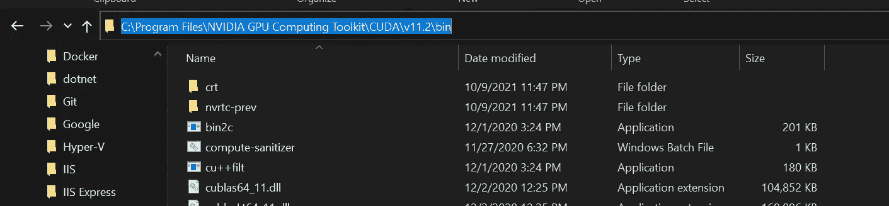

打开它并复制文件路径。然后，按“开始”(Windows)按钮并键入“环境变量”:

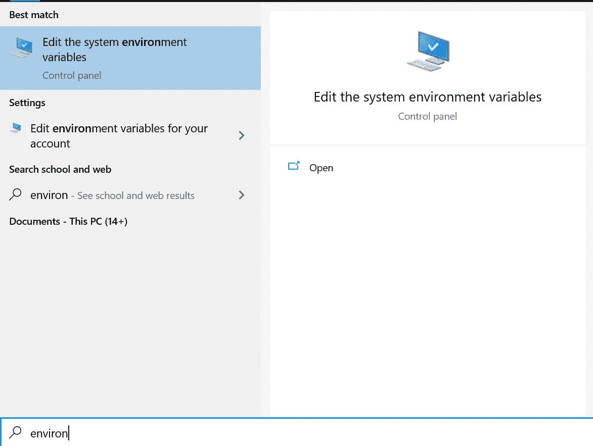

打开它，转到“环境变量”。这将打开弹出窗口:

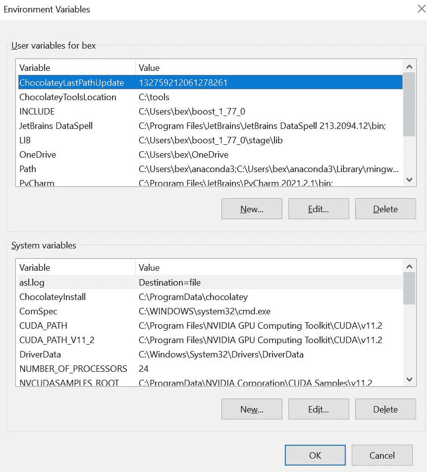

从顶部选择“路径”,然后按编辑。按“新建”并将复制的链接粘贴到那里。

然后，回到 GPU toolkit 文件夹，打开`libnvvp`文件夹:

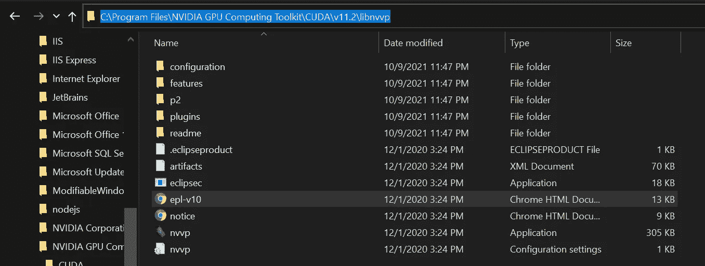

复制它的路径并粘贴到环境变量中，就像您对`bin`文件夹所做的那样。然后，关闭所有弹出窗口，保存更改。

# 步骤 7:使用 Jupyter Lab 在虚拟环境中安装 TensorFlow

最后，我们准备安装 TensorFlow。使用您喜欢的软件包管理器创建一个虚拟环境。我使用`conda`，所以我用 Python 版创建了一个名为`tf`的`conda`环境。

```
conda create -n tf python==3.8
conda activate tf
pip install --upgrade tensorflow
pip install jupyterlab ipykernel
```

重要的是 TensorFlow 和 JupyterLab 都安装了`pip`或`conda`。如果它们是从不同的渠道安装的，你会在 JupyterLab 中得到一个`ModelNotFoundError`。

接下来，我们应该将`conda`环境添加到 Jupyterlab，这样当我们启动一个会话时，它就会被列为有效的内核:

```
ipython kernel install --user --name=<name of the kernel, `tf` for our case>
```

如果您启动 JupyterLab，您应该能够将环境视为一个内核。创建一个新的笔记本，并运行以下代码片段来检查 TF 是否可以检测到您的 GPU:

```
import tensorflow as tf
from tensorflow.python.client import device_lib

print("Num GPUs Available: ", len(tf.config.list_physical_devices('GPU')))
device_lib.list_local_devices()
```

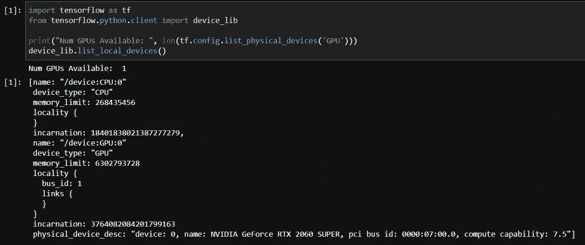

正如输出所说，我有一个单一的 GPU，在最后，它显示其名称。如果您有类似的输出，那么我在这里的工作就完成了！

> 说明摘自这个视频[的 YouTube 视频](https://www.youtube.com/watch?v=hHWkvEcDBO0&t=341s)。

[](https://ibexorigin.medium.com/membership)