# 如何使用 Python 找到餐馆的最佳位置

> 原文：<https://towardsdatascience.com/how-to-find-best-locations-for-your-restaurants-with-python-b2fadc91c4dd?source=collection_archive---------5----------------------->

## 用 CVXPY 解决集合覆盖问题

# 动机

在[模拟你的餐厅中的真实事件](/simulate-real-life-events-in-python-using-simpy-e6d9152a102f)后，你的餐厅开始吸引更多的顾客，所以你决定在其他地方开设连锁餐厅。

由于许多顾客喜欢在附近就餐，您希望您的餐厅距离 1、2、3、4 和 5 区最多 15 英里。最佳解决方案是在所有其他区域的 15 英里范围内建立最少数量的餐馆。

假设您的餐厅只能位于 1 区、2 区、3 区、4 区或 5 区，您应该将餐厅建在哪个位置？

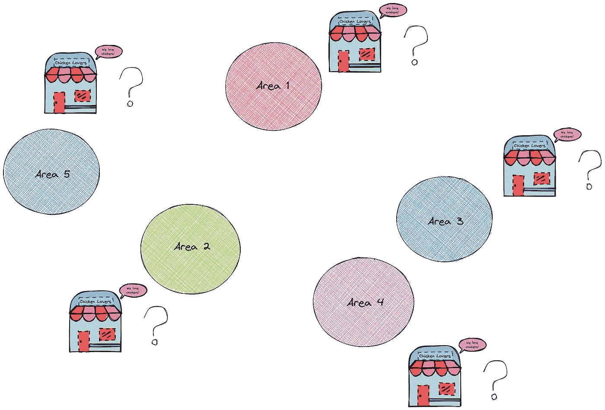

作者图片

这就是所谓的集合覆盖问题。在本文中，您将学习如何使用 CVXPY 解决这个问题。

# CVXPY 是什么？

[CVXPY](https://www.cvxpy.org/) 是一种嵌入 Python 的建模语言，用于如上所述的凸优化问题。它类似于[纸浆](https://coin-or.github.io/pulp/)，但是它的语法更简单、更直观。

要安装 CVXPY，请键入:

```
pip install cvxpy
```

# 问题陈述

在深入研究数学公式和代码之前，让我们先写下我们拥有什么和我们想要实现什么。

*   **输入参数**:我们被提供区域之间的距离:

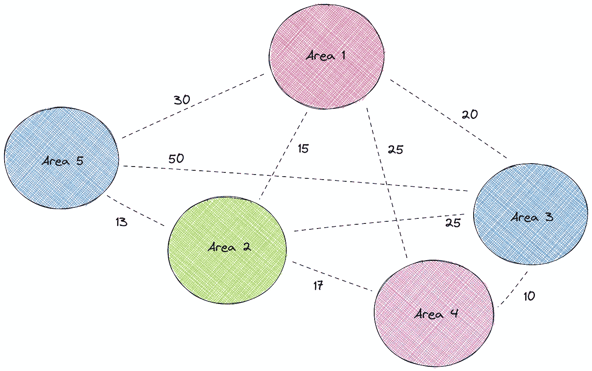

作者图片

**目标**:我们想选择最少的区域来建造餐馆

约束:我们需要确保每个区域都在至少一家餐馆的 15 英里范围内

**决策变量**:我们将根据目标和约束条件决定是否在某一特定区域开店。

# 解决

## 输入参数

要解决这个问题，首先，把距离矩阵变成一个表示两个区域之间的距离是否在 15 英里以内的矩阵。具体来说，

*   小于或等于 15 英里**的距离**变为 **1******
*   大于 15 英里距离**变成 **0****

接下来，将数据帧转换成矩阵:

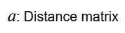

作者图片

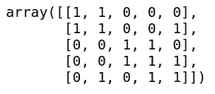

作者图片

## 决策变量

我们将决定是否在某个特定的地区开店。

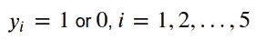

作者图片

## 限制

我们需要确保每个区域都在至少一家餐馆的 15 英里范围内。

例如，因为我们知道区域 1 在区域 1 和区域 2 的 15 英里范围内，所以我们需要确保其中一个餐馆建在区域 1 或区域 2。

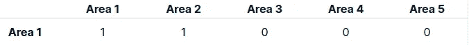

作者图片

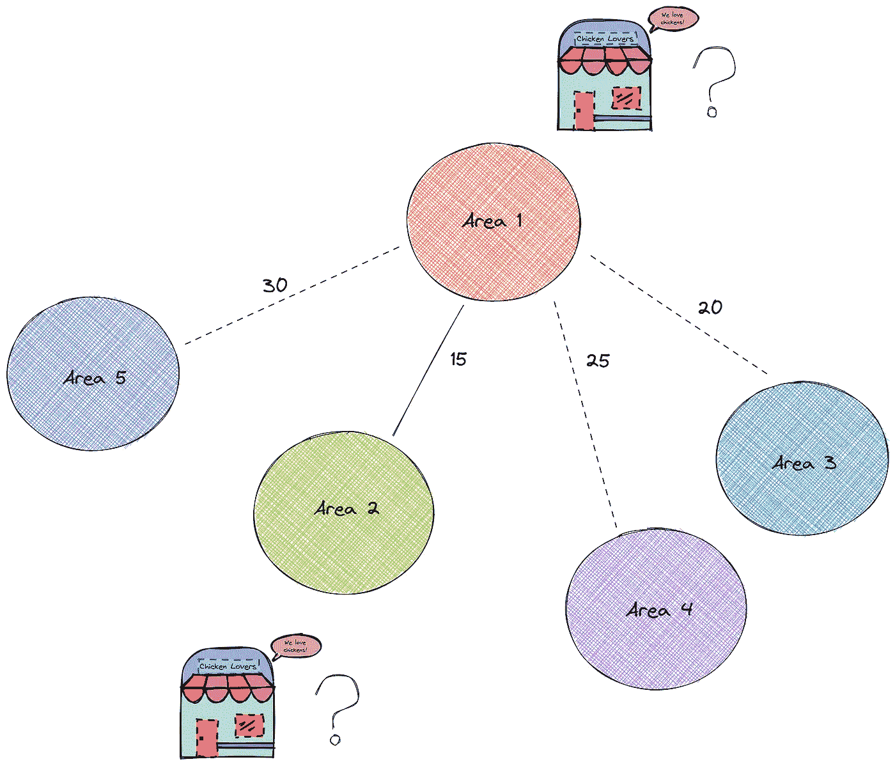

作者图片

这意味着我们需要如下内容:

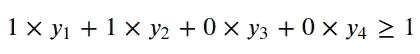

作者图片

为了将上述等式推广到所有领域，我们可以使用[矩阵乘法](https://www.mathsisfun.com/algebra/matrix-multiplying.html):

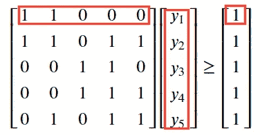

作者图片

## 目标

尽量减少用于建造餐馆的面积。

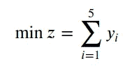

作者图片

## 解决

现在我们有了约束和目标，让我们来解决问题吧！

```
'optimal'
```

厉害！因为问题的状态是最优的，所以找到了最优解。要查看解决方案，请键入:

```
array([0., 1., 1., 0., 0.])
```

该结果表明，区域 2 和 3 是建造餐馆的两个理想位置。

# 解决方案的解释

为什么选择 2 区和 3 区？在下面的图片中，我们可以看到，通过在 2 号和 3 号区域建造餐馆，每个区域都在至少一家餐馆的 15 英里范围内！

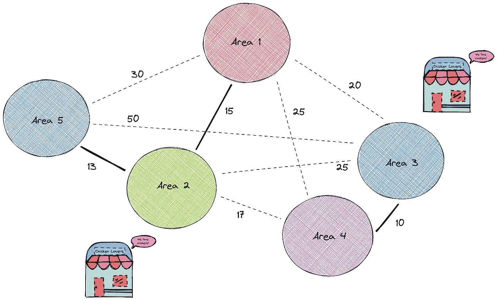

作者图片

这个问题的解决方案似乎很直观，因为我们只需要考虑 5 个方面。但是当你需要考虑 10 个或者更多的区域时，这种求解方法会非常有帮助。

# 结论

恭喜你！您刚刚学习了如何使用 CXVPY 解决集合覆盖问题。希望这篇文章能给你解决类似问题所需的知识。

在 Github repo 中，您可以随意使用本文的代码:

[](https://github.com/khuyentran1401/Data-science/tree/master/mathematical_programming/locations_of_stores) [## khuyentran 1401/数据科学

### 有用的数据科学主题以及代码和文章的集合— khuyentran1401/Data-science

github.com](https://github.com/khuyentran1401/Data-science/tree/master/mathematical_programming/locations_of_stores) 

我喜欢写一些基本的数据科学概念，并尝试不同的算法和数据科学工具。你可以通过 [LinkedIn](https://www.linkedin.com/in/khuyen-tran-1ab926151/) 和 [Twitter](https://twitter.com/KhuyenTran16) 与我联系。

如果你想查看我写的所有文章的代码，请点击这里。在 Medium 上关注我，了解我的最新数据科学文章，例如:

[](/simulate-real-life-events-in-python-using-simpy-e6d9152a102f) [## 使用 SimPy 在 Python 中模拟真实事件

towardsdatascience.com](/simulate-real-life-events-in-python-using-simpy-e6d9152a102f) [](/how-to-solve-a-staff-scheduling-problem-with-python-63ae50435ba4) [## 如何用 Python 解决人员调度问题

### 尽可能减少每班的工人数量，同时为每个时间窗口分配足够的工人

towardsdatascience.com](/how-to-solve-a-staff-scheduling-problem-with-python-63ae50435ba4) [](/how-to-match-two-people-with-python-7583b51ff3f9) [## 如何用 Python 找到最佳匹配

### 给定个人偏好，如何匹配使得总偏好最大化？

towardsdatascience.com](/how-to-match-two-people-with-python-7583b51ff3f9) [](/how-to-create-mathematical-animations-like-3blue1brown-using-python-f571fb9da3d1) [## 如何使用 Python 创建类似 3Blue1Brown 的数学动画

### 利用您的 Python 技能创建美丽的数学动画

towardsdatascience.com](/how-to-create-mathematical-animations-like-3blue1brown-using-python-f571fb9da3d1) 

# 参考

陈(2010)。*应用整数规划:建模与求解*。j .威利&的儿子们。