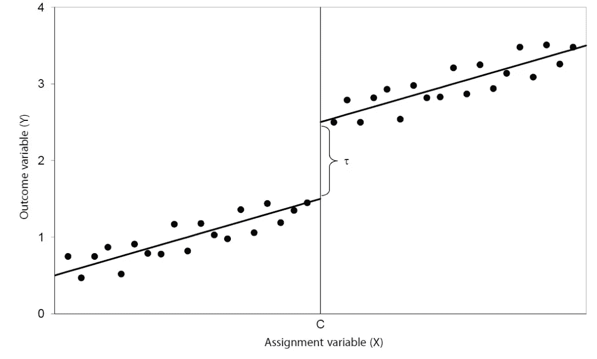
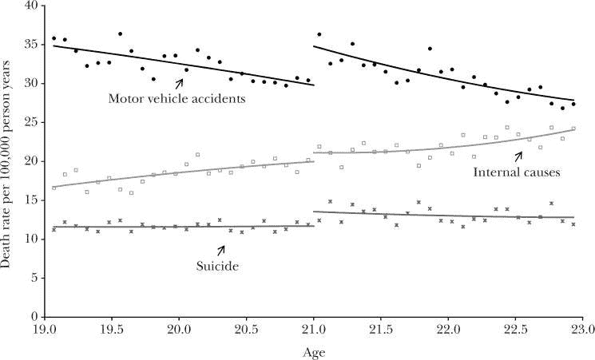
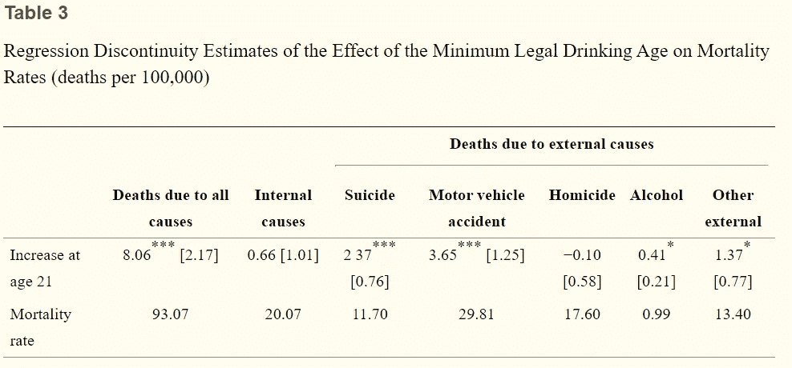
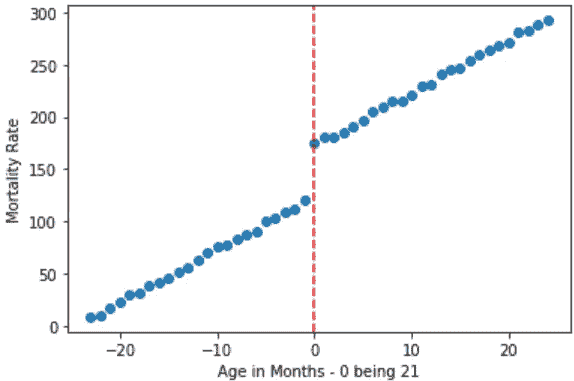
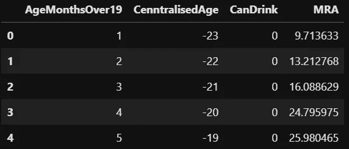
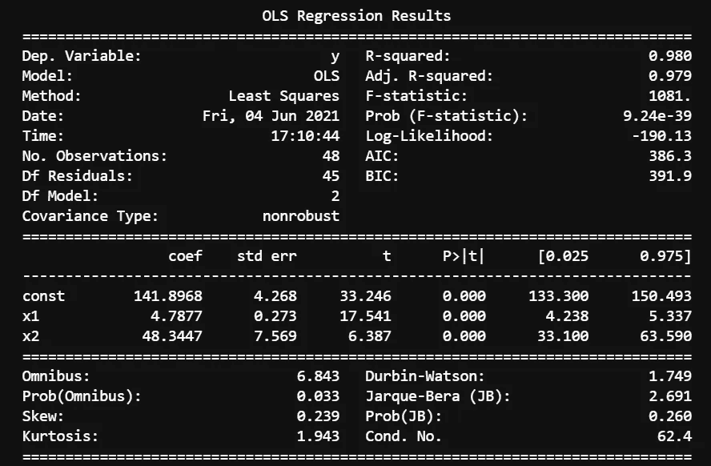

# 当 A/B 测试不合适时，如何找到因果推断

> 原文：<https://towardsdatascience.com/how-to-find-causal-inference-when-a-b-tests-are-unsuitable-2962846f1759?source=collection_archive---------21----------------------->

## 回归不连续设计(RDD)是数据科学中经常被忽视的一个计量经济学主要内容。在这里，我用 Python 中的 RDD 来决定是否应该允许孩子喝啤酒。


由[乔治·考克斯](https://unsplash.com/@georgeallancox?utm_source=unsplash&utm_medium=referral&utm_content=creditCopyText)在 [Unsplash](https://unsplash.com/s/photos/beer?utm_source=unsplash&utm_medium=referral&utm_content=creditCopyText) 上拍摄的照片

数据科学目前风靡一时，这是很正确的。计量经济学，数据科学的兄弟(统计学是父亲)，有时会觉得有点被冷落。尽管它们的大部分技术和程序是相同的，但在现代数据科学中，一些真正有用的计量经济学技术经常被遗忘。

我在期刊上发表的一些计量经济学作品的例子可以在这里看到。

数据科学主要关注预测，试图确定因果推断通常不被认为是重要的。只要底层系统和关系不变，数据科学预测技术就非常棒，但它们在现实世界中经常发生变化。了解因果关系也有助于推动政策和决策的制定。

尽管计量经济学以令人难以置信的枯燥而闻名(尽管不知何故它的兄弟被称为 21 世纪最性感的工作)，但它通常是一门艺术科学。

因为根据定义，计量经济学研究经济和经济中的人类互动，A/B 测试通常很难获得，因为它们在伦理上具有挑战性。我们不能只是在宏观尺度上玩弄人们的生活，否则人们可能会有点恼火。想象一下，我们刚刚开始随机分配大学名额。因此，计量经济学提出了一些后门方法，可以有一些很大的用途。

在这篇文章中，我将通过一个最有趣，但也最简单的计量经济学技术— **回归不连续设计**。我将使用来自 Carpenter(2011 年)的一个例子来分析法定饮酒年龄，以及降低法定饮酒年龄对经济的影响。

作为一名苏格兰人，这是我最关心的事情。

我也会用 Python 来编码。

## **回归不连续设计**

在计量经济学(以及统计学、流行病学和统计学)中，回归不连续设计是一种准实验技术，试图从 A/B 检验不适合的数据中得出因果推断。这通常是事后利用现有数据完成的。这是通过在“干预点”上下指定一个阈值来实现的。然而，仍然不可能用这种方法要求明确的因果推断，因为它不能自动拒绝任何潜在的或未考虑的变量的因果影响。然而，[研究](https://onlinelibrary.wiley.com/doi/abs/10.1002/pam.22051)表明 RCT(A/B 测试)和 rdd 不会产生太不相似的结果(在进行适当调整后，在 0.07 标准偏差内)。

最常见的例子是奖学金和平均绩点。



我们正在寻找的平均治疗效果的例子。来源:https://www.rpubs.com/muntasir_masum/rdd

考虑一所高中，其中前 *x* 名学生(按 GPA 排序)获得了奖学金，我们想知道奖学金对这些人的影响。我们不能简单地比较获得奖学金的人和没有获得奖学金的人，因为有明显的选择偏差。更优秀的个人更有可能获得奖学金，因此更有可能在未来出类拔萃(假设未来的成功可以通过 GPA 来预测，这并不夸张)。

奖学金可能根本没有任何效果，只是获得奖学金的学生已经准备好做得更好。所以在上图中，以 C 为奖学金分界点，高于 C 的每个人都能获得奖学金，低于 C 的人则不能。

RDD 所做的，是将分界点附近的点(或学生)进行比较。例如，在 78-82%范围内的学生。考虑到阅卷考试和其他个体随机变量的随机性，这一组被认为在潜在能力上有些平等。比较该组中的个体，一些接受治疗(奖学金)，一些没有，我们可以推断奖学金对个体的影响，并因此估计因果推断(如前所述，这不是真正的因果推断，而是创造的平均治疗效果)。

## 是否应该降低最低饮酒年龄？

在他们的论文中，[Carpenter&DOB kin(2011)](https://www.ncbi.nlm.nih.gov/pmc/articles/PMC3182479/)使用这种精确的技术来分析如果在美国饮酒年龄从 21 岁降低会有什么影响。考虑到我们在苏格兰大约八岁就开始喝威士忌，我完全赞成削减威士忌，这样我们在池塘那边的兄弟姐妹就可以和我们一样享受生活的果实(尽管你可能不想缩短我们的预期寿命)。让我们看看数据是否一致。

在这里，RDD 是一个很好的工具，因为已经有了一个特定的截止日期——一个人的 21 岁生日。一个人在 21 岁生日的前一天和后一天实际上是同一个人，除了他们现在可以享受生活。用更科学的术语，和原作者的话；“如果在 21 岁时除了法律制度没有发生变化，那么 21 岁时的离散死亡率似乎可以归因于饮酒年龄”。

作者比较了三种不同类型的死亡；机动车死亡、内因死亡和自杀死亡。

可以看出，第一组和最后一组中的最佳拟合线明显不连续。



资料来源:【nih.gov 最低法定饮酒年龄和公共健康(T2)】

为了估计不连续性并检验其在统计上是否显著，他们使用以下等式:

> *y*=β0+β1*MLDA*+β2*生日* + f( *年龄* ) + ε

*“y”*为分年龄死亡率，每年、每月各一个数据点。

*“MLDA”*是一个虚拟变量，对于观测值 21 和更老的观测值，其取值为 1，否则取值为 0。

*“f(年龄)”*是与*“MLDA*”假人完全交互的二次多项式。

*【生日】*是死者 21 岁生日所在月份的虚拟变量，旨在吸收生日庆祝对死亡率的显著影响。

“ε”当然是一如既往的未被观察到的误差项。

***因此，该模型中感兴趣的参数为β1。***

然后，作者用上述方程进行线性回归，并给出了下面的结果表。



资料来源:[最低法定饮酒年龄和公共健康(nih.gov)](https://www.ncbi.nlm.nih.gov/pmc/articles/PMC3182479/)

上表中的结果与图表证据一致，并显示当人们年满 21 岁时，总死亡率增加了 8.7%，具有统计学意义(从 93.07 例死亡的基数开始，每 100，000 人年增加 8.06 例死亡，相当于 8.06/93.07 = 0.087，即增加了 8.7%)。

总的来说，上图中的视觉证据和表中相应的回归估计提供了强有力的证据，证明最低法定饮酒年龄对 21 岁时自杀、机动车事故和酒精过量的死亡率有显著影响。

该死，看来不让孩子喝酒是个好主意。

## 自己怎么做

现在，我将简要地向您展示如何用 Python 自己运行这个实验的简化版本。这非常简单。因此，首先我通过逆向工程作者用于回归的方程制造了一些虚假数据。规模有点不同，但这没关系。在经历了 23 年的伤痛之后，苏格兰终于获得了欧洲足球锦标赛的参赛资格，这可能是今年的数据



作者创建的虚构数据散点图



由作者创建的用于此分析的数据帧的标题

我使用了同样的 48 个月的周期，也集中了年龄(无论如何，它将在回归中被标准化)。

然后，我们可以像往常一样简单地运行线性回归！我们可以使用“统计模型”来得到一个更加“计量经济学”风格的输出。Sklearn 产生 R 平方，但不产生系数 P 值，这是我们在这种情况下想知道的。

链接到我的 [github](https://gist.github.com/jasher4994/fc5a89e3454bd2d312bbd0b4680cc904) —作者代码。

因此，输出如下:



作者运行的回归的输出。

不足为奇的是，回归预测了我制作数据集时使用的几乎准确的数字(5 代表年龄，50 代表 21 岁)。我确实添加了一个随机误差项，但显然还不够，因为 R 平方仍然非常高，为 0.98。

可以看出，年龄和 21 岁生日的 P 值都非常显著，因此我们可以拒绝 21 岁生日不影响死亡率的无效假设(当然我们可以这样做，因为我是以这种方式获得数据的)。

因此，正如你所看到的，它实际上与运行正常的线性回归是一样的，只是在指定方程和控制关系时要格外小心。原始论文的作者投入了更多的努力来控制所有其他年龄变量，但这只是一个如何做到这一点的简化示例。

## **外卖**

如果你能做 A/B 测试，那就做吧。但是如果你不能，那么 RDD 是你最好的选择。如果你正确地指定了方程，并且没有违反任何假设，你应该不会有任何问题。小心陷阱，如[虚拟变量陷阱](https://www.algosome.com/articles/dummy-variable-trap-regression.html#:~:text=The%20Dummy%20Variable%20trap%20is,%2Ffemale)%20as%20an%20example.)或过多的[多重共线性](https://en.wikipedia.org/wiki/Multicollinearity#:~:text=In%20statistics%2C%20multicollinearity%20(also%20collinearity,a%20substantial%20degree%20of%20accuracy.)。

如前所述，这种方法不能推导出真正的因果推理。例如，我们并不确切知道这个等式中的所有变量。美国青少年长时间等待饮酒可能是他们 21 岁后不久死亡的原因之一。所以在做大胆的陈述时要小心。

最后，总结一下，[Carpenter&DOB kin(2011)](https://www.ncbi.nlm.nih.gov/pmc/articles/PMC3182479/)的研究结果表明，饮料将不得不收取 15 美元，以弥补将饮酒年龄降低到 18 岁的经济成本(使用大约 800 万美元作为生命的统计价值)。

就我个人而言，我不赞成为一杯酒支付 15 美元(尽管我现在在伦敦支付的价格与此相差不远)。

所以，抱歉，年轻的美国人，你得等到 21 岁，反正这对你没好处。

我希望你喜欢这篇文章，如果你喜欢，这里还有一些我的类似的文章。

```
If I’ve inspired you to join medium I would be really grateful if you did it through this [link](https://jamesasher4994.medium.com/membership) — it will help to support me to write better content in the future.If you want to learn more about data science, become a certified data scientist, or land a job in data science, then checkout [365 data science](https://365datascience.pxf.io/c/3458822/791349/11148) through my [affiliate link.](https://365datascience.pxf.io/c/3458822/791349/11148)
```

[](/how-to-predict-something-with-no-data-and-bonsai-trees-b6ebc6471da3) [## 如何预测没有数据的事物——还有盆景树

towardsdatascience.com](/how-to-predict-something-with-no-data-and-bonsai-trees-b6ebc6471da3) [](/how-to-easily-show-your-matplotlib-plots-and-pandas-dataframes-dynamically-on-your-website-a9613eff7ae3) [## 如何轻松地在你的网站上动态显示你的 Matplotlib 图和 Pandas 数据框。

### 这是一种令人惊讶的简单方法，可以在线向全世界展示您的图表和数据框架，而且不到…

towardsdatascience.com](/how-to-easily-show-your-matplotlib-plots-and-pandas-dataframes-dynamically-on-your-website-a9613eff7ae3) 

干杯，

詹姆斯。