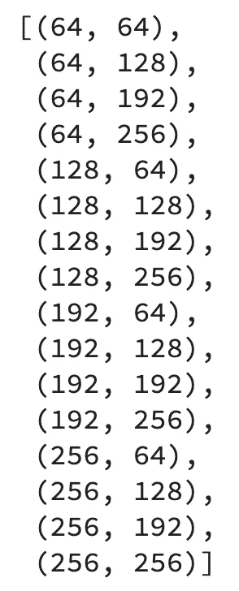
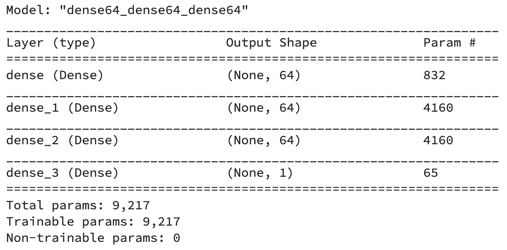

# 如何用 TensorFlow 找到最佳的神经网络结构——最简单的方法

> 原文：<https://towardsdatascience.com/how-to-find-optimal-neural-network-architecture-with-tensorflow-the-easy-way-50575a03d060?source=collection_archive---------7----------------------->

## 在任何数据集上优化前馈神经网络模型的最佳指南

照片由[安东尼·里埃拉](https://unsplash.com/@frenchriera?utm_source=unsplash&utm_medium=referral&utm_content=creditCopyText)在 [Unsplash](https://unsplash.com/?utm_source=unsplash&utm_medium=referral&utm_content=creditCopyText) 拍摄

深度学习归结为实验。手动训练数百个模型既繁琐又耗时。我宁愿用我的时间做些别的事情，我想你也一样。

想象一下，你想为你的深度神经网络找到最佳架构。你从哪里开始？多少层？每层有多少个节点？激活功能呢？有太多的活动部件。

您可以在一定程度上自动化这个过程，本文将向您展示如何实现。阅读后，您将有一个函数用于在给定特定参数的情况下生成神经网络架构，另一个函数用于寻找最佳架构。

不想看书？请观看我的视频:

你可以在 [GitHub](https://github.com/better-data-science/TensorFlow) 上下载源代码。

# 使用的数据集和数据预处理

我不打算在这里花太多时间。我们将使用与[上一篇文章](/how-to-train-a-classification-model-with-tensorflow-in-10-minutes-fd2b7cfba86)中相同的数据集——来自 Kaggle 的[葡萄酒质量数据集](https://www.kaggle.com/shelvigarg/wine-quality-dataset):

图片 1——来自 Kaggle 的葡萄酒质量数据集(图片由作者提供)

您可以使用以下代码将其导入 Python，并随机打印几行:

我们忽略警告并更改默认的 TensorFlow 日志级别，这样我们就不会被输出淹没。

以下是数据集的外观:

图 2——葡萄酒质量数据集的随机样本(图片由作者提供)

数据集基本上是干净的，但默认情况下不是为二元分类(好酒/劣酒)而设计的。取而代之的是，葡萄酒是按等级来评定的。我们现在将解决这个问题，还有许多其他问题:

*   **删除缺失值** —它们为数不多，所以我们不会在插补上浪费时间。
*   **处理分类特征**——唯一的一个是`type`，指示葡萄酒是白还是红。
*   **转换为二分分类任务**——我们将把任何 6 分及以上的葡萄酒宣布为*好*，任何低于*的为差*。
*   **训练/测试拆分**——经典的 80:20 拆分。
*   **缩放数据** —预测值之间的比例差异很大，因此我们将使用`StandardScaler`来拉近数值。

下面是完整的数据预处理代码片段:

同样，如果您想更详细地了解数据预处理背后的逻辑，请参考[上一篇文章](/how-to-train-a-classification-model-with-tensorflow-in-10-minutes-fd2b7cfba86)。

这样一来，让我们看看如何优化神经网络架构。

# 如何优化神经网络模型？

寻找最佳神经网络模型的方法将具有一些可调整的常数。今天的网络将有 3 个隐藏层，每层最少 64 个节点，最多 256 个节点。我们将节点之间的步长设置为 64，因此可能是 64、128、192 和 256:

让我们验证节点数的可能性。您可以通过创建最小和最大节点数之间的范围列表来做到这一点，请记住步长:

以下是您将看到的内容:

图 3——节点数的可能性(图片由作者提供)

将这一逻辑延伸到两个隐藏层，您最终会得到以下可能性:

或者视觉上:

图 4-两个隐藏层的节点数可能性(图片由作者提供)

要获得两层之间选项的每一种可能的排列，您可以使用`itertools`中的`product()`函数:

以下是输出结果:

图 5 —两层深度神经网络架构排列(图片由作者提供)

我们的目标是优化一个三层深度的神经网络，所以我们最终会有更多的排列。您可以通过首先将节点选项列表乘以`num_layers`来声明可能性，然后计算排列:

有很多选择——总共 64 种。在优化过程中，我们将迭代排列，然后再次迭代单个排列的值，以获得每个隐藏层的节点数。

简而言之，我们将有两个`for`循环。前两种排列的逻辑如下:

第二个打印声明放在这里只是为了让型号之间有个空隙，不要想太多。以下是输出结果:

图 6-每层的节点数量(作者提供的图片)

我们将在每次迭代中创建一个新的`tf.keras.Sequential`模型，并为其添加一个具有单个训练行形状的`tf.keras.layers.InputLayer`(`(12,)`)。然后，我们将迭代单个排列中的项目，并向模型添加一个`tf.keras.layers.Dense`层，将节点数设置为单个排列的当前值。最后，我们将添加一个`tf.keras.layers.Dense`输出层。

将名称设置为模型是一个好主意，这样以后比较容易。我们将对 no 的输入形状和激活函数进行硬编码，并在下一节中将这些部分设置为动态的。

代码如下:

现在让我们来看看单个模型是什么样子的:

图 7 —单一模型架构(图片由作者提供)

这就是我们的逻辑。不过，有一种方法可以改进它，因为每次想要运行优化时运行几十个笔记本单元并不方便。为激活函数、输入形状等硬编码值也不是最好的主意。

出于这个原因，接下来我们将声明一个用于生成序列模型的函数。

# 用于优化神经网络的模型生成函数

该函数接受许多参数，但不包含我们之前没有提到的任何内容。它为您提供了更改输入形状、隐藏和输出层的激活函数以及输出层的节点数量的选项。

代码如下:

让我们测试一下——我们将坚持使用一个具有三个隐藏层的模型，每个隐藏层最少 64 个节点，最多 256 个节点:

请随意检查`all_models`列表的值。它包含 64 个顺序模型，每个模型都有唯一的名称和体系结构。训练这么多模型需要时间，所以让我们通过编写另一个助手函数来使事情变得格外简单。

# 用于优化神经网络的模型训练函数

这个函数接受模型列表、训练和测试数据，以及可选的一些时期和详细级别。建议将 verbosity 设置为 0，这样您就不会被控制台输出淹没。该函数返回一个 Pandas DataFrame，其中包含测试集的性能指标，用准确度、精确度、召回率和 F1 来衡量。

代码如下:

现在，让我们开始优化。

# 运行优化

请记住，优化将需要一些时间，因为我们正在为 50 个时期训练 64 个模型。以下是开始这一过程的方法:

优化在我的机器(M1 MacBook Pro)上运行了 34 分钟，并打印了以下内容:

图 8 —优化输出(作者提供的图片)

您看到这个输出是因为`optimize()`函数中的`print()`语句。它给你一种进步的感觉。

我们现在有了一个数据框架，可以按照准确度、精确度、召回率或 F1 进行排序。以下是按精度降序排序的方法，因此首先显示值最高的型号:

图 9-模型优化结果(图片由作者提供)

看起来最简单的模型产生了最好的精确度。您还可以测试具有两个和四个隐藏层的模型的优化，甚至更多，但是我将让您来决定。只是调用`get_models()`函数，传入不同的参数值。

这就是我今天想讲的全部内容。接下来让我们总结一下。

# 离别赠言

为您的数据集找到最佳的神经网络架构归结为一件事，而且只有一件事-实验。手工训练和评估上百个模型是相当繁琐的，所以你今天看到的两个函数可以帮你节省一些时间。您仍然需要等待模型训练，但是在这个数据集上整个过程很快。

从这里开始的一个好方法是选择一个你认为最好的架构，并调整学习速度。

如果处理图像数据和卷积层，事情会变得更加复杂，训练时间也会变得更长。这就是下一篇文章将涉及的内容——我们将开始深入计算机视觉，并训练一个简单的卷积神经网络。别担心，它不会出现在 MNIST 的数据集中。

*您如何优化前馈神经网络？是类似的东西，还是你使用的是专用的 AutoML 库？*请在下面的评论区告诉我。

*喜欢这篇文章吗？成为* [*中等会员*](https://medium.com/@radecicdario/membership) *继续无限制学习。如果你使用下面的链接，我会收到你的一部分会员费，不需要你额外付费。*

 [## 通过我的推荐链接加入 Medium-Dario rade ci

### 作为一个媒体会员，你的会员费的一部分会给你阅读的作家，你可以完全接触到每一个故事…

medium.com](https://medium.com/@radecicdario/membership) 

# 保持联系

*   注册我的[简讯](https://mailchi.mp/46a3d2989d9b/bdssubscribe)
*   在 YouTube[上订阅](https://www.youtube.com/c/BetterDataScience)
*   在 [LinkedIn](https://www.linkedin.com/in/darioradecic/) 上连接