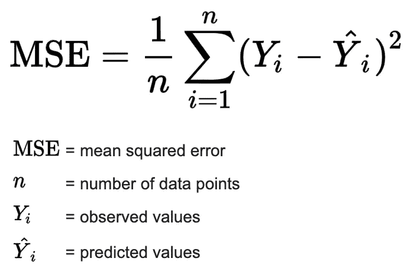

# 如何在你的机器学习模型中找到弱点

> 原文：<https://towardsdatascience.com/how-to-find-weaknesses-in-your-machine-learning-models-ae8bd18880a3?source=collection_archive---------13----------------------->

## FreaAI:来自 IBM 研究人员的新方法

任何时候使用汇总统计简化数据，都会丢失信息。模型精度也不例外。当将模型简化为汇总统计数据时，您将无法确定哪里的性能最低/最高以及原因。

图 1:模型性能较低的数据区域示例。图片作者。

为了解决这个问题，IBM 的研究人员最近开发了一种叫做 [FreaAI](https://arxiv.org/pdf/2108.05620.pdf) 的方法，可以识别给定模型准确性较差的可解释数据切片。从这些切片中，工程师可以采取必要的步骤来确保模型按预期运行。

不幸的是，FreaAI 不是开源的，但是许多概念可以很容易地在您喜欢的技术栈中实现。让我们开始吧…

# 技术 TLDR

FreaAI 在测试数据中找到具有统计显著低性能的切片。它们被返回给工程师检查。方法步骤如下:

1.  **使用最高先验密度(HPD)方法寻找低精度的单变量数据切片。**这些单变量数据切片缩小了搜索空间，并显示了我们的数据在哪里更有可能出现问题。
2.  **使用决策树寻找低精度的二元数据切片。**这些双变量数据切片减少了分类预测因子和二阶相互作用的搜索空间，以显示我们的数据在哪里更有可能出现问题。
3.  **删除所有不符合特定启发式规则的数据切片。**主要的两个是测试集的最小支持度和误差的统计显著增加。

# 但是，到底是怎么回事呢？

这是一大堆术语，所以让我们慢一点，真正理解发生了什么…

# 1.问题是

当开发一个模型时，我们经常使用“准确性”度量来确定适合度。一个例子是均方误差，用于线性回归，如图 2 所示。

图 2:均方误差公式。图片作者— [src](https://www.probabilitycourse.com/chapter9/9_1_5_mean_squared_error_MSE.php) 。

但是这个平均误差仅仅告诉我们平均起来我们做的有多好。我们不知道我们是否在数据的某些方面表现得很好，或者在其他方面表现得很差。

这是预测建模中一个长期存在的问题，最近得到了很多关注。

# 2.解决方案

一种解决方案是 FreaAI。该方法由 IBM 开发，旨在确定我们的模型在数据中表现不佳的地方。

有两个主要步骤。第一步涉及创建数据切片，第二步涉及确定模型在这些数据切片中是否表现不佳。FreaAI 的输出是我们数据中模型性能较低的一组“位置”。

## **2.1。数据切片**

组合测试(CT)是一个框架，它依次查看所有预测器组，以找到表现不佳的区域。例如，如果我们有两个分类预测值，颜色和形状，我们会查看所有可能的组合，看看准确性在哪里下降。

然而，在大型数据集上利用组合测试在计算上是不可能的——随着每个新列的出现，我们看到所需的组合数量呈指数级增长。因此，我们需要定义一种方法来帮助我们搜索特性，找到潜在的不准确的地方。

图 3:蓝色的 50%最高密度区域(HDR)的例子。图片作者——[src](https://mathematica.stackexchange.com/questions/173282/computing-credible-region-highest-posterior-density-from-empirical-distributio)。

FreaAI 使用的第一种方法是所谓的[最高密度区域(HDR)](https://stats.stackexchange.com/questions/148439/what-is-a-highest-density-region-hdr) (图 3)。简而言之，HDR 找到了数字特征中可以找到一定比例数据的最小区域，即高密度区域。在图 3 中，该区域由水平蓝色虚线区分，50%的数据位于该线之上。

从这里开始，我们将这个范围迭代地减小一个值ε(默认为 0.05)，并寻找精度的增加。**如果在给定的迭代中精度确实增加了，我们知道该模型在前一次迭代和当前迭代之间的区域中表现不好。**

为了确定数值预测因子的不良拟合区域，我们对测试集中的所有预测因子反复运行 HDR 方法。

很酷，对吧？

第二种方法利用决策树来处理所有非数字预测器以及两种特征的组合。简而言之，我们拟合一个决策树，并寻找这些特征的哪些分裂降低了准确性。

图 4:连续单变量预测因子“年龄”的决策树示例。图片作者。

在图 4 中，每个*决策节点*(蓝色)是我们特征的一个分割，每个*结束节点*(数字)是该分割的精度。通过拟合这些树，我们可以真正减少搜索空间，更快地找到性能差的区域。**此外，因为树对于许多不同种类的数据都非常稳健，所以我们可以对分类预测器或多个预测器进行分析，以捕捉交互效应。**

这种决策树方法对所有特征组合以及非数字的单个特征重复进行。

## 2.2.数据切片的试探法

到目前为止，我们只关心使用准确性开发数据切片，但是还有其他启发方法可以帮助我们找到**有用的**数据切片:

1.  **统计显著**:为了确保我们只查看准确性有意义下降的数据切片，我们只保留性能比我们的误差置信区间的下限低 4%的切片。通过这样做，我们可以用概率 *α* 声明我们的数据切片具有更高的误差。
2.  **可解释的**:我们也想确保发现的有问题的地方可以被采取行动，所以我们在创建组合时只看两三个特征。通过限制低阶交互，我们的工程师有更大的机会开发解决方案。
3.  **最小支持度**:最后，数据切片必须有足够的误差才值得研究。我们要求必须至少有 2 个错误分类，或者它必须覆盖 5%的测试误差——无论哪个值更大都是我们采用的标准。

有趣的是，您可以根据自己的业务需求定制其他启发式方法。对一些用户进行错误分类比其他用户更糟糕，因此您可以将这一点纳入您的数据切片标准——想想[精度/召回权衡](/accuracy-precision-recall-or-f1-331fb37c5cb9)。

# 3.总结和要点

所以，这就是你要的——荣耀的法国。

还是那句话，FreaAI 不是开源的，但希望它将来会向公众发布。与此同时，您可以将我们讨论的框架应用到您自己的预测模型中，并确定哪里存在系统性的表现不佳。

## 3.1.摘要

概括地说，FreeAI 使用 HDR 和决策树来减少预测器的搜索空间。然后，它反复查看单个特性以及组合，以确定哪里的性能较低。这些低性能领域有一些额外的启发，以确保调查结果是可操作的。

## 3.2.你为什么要在乎？

首先，这个框架帮助工程师识别模型的弱点。当这些弱点被发现时，它们可以(有希望)被纠正，从而改进预测。这种增益对于黑盒模型(如神经网络)特别有吸引力，因为没有模型系数。

**通过隔离表现不佳的数据区域，我们获得了一个了解黑盒的窗口。**

FreaAI 在其他应用方面也有着令人感兴趣的潜力。一个例子是识别模型漂移，这是当经过训练的模型随着时间变得越来越不有效时发生的情况。IBM 刚刚发布了一个用于确定模型漂移的假设测试框架。

另一个有趣的应用是确定模型偏差。在这种情况下，偏见是不公平的概念，例如基于性别拒绝给某人贷款。通过查看模型性能较低的不同数据分割，您可能会发现存在偏差的区域。

*感谢阅读！我会再写 37 篇文章，把学术研究带到 DS 行业。查看我的评论，链接到这篇文章的主要来源以及一些有用的资源。*