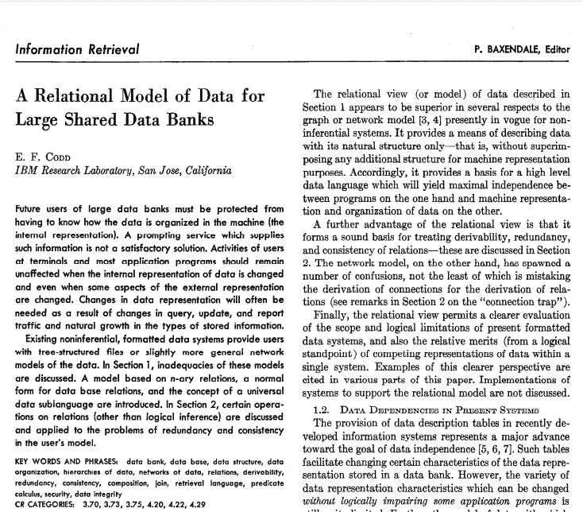
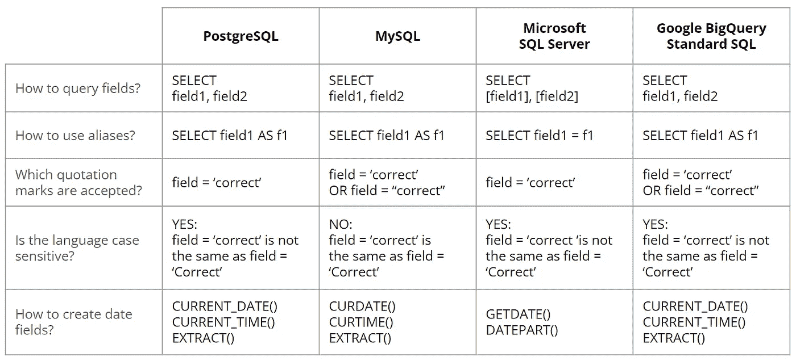
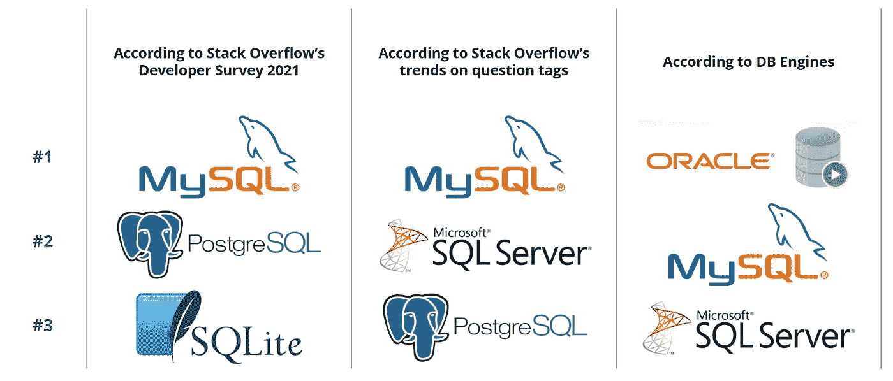

# 如何在不同类型的 SQL 中找到自己的路

> 原文：<https://towardsdatascience.com/how-to-find-your-way-through-the-different-types-of-sql-26e3d3c20aab?source=collection_archive---------11----------------------->

## [入门](https://towardsdatascience.com/tagged/getting-started)，SQL 方言:什么，为什么，如何

## MySQL、PostgreSQL、SQL Server……为什么会有这么多 SQL 方言存在？你应该选择哪一个？

在 SQL 丛林中寻找正确的方向(由[伊森·赛克斯](https://unsplash.com/@e_sykes?utm_source=unsplash&utm_medium=referral&utm_content=creditCopyText)在 [Unsplash](https://unsplash.com/?utm_source=unsplash&utm_medium=referral&utm_content=creditCopyText) 上拍摄)

无论你是数据库管理领域的初学者还是整天操纵表和视图的 SQL 专家，你可能已经听说过一些关于 SQL 的术语，比如“Transact-SQL”或“PostgreSQL”。为什么不简单的用“SQL”来谈… SQL？顺便问一下，你念" S. Q. L . "还是"续集"？

我最初认为，用来谈论 SQL 作为一种编程语言的术语的多样性是无聊的工程师或营销人员为了以不同的名称销售相同的“产品”而制造的过度复杂化的结果。然而，我必须承认这不是真的:**SQL 编程语言*和* SQL 编程语言**确实存在差异。

这篇文章有几个目标。首先，它介绍了 SQL 创建和扩展背后的历史背景，这是这种编程语言进一步发展的基础。这将引导我们进入第二部分，旨在更好地理解各种 SQL 方言之间的差异。最后，我们将把这些见解放到**中，帮助您选择学习和使用 SQL** 作为管理数据库工具的最佳方式。

# 一点历史:为什么存在不同的 SQL 方言？

为了理解 SQL 方言的起源，我们必须**回到关系数据库管理的基础(RDBM)** 。1970 年，在 IBM 工作的英国计算机科学家埃德加·弗兰克·科德发表了一篇名为“[大型共享数据库数据的关系模型](https://www.seas.upenn.edu/~zives/03f/cis550/codd.pdf)”的论文。这就是他**发明数据库管理关系模型**的时候，从那时起它就成为了关系数据库和关系数据库管理系统的理论基础。

E.F. Codd 研究论文摘要([来源](https://www.seas.upenn.edu/~zives/03f/cis550/codd.pdf))

在这个突破性的发明之后，设计者选择用两种方式来表达关系模型:微积分(像 Ingres 那样)或者代数(像 IBM 那样)。代数赢得了这场战斗，这就是现在使用的方法。在此之后，**在 80 年代后期做了一些努力来创建*一个* SQL 标准**。SQL 于 1986 年成为美国国家标准协会(ANSI)的标准，并于 1987 年成为国际标准化组织(ISO)的标准。自 20 世纪 80 年代以来，SQL 标准已经过多次修订，尽管标准 SQL 的核心特性自 1992 年以来一直保持稳定。

然而，**新的变化不断出现**，因为在不同厂商工作的数据库实现者需要解决新的问题或规避标准中没有解决的已经存在的问题。这解释了为什么多种 SQL 方言出现了，并且今天仍然共存。

总结一下这段历史介绍，目前的情况如下:只有一种 SQL 语言**，但是不同的数据库管理系统已经**扩展了原始的 SQL 标准，以添加它们自己的功能**或者使语法适应它们自己的运行方式。通过这样做，他们诞生了各种 SQL 方言。**

# **SQL 方言:有什么区别？**

**如您所知， **SQL 是一种编程语言**，用于提取数据和处理数据库中的数据。其中，SQL Server、Oracle、MySQL 和 PostgreSQL 是**关系数据库管理系统(RDBMS)** ,出于我们前面提到的原因，它们有自己的 SQL 方言。**

**对于新手或中级用户来说，**这些差异主要可以在语法**中看到，而对于我们大多数人(包括我自己)来说，这些差异背后的技术原因是相当模糊的。然而，这不会妨碍我们以最恰当的方式使用 SQL！**

**为了更好地理解四种 SQL 方言之间的主要差异，这里概述了 PostgreSQL、MySQL、Microsoft SQL Server 和标准 SQL 在 Google BigQuery 中使用时的一些语法特性。**

****

**四种 SQL 方言的语法差异(按作者分类的图表)**

**更进一步，你会在一个名为“关系数据库管理系统的[比较”的专门维基百科页面上找到各种 RDBMS 之间差异的相对详尽的清单。](https://en.wikipedia.org/wiki/Comparison_of_relational_database_management_systems)**

# **选择的时间:应该使用哪种 SQL 方言？**

**正如我们刚刚讨论的， **PostgreSQL** 是最接近标准 SQL 的，同时它是一种广泛使用的 SQL 方言。这就是为什么从学习 PostgreSQL 开始会给你**最灵活的工具**，以便以后可能适应其他 SQL 方言并将你的技能转化到其他 RDBMS。**

**做出决定的另一种方法可能是检查劳动力市场当前的技术技能需求。在其[最新的开发者调查(2021)](https://insights.stackoverflow.com/survey/2021#section-most-popular-technologies-databases) 中，堆栈溢出位列最受欢迎的数据库技术。顶级技术都包括 SQL，这加强了开始学习 SQL(无论何种方言)的必要性。在这项调查中， **MySQL** 在很大程度上主导了排名。**

**基于栈溢出上的问题标签看[趋势](https://www.datacamp.com/community/blog/sql-differences)时， **MySQL** 也排在其他 SQL 方言之前。微软 SQL Server 排名第二，因为它仍然被大公司广泛使用。**

**网站 [DB-Engines](https://db-engines.com/en/ranking) 提出了另一个排名顺序，其中**甲骨文**排名第一。为了每年建立这个列表，他们分析了从搜索引擎(Google，Bing)，Google Trends，IT 相关网站(Stack Overflow，DBA Stack Exchange)，工作搜索引擎(实际上，只是雇佣)，社交网络(LinkedIn，Twitter)检索的数据。**

****

**根据不同来源列出的前 3 种 SQL 方言(按作者排列的图表)**

**最后，还是务实一点吧。如果你在一家使用特定 RDBMS 的公司工作，那么你应该学习与之相关的 SQL 方言。例如，微软 SQL Server 在许多行业仍然占有很大的市场份额。如果你正在某个行业找工作，你可以浏览职位空缺，看看数据库管理所需的技能。这可能会给你一些宝贵的提示，告诉你为了自己的职业目标应该开始学习哪种 SQL 方言。**

# **最后的想法**

**掌握 SQL 是数据库管理的必备技能。无论您选择从哪种 SQL 方言开始，基本原理都是相同的，并且是使用数据库的一个关键元素。**

**在你学习了基础知识之后，当你沿着职业道路前进时，你可能不得不**学习几种 SQL 方言**。我的最后一条建议是:选择第一种 SQL 方言并坚持下去，直到你获得足够的知识，然后你将能够适应使用 SQL 的其他环境。**

**举个例子，**我在大学**和在线课程中学到了 MySQL。但自从我在一家初创公司担任数据分析师以来，我已经将**切换到了标准 SQL** ，因为它被用于谷歌大查询。希望这篇文章能帮助你在 SQL 之旅中选择正确的道路！**

**你喜欢阅读这篇文章吗？ [*成为*](https://marie-lefevre.medium.com/membership) *的一员，加入一个不断成长的充满好奇心的社区吧！***

**[https://marie-lefevre.medium.com/membership](https://marie-lefevre.medium.com/membership)**