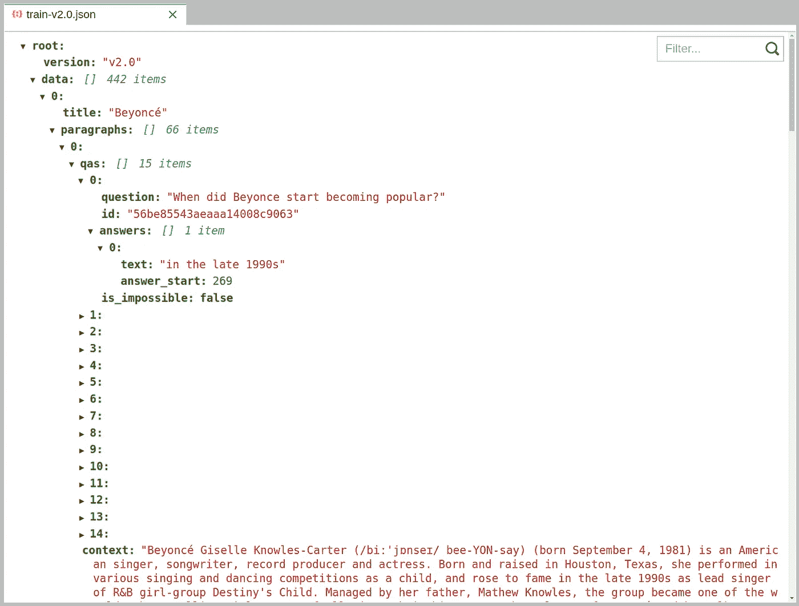
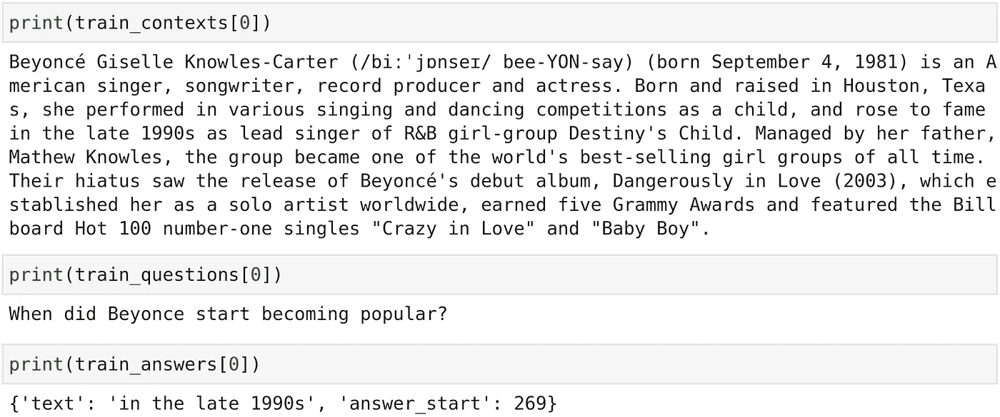
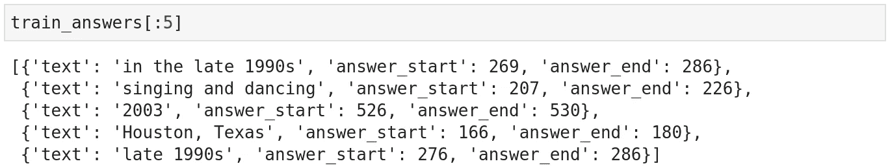
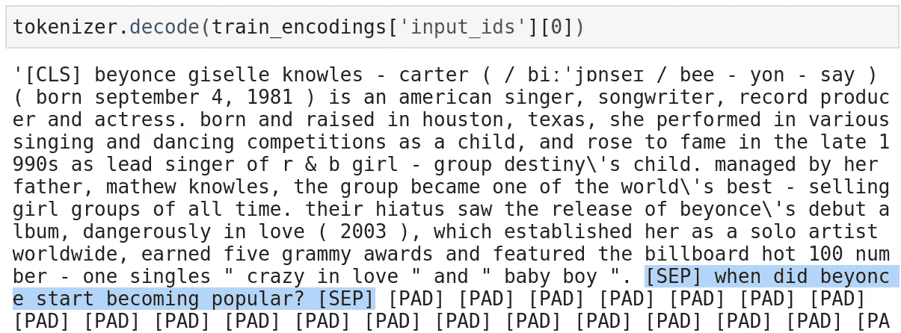
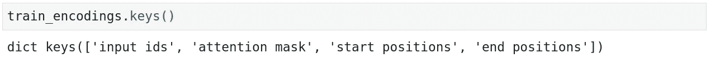
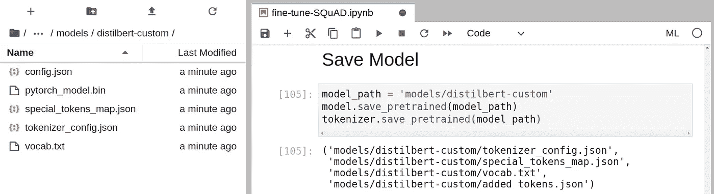
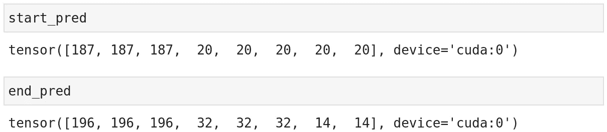
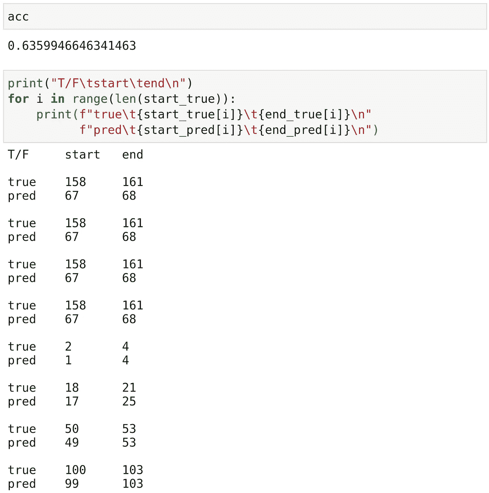

# 如何微调问答转换器

> 原文：<https://towardsdatascience.com/how-to-fine-tune-a-q-a-transformer-86f91ec92997?source=collection_archive---------3----------------------->

## 了解如何微调问答的 ML 模型


由[迈克尔·泽兹奇](https://unsplash.com/@lazycreekimages?utm_source=medium&utm_medium=referral)在 [Unsplash](https://unsplash.com?utm_source=medium&utm_medium=referral) 上拍摄的照片

Transformer 模型无疑是 NLP 中的领导者——在几乎所有其他任务中，它都胜过几乎所有其他模型架构。

变形金刚已经证明自己有能力处理的最有趣的基于语言的任务之一是问答。

在本文中，我们将了解 NLP 中的问答领域，并了解如何下载和微调世界上最先进的 transformer 模型。简而言之:

```
> Our Dataset
  - Downloading SQuAD> Preparing The Data
  - Extraction
  - Encoding
  - Initializing the Dataset> Fine-Tuning> Measuring Performance
  - Implementing Accuracy
```

如果你喜欢视频——我在这里也涵盖了一切:

# 我们的数据集

对于我们的例子，我们将使用[斯坦福问答数据集(SQuAD) 2.0](https://rajpurkar.github.io/SQuAD-explorer/) 。我们的模型将被期望正确地选择回答我们提供的问题的文本片段的特定部分。

## 下载小队

我们可以像这样用 Python 下载数据:

这将返回两个文件，我们的训练数据`train-v2.0.json`——和我们的验证数据`dev-v2.0.json`。两者看起来都像这样:



JSON 预览——它包括几个层，这些层导致一个**上下文**(底部)和几个**问题** - **答案**对用于每个上下文

这里我们的数据有三个关键部分，它们是:

*   **问题** —包含我们将向模型提出的问题的字符串
*   **上下文** —包含我们问题答案的更大的文本片段
*   **答案** —较短的字符串，是给定上下文的“摘录”，为我们的问题提供答案

因此，我们将为模型提供一个问题和相应的答案。然后，模型必须读取两者，并从上下文返回预测答案的标记位置。

# 准备数据

## 提取，血统

准备这些数据进行微调的第一步是将我们的问题、上下文和答案从 JSON 文件提取到训练和验证集中。我们可以这样做:

答案

这使我们的两个数据集在三个列表(每个列表)之间拆分:



相应的上下文、问题和答案集

我们的上下文和问题是简单的字符串——彼此对应。每个问题的答案都可以在上下文中找到。

答案列表略有不同，因为每个条目都是一个字典，其中答案包含在`'text'`中，并且该答案在上下文中的起始位置也在`'answer_start'`中提供。

这没问题，但是我们需要训练我们的模型在上下文中找到答案的开始和结束——所以我们也需要添加一个`'answer_end'`值:

这给了我们:



字典的答案数组——现在包括一个修正的 **answer_start** 和一个 **answer_end** 位置

## 编码

我们的数据几乎准备好了；我们只需要将我们的字符串转换成记号——然后将我们的`answer_start`和`answer_end`索引从字符位置转换成记号位置。

使用内置的 HuggingFace 标记器很容易完成标记化，如下所示:

我们的上下文问题对现在被表示为`Encoding`对象。这些对象合并每个相应的上下文和问题字符串，以创建 BERT 所期望的 Q & A 格式——它简单地将上下文和问题连接在一起，但用一个`[SEP]`标记分隔开:



我们输入到模型中的数据(显示出来的数据被解码成人类可读的文本)只是上下文(包含答案)和问题的连接，用一个**【SEP】**标记分隔

这个串联版本存储在我们的`Encoding`对象的`input_ids`属性中。但是，数据存储为 BERT 可读的令牌 id，而不是人类可读的文本。

这个`tokenizer`很棒，但是它没有产生我们的答案开始-结束令牌位置。为此，我们定义了一个定制的`add_token_positions`函数:

这个函数向我们的`Encoding`对象添加了另外两个属性— `start_positions`和`end_positions`。其中每一个都是一个简单的列表，包含答案的开始/结束标记位置，对应于它们各自的问题-上下文对。



**train_encodings** 和存储在对象内部的属性——包括令牌 **start_positions** 和 **end_positions**

## 正在初始化数据集

现在，我们已经准备好了数据，并且拥有了我们需要的一切—我们只需要将它转换成正确的格式，以便使用 PyTorch 进行培训。

为此，我们需要构建一个数据集对象，我们可以像这样轻松地完成:

我们将能够在训练和验证期间将这些数据集对象输入到我们的模型中。

# 微调

我们的数据现在完全可以供我们的模型使用了。我们现在要做的就是设置我们的 PyTorch 环境，初始化我们将在训练期间用来加载数据的`DataLoader`——最后，开始微调我们的模型:

与大多数变压器模型相比，DistilBert 是一个小模型——但这仍需要一些时间来训练。

完成后，我们可以继续保存我们新微调的模型(如果需要，还有 tokenizer)——我们将把它保存到一个新目录`models/distilbert-custom`:



拯救我们的

当再次加载我们的模型时，我们可以使用与从 HuggingFace 加载模型时相同的`from_pretrained`方法——我们所做的就是用我们的本地路径替换在线模型路径/名称——在这种情况下:

```
model_path = 'models/distilbert-custom'
model = DistilBertForQuestionAnswering.from_pretrained(model_path)
tokenizer = DistilBertTokenizerFast.from_pretrained(model_path)
```

或者使用通用`AutoModel`加载器:

```
model = AutoModel.from_pretrained(model_path)
tokenizer = AutoTokenizer.from_pretrained(model_path)
```

# 衡量绩效

一旦我们训练了我们的模型，我们就可以开始进行预测，并向我们的模型提出一些问题。

请记住，我们已经在使用一个高度优化的基础模型——这使我们成功了一半——但是我们仍然可以从不同模型的实验中受益。

但是现在，我们只需要学习这种方法——以及如何将它应用到我们自己更具体的用例中。所以让我们来学习一下后培训应该怎么做。

为了从我们的模型中提取开始-结束令牌范围，我们可以访问`start_logits`和`end_logits`张量并执行`argmax`函数，如下所示:

```
start_pred = torch.argmax(outputs['start_logits'], dim=1)
end_pred = torch.argmax(outputs['end_logits'], dim=1)
```



**start_pred** 和 **end_pred** 张量将看起来像这样——这些是模型对开始-结束答案位置的预测。

我们在这里可以测量的最简单的度量是准确性——更具体地称为*精确匹配*(EM)——模型是否获得了正确的开始或结束标记？当然，这并没有考虑到模型越来越接近，可能会丢失一两个令牌——但这是一个开始。

为了计算每批的 EM，我们取每批匹配数的`sum`,然后除以总数。我们用 PyTorch 这样做:

```
acc = ( (start_pred == start_true).sum() / len(start_pred) ).item()
```

最后的`.item()`将张量值提取为一个简单的 Python `int`。

## 精确匹配

现在我们知道了如何计算我们的问答准确度——让我们为我们的`val_dataset`实现它吧！

我们再次设置了一个`DataLoader`——然后遍历每一批。不过这一次，我们调用`model.eval()`将相关层的行为从训练模式切换到推理模式，并使用`torch.no_grad()`阻止 PyTorch 计算模型梯度(仅在训练期间需要):

在所有这些之后，我们有了一个——尽管是粗略的——精确度的衡量标准。

在 63.6% 的时间里，该模型设法获得正确答案的确切跨度(开始和/或结束)。63.6%当然不是一个特别令人印象深刻的数字，除非我们更深入地了解该模型的表现。



打印出我们数据集中最后一批问答对——尽管在大约 50%的情况下，它与真实答案的差距不到一个符号(或更少),但它只获得了 18.75%的 EM。

EM 指标并没有描绘出全貌——尽管在最后一批中 EM 得分仅为 18.75%——该模型在 4/8 的问题中确实非常接近，这并没有反映在 EM 得分中。

尽管如此，当测量和比较模型时，EM 是一个完美的起点。

本次演练到此结束！我们采用了一个预训练的 DistilBert 模型，给它安装了一个问答头，并使用小队数据集对它进行了微调。制作我们自己的问答模型。

然而，更重要的是，我们引入了获取问答数据集的过程，并使用它来“微调”预训练的 transformer 模型。

学习和理解这个过程非常重要，如果应用正确，可以将问答模型在特定用例上的性能提高很多。

您很可能不会使用 SQuAD 数据集进行任何微调，而是使用您自己的数据或开源问答数据集:

*   [NewsQA](https://www.microsoft.com/en-us/research/project/newsqa-dataset/) — 120K CNN 新闻文章
*   [图 QA](https://www.microsoft.com/en-us/research/project/figureqa-dataset/) —基于图表的 Q & A
*   来自 Reddit 的财务意见 Q &
*   常识问答——祝你好运😄

现在已经有大量的数据集可用，而且越来越多的数据集经常可用，所以有很多东西可以学习！

我希望你喜欢这篇文章！如果你有任何问题，请通过 [Twitter](https://twitter.com/jamescalam) 或在下面的评论中告诉我。如果你想知道更多类似的内容，我也会在 YouTube 上发布。

感谢阅读！

# 参考

[使用自定义数据集进行微调](https://huggingface.co/transformers/custom_datasets.html#qa-squad)，HuggingFace 的变形金刚文档

[🤖带变压器的 NLP 课程](https://bit.ly/nlp-transformers)

[全篇代码](https://gist.github.com/jamescalam/55daf50c8da9eb3a7c18de058bc139a3)

**除非另有说明，所有图片均出自作者之手*