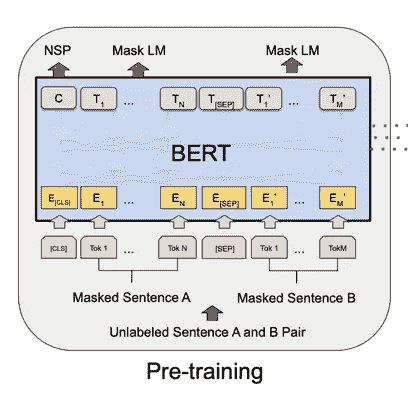
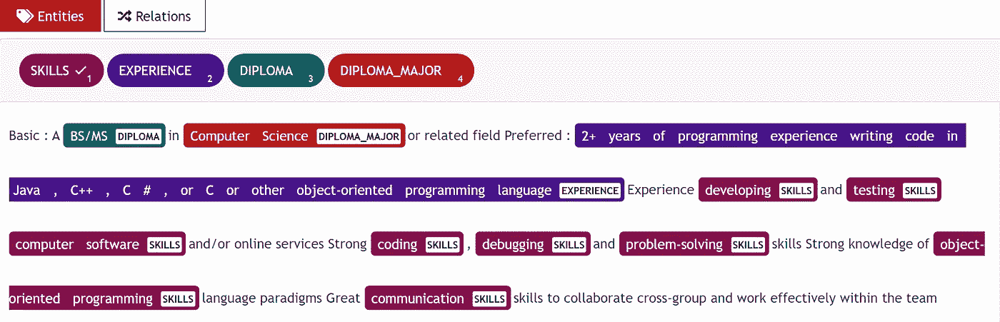
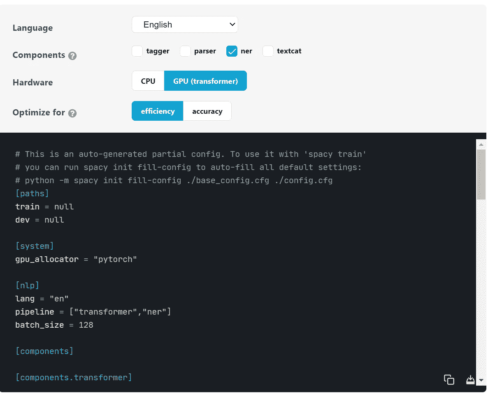
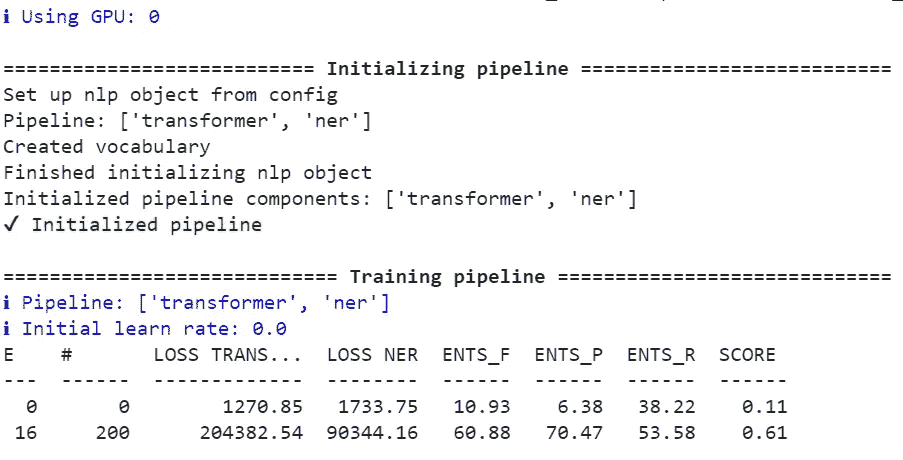

# 如何用 spaCy 3 微调 BERT 变压器

> 原文：<https://towardsdatascience.com/how-to-fine-tune-bert-transformer-with-spacy-3-6a90bfe57647?source=collection_archive---------0----------------------->

## 如何为 NER 微调 BERT 的分步指南


照片由 <https://unsplash.com/@jasonrosewell> [阿丽娜·格鲁布尼亚](https://unsplash.com/@alinnnaaaa)在 [Unsplash](https://unsplash.com/photos/ASKeuOZqhYU) 上拍摄

自从 Vaswani 等人的开创性论文“[注意力是你所需要的全部](https://arxiv.org/abs/1706.03762)”以来，变压器模型已经成为 NLP 技术中最先进的技术。应用范围从 NER，文本分类，问答或聊天机器人，这项惊人的技术的应用是无限的。

更具体地说，BERT——代表转换器的双向编码器表示——以一种新颖的方式利用转换器架构。例如，BERT 用一个随机屏蔽的单词分析句子的两边来进行预测。除了预测掩码标记之外，BERT 还通过在第一个句子的开头添加分类标记[CLS]来预测句子的顺序，并通过在两个句子之间添加分隔标记[SEP]来尝试预测第二个句子是否跟随第一个句子。



伯特建筑

在本教程中，我将向您展示如何微调 BERT 模型来预测软件职位描述中的技能、文凭、文凭专业和经验等实体。如果你有兴趣更进一步，提取实体之间的关系，请阅读我们的[文章](https://walidamamou.medium.com/how-to-train-a-joint-entities-and-relation-extraction-classifier-using-bert-transformer-with-spacy-49eb08d91b5c)关于如何使用 transformers 执行联合实体和关系提取。

微调变压器需要强大的并行处理 GPU。为此，我们使用 Google Colab，因为它提供免费的带有 GPU 的服务器。

对于本教程，我们将使用新发布的 [spaCy 3 库](https://spacy.io/usage/v3)来微调我们的转换器。下面是如何在 spaCy 3 上微调 BERT 模型的分步指南(视频教程[此处](https://www.youtube.com/watch?v=Y_N_AO39rRg&t=1s))。代码和必要的文件可以在 G [ithub repo](https://github.com/UBIAI/Fine_tune_BERT_with_spacy3) 中找到。

# 数据标签:

为了使用 spaCy 3 对 BERT 进行微调，我们需要提供 spaCy 3 JSON 格式的训练和开发数据([参见这里的](https://spacy.io/api/data-formats))，然后这些数据将被转换成一个. spaCy 二进制文件。我们将提供 TSV 文件中包含的 IOB 格式的数据，然后转换为 spaCy JSON 格式。

对于培训数据集，我只标记了 120 个职位描述和大约 70 个职位描述，这些职位描述带有实体，如*技能*、*文凭*、*文凭专业、*和*经验*。

在本教程中，我使用了 [UBIAI](https://ubiai.tools/) 注释工具，因为它具有广泛的特性，例如:

*   ML 自动注释
*   字典、正则表达式和基于规则的自动注释
*   团队协作以共享注释任务
*   **直接将注释导出为 IOB 格式**

使用 UBIAI 中的正则表达式特性，我已经按照“\d.*\+模式对所有提到的体验进行了预注释。*”如“5 年以上 C++经验”。然后，我上传了一个包含所有软件语言的 csv 字典，并分配了实体技能。预先注释可以节省大量时间，并帮助您最大限度地减少手动注释。



UBIAI 注释接口

关于 UBIAI 注释工具的更多信息，请访问文档页面和我之前的文章。

导出的注释将如下所示:

```
MS B-DIPLOMA
in O
electrical B-DIPLOMA_MAJOR
engineering I-DIPLOMA_MAJOR
or O
computer B-DIPLOMA_MAJOR
engineering I-DIPLOMA_MAJOR
. O
5+ B-EXPERIENCE
years I-EXPERIENCE
of I-EXPERIENCE
industry I-EXPERIENCE
experience I-EXPERIENCE
. I-EXPERIENCE
Familiar O
with O
storage B-SKILLS
server I-SKILLS
architectures I-SKILLS
with O
HDD B-SKILLS
```

为了从 IOB 转换到 JSON(参见文档[这里](https://spacy.io/api/cli#convert)，我们使用 spaCy 3 命令:

```
!python -m spacy convert drive/MyDrive/train_set_bert.tsv ./ -t json -n 1 -c iob
!python -m spacy convert drive/MyDrive/dev_set_bert.tsv ./ -t json -n 1 -c iob
```

在转换成 spaCy 3 JSON 之后，我们需要将 training 和 dev JSON 文件都转换成。spacy 二进制文件使用此命令(用您自己的命令更新文件路径):

```
!python -m spacy convert drive/MyDrive/train_set_bert.json ./ -t spacy!python -m spacy convert drive/MyDrive/dev_set_bert.json ./ -t spacy
```

# 模型培训:

*   打开一个新的 Google Colab 项目，确保在笔记本设置中选择 GPU 作为硬件加速器。
*   为了加速训练过程，我们需要在我们的 GPU 上运行并行处理。为此，我们安装了 NVIDIA 9.2 cuda 库:

```
!wget [https://developer.nvidia.com/compute/cuda/9.2/Prod/local_installers/cuda-repo-ubuntu1604-9-2-local_9.2.88-1_amd64](https://developer.nvidia.com/compute/cuda/9.2/Prod/local_installers/cuda-repo-ubuntu1604-9-2-local_9.2.88-1_amd64) -O cuda-repo-ubuntu1604–9–2-local_9.2.88–1_amd64.deb!dpkg -i cuda-repo-ubuntu1604–9–2-local_9.2.88–1_amd64.deb!apt-key add /var/cuda-repo-9–2-local/7fa2af80.pub!apt-get update!apt-get install cuda-9.2
```

要检查是否安装了正确的 cuda 编译器，运行:！nvcc -版本

*   安装空间库和空间转换器管道:

```
pip install -U spacy
!python -m spacy download en_core_web_trf
```

*   接下来，我们安装为 cuda 9.2 配置的 pytorch 机器学习库:

```
pip install torch==1.7.1+cu92 torchvision==0.8.2+cu92 torchaudio==0.7.2 -f https://download.pytorch.org/whl/torch_stable.html
```

*   pytorch 安装后，我们需要安装为 cuda 9.2 调整的 spacy transformers，并更改 CUDA_PATH 和 LD_LIBRARY_PATH，如下所示。最后，安装 cupy 库，它相当于 numpy 库，但用于 GPU:

```
!pip install -U spacy[cuda92,transformers]
!export CUDA_PATH=”/usr/local/cuda-9.2"
!export LD_LIBRARY_PATH=$CUDA_PATH/lib64:$LD_LIBRARY_PATH
!pip install cupy
```

*   SpaCy 3 使用包含所有模型训练组件的配置文件 config.cfg 来训练模型。在 [spaCy training 页面](https://spacy.io/usage/training)中，您可以选择模型的语言(本教程中为英语)、要使用的组件(NER)和硬件(GPU)并下载配置文件模板。



用于培训的 Spacy 3 配置文件。[来源](https://spacy.io/usage/training)

我们唯一需要做的就是为火车和 dev 填充路径。垃圾文件。完成后，我们将文件上传到 Google Colab。

*   现在我们需要用 BERT 模型需要的其余参数自动填充配置文件；您只需运行以下命令:

```
!python -m spacy init fill-config drive/MyDrive/config.cfg drive/MyDrive/config_spacy.cfg
```

我建议调试您的配置文件，以防出现错误:

```
!python -m spacy debug data drive/MyDrive/config.cfg
```

*   我们终于准备好训练 BERT 模型了！只需运行这个命令，培训就应该开始了:

```
!python -m spacy train -g 0 drive/MyDrive/config.cfg — output ./
```

页（page 的缩写）如果你得到错误 cupy _ back ends . CUDA . API . driver . CUDA driver ERROR:CUDA _ ERROR _ INVALID _ PTX:一个 PTX JIT 编译失败，只需卸载 cupy 并重新安装它，它应该可以修复这个问题。

如果一切正常，您应该开始看到模型得分和损失正在更新:



在 google colab 上进行 BERT 培训

培训结束时，模型将保存在文件夹“模型-最佳”下。模型分数位于 model-best 文件夹内的 meta.json 文件中:

```
“performance”:{“ents_per_type”:{“DIPLOMA”:{“p”:0.5584415584,“r”:0.6417910448,“f”:0.5972222222},“SKILLS”:{“p”:0.6796805679,“r”:0.6742957746,“f”:0.6769774635},“DIPLOMA_MAJOR”:{“p”:0.8666666667,“r”:0.7844827586,“f”:0.8235294118},“EXPERIENCE”:{“p”:0.4831460674,“r”:0.3233082707,“f”:0.3873873874}},“ents_f”:0.661754386,“ents_p”:0.6745350501,“ents_r”:0.6494490358,“transformer_loss”:1408.9692438675,“ner_loss”:1269.1254348834}
```

由于训练数据集有限，分数肯定远低于生产模型水平，但值得在示例工作描述中检查其性能。

# 用变压器提取实体

为了在示例文本上测试模型，我们需要加载模型并在我们的文本上运行它:

```
nlp = spacy.load(“./model-best”)
text = ['''Qualifications- A thorough understanding of C# and .NET Core- Knowledge of good database design and usage- An understanding of NoSQL principles- Excellent problem solving and critical thinking skills- Curious about new technologies- Experience building cloud hosted, scalable web services- Azure experience is a plusRequirements- Bachelor's degree in Computer Science or related field(Equivalent experience can substitute for earned educational qualifications)- Minimum 4 years experience with C# and .NET- Minimum 4 years overall experience in developing commercial software''']for doc in nlp.pipe(text, disable=["tagger", "parser"]): print([(ent.text, ent.label_) for ent in doc.ents])
```

以下是从我们的示例工作描述中提取的实体:

```
[("C", "SKILLS"),("#", "SKILLS"),(".NET Core", "SKILLS"),("database design", "SKILLS"),("usage", "SKILLS"),("NoSQL", "SKILLS"),("problem solving", "SKILLS"),("critical thinking", "SKILLS"),("Azure", "SKILLS"),("Bachelor", "DIPLOMA"),("'s", "DIPLOMA"),("Computer Science", "DIPLOMA_MAJOR"),("4 years experience with C# and .NET\n-", "EXPERIENCE"),("4 years overall experience in developing commercial software\n\n", "EXPERIENCE")]
```

仅使用 120 个培训文档就已经相当不错了！我们能够正确地提取大部分技能、文凭、文凭专业和经验。

有了更多的训练数据，该模型肯定会进一步改进，并产生更高的分数。

# 结论:

由于惊人的 spaCy 3 库，仅用几行代码，我们就成功地训练了一个功能性的 NER 变换器模型。请继续在您的用例上进行尝试，并分享您的结果。注意，您可以使用 [UBIAI](https://ubiai.tools) 标注工具来标注您的数据，我们提供 14 天免费试用。

一如既往，如果您有任何意见，请在下方留言或发送电子邮件至 admin@ubiai.tools！

在 Twitter 上关注我们

# 参考

*   https://www.youtube.com/watch?v=Y_N_AO39rRg&t = 1s