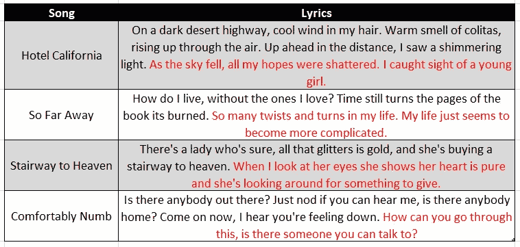

# 如何为文本生成微调 GPT-2

> 原文：<https://towardsdatascience.com/how-to-fine-tune-gpt-2-for-text-generation-ae2ea53bc272?source=collection_archive---------0----------------------->

## 使用 GPT-2 生成高质量的歌词


来源:https://unsplash.com/photos/gUK3lA3K7Yo

自然语言生成(NLG)在最近几年取得了令人难以置信的进步。2019 年初，OpenAI 发布了 GPT-2，这是一个巨大的预训练模型(1.5B 参数)，能够生成类似人类质量的文本。

顾名思义，创成式预训练变形金刚 2 (GPT-2)基于变形金刚。因此，它使用注意力机制，这意味着它学会关注与上下文最相关的前几个单词，以便预测下一个单词(更多信息，请访问[这里](/transformers-a-simple-explanation-5b17aeb587e6))。

本文的目标是向您展示如何根据您提供给它的数据，对 GPT-2 进行微调，以生成上下文相关的文本。

作为一个例子，我将生成歌词。这个想法是使用已经训练好的模型，根据我们的具体数据进行微调，然后根据模型观察到的情况，生成任何给定歌曲中应该遵循的内容。

## 准备数据

GPT-2 本身可以生成质量不错的文本。但是，如果您希望它在特定的上下文中做得更好，您需要根据您的特定数据对它进行微调。在我的例子中，因为我想生成歌词，所以我将使用下面的 Kaggle [数据集](https://www.kaggle.com/neisse/scrapped-lyrics-from-6-genres)，它包含总共 12，500 首流行摇滚歌曲的歌词，都是英文的。

让我们从导入必要的库和准备数据开始。我推荐在这个项目中使用 Google Colab，因为使用 GPU 会让事情变得更快。

从第 26 行和第 34–35 行可以看出，我创建了一个小型测试集，删除了每首歌的最后 20 个单词。这将允许我将生成的文本与实际文本进行比较，以查看模型的执行情况。

## 创建数据集

为了在我们的数据上使用 GPT-2，我们还需要做一些事情。我们需要对数据进行记号化，这是将一系列字符转换成记号的过程，即把一个句子分割成单词。

我们还需要确保每首歌曲最多支持 1024 个令牌。

在训练过程中,`SongLyrics`类将为我们做这些，为我们原始数据帧中的每一首歌。

## 模型的训练

我们现在可以导入预训练的 GPT-2 模型，以及令牌化器。另外，就像我之前提到的，GPT 2 号是巨大的。如果你试图在你的电脑上使用它，你很可能会得到一堆`CUDA Out of Memory`错误。

可以使用的另一种方法是**累加梯度**。

这个想法很简单，在调用优化来执行梯度下降步骤之前，它将对几个操作的梯度求和。然后，将该总数除以累计步数，以获得训练样本的平均损失。这意味着更少的计算。

现在，最后，我们可以创建训练函数，它将使用我们所有的歌词来微调 GPT-2，以便它可以预测未来的优质诗句。

随意使用各种超参数(批量大小、学习率、时期、优化器)。

然后，最后，我们可以训练模型。

```
model = train(dataset, model, tokenizer)
```

使用`torch.save`和`torch.load`，你也可以保存你训练好的模型以备将来使用。

## 歌词生成

是时候使用我们全新的微调模型来生成歌词了。通过使用以下两个函数，我们可以为测试数据集中的所有歌曲生成歌词。请记住，我已经删除了每首歌的最后 20 个词。对于给定的歌曲，我们的模型现在将查看他的歌词，并得出歌曲的结尾。

对于整个测试数据帧，`generate` 函数准备生成，而`text_generation` 实际上完成生成。

在第 6 行，我们指定了一代的最大长度。我将其保留为 30，但这是因为标点符号很重要，稍后我将删除最后几个单词，以确保生成在句子的末尾结束。

另外两个超参数值得一提:

*   **温度**(第 8 行)。它用于衡量给定单词生成的概率。因此，高温迫使模型做出更多的原创预测，而低温则防止模型偏离主题。
*   **顶 p 过滤**(第 7 行)。该模型将按降序对单词概率进行排序。然后，它会将这些概率相加，直到 p，同时丢弃其他单词。这意味着该模型只保留最相关的单词概率，而不是只保留最好的一个，因为对于给定的序列，不止一个单词是合适的。

在下面的代码中，我简单地清理了生成的文本，确保它在句子的末尾(而不是中间)结束，并将其存储在测试数据集中的一个新列中。

## 性能赋值

有许多方法可以评估生成文本的质量。最受欢迎的指标叫做 BLEU。该算法根据生成的文本与现实的相似程度，输出一个介于 0 和 1 之间的分数。分数为 1 表示生成的每个单词都存在于真实文本中。

下面是为生成的歌词评估 BLEU 分数的代码。

我们获得了 0.685 的平均 BLEU 分数，相当不错。相比之下，没有任何微调的 GPT-2 模型的 BLEU 得分为 0.288。

然而，BLEU 也有其局限性。它最初是为机器翻译而创建的，只查看用于确定生成文本质量的词汇。这对我们来说是个问题。事实上，有可能产生高质量的诗句，使用与现实完全不同的词语。

这就是为什么我会对模型的性能做一个主观的评价。为此，我创建了一个小的 web 界面(使用 Dash)。代码可以在我的 Github 库中找到。

界面的工作方式是你给 app 提供一些输入单词。然后，该模型将使用它来预测下一对诗句应该是什么。以下是一些结果示例。



红色的是 GPT-2 模型预测的，给定黑色的输入序列。你看到它已经成功地产生了有意义的诗句，并且尊重了之前发生的事情的背景！此外，它会生成长度相似的句子，这对于保持歌曲的节奏非常重要。在这方面，当生成歌词时，输入文本中的标点符号是绝对必要的。

## 结论

正如本文所示，通过对特定数据进行 GPT-2 微调，可以相当容易地生成上下文相关的文本。

对于歌词生成，该模型可以生成尊重上下文和句子的期望长度的歌词。当然，可以对模型进行改进。例如，我们可以强迫它生成押韵的诗句，这是写歌词时经常需要的。

非常感谢你的阅读，我希望我能有所帮助！

包含所有代码和模型的库可以在这里找到:[https://github . com/francoistamant/lyrics-generation-with-gp T2](https://github.com/francoisstamant/lyrics-generation-with-GPT2)