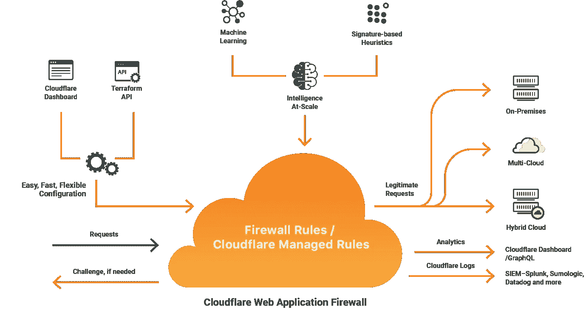

# 对 Flask-vue.js 应用程序中的 CloudFlare 网关超时错误 524 进行故障排除

> 原文：<https://towardsdatascience.com/how-to-fix-a-cloudflare-gateway-timeout-error-in-a-flask-vue-js-ml-application-efe2826585bb?source=collection_archive---------7----------------------->

CloudFlare 如何通过 [CloudFlare 网站](https://www.cloudflare.com/ru-ru/waf/)工作

当我和[曼努埃尔·古兹曼](https://www.linkedin.com/in/manuelguzmandao/) (MSW R & D director)在测试一个 ML 应用程序时，出现了 524 网关超时错误，这个应用程序需要几分钟时间来生成结果，然后再将结果发送给用户。

我们发现应该增加 CloudFlare 中的超时限制来消除错误。

根据我们在谷歌搜索这个错误时发现的一些答案，它是不可能修复的([查看这个 StackOverflow 答案](https://stackoverflow.com/questions/38536167/is-it-possible-to-increase-cloudflare-time-out))。

经过一次头脑风暴，我们按照曼纽尔的想法解决了这个问题。

在本文中，我将与您分享我们为解决 Cloudflare 中的 524 网关超时错误而采取的所有步骤。

我将介绍如何解决这种类型的错误，更重要的是我们使用的代码片段。

## 什么是 524 网关超时错误？

524 网关超时错误是特定于 Cloudflare 的 HTTP 状态代码，表示与服务器的连接因超时而关闭。

下面是在 [Cloudflare 支持网站](https://support.cloudflare.com/hc/en-us/articles/115003011431-Troubleshooting-Cloudflare-5XX-errors)中的定义

> 错误 524 表示 Cloudflare 成功连接到源 web 服务器，但在默认的 100 秒连接超时之前，源没有提供 HTTP 响应。企业客户可以将 524 超时增加到 600 秒。

在可操作的情况下，浏览器向应用程序所在的 web 服务器发送请求，然后将包含状态代码(即 200)和结果(ML 应用程序的预测)的回答发送回用户。如果与服务器的连接超过 100 秒而没有发回响应，用户将收到状态代码 524 和空内容。

CloudFlare 仅在企业计划上提供超时[的定制。](https://www.cloudflare.com/fr-fr/enterprise/)

GIF via [GIPHY](https://media.giphy.com/media/14SAx6S02Io1ThOlOY/giphy.gif)

## 解决方案

以下步骤描述了该解决方案

1.  浏览器发送带有参数的第一个请求来启动后端进程(在我们的例子中，它是一个 ML 应用程序后端)。

2.应用程序后端为这个请求生成一个 ID

3.应用程序后端使用给定的参数启动(预测)过程

4.应用后端立即将响应发送回浏览器(无需等待预测过程完成),该响应包括请求 ID 和指示该过程当前正在工作的状态 202

5.浏览器收到答案，等待 10 秒钟(这取决于您的预测过程生成最终结果所需的时间)，然后用相同的 ID 发出另一个请求，以检查预测过程是否完成(状态 200)

5.如果预测过程尚未完成，则重复步骤 4 和 5

就是这样！

您的浏览器将等待预测结果，并在准备就绪时获得后端答案。

GIF via [GIPHY](https://media.giphy.com/media/4NnTap3gOhhlik1YEw/giphy.gif)

# 摘要

与其他类型的应用程序相比，机器学习应用程序的响应时间通常较长。每当应答时间超过服务器连接超时限制时，就可以应用这种解决方案。

如果你有问题，欢迎在下面评论或通过[邮箱](http://maha.amami@mysciencework.com)或 [Linkedin](https://www.linkedin.com/in/maha-amami-phd-088b42b2/) 提问。我会回答的。