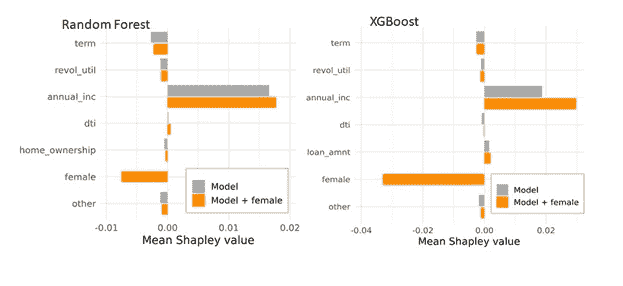
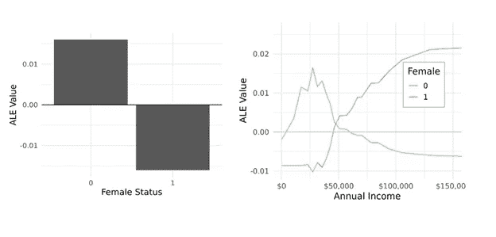

# 如何修复特征偏差

> 原文：<https://towardsdatascience.com/how-to-fix-feature-bias-9e47abccb942?source=collection_archive---------17----------------------->

## [公平和偏见](https://towardsdatascience.com/tagged/fairness-and-bias)

## 选择策略需要测试和权衡

由[马特·阿特兹](https://unsplash.com/@mattartz?utm_source=medium&utm_medium=referral)在 [Unsplash](https://unsplash.com?utm_source=medium&utm_medium=referral) 上拍摄的照片

特征偏差反映了人类判断中的测量误差或偏差，会对机器学习模型的公平性产生负面影响。这篇文章讨论了减轻这种偏见的五个潜在策略。最好的方法是上下文相关的。可解释性技术对于确保解决方案解决偏见并且不引入额外的不公平是必不可少的。这篇博客是我上一篇文章[1]的后续，那篇文章讨论了一种缓解方法的缺点。

当一个特征在不同的群体中有不同的含义时(如种族或性别类别)，就会出现特征偏差。这可能反映了测量误差、自我报告的差异或有偏见的人类判断。以下是说明该问题的一些示例场景:

1.  男性比女性更不可能报告癌症家族史，即使它确实存在[2]；这种差异可能导致低估男性的风险。
2.  在刑事累犯模型中使用以前的逮捕受到了批评，因为逮捕不能以统一的方式反映潜在的犯罪。例如，当发现犯罪或使用逮捕与警告存在种族差异时，模型可能高估某些群体的风险[3，4，5]。
3.  低收入人群可能难以准确报告就业和收入，部分原因是当“收入”随时间变化或涉及多个来源时，很难简明地描述“收入”[6]。对于这个群体来说，这样的调查问题可能更模糊，因此更容易出错。

了解您的数据源至关重要。例如，如果收入特征直接取自工资单或纳税申报表数据，则特征偏差的风险可能较低，但如果是自我报告，则风险非常高。各组间缺失值或缺省值比率的差异也是危险信号。可解释性技术可以帮助识别潜在的风险特征[1，7]。

如果某个特性可能会有偏差，该如何处理？这篇文章包含了我对五种可能的缓解方法的想法。没有适合每种情况的完美技巧。减轻特征偏差可能需要尝试几种策略并彻底测试结果。

# 修改您的数据

减轻特征偏差的一个显而易见的策略是修复数据。在许多情况下，这可能很难或者不可能，但是值得考虑。与其他策略相比，数据修改降低了意外后果的风险。如果您不知道所有情况下的组成员，这也是唯一有效的技术。例如，在我处理过的数据中，通常只有一部分人的性别或种族/民族信息；可以使用这些案例来评估公平性，但是我们希望在缺少这些信息的情况下进行预测。

可以有许多方法来调整数据。有可能丢弃有偏见的特征或者用来自更可靠来源的信息来代替。如果您能够控制该功能，您也许能够实现直接修复。例如，如果偏见是由您管理的调查中的措辞引起的，那么更改调查并重新收集数据可能是最好的选择。如果特征偏差影响特征的极端值(例如，最高或最低收入的个人)，阈值或分桶可能是有用的。

如果特征偏差与组成员关系密切，也有可能重新调整值，例如在组内使用四分位数。在最近的一篇论文[5]中测试了一种重新标度方法。发现表现不佳。

# 在模型中包含敏感特性(概述)

我在之前的博文[1]中详细讨论了这个策略。简而言之，一些人认为，在非线性模型中包含一个敏感特征会导致模型自动调整不同组之间特征贡献的相对强度[3]。然而，我的文章认为，这种交互效应并不能保证会被纳入模型，当敏感特征对预测做出“类似主效应”的贡献时，可能会出现意想不到的后果。

当群体成员与模型中的其他预测因素相关，或与结果有因果关系的未测量特征相关时，纳入敏感特征尤其危险。这使得它特别有可能作为一个主要的影响，或作为一个与意想不到的功能互动。

有可能使用各种可解释性技术来确定敏感特性包含具有预期的效果[1]。对于一些数据集来说，这种方法的优势可能超过其风险。

# 使用不同的模型类型

对于敏感特征包含技术，不同的模型类型可以更好地捕捉成对的交互。在我之前的文章[1]中，我尝试了两种方法:随机森林和 XGBoost，但是报告了随机森林的结果，因为它们更容易解释。在这里，我将讨论 XGBoost。虽然这两种模型类型都显示了风险，但是对于我的测试场景，XGBoost 通常比 random forest 更好地减轻了特性偏差。

简而言之，我的方法包括在公共贷款数据集中随机分配男性或女性“性别”,然后只减少女性收入特征的值。虽然“性别”对实际违约率没有影响，但收入预测中的特征偏差导致了对女性贷款违约的过度预测。然后，我的帖子测试了将女性身份添加到特征中会纠正偏见的假设。详见上一篇帖子[1]；代码在 GitHub [8]上。

我检验了女性特征的加入是否使人口水平的模型结果更像实际违约率。对于随机森林，这种修正是微弱的[1]。对于 XGBoost，我看到了更大的共识:

实际违约率与随机森林(RF)和 XGBoost (XGB)模型(包括女性指标特征)的预测相比。

群体水平的差异在聚集 Shapley 值图中也很明显。这样的图可以识别出驱动组间差异的特征[7，9]；在这里，我展示了女性与男性违约率的差异有多大是由每个特征造成的。我使用这些图来比较具有和不具有敏感特征的模型:

随机 forest(左)和 XGBoost(右)模型中，女性的聚合 Shapley 值与男性参考值的比较(不含和含女性指标特征)。图片作者。

首先关注灰色条，很明显，如预期的那样，特征偏差通过收入特征影响模型预测。这两种模型类型受到的影响相似。

当女性指标被引入模型时，差异是明显的(图中的橙色柱)。这个特性对 XGBoost 的补偿效果比随机森林模型大得多。这与 XGBoost 更好的群体水平偏倚校正是一致的。

仅对于 XGBoost，包括女性身份在内的模型的收入栏变化显著，表明这一特性的影响更大。这在全球重要性方面也很明显；在没有女性特征的情况下，收入是排列重要性第三重要的特征，但当包括女性地位时，它成为最重要的特征。考虑到特征偏差降低了收入和违约状态之间的相关性，这种增加是可以预期的。具有偏差特征的模型可能低估了收入的影响。

我不是这些算法的专家，但是我认为不同之处在于 XGBoost 提供了定向搜索，而随机森林模型覆盖了更多的解决方案。如果我们有一个与另一个要素相关的强预测器，随机森林将对涉及强预测器的一些解决方案和使用弱预测器的一些解决方案进行采样。但是，如果已经找到涉及较强预测器的解决方案，XGBoost 将不会包含较弱的预测器，假设较弱的预测器没有独立的影响。因此，XGBoost 模型倾向于依赖一小组更强的特性。XGBoost 模型中的收入特征较少被相关信息稀释，我们看到了更强的影响。

所有这些都表明，与随机森林相比，当模型中包含敏感特征时，XGBoost 可以更好地调整特征偏差。然而，群体水平的反应并不能保证个案的公平性。我们可能正在以一种非特定的方式调整偏见，例如通过统一降低所有女性的风险，而不仅仅是那些有偏见的收入使她们处于风险之中。

在示例场景中，女性地位应该只通过与收入的互动来发挥作用。任何“主效应类似”的行为本质上都是用刻板印象抵消特征偏差，而不是纠正偏差。我们可以使用累积局部效应(ALE)图来评估“主效应样”和二阶效应的程度[10]。对于随机森林模型，ALE 图显示了可比较的主效应和二阶效应，表明正在发生某种程度的 s 非特异性调整[1]。

对于 XGBoost，ALE 图显示了比随机森林[1]更强的对收入和女性地位的整体影响。然而，单向和双向幅度也是可比较的，表明“主要效应相似”和交互作用贡献是相似的:

左图:XGBoost 模型中女性特征的单向 ALE 图。右图:模型的收入和女性地位的双向 ALE 图。作者图片

通过检查 XGBoost 模型中的树，我确认存在涉及女性特征但不涉及收入特征的决策路径。因此，陈规定型风险依然存在。

与随机森林模型不同，我看到了 XGBoost 模型包含虚假交互的证据。当弗里德曼的 H 统计[11]被用于筛选互动时，我发现女性地位与贷款金额之间有一个相对较大的值。ALE 图也表明发生了这种相互作用(未显示)。贷款金额与收入相关(收入无偏时 Spearman 系数为 0.44，收入有偏时为 0.36)。通过引入这种相互作用，XGBoost 模型可能会对女性的相关特征进行加权，以补偿不可靠的收入。但是，这是对特征偏差的间接校正，在某些情况下可能不准确。

当敏感特征被合并到 XGBoost 模型中时，诸如误报率和漏报率的公平性度量得到改善。例如，对于不包括女性状态的模型，女性的假阳性率比男性高近 31%,当加入该特征时，假阳性率下降到约-2%。对于有和没有敏感特征的模型，假阳性的原始比率是相似的。相反，对于随机森林测试，敏感特征的添加显著增加了总体假阳性率；尽管男性和女性之间的差距有所缩小，但两种性别的错误率都有所上升。

根据修正不足的程度以及对公平性和性能指标的适度或不存在的改进，我已经得出结论，对于我的随机森林示例来说，增加一个敏感特性可能并不比没有好[1]。然而，XGBoost 模型的总体水平度量的巨大改进可能证明这个解决方案是正确的，至少对于我的场景是这样。

总之，对于我的简单示例，与随机森林模型相比，使用 XGBoost 模型提高了敏感特征包含技术的有效性。然而，刻板印象的风险仍然存在，我看到了意想不到的互动。对于这个项目，我只测试了两种模型类型。可能其他类型会更好地结合成对的相互作用。

# 创建一个明确的交互术语

对数据集的一个可能的修改是创建一个由收入和女性地位产生的特征；对于所有男性，特征值为 0，对于女性，与年收入相同。我们希望用显式交互建模能够降低类似主效应贡献的风险。然而，在一个基于树的模型中，当分割点接近零时，交互特性可以很容易地作为一个指标，所以不清楚这种好处是否会出现。

当我在随机森林模型中测试交互功能时，与使用功能指示器相比，人口统计奇偶校验略有改善。预测违约的男女差距从 1.1%降至 0.8%；预测仍然是不准确的。在我看来，与使用雌性指标的模型相比，具有显式交互特征的随机森林模型的公平度量的行为稍好一些。假阳性率提高，男女差距缩小。假阴性总体上升，但变得更加平等。

对于 XGBoost，当使用交互项而不是女性指标时，在人口统计均等或公平指标方面没有有意义的改善。

在这种情况下，识别女性地位的潜在主要影响是困难的，因为我们没有一个方便的 ale 图来描述相互作用的“性别部分”。对树的检查提供了一些信息，因为决策路径不包含收入，但是在具有非常低的阈值的收入相互作用上的分裂很可能反映类似主效应的贡献或虚假的相互作用。

对于随机森林，不涉及收入但包含阈值小于 5000 美元的交互特征的决策路径在平均树中出现约 11 次。这是路径的 1.6%，或略低于使用女性指标的模型中出现的 2.4%[1]。模型的 XGBoost 版本也显示了这样的决策路径。

总的来说，收入-女性互动特征的纳入产生了一个在很大程度上类似于涉及女性地位指标的模型。对于随机森林的情况，交互解决方案的性能稍好，但是仍然存在严重的修正不足和意外后果的风险。此外，交互特征解决方案更难解释。

# 为每个组建立一个单独的模型

另一个建议的特征偏差解决方案是按组创建单独的模型[3]。我没有测试这个选项，但是我希望它能够很好地修复我的场景中的特性偏差。然而，这个修复在很大程度上取决于我如何设置我的例子。

首先，我在男性和女性群体中都有合理的计数。在真实数据中，一些组可能被严重低估，在这种情况下，对于低容量组，模型可能非常不同，或者表现不佳。数据中的表示级别对于其他解决方案也很重要，但是单独的模型特别容易受到影响。

像敏感特性合并技术一样，在比我的测试更复杂的场景中，单独的模型变得很危险。在我的例子中，女性地位仅通过收入特征起作用，因此我可以合理地预期，如果我构建两个模型，除了该特征之外，它们将非常相似。然而，如果女性地位与其他特征相关，或者与数据中不存在的因果关系相关，我们可能会得出不同群体的非常不同的模型，这可能很难证明。

# 最后的想法

我已经简要地讨论了减轻特征偏差的五种策略。我希望并想象还有其他我没有考虑到的技术(请在评论中分享)。

正如我在以前的文章[1]中所写的，对于功能偏见，没有“免费的午餐”。某些解决方案在某些环境下可能不可行，数据集特征和模型类型强烈影响有效性。对于一个测试场景，我展示了在 XGBoost 中包含敏感特性比在随机森林模型中更好的缓解。此外，我发现对于随机森林来说，引入交互项比敏感特性包含稍微好一点，但是对于 XGBoost 来说，这两种方法是等效的。机器学习算法的细节可能有助于提出解决方案，但在这一点上，我可能会依靠试验、错误和测试来选择技术。

令人欣慰的是，可解释性技术和公平性度量可以帮助回答如下问题:解决方案在多大程度上纠正了特征偏差？谁可能受益或面临风险？哪些功能会受到我们的更改的影响？这种技术比什么都不做好吗？这样，即使没有完美的解决方案，我们也可以做出明智的决定并预测负面后果。

# 参考

[1] V. Carey，[特征偏见没有免费的午餐](/no-free-lunch-with-feature-bias-561c9cd3dd18) (2021)，走向数据科学

[2] M. Sieverding、A.L .阿波加斯特、S. Zintel 和 C. von Wagner，[《自我报告的癌症家族史中的性别差异:综述和二次数据分析》](https://onlinelibrary.wiley.com/doi/full/10.1002/cam4.3405) (2020)，癌症医学，9:7772–7780。

[3] S. Corbett-Davies 和 S. Goel，[《公平的度量和误度量:对公平机器学习的批判性评论》](https://5harad.com/papers/fair-ml.pdf) (2018)，工作论文(arXiv.org)。

[4] Will Douglas Heaven，[预测性警务算法是种族主义者。它们需要被拆除](https://www.technologyreview.com/2020/07/17/1005396/predictive-policing-algorithms-racist-dismantled-machine-learning-bias-criminal-justice/) (2020)，麻省理工学院技术评论

[5]Jennifer L . Skeem 和 Christopher Lowenkamp，[使用算法解决预测累犯中固有的权衡问题](https://papers.ssrn.com/sol3/papers.cfm?abstract_id=3578591,) (2020)，行为科学&法律，即将出版

[6] Nancy A. Mathiowetz、Charlie Brown 和 John Bound，[第 6 章:低收入人口调查中的测量误差](https://www.nap.edu/read/10206/chapter/8) (2002 年)，福利人口:数据收集和研究问题，由 Michele Ver Ploeg、Robert A. Moffitt 和 Constance F. Citro 编辑

[7]斯科特·伦德伯格(Scott Lundberg)，[解释对数据科学公平的衡量](/explaining-measures-of-fairness-f0e419d4e0d7) (2020)。

[8]诉凯里。GitHub 库，【https://github.com/vla6/Stereotyping_ROCDS】T2。

[9] V. Carey，[公平指标不会把你从刻板印象中拯救出来](/fairness-metrics-wont-save-you-from-stereotyping-27127e220cac) (2020)，走向数据科学。

[10] C. Molnar， [5.3 累积局部效应(ALE)图](https://christophm.github.io/interpretable-ml-book/ale.html) (2018)，可解释的机器学习:使黑盒模型可解释的指南。

[11] C. Molnar， [5.4 特征交互](https://christophm.github.io/interpretable-ml-book/interaction.html) (2018)，可解释的机器学习:使黑盒模型可解释的指南。