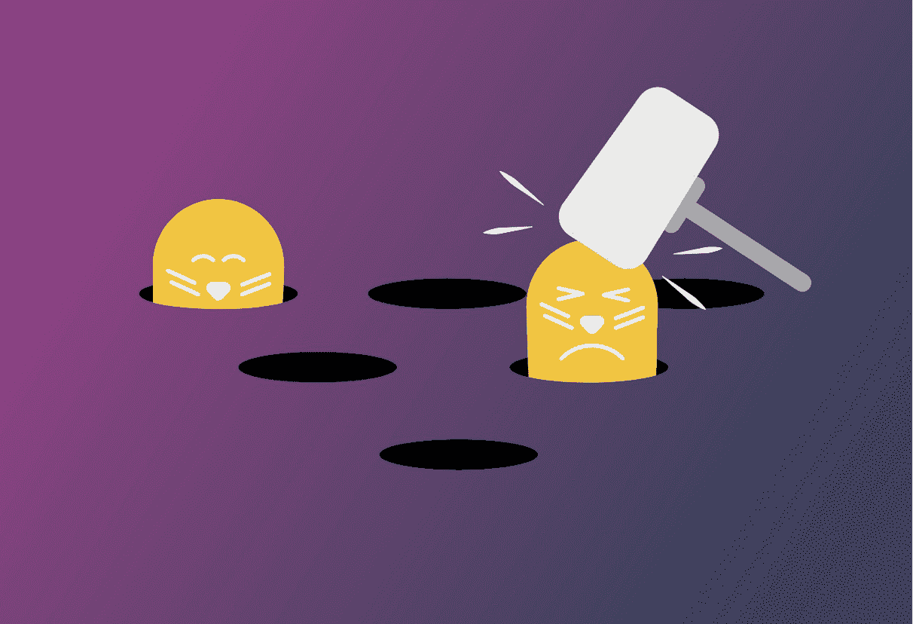
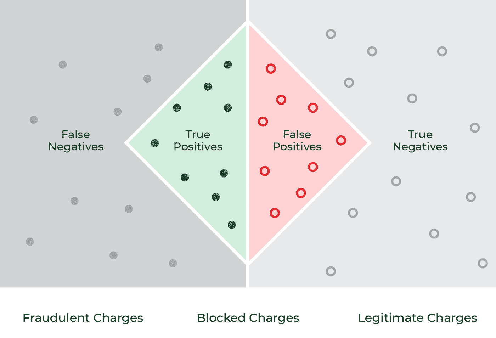

# 如何挫败欺诈者破坏您的欺诈模型

> 原文：<https://towardsdatascience.com/how-to-foil-the-fraudsters-messing-with-your-fraud-models-ac426481fd8b?source=collection_archive---------24----------------------->

作者图片

## *监控、减轻和预防欺诈的洗钱可观察性最佳实践*

每年，欺诈给全球经济带来超过 5 万亿美元的损失[。除了对个人受害者造成严重的个人损失之外，欺诈还会以收入和生产力损失以及声誉和客户关系受损的形式影响企业。人工智能从业者站在这场战斗的前线，构建和部署复杂的人工智能模型来检测欺诈行为，这些欺诈行为每年为](https://www.crowe.com/global/news/fraud-costs-the-global-economy-over-us$5-trillion)[组织节省了](https://venturebeat.com/2020/07/15/how-visa-harnessed-data-and-ai-to-prevent-25-billion-in-fraud/)数十亿美元。

当然，这是一项具有挑战性的任务。从金融服务到医疗保健、保险、技术和旅游，欺诈的形式和攻击媒介多种多样。事实上，在当今世界，随着数据泄露在大型企业中变得越来越常见，被盗的凭据在暗网上出售，黑客利用勒索软件攻击从关键基础设施到本地连锁医院的所有目标。

## 为什么在欺诈检测中使用 ML 监控和可观察性？

欺诈持续存在的部分原因是在现实世界中识别欺诈的复杂性。不断演变的滥用模式和不平衡的数据集很容易挫败僵化的基于规则的系统。由于这种脆弱性，企业和政府很久以前就在异常检测、欺诈预防和其他反滥用投资领域采用了 ML 技术。然而，在不受监控的情况下，欺诈者甚至能够在几周内使幼稚的 ML 模型失效。

随着犯罪分子继续[重新发明](https://www.wsj.com/articles/faces-are-the-next-target-for-fraudsters-11625662828) [对抗性](https://thenextweb.com/news/hackers-are-turning-our-ai-security-systems-against-us-but-they-can-be-stopped) [技术](https://ieeexplore.ieee.org/document/8449268)来利用生产中的模型，对异常情况的监控变得对业务和时间都很重要。通过检测基线和生产分布之间的偏差，并检查特征和群组表现，团队可以主动识别问题并重新训练模型，以最大限度地减少损失。

例如，一家信用卡公司在检查推断分布的差异时，可能会发现欺诈模型在生产中的假阳性远远多于验证基线，导致数百万次合法购买在销售点被拒绝，并使客户转而使用其他卡。或者，一个研究总体准确性下降的 ML 团队可能会发现，相对于在训练数据中占主导地位的大额购买，欺诈模型在预测小额交易方面不太好。不管是什么问题，监控可以帮助 ML 团队防止损失，维护来之不易的品牌忠诚度和市场份额。

监控和可观察性之所以重要，还有另一个原因:在金融和医疗保健等受到严格监管的行业，法律要求自动系统提出的任何索赔都要有 ML 模型的透明度。除了遵从性，组织还需要可解释性来反思和理解为什么一个模型做出了一个特定的预测，以确保更广泛的治理、公平和减少偏差。

## 欺诈特有的挑战

在深入研究解决生产中欺诈模型问题的最佳实践之前，了解处理欺诈数据的一些常见挑战以及可能出现的问题会有所帮助。

即使你觉得你已经很好地处理了数据本身，许多问题经常困扰着反滥用 ML 团队。以下是一些常见的挑战:

*   **不平衡的数据集。**一般来说，欺诈只占现实世界交易的一小部分。例如，在医疗保健行业，欺诈估计占总交易的 3%。由于在训练和验证阶段可获得的关于实际活动或感兴趣的观察(即医疗保健中的向上编码或伪造处方)的数据较少，如果没有适当的对策(如数据向上采样)，模型在现实世界中的表现可能会很差。
*   **误导传统评估指标。如果他们的模型达到 99%的准确率，人们可能会认为它表现得非常好。但是，如果您的模型发现不到 1%的欺诈交易，这种误导性的指标实际上可能会掩盖您的模型仍然(在最坏的情况下)遗漏每个可能的欺诈交易的事实。由于大多数最大似然算法都是为了最大化精度和减少误差而优化的，所以当类间样本平衡且相等时，它们往往工作得最好。欺诈很少(如果有的话)出现这种情况，例如，欺诈性信用卡交易可能占所有交易的 0.5%，但每月仍会超过 1 亿美元。**
*   **功能受限/敏感。**交易数据也可以被限制。在医疗保健或金融服务等行业，法规和合规性措施会导致敏感或个人身份信息(PII)从数据源中被篡改，以将用户从交易中抽象出来。例如，信用卡交易可能限于其最基本的细节(即交易 ID、日期/时间、终端、交易金额、位置等)。
*   并非所有的推论都同等重要。错误分类的欺诈交易(假阴性——对确实是欺诈的交易预测“不是欺诈”)通常比错误分类的合法交易(假阳性——对不是欺诈的交易预测欺诈)成本更高。在信用卡欺诈中，后者对客户来说是一种轻微的不便——他们通常可以通过短信确认信用卡收费是否合法——而前者是一种直接的经济损失。

作者图片(阿里泽·艾)

## 欺诈模型可观察性的最佳实践

一旦您设置了基准和监视器，手头的任务就变成了识别问题的根本原因，并随着威胁的实时发展而快速响应。虽然每个行业和组织的模型和指标都略有不同，但在确定哪些方面不如预期以及如何应对方面有一些共性。

**重要指标**

如上所述，在评估您的欺诈模型的性能时，准确性可能会产生误导。一些重要的观察指标包括:

*   [**回忆**](https://arize.com/glossary/recall/) 。您的模型检测到多少欺诈可能具有指导意义，提供了一个窗口来了解您的模型对现实世界威胁的影响。或者，您可以监控您的模型的假阴性率(召回的倒数)。
*   <https://arize.com/glossary/false-negative/>**假阴性率。假阴性率衡量模型未能准确预测的欺诈(归类为非欺诈)。这是一个关键的性能指标，因为就直接财务损失而言，它对组织来说是最昂贵的，会导致退款和其他被盗资金。T4 估计，金融服务行业每年因欺诈造成的损失高达 1.5 万亿美元。**
*   **[**假阳性率**](https://arize.com/glossary/false-positive/) 。假阳性率——或模型预测实际上并不欺诈的交易欺诈的比率——也很重要，因为给客户带来不便有其间接成本，无论是在医疗保健领域，患者的索赔被拒绝，还是在信用卡领域，客户延迟购买食品杂货。根据 Forrester 和 Adobe 的一项研究[,重视客户体验的企业创造的客户终身价值是其他公司的 1.6 倍。](https://www.adobe.com/content/dam/acom/en/experience-cloud/research/roi/pdfs/business-impact-of-cx.pdf)**

****性能下降****

**识别导致性能下降的切片(或特性和值的组合)至关重要。通过过滤各种低性能特征/价值片段来深入分析您的模型的性能，有助于发现欺诈模式、欺诈者来源和隐藏的模型漏洞。**

**回到之前的信用卡欺诈的例子，业绩突然下降背后的切片可能是小额欺诈费用的激增(**

**In each case, having an ML observability platform that not only monitors your performance metrics but also proactively surfaces feature performance heatmaps can be the difference between patching costly model exploits in hours versus several days.**

****漂移的重要性****

**作为一名 ML 从业者，随着时间的推移，你可能会遇到漂移或分布变化。监测和[排除漂移](https://arize.com/model-drift/)是每个从业者工具箱的重要组成部分(作为参考，这里有一个关于如何[排除模型漂移](https://arize.com/take-my-drift-away/)的深度探讨，由达美航空的艾华撰写)。**

**特别是在欺诈中，策略总是在不断变化，因此考虑偏差以确保您的模型保持相关性非常重要。识别各种模型环境和版本之间的特征、模型和实际偏差有助于识别欺诈模式、数据质量问题和异常分布行为。**

**为了具体说明这一点，让我们回到信用卡的例子，在这个例子中，一家公司发现当地零售商的小额欺诈交易突然激增。通过检测数据形状的变化(在这种情况下，是交易规模的变化)，从业者可以积极主动，在新策略造成大范围损失之前将其消灭。这在像身份盗窃这样的金融欺诈中尤其重要，因为受害者甚至可能在几个月后才意识到并报告这一活动。**

**继续以信用卡欺诈为例，下面是一些异常分布变化可能意味着什么的指南，具体取决于它们在哪里发生以及现实世界的场景:**

****救命！我们看到…****

****预测漂移****

***可能的漂移相关性:*欺诈预测的涌入和激增可能意味着您的模型受到攻击！你分类的欺诈比你预期在生产中看到的要多得多，但是(到目前为止)你的模型在捕捉这一点上做得很好。让我们希望它保持这种方式。**

***现实世界的场景:*一个健康服务提供商的[黑客攻击](https://www.healthcaredive.com/news/phishing-scam-at-presbyterian-exposes-183k-patients-data/561745/)导致身份盗窃和信用卡号在黑暗网络上出售的激增。幸运的是，犯罪分子在他们的利用中不够新颖，以避免被现有的欺诈模型抓住。**

****实际漂移(无预测漂移)****

***可能的漂移相关性:*欺诈实际值的大量涌入，而预测值的分布没有发生变化，这意味着欺诈者在你的模型中发现了漏洞，而且他们正在逍遥法外。尽快排除故障并修复您的模型，以避免任何更昂贵的退款。**

***真实世界场景:*一个全球犯罪团伙[利用](https://www.propublica.org/article/how-unemployment-insurance-fraud-exploded-during-the-pandemic)[的新战术](https://www.wsj.com/articles/bank-of-americas-california-partnership-long-flourishing-is-roiled-by-unemployment-fraud-11634722201)预付借记卡将失业欺诈推至历史新高，导致根据 COVID 之前或更传统的信用卡数据训练的欺诈模型性能下降。**

****特征漂移****

***可能的漂移相关性:*新的和/或现有特征值的涌入可能是季节变化(税收或假日季节)的指示，或者在最坏的情况下与欺诈利用相关；使用“随时间推移的漂移”堆叠在“随时间推移的性能指标”图表的顶部，验证是否存在任何相关性。**

***现实世界的情景:*一个比往常更早的假日购物季开始了，购票量比往年更多。这可能是创纪录的零售需求和不断变化的消费者行为的迹象，也可能是一种新型欺诈利用(或两者兼有)。**

## **结论**

**随着欺诈不断演变，甚至在当今时代以新的形式出现，损失的可能性很高，数据科学和 ML 团队制定一个可观察性战略来捕捉、监控和排查生产中的欺诈模型问题至关重要。通过采用一种既能被动监控关键指标又能主动测量偏差的方法，反滥用反洗钱团队可以提前发现潜在问题，腾出时间专注于最复杂的威胁。作为补充参考，这里的[是](https://docs.arize.com/arize/resources/use-cases/fraud)ML 可观察性平台如何帮助客户处理欺诈监控。**

# **联系我们**

**如果这个博客引起了你的注意，并且你渴望了解更多关于[机器学习可观察性](https://arize.com/platform-overview/)和[模型监控](https://arize.com/model-monitoring/)，请查看我们其他的[博客](https://arize.com/blog/)和 [ML 监控](https://arize.com/ml-monitoring/)上的资源！如果您有兴趣加入一个有趣的 rockstar 工程团队，帮助模型成功生产，请随时[联系](https://arize.com/contact/)我们，并在此处[找到我们的空缺职位](https://arize.com/careers/)！**