# 如何使用开源软件预测 Shopify 商店的采购订单

> 原文：<https://towardsdatascience.com/how-to-forecast-purchase-orders-for-shopify-stores-using-open-source-db82afec12fe?source=collection_archive---------36----------------------->

## *使用* [*MindsDB*](http://mindsdb.com/) *中的开源集成机器学习和开源数据集成平台*[*Airbyte*](https://airbyte.io)*预测 Shopify 店铺指标。*

作者图片

随着数据量呈指数级增长，对于专注于电子商务的企业来说，尽可能快速高效地利用这些数据至关重要。机器学习代表着一种颠覆，它可以提高预测能力，增强人类对价格、分类和供应链优化、库存管理、交付管理和客户支持等用例的决策能力。在这个“如何做”指南中，我们将提供一步步的说明，向您展示如何使用开源数据集成平台 [Airbyte](https://airbyte.io) 和运行在任何数据库之上的开源 AutoML 框架 [MindsDB](https://mindsdb.com) 简单而廉价地将机器学习集成到现有的 Shopify 帐户中。

我们的指南将由两部分组成:

1.  使用 Airbyte 提取您的 Shopify 数据并将其加载到数据库中。在我们的例子中，我们将使用开源的 DB PostgreSQL，但是它也可以是您选择的不同的数据库。
2.  使用 MindsDB 自动构建和训练用于预测采购订单的机器学习模型。

我们开始吧！

我们将假设您已经通过 Docker 设置了 Airbyte。如果没有，这里有一个链接，链接到一篇介绍如何做的文章。

# 步骤 1:用 Airbyte 将数据从 Shopify 复制到 PostgreSQL

## a.设置 Airbyte Shopify 连接器

Airbyte 的 Shopify 连接器将允许我们获取你的 Shopify 数据，并将其存储在数据库或数据仓库中。对于本文，我们将把通过 Shopify 连接器获得的数据存储到 PostgreSQL 数据库中。

Airbyte Shopify connector 能够将放弃的结账、收藏、自定义收藏、客户、元字段、订单、产品和交易同步到您选择的目的地。

让我们从启动 Airbyte web 应用程序开始。首先，进入您克隆 Airbyte 库的目录，然后在您的 terminal:‍中运行以下代码

> docker-排版

然后，在浏览器中访问 [http://localhost:8000](http://localhost:8000) 以查看 Airbyte 仪表盘。

在**源**部分，点击仪表板右上角的 **+新源**按钮，添加一个新源。

在新屏幕中，输入信号源的名称——我们称之为**shopify——source，**,但你可以随意命名。然后，在**源类型**下拉列表中，选择 **Shopify。**

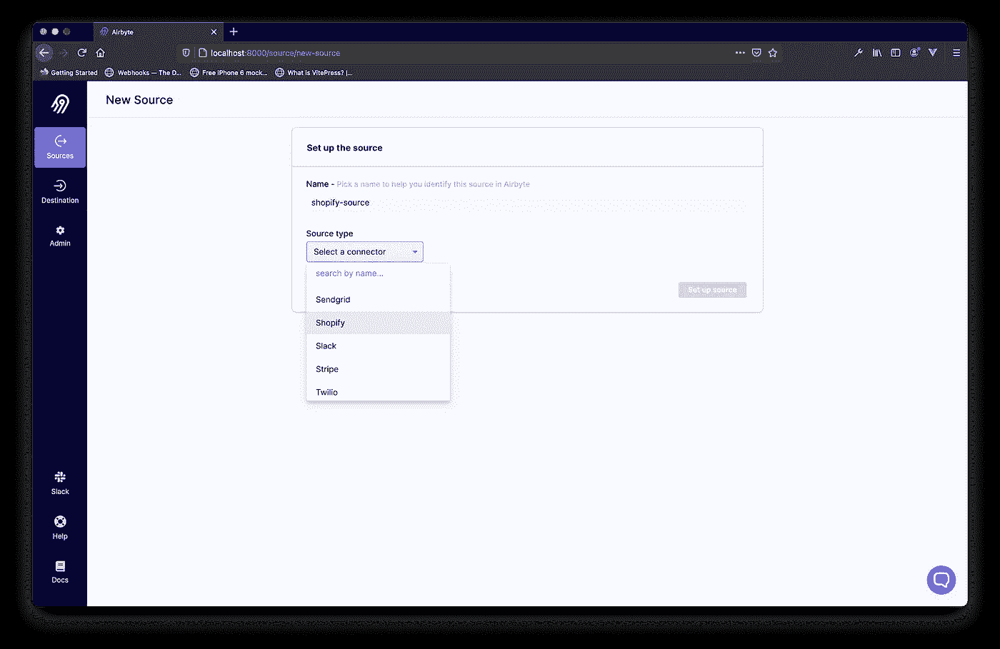

作者图片

选择 **Shopify** 连接器会提示 Airbyte 加载 Airbyte Shopify 连接器需要的配置参数。如果是第一次选择 Shopify 连接器，这可能需要一段时间。Airbyte 将在幕后从 Docker Hub 中提取 Shopify 连接器图像。

当它完成提取图像时，您将看到以下内容:

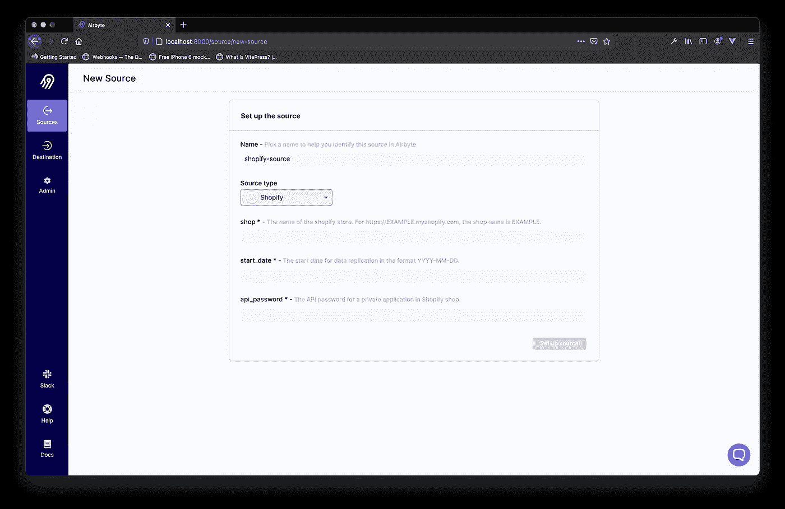

作者图片

让我们来看看 Shopify 连接器需要的参数:

*   **商店**:这将是您想要从中复制数据的 Shopify 上的商店名称。因此，如果你的店铺的网址是[https://airbyte.myshopify.com](https://airbyte.myshopify.com)，你的店铺名称将是 **airbyte** 。
*   **start_date** :这将是您希望 Airbyte 开始复制的日期，格式为 YYYY-MM-DD。
*   **api_password** :这将是你在 Shopify 仪表盘上创建的私人应用的密码。

商店名称和**开始日期**可以很容易地填写，但 api_password 要求你在 Shopify 上创建一个新的私人应用程序，以防你还没有。让我们在 Shopify 上创建一个私人应用程序，并获取设置 Airbyte Shopify 连接器所需的密码。

## b.创建 Shopify 私人应用程序

要创建一个 Shopify 私人应用程序，请登录您的 Shopify 仪表盘，点击侧边栏菜单中的**应用程序**。

作者图片

然后，点击页面底部的**管理私人应用**链接。如果您之前没有启用私人应用程序，您将看到一个屏幕来启用它。点击**启用私人应用开发**按钮。

作者图片

您将被带到一个屏幕，接受 Shopify 关于私人应用程序开发使用的条款。如果您同意，请勾选复选框，然后再次点击**启用私人应用程序开发**。

启用私人应用程序开发后，您将被重定向到一个屏幕，在此您可以创建私人应用程序。

点击**创建私人应用**按钮开始。

在 **App 详情**部分，填写私人 App 名称和紧急开发者邮箱。

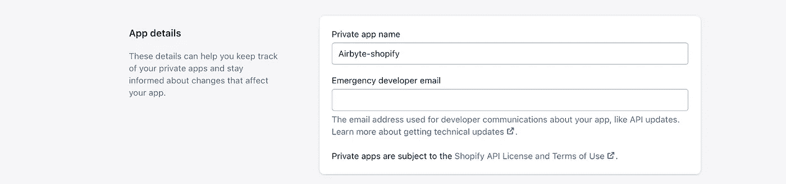

作者图片

转到管理 API 部分，并执行以下操作:

*   点击**显示非活动管理 API 权限**下拉菜单，并在列表中找到**订单 API** 。然后，从选择框中授予**读取权限**。
*   找到 **Shopify 支付争议**和 **Shopify 支付支出，**并批准这些支出。
*   最后，点击**保存**按钮保存您的新私人应用。

您将看到一个确认模式，只需点击**创建应用**按钮，确认创建私人应用。就是这样！现在我们只需要获取私有 app API 密码。

在同一页面上，向下滚动到**管理 API** 部分，复制您的私有应用 API 密码。

然后，转到 Airbyte web UI 仪表板，提供带有您刚才复制的密码的 Shopify 连接器配置表单。

在你停止设置 Shopify 的 Airbyte UI 中，粘贴你从 Shopify 复制的密码，然后点击**设置源**。

## c.设置目的地

一旦您成功设置了源，Airbyte 将导航到目的屏幕。点击右上角的**添加目的地**按钮。在下拉列表中，点击 **+添加新目的地。**

Airbyte 将验证源，然后显示一个表单来输入目的地名称和类型。输入 **shopify-destination** 作为名称，选择 **Postgres** 作为目的地类型。为了设置我们的 Postgres 目的地，我们将通过 Docker 旋转一个 Postgres 容器。因此，在您的终端中运行以下命令:

> docker run-RM-name shopify-d b-e POSTGRES _ PASSWORD = PASSWORD-v $ HOME/docker/volumes/POSTGRES:/var/lib/PostgreSQL/data-p 2000:5432-d POSTGRES

请注意，上面代码片段中的**-v $ HOME/Docker/volumes/Postgres:/var/lib/PostgreSQL/data**位对于持久存储数据非常重要，因为默认情况下，Postgres Docker 容器中的数据是短暂的，当容器被销毁时会丢失。您可以在本地机器上创建目录(因为我们假设它不存在)。在剥离 Docker 容器的命令之前，运行以下命令来创建它:

> mkdir-p $ HOME/docker/volumes/postgres

验证容器正在运行。然后在 Airbyte 仪表板中填写登录凭证。

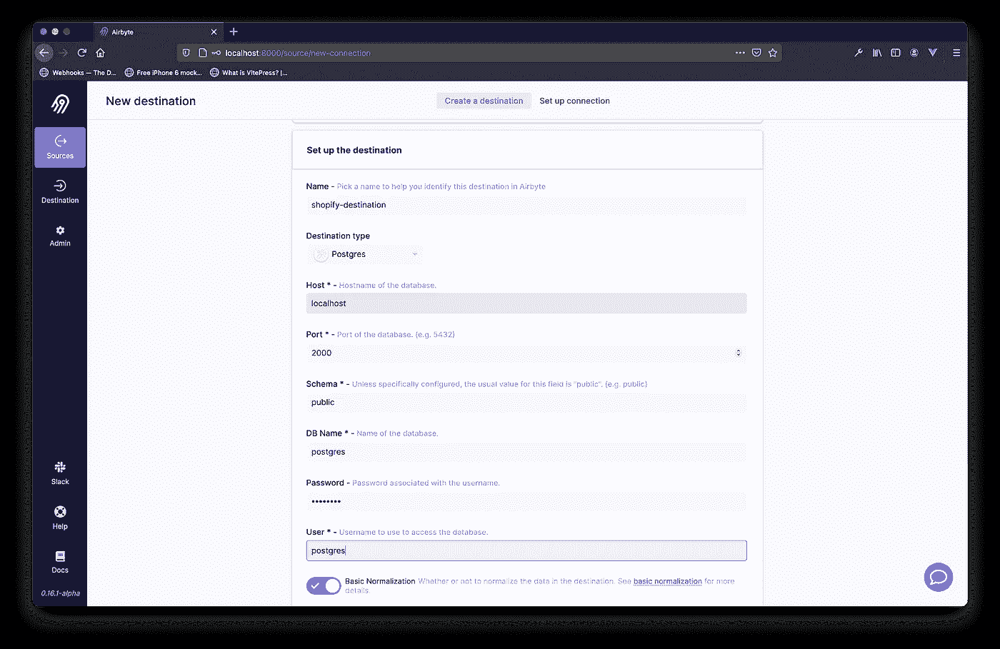

作者图片

在 Airbyte 成功设置目标之后，您将看到要复制到目标上的数据的模式，以及指定与源同步频率的下拉列表。在本教程中，我们选择了手动，因为我们想直接控制同步发生的时间**。**

然后点击**设置连接**按钮。

Airbyte 会将您导航到目标页面，您可以点击 **Launch** 按钮开始复制。要监控同步，您可以单击目的地名称来查看同步过程和状态。

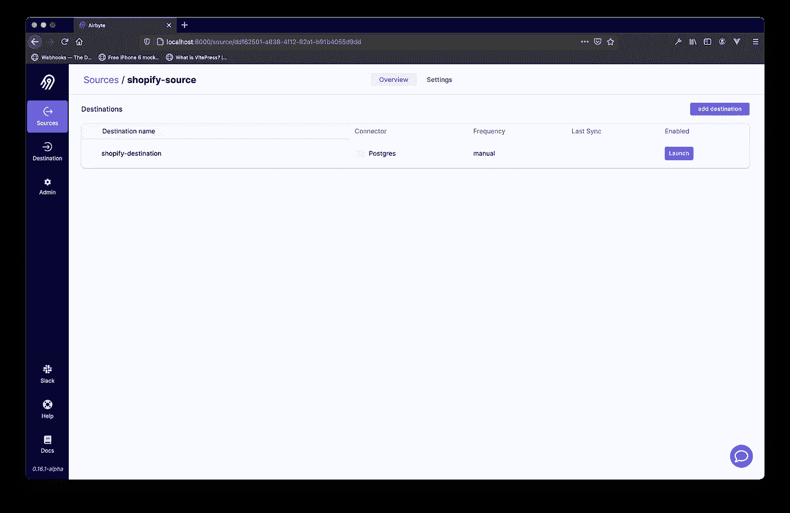

作者图片

一旦 Airbyte 将数据复制到 Postgres 数据库，同步的状态将变为**成功**。要确认同步成功，您可以运行以下命令:

> docker exec shopify-source psql-U postgres-c " SELECT COUNT(*)FROM public . transactions；"‍

上面应该返回**事务**表上所有记录的计数。

# 步骤 2:使用 MindsDB 预测采购订单

下一步是对我们导入数据库的商店数据进行预测分析。在此之前，我们需要首先安装 MindsDB。有几种安装方法，如[文档](https://docs.mindsdb.com/)中所述。我们的建议是始终使用 [Docker](https://docs.mindsdb.com/installation/docker/) ，因为它封装了运行 MindsDB 的所有依赖项。要下载最新的生产映像，请运行以下命令:

> 码头工人拉动 mindsdb/mindsdb

或者，如果您的机器上预装了 Python，您可以使用 **pip** 来安装最新的 MindsDB 版本。为此，创建一个新的虚拟环境并运行:

> pip 安装 mindsdb

然后，启动服务器运行:

> docker run-p 47334:47334 minds db/minds db

或者，如果您已经安装了 **pip** run:

> python3 -m mindsdb‍

最后，MindsDB Studio 应该会在您的默认浏览器上自动启动[http://127 . 0 . 0 . 1:47334/](http://127.0.0.1:47334/)。

## a.连接 MindsDB 和 PostgreSQL

有三种方法可以使用 MindsDB。第一种是通过名为 MindsDB Studio 的图形用户界面。第二种方法是使用 REST APIs。为了简化集成，您可以使用我们的 Python 或 JavaScript SDKs。第三种方法是通过执行 SQL 语句在数据库内部直接完成。

在本教程中，我们将通过 MindsDB Studio 解释一切，以便您可以直观地跟随。我们还将共享 SQL 查询，以防您想直接在数据库内部进行测试。

要从左侧导航菜单连接 MindsDB 和 PostgreSQL，请转到 integrations 并单击**添加数据库**按钮**。**在这里，您需要填写连接到 PostgreSQL 数据库的所有参数。

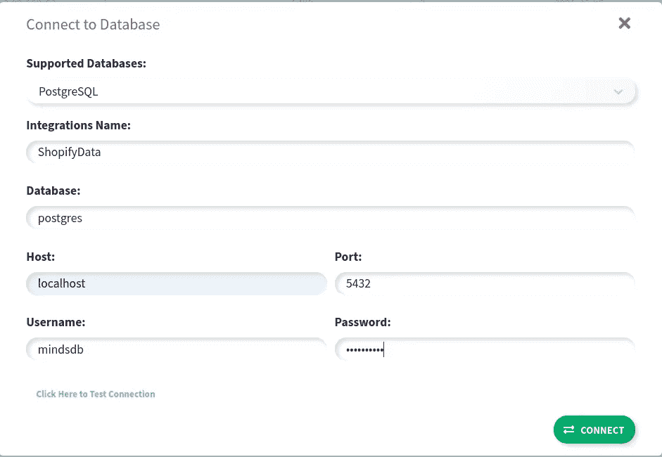

作者图片

连接到 PostgreSQL 所需的参数是:

*   **支持的数据库:从下拉列表中选择 PostgreSQL。**
*   **集成名称**:姑且称之为 ShopifyData。
*   **数据库**:保存 shopify 数据的数据库名称。
*   **主机:PostgreSQL 主机名或 IP 地址。**
*   **端口**:PostgreSQL 端口(默认为 5432)。
*   **用户名**:有权访问数据库的用户。
*   **密码**:上述用户的密码。

填写表格后，点击**连接**。您现在已经成功连接到 PostgreSQL。下一步是从您希望用于模型训练的数据中创建一个数据源。

## b.订单数据

让我们来概括一下这些数据。在我们将数据导入 PostgreSQL 之后，Airbyte 在公共模式中创建了不同的表。如果您列出这些表，您将会注意到，在导入数据之前，Airbyte 已经创建了用于**订单**、**订单 _ 退款、产品、交易、已放弃 _ 结账、**和其他一些表。

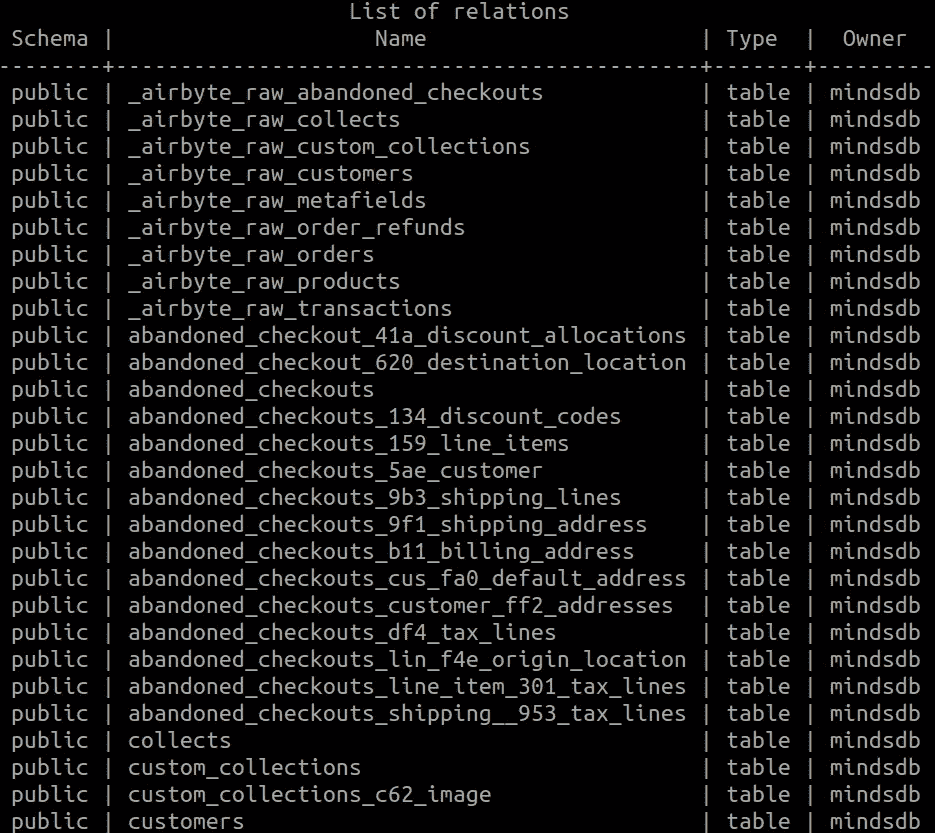

作者图片

预测未来订单数量的重要数据在**订单**表中。让我们 ***从命令中选择*吧；*** 这样我们就可以看到订单列表。表格中有 30 多列，但我们将只关注:

*   **processed_at:订单处理的时间。**
*   供应商:例如，如果你卖鞋，供应商可能是耐克、阿迪达斯、万斯、匡威等。
*   **财务 _ 状态**:我们将**只选择**等待**或已经**支付**的订单。**

除了 Shopify 数据，您还可以使用许多其他选项来进行预测分析。为了保持展示简单，我们将重点关注上述 3 个参数，并训练一个模型来估计商店在下一阶段将收到的订单数量。

转到数据库集成仪表板，点击**新建数据集**。在弹出窗口中，您将能够选择数据来训练模型:。

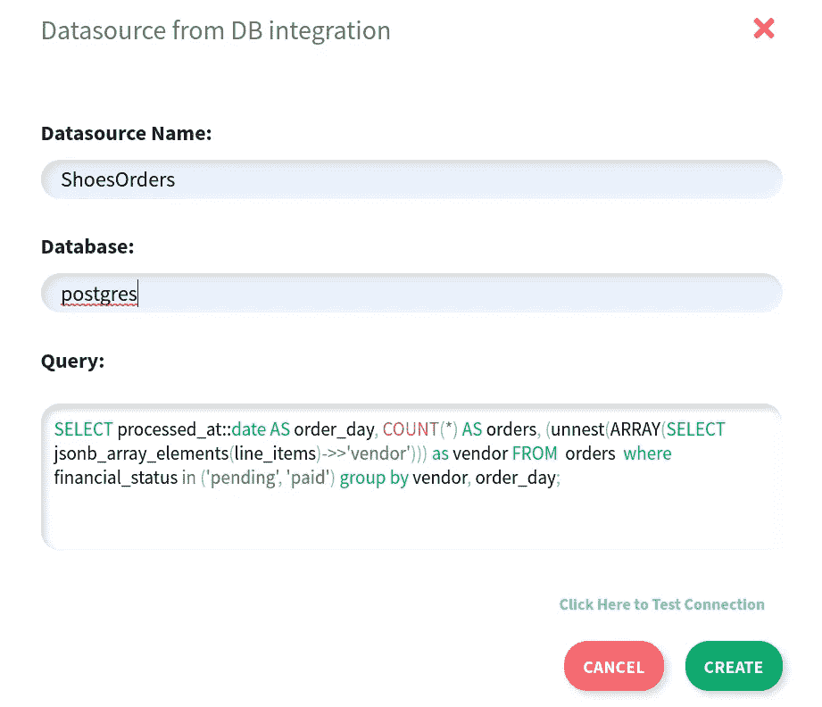

作者图片

让我们概述一下我们的**选择**查询:

> SELECT processed _ at::date AS order _ day，COUNT(*) AS orders，(unnest(ARRAY(SELECT jsonb _ ARRAY _ elements(line _ items)-> > ' vendor '))FROM orders WHERE financial _ status IN(' pending '，' payed ')GROUP BY vendor，order _ day；

该查询将选择处理订单的时间，并将其转换为 YY:MM:DD 格式(不包括当天的时间，因为我们将按每天的频率进行预测)。然后，从包含 JSON 格式的产品信息的 line_items 列中选择供应商。

最后，合计每个供应商每天的订单数量。

点击 **CREATE** ，MindsDB 将创建一个名为 ShopifyOrders 的新数据源。

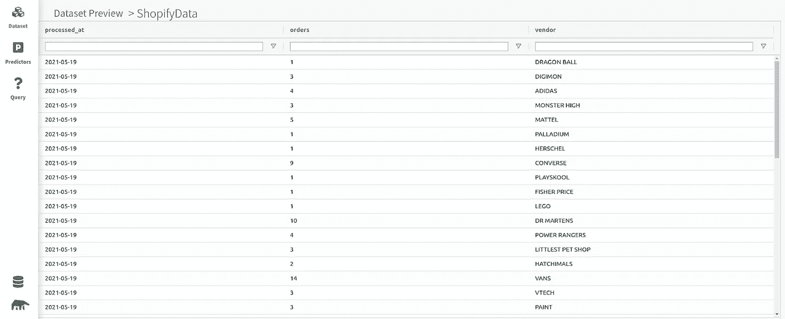

作者图片

如果预览数据，您将看到按供应商分组的每日订单数。上面的例子显示了**鞋子**和**玩具**商店的订单。它将过去 5 年不同供应商的每日订单分组，如耐克、VANS、阿迪达斯、乐高、美泰等。

我们现在有连接到 MindsDB 的数据。接下来的步骤是:

1.  执行数据分析
2.  训练一个 ML 模型
3.  通过查询模型来预测未来订单的数量

## c.数据分析

在**数据集**仪表板中，点击**质量**按钮，以便 MindsDB 可以开始其自动化数据分析程序。在后台，它将迭代每个数据记录，如果数据中有潜在的偏差或异常值，将显示警告。如果您单击某些列，它将显示特定列的附加信息，如数据类型、是否有任何缺失值、不同值的数量，如果有潜在偏差，它将显示更多信息。

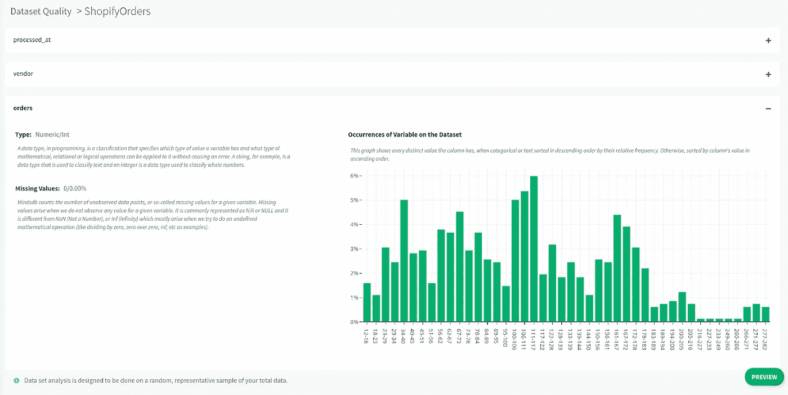

作者图片

通过执行数据分析，您将获得有关数据的更多信息，并决定是否信任 MindsDB 显示的警告以对其采取行动(请记住，好的数据集对于好的 ML 模型至关重要)，或者您可以忽略它们并继续进行模型训练。

## d.模特培训

要训练新模型，点击左侧导航栏中的**预测器**选项卡，然后点击**训练新模型**按钮**。**在 pup 表单中，您需要输入所有必需的信息，以便 MindsDB 可以开始训练时间序列预测模型:

*   **FROM:** 从中选择数据的数据源。在这个例子中，ShopifyOrders。
*   **预测器名称:**新模型的名称，例如 shopify_orders。
*   **只选择要预测的列:**我们要预测的目标变量。在本例中，订单数量被计算。
*   **选择要为训练移除的列:**我们要从模型训练中排除的列。您可以将此字段留空，因为我们训练的模型只有 3 列。
*   **样本误差范围:**计算[0.0–1.0]范围内的误差范围。将其留空，因此将使用默认值 0.01。
*   **停止训练后:**用于测试目的，加速模型训练。除非您有时间限制，否则请留空。
*   **使用 GPU:** 在 GPU 或 CPU 上训练模型。如果您有 GPU，请选择此复选框以获得训练和查询阶段的加速。
*   这是一个时间序列预测问题吗？:在复选框中选择是。
*   **Order by:** 数据排序所基于的列。选择已处理 _at。
*   **分组依据:**对数据中的实体进行分组所依据的列。我们将按供应商分组，有效地分析每一个不同的玩具和鞋子供应商，以产生准确的预测。根据维度数据的分组方式，这可能会产生从几个到几百个(或者更多！)MindsDB 预测器将学习预测的时间序列。
*   **未来预测数:**使用默认值 1。这意味着我们的模型将被训练来预测第二天应该到来的订单量。
*   **使用先前目标:**使用目标列的先前值作为模型的时序特定部分的附加信息。保持选中状态。
*   **回顾窗口:**进行预测时要回顾的行数。将其设置为 10，以便在预测时考虑最近 10 天的订单量。

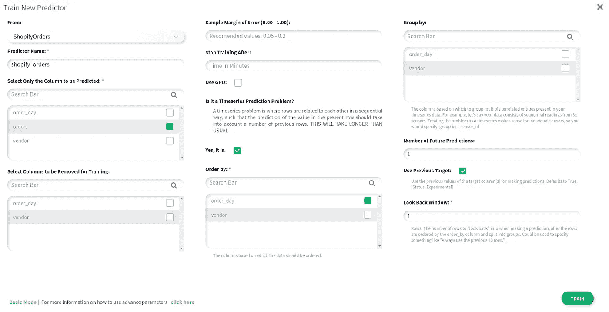

作者图片

要开始培训，点击**培训。**

或者，您可以通过运行以下查询，直接在数据库中自动训练模型:

> 将值(' shopify_orders '，' orders '，' SELECT processed _ at::date AS order _ day，COUNT(*) AS orders，(unnest(ARRAY(SELECT jsonb _ ARRAY _ elements(line _ items)-> > " vendor)))作为订单的供应商，其中 financial_status in ("pending "，" payed ")group by vendor，order _ day；');

要获得更多关于插入查询的信息，请访问 [MindsDBs PostgreSQL docs](https://docs.mindsdb.com/model/postgresql/#train-new-model) 。

MindsDB 将立即启动自动化机器学习管道，推断每一列的数据类型，为每一列实例化一个编码器，以获得数据的信息性中间表示，然后使用它来训练一个基于递归神经网络和梯度助推器混合的预测模型。最后，它将执行模型分析，以提供关于您可以预期预测有多好的见解。

当该程序完成时，状态将变为**完成**。接下来，单击预览按钮。模型预览面板提供了与已训练模型相关的细节。第一部分展示了模型的准确性以及 MindsDB 如何进行数据集分割。

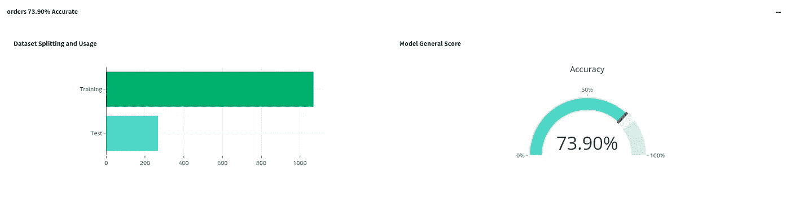

作者图片

您可以看到，shopify_orders 模型的预测准确率约为 74%，这意味着在 74%的情况下，订单的真实数量落在保留验证数据集的预测范围内。

下一节显示了列的重要性，MindsDB 从 0 到 10 对这些列进行评级，0 表示最不重要，10 表示最重要，以便做出正确的预测。给定我们使用的设置，我们的时间序列预测器需要所有三列来训练，因此这部分分析不适用于该预测器。

最后一部分显示了一个混淆矩阵，如果您将鼠标悬停在该矩阵上，您将看到模型正确预测订单数量的时间百分比，或者模型错误分类订单数量的时间百分比。一个完美的预测者会显示一条又细又直的对角线。在这种情况下，对角线仍然是结构良好的，这加强了报告的 74%的准确性。

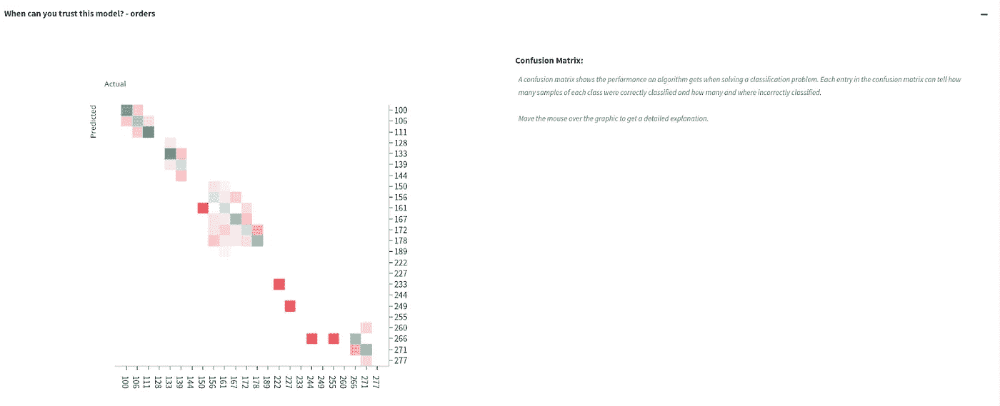

作者图片

## e.预测订单数量

模型训练成功。怎么用它来预测订单数量呢？从左侧导航选项卡中点击**查询**选项，然后点击**新建查询**按钮**。**

假设我们要预测" ***商店下周五将获得多少个逆向订单？*** 。”

在下拉列表中，选择供应商(例如 Converse)和日期(例如 2021 年 6 月 18 日),我们希望预测该日期的订单数量。

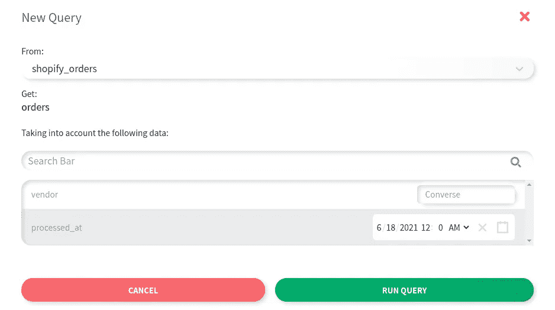

作者图片

然后，点击**运行查询**，不到一秒钟 MindsDB 就会返回预测值。

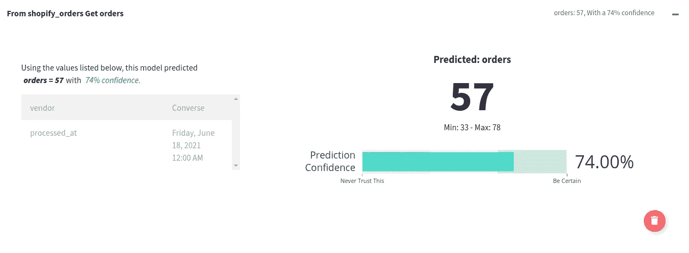

作者图片

如果您想直接从数据库运行中获得预测:

> SELECT orders AS predicted，orders_confidence AS confidence，orders _ explain AS info FROM mindsdb . shopify _ orders where " vendor " = ' Converse ' AND " order _ day " = ' 2021–06–18 '；‍

在这个例子中，对于 2002 年 6 月 18 日星期五的 Converse 产品，MindsDB 认为商店将获得大约 57 个订单，最小订单为 32 个，最大订单为 78 个。此外，MindsDB 有 74%的把握这将是正确的订单数量。用户可以以修改置信度为代价进一步调整预测区域的宽度:一对更紧密的边界意味着预测的置信度更低，反之亦然。

另一件要注意的事情是，当您提供更多的历史背景时，查询会更准确。

# 包扎

我们已经展示了使用 Airbyte 在数据库中提取和加载数据是多么容易，然后利用 MindsDB 执行预测分析以推动更好的基于业务的决策。如需更多信息和示例，请查看关于 [Airbyte](https://docs.airbyte.io/) 、 [MindsDB](https://docs.mindsdb.com/) 的文档，并在[http://cloud.mindsdb.com 注册一个免费的 MindsDB 云帐户。](http://cloud.mindsdb.com/)

*最初发布于*[*https://airbyte . io*](https://airbyte.io/recipes/implement-machine-learning-for-your-shopify-store-with-mindsdb)*。*