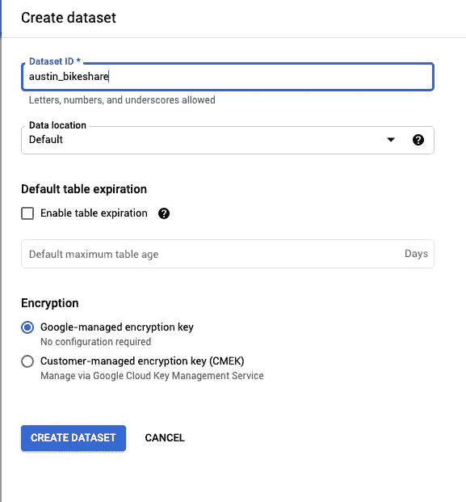
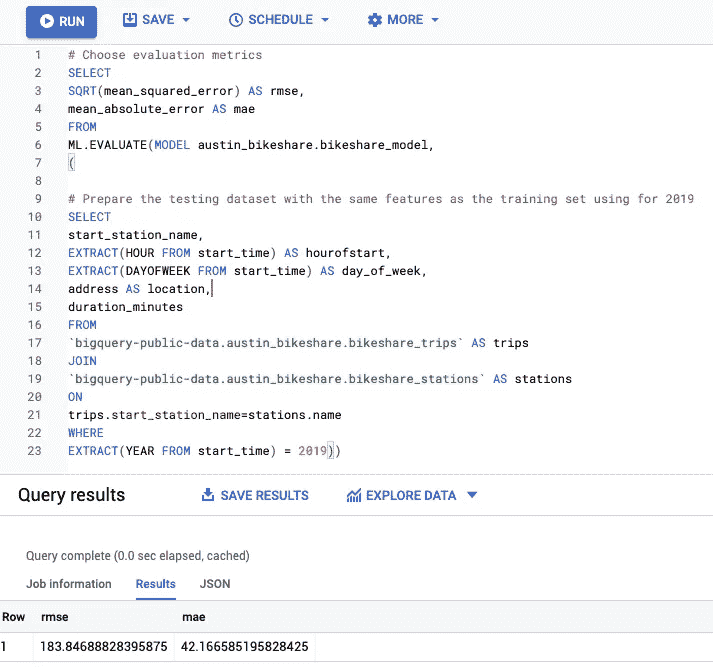
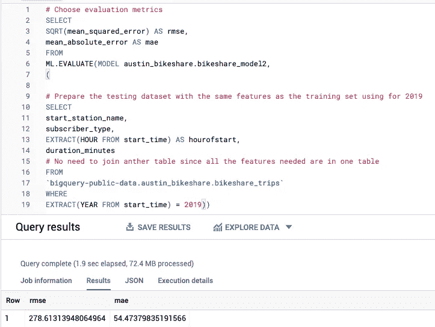
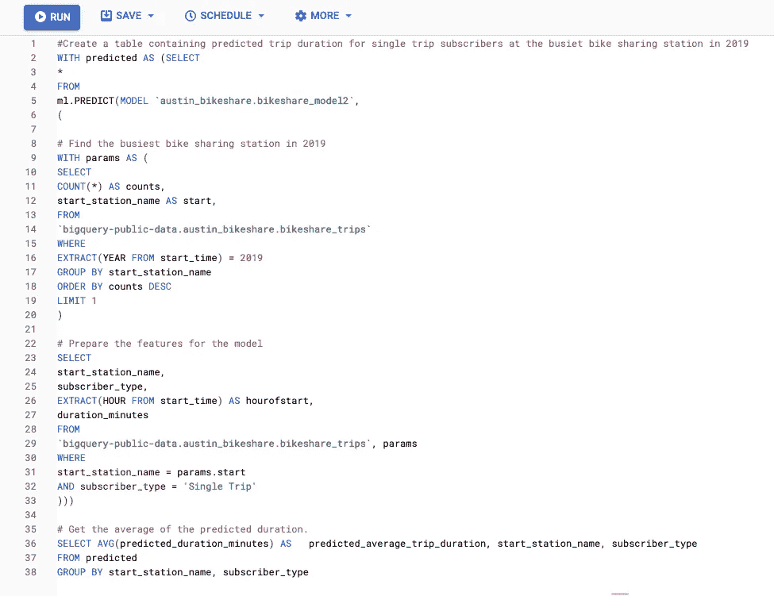
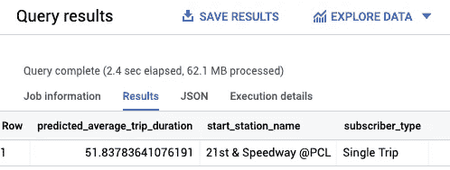
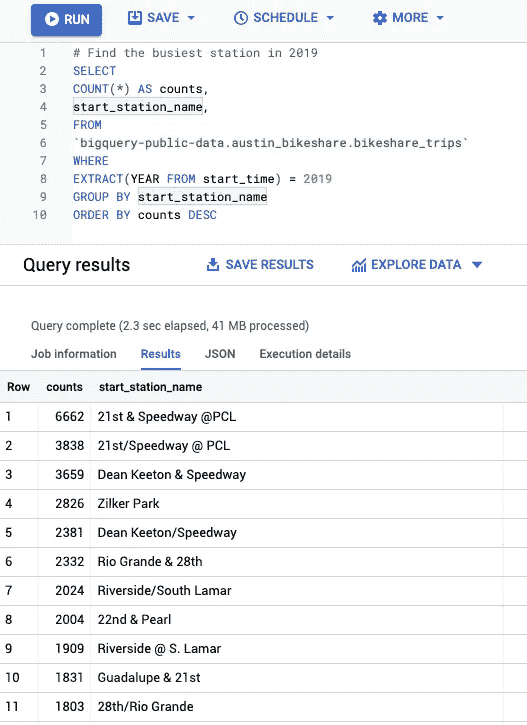
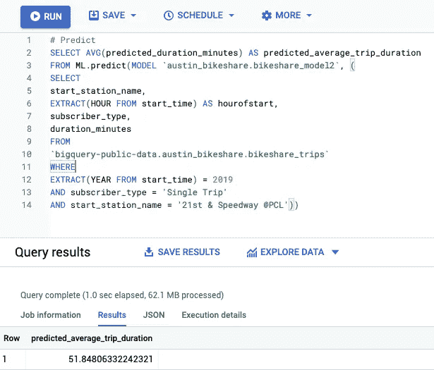

# 如何使用 BigQuery ML 预测旅行持续时间

> 原文：<https://towardsdatascience.com/how-to-forecast-trip-duration-using-bigquery-ml-ef2bf4a52a47?source=collection_archive---------18----------------------->

## 谷歌云平台

## 使用 GCP 进行 ML 回归项目


照片由[卢西恩·阿利克夏](https://unsplash.com/photos/3ZzOF5qqiEA)从 [Unsplash](https://unsplash.com/) 拍摄

本教程将通过 Google Cloud 中的挑战实验室 Qwiklab: [用 BigQuery ML: Challenge Lab](https://google.qwiklabs.com/focuses/14294?parent=catalog) 创建 ML 模型。

我们将使用谷歌云公共数据集上共享的真实数据集: [austin_bikeshare](https://console.cloud.google.com/bigquery?p=bigquery-public-data&d=austin_bikeshare&page=dataset) 来帮助公共自行车共享系统选择新的自行车型号。本实验旨在预测不同自行车方案的平均出行持续时间。使用所选特征的不同假设提供了两种方案。你会比较哪一个性能更好。

# 第一步:创建一个数据集来存储你的机器学习模型

使用分配的凭证登录 Google Cloud Platform 后，打开 BigQuery 并在您的项目中创建一个数据集。



在 BigQuery 中创建数据集(图片由作者提供)

# 步骤 2:创建预测 BigQuery 机器学习模型

我们将在第一个模型中纳入起始站名称、旅行开始的时间、旅行的工作日和起始站的地址，并仅使用 2018 年的数据来训练第一个模型。

模型 1 培训:

```
# Create a Linear regression modelCREATE or REPLACE MODEL austin_bikeshare.bikeshare_modelOPTIONS(model_type='linear_reg', labels=['duration_minutes']) AS# Data preprocessing and feature selectionSELECTstart_station_name,EXTRACT(HOUR FROM start_time) AS hourofstart,EXTRACT(DAYOFWEEK FROM start_time) AS day_of_week,address AS location,duration_minutesFROM`bigquery-public-data.austin_bikeshare.bikeshare_trips` AS trips# Join to get the address of the start stationJOIN`bigquery-public-data.austin_bikeshare.bikeshare_stations` AS stationsONtrips.start_station_name=stations.nameWHEREEXTRACT(YEAR FROM start_time) = 2018AND duration_minutes > 0
```

# 第三步:创建第二个机器学习模型

第二种型号的功能相对简单。我们将在第二个模型中纳入起始站名称、旅行开始的时间和自行车共享订户类型，并仅使用 2018 年的数据来训练该模型。

模式 2 培训:

```
# Create a Linear regression modelCREATE or REPLACE MODEL austin_bikeshare.bikeshare_model2OPTIONS(model_type='linear_reg', labels=['duration_minutes']) AS# Data preprocessing and feature selectionSELECTstart_station_name,subscriber_type,EXTRACT(HOUR FROM start_time) AS hourofstart,duration_minutesFROM`bigquery-public-data.austin_bikeshare.bikeshare_trips`WHEREEXTRACT(YEAR FROM start_time) = 2018AND duration_minutes > 0
```

# 步骤 4:评估两个机器学习模型

平均绝对误差和均方根误差都用于评估。

模型 1 评估:

```
# Choose evaluation metricsSELECTSQRT(mean_squared_error) AS rmse,mean_absolute_error AS maeFROMML.EVALUATE(MODEL austin_bikeshare.bikeshare_model,(# Prepare the testing dataset with the same features as the training set using for 2019SELECTstart_station_name,EXTRACT(HOUR FROM start_time) AS hourofstart,EXTRACT(DAYOFWEEK FROM start_time) AS day_of_week,address AS location,duration_minutesFROM`bigquery-public-data.austin_bikeshare.bikeshare_trips` AS tripsJOIN`bigquery-public-data.austin_bikeshare.bikeshare_stations` AS stationsONtrips.start_station_name=stations.nameWHEREEXTRACT(YEAR FROM start_time) = 2019))
```



对第一个模型的评估(图片由作者提供)

模型 2 评估:

```
# Choose evaluation metricsSELECTSQRT(mean_squared_error) AS rmse,mean_absolute_error AS maeFROMML.EVALUATE(MODEL austin_bikeshare.bikeshare_model2,(# Prepare the testing dataset with the same features as the training set using for 2019SELECTstart_station_name,subscriber_type,EXTRACT(HOUR FROM start_time) AS hourofstart,duration_minutes# No need to join anther table since all the features needed are in one tableFROM`bigquery-public-data.austin_bikeshare.bikeshare_trips`WHEREEXTRACT(YEAR FROM start_time) = 2019))
```



对第二个模型的评估(图片由作者提供)

通过比较，我们可以发现第一种模型更准确。

# 第五步:使用第二个模型预测平均出行持续时间

我们将使用第二个模型来预测 2019 年从最繁忙的自行车共享站出发的平均行程长度，其中订户类型为`Single Trip`。

```
#Create a table containing predicted trip duration for single trip subscribers at the busiet bike sharing station in 2019WITH predicted AS (SELECT*FROMml.PREDICT(MODEL `austin_bikeshare.bikeshare_model2`,(# Find the busiest bike sharing station in 2019WITH params AS (SELECTCOUNT(*) AS counts,start_station_name AS start,FROM`bigquery-public-data.austin_bikeshare.bikeshare_trips`WHEREEXTRACT(YEAR FROM start_time) = 2019GROUP BY start_station_nameORDER BY counts DESCLIMIT 1)# Prepare the features for the modelSELECTstart_station_name,subscriber_type,EXTRACT(HOUR FROM start_time) AS hourofstart,duration_minutesFROM`bigquery-public-data.austin_bikeshare.bikeshare_trips`, paramsWHEREstart_station_name = params.startAND subscriber_type = 'Single Trip')))# Get the average of the predicted duration.SELECT AVG(predicted_duration_minutes) AS   predicted_average_trip_duration, start_station_name, subscriber_typeFROM predictedGROUP BY start_station_name, subscriber_type
```



预测脚本(图片由作者提供)



预计平均出行时长(图片由作者提供)

如果上面的脚本没有通过评分系统，您可以将它分成两部分:一部分查找最繁忙的自行车共享站，另一部分使用站名进行预测，如下所示:

```
# Find the busiest station
SELECTCOUNT(*) AS counts,start_station_name,FROM`bigquery-public-data.austin_bikeshare.bikeshare_trips`WHEREEXTRACT(YEAR FROM start_time) = 2019GROUP BY start_station_nameORDER BY counts DESC
```



```
# Predict
SELECT AVG(predicted_duration_minutes) AS predicted_average_trip_durationFROM ML.predict(MODEL `austin_bikeshare.bikeshare_model2`, (SELECTstart_station_name,EXTRACT(HOUR FROM start_time) AS hourofstart,subscriber_type,duration_minutesFROM`bigquery-public-data.austin_bikeshare.bikeshare_trips`WHEREEXTRACT(YEAR FROM start_time) = 2019AND subscriber_type = 'Single Trip'AND start_station_name = '21st & Speedway @PCL'))
```



# 祝贺！

如果您完成了之前的实验，您将通过挑战实验室，并获得来自 Google Cloud 的[Create ML Models with big query ML](https://google.qwiklabs.com/public_profiles/efe0355d-a961-4241-8b44-dae4c9b919fa/badges/1143996)徽章，这些实验有一步一步的说明。

我希望你喜欢这次旅行。欢迎在 [Linkedin](https://www.linkedin.com/in/fangyiyu/) 上发表评论和我联系。