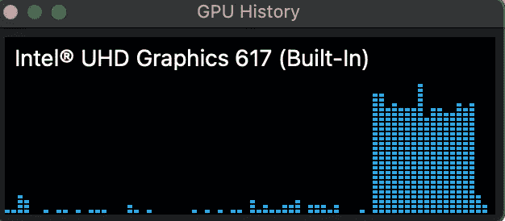
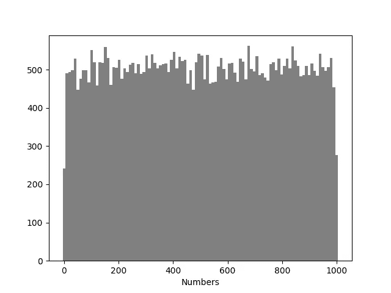
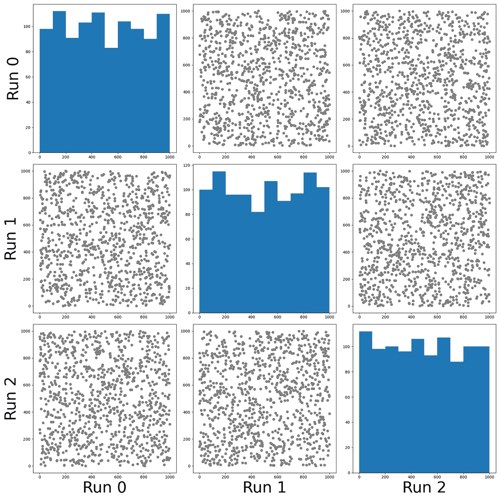

# 如何在 GPU 上生成随机数向量

> 原文：<https://towardsdatascience.com/how-to-generate-a-vector-of-random-numbers-on-a-gpu-a37230f887a6?source=collection_archive---------29----------------------->


蒂莫西·戴克斯在 [Unsplash](https://unsplash.com?utm_source=medium&utm_medium=referral) 拍摄的照片

## 解决老问题的现代硬件

随机数是数据科学家生活中必不可少的一部分。例如，如果你需要初始化神经网络的矩阵，使用零模型执行数据分析，或者甚至在运行[蒙特卡罗模拟](https://en.wikipedia.org/wiki/Monte_Carlo_method)时，你必须生成它们。

想象一下，你必须生成**许多独立的随机数序列**，比方说，一组[蒙特卡罗马尔可夫链](https://en.wikipedia.org/wiki/Markov_chain_Monte_Carlo) (MCMC)。在这类问题中，给定一个起点和一个规则来产生状态 *n+1* 给定状态 *n* 就有可能对给定分布的许多状态进行采样。也可以使用 MCMC 来执行**自然语言处理**【1】。

在多个独立对象上执行相同任务的理想硬件是图形处理单元。事实上，GPU 可以被编程为运行多个独立的**线程**，这些线程同时执行相同的操作。

在这里，我将描述一个简单的例子，如何使用苹果金属框架生成随机数序列，以在快速 **GPU 硬件**上运行操作。

# 随机数的向量

这里的思路是生成一个**独立** **随机**数字**均匀** **分布**的向量。举例来说，每个数字可以代表马尔可夫链末端的一个状态。

该代码由三部分组成:

*   准备好初始状态(种子)的向量
*   **这个向量被传递给 GPU 和**每个线程运行**一个链并输出一个单一的数字(状态)**
*   **状态从 GPU**复制**到 CPU，然后再复制到**磁盘**上的文件中，以便稍后进行分析。**

# **在 GPU 上运行**

**我选择利用 Apple Metal Framework 来执行上述操作，并在 GPU 上执行操作。整个代码可以很容易地翻译成其他语言，如 [OpenCL](https://opencl.org/) 或 [CUDA](https://developer.nvidia.com/cuda-zone) 。**

**<https://developer.apple.com/metal/>  

为了对 Metal 上的数据执行流水线，我们需要创建一个*命令缓冲区*，将命令写入其中，并将缓冲区提交给命令队列。Metal 将[发送命令](https://developer.apple.com/documentation/metal/basic_tasks_and_concepts/performing_calculations_on_a_gpu?preferredLanguage=occ)给 GPU 执行。

在本例中，我们将使用 *ComputeCommandBuffer* ，因为我们的任务是计算任务，而不是图形任务。

我们用 C++编写的包装了金属代码的程序将在 Mac 内置的 GPU 上高效运行。



计算期间的 GPU 使用统计。图片作者。

# 算法

(伪)随机数的生成从一个名为*种子*的整数值开始。然后，有[种不同的方法](https://en.wikipedia.org/wiki/List_of_random_number_generators)产生后续随机数；Mersenne Twister 和 xorshift 就是两个例子。

## 梅森扭结算法

[梅森扭结器](https://en.wikipedia.org/wiki/Mersenne_Twister)是一个**伪随机数发生器**，也是目前使用最广泛的**通用型**。它是由松本诚和西村拓治在 1997 年开发的，它是专门为纠正老式发电机的大部分缺陷而设计的。

最常用的梅森扭转算法是基于梅森素数 2 ⁹⁹ ⁷-1.它的标准实现， *MT19937* ，使用 32 位**字长。**

在这个例子中，我将使用 Mersenne Twister 的[金属实现。](https://github.com/fvalle1/latentrees/blob/main/independentrees/metal/mersenne.metal)

## 马萨格里亚的 xorshift

另一个容易实现的生成随机数的算法是 xorshift [3]。这是一种非常快速的发电机。它的创造者还建议对 xorwow 生成器进行改进，其中 xorshift 生成器的输出添加了一个 [Weyl 序列](https://en.wikipedia.org/wiki/Weyl_sequence)。xorwow 生成器是 nVidia [CUDA](https://en.wikipedia.org/wiki/CUDA) 图形处理单元应用编程接口的 CURAND 库中的默认生成器。

**xorshift** 的 GPU 实现如下。

```
uint rand_xorshift(uint rng_state){    
    rng_state ^= (rng_state << 13);
    rng_state ^= (rng_state >> 17);    
    rng_state ^= (rng_state << 5);    
    return rng_state;
}
```

这可以[方便地](https://github.com/fvalle1/latentrees/blob/main/independentrees/opencl/random.cl)移植到其他 GPU 编程语言，如 [OpenCL](https://opencl.org/) 。

# 示例和运行

在示例中，我将描述线程应该生成从边界为 0 和 1000 的**均匀分布**中抽取的随机数。

下面显示的 Metal 代码显示了在每个 GPU 线程上生成 100 个随机数并将最后一个存储到一个数组(vOut)的过程示例，该数组稍后将由 CPU 代码访问。

每个线程都有一个由主 CPU 线程通过 *vIn* 数组传递的*种子*。然后每个线程创建自己的生成器

```
#include <metal_stdlib>#include “mersenne.metal”
using namespace metal;
kernel void storyMersenne(
const device uint *vIn [[ buffer(0) ]],
device int *vOut [[ buffer(1) ]],
uint id[[ thread_position_in_grid ]]){mt19937 generator;generator(vIn[id]);uint r;
for (uint l = 0; l < 100; l++) r = generator.rand();vOut[id] = r;}
```

当 GPU 的每个线程都生成了随机数时，就可以查看它们的分布，并验证它们是否如预期的那样**均匀分布**。



图中显示**是的**，它们分布均匀。

## 如果有多次运行呢

可以用来评估随机数生成器的另一个标准是，生成的随机数序列很有可能**互不相同**。

我测试了这个事实，生成了多个随机数序列，并研究了它们之间的相关性。该图显示不同运行中产生的点实际上**不相关**。



不同运行的相关性。图片作者。

# 结论

在许多应用中，拥有一个**好的随机数来源**是必要的。快速生成它们将是一个优势。

当您必须进行涉及随机数序列的计算或**马尔可夫链蒙特卡罗**时，只要它们是独立的，并且知道 **GPU 硬件已经过优化**可以并行执行许多操作，那么使用 Metal 或 OpenCL 中实现的算法来生成它们可能是一个不错的选择。

一个简单的例子表明，利用 MacBook GPU 可以轻松生成均匀分布且不相关的随机数。

# 参考

[1] Gerlach，m .，Pexioto T.P .，Altmann E.G. [主题模型的网络方法。](https://advances.sciencemag.org/content/4/7/eaaq1360?intcmp=trendmd-adv&utm_source=TrendMD&utm_medium=cpc&utm_campaign=TrendMD_1) (2018)

[2]杰森·r·布莱文斯 [C++梅森扭扭器包装器类](https://github.com/naleksiev/mtlpp) (2006)。

[3]乔治·马萨利亚。[随机数发生器](https://doi.org/10.22237/jmasm/1051747320)。(2003)现代应用统计方法杂志。**