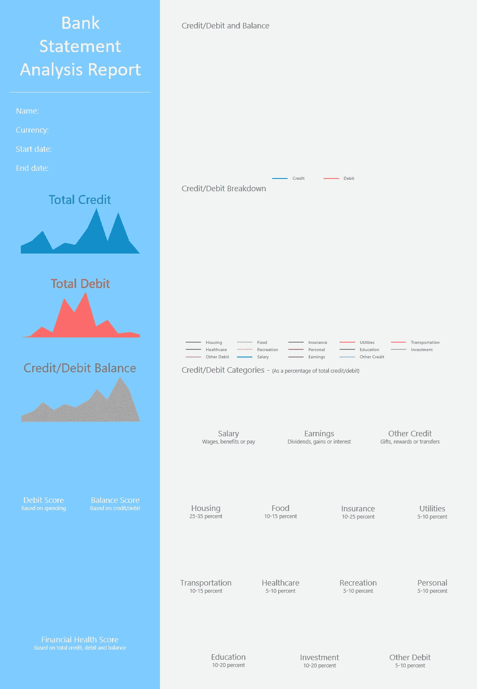
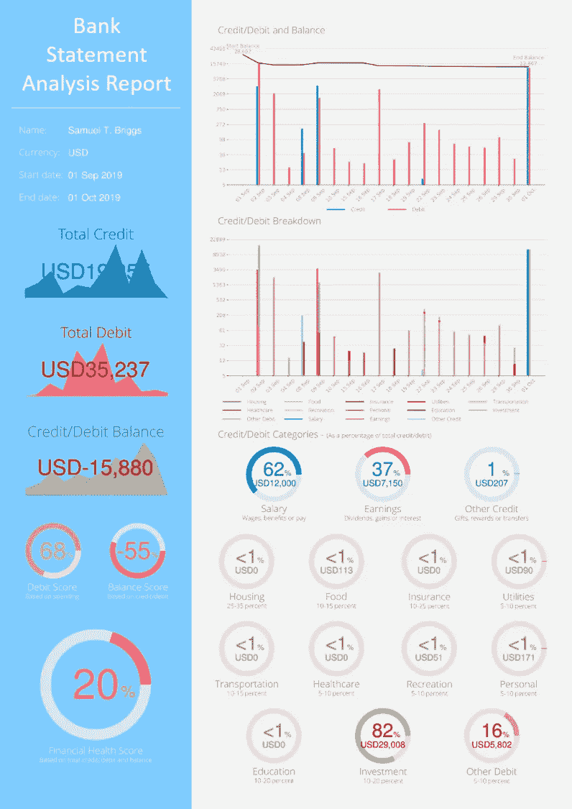

# 如何用 Python 生成自动化的 PDF 文档

> 原文：<https://towardsdatascience.com/how-to-generate-automated-pdf-documents-with-python-55981f4d9e3?source=collection_archive---------2----------------------->

## 利用自动化轻松创建令人眼花缭乱的 PDF 文档


在 [Unsplash](https://unsplash.com?utm_source=medium&utm_medium=referral) 上由 [Austin Distel](https://unsplash.com/@austindistel?utm_source=medium&utm_medium=referral) 拍摄的照片

你上一次处理 PDF 文档是什么时候？你可能不需要回顾太久就能找到这个问题的答案。我们每天都要处理大量的文档，其中绝大多数都是 PDF 文档。公平地说，这些文件中有很多都是重复的，而且编写起来非常痛苦。是时候考虑利用 Python 的自动化功能来机械化繁琐的工作了，这样我们就可以将宝贵的时间重新分配给生活中更紧迫的任务。

请注意，完全没有必要精通技术，我们在这里要做的事情应该是足够琐碎的，我们内心不喜欢的门外汉可以在短时间内解决。阅读完本教程后，你将学习如何自动生成 PDF 文档，将你自己的数据、图表和图像打包在一起，呈现出令人眼花缭乱的外观和结构。

具体来说，在本教程中，我们将自动执行以下操作:

*   创建 PDF 文档
*   插入图像
*   插入文本和数字
*   可视化数据

## 创建 PDF 文档

在本教程中，我们将使用 [FPDF](https://pyfpdf.readthedocs.io/en/latest/index.html) ，它是 Python 中用来生成 PDF 的最通用、最直观的包之一。在我们继续下一步之前，启动 Anaconda 提示符或您选择的任何其他 Python IDE，并安装 FPDF:

```
pip install FPDF
```

然后导入我们将用来呈现文档的库栈:

```
import numpy as np
import pandas as pd
from fpdf import FPDF
import matplotlib as mpl
import matplotlib.pyplot as plt
from matplotlib.ticker import ScalarFormatter
```

随后，继续创建 PDF 文档的第一页，并设置字体的大小和颜色:

```
pdf = FPDF(orientation = 'P', unit = 'mm', format = 'A4')
pdf.add_page()
pdf.set_font('helvetica', 'bold', 10)
pdf.set_text_color(255, 255, 255)
```

然而，如果你需要不同的字体，你可以随时改变字体。

## 插入图像

下一个合乎逻辑的步骤是给我们的文档一个背景图像，为页面的其余部分设置结构。对于本教程，我使用 Microsoft PowerPoint 来呈现我的背景图像的格式。我只是使用文本框和其他视觉效果来创建所需的格式，完成后，我通过选择所有元素并按 Ctrl-G 将所有内容分组在一起。最后，我通过右键单击它们并选择“另存为图片”将分组的元素保存为 PNG 图像。



背景图像。图片作者。

正如您在上面看到的，背景图像为我们的页面设置了结构，并为稍后将生成的图表、图形、文本和数字留出了空间。用于生成该图像的特定 PowerPoint 文件可以从[这里](https://github.com/mkhorasani/Bank_Scan/blob/master/background.pptx)下载。

随后将背景图像插入到您的 PDF 文档中，并使用以下内容配置其位置:

```
pdf.image('C:/Users/.../image.png', x = 0, y = 0, w = 210, h = 297)
```

请注意，您可以通过扩展上面显示的方法插入任意数量的图像。

## 插入文本和数字

添加文本和数字有两种方法。我们可以指定要放置文本的确切位置:

```
pdf.text(x, y, txt)
```

或者，我们可以创建一个单元格，然后将文本放入其中。这种方法更适合于对齐或居中可变或动态文本:

```
pdf.set_xy(x, y)
pdf.cell(w, h, txt, border, align, fill)
```

请注意，在上述方法中:

*   “x”和“y”是指我们页面上的指定位置
*   “w”和“h”指的是我们细胞的大小
*   “txt”是要显示的字符串或数字
*   “边框”表示是否必须在单元格周围画一条线(0:否，1:是或 L:左，T:上，R:右，B:下)
*   “对齐”表示文本的对齐方式(左:左，中:右)
*   “填充”指示单元格背景是否应该填充(真，假)。

## 可视化数据

在这一部分中，我们将创建一个条形图，显示我们的贷方、借方和余额值随时间变化的时间序列数据集。为此，我们将使用 Matplotlib 来呈现我们的图形，如下所示:

在上面的代码片段中，credit、debit 和 balance 是二维列表，分别包含日期和交易金额的值。一旦生成并保存了图表，就可以使用前面几节中介绍的方法将它插入到我们的 PDF 文档中。

类似地，我们可以用下面的代码片段生成圆环图:

完成后，您可以通过生成自动化的 PDF 文档来完成它:

```
pdf.output('Automated PDF Report.pdf')
```

## 结论

这就是你自己的自动生成的 PDF 报告！现在，您已经学会了如何创建 PDF 文档，将文本和图像插入其中，还学会了如何生成和嵌入图表和图形。但是您决不仅限于此，事实上，您还可以扩展这些技术，使之包括多页文档的其他视觉效果。天空才是真正的极限。



图片作者。

如果您想了解更多关于数据可视化和 Python 的知识，请随时查看以下(附属链接)课程:

## 使用 Streamlit 开发 Web 应用程序:

[](https://www.amazon.com/Web-Application-Development-Streamlit-Applications/dp/1484281101?&linkCode=ll1&tag=mkhorasani09-20&linkId=a0cb2bc17df598006fd9029c58792a6b&language=en_US&ref_=as_li_ss_tl) [## 使用 Streamlit 开发 Web 应用程序:开发和部署安全且可伸缩的 Web 应用程序…

### 使用 Streamlit 开发 Web 应用程序:使用……开发安全且可扩展的 Web 应用程序并将其部署到云中

www.amazon.com](https://www.amazon.com/Web-Application-Development-Streamlit-Applications/dp/1484281101?&linkCode=ll1&tag=mkhorasani09-20&linkId=a0cb2bc17df598006fd9029c58792a6b&language=en_US&ref_=as_li_ss_tl) 

## 使用 Python 实现数据可视化:

[](https://www.coursera.org/learn/python-for-data-visualization?irclickid=xgMQ4KWb%3AxyIWO7Uo7Vva0OcUkGQgW2aEwvr1c0&irgwc=1&utm_medium=partners&utm_source=impact&utm_campaign=3308031&utm_content=b2c) [## 用 Python 实现数据可视化

### “一图胜千言”。我们都熟悉这个表达。它尤其适用于试图…

www.coursera.org](https://www.coursera.org/learn/python-for-data-visualization?irclickid=xgMQ4KWb%3AxyIWO7Uo7Vva0OcUkGQgW2aEwvr1c0&irgwc=1&utm_medium=partners&utm_source=impact&utm_campaign=3308031&utm_content=b2c) 

## 面向所有人的 Python 专业化:

[](https://www.coursera.org/specializations/python?irclickid=xgMQ4KWb%3AxyIWO7Uo7Vva0OcUkGQgW16Ewvr1c0&irgwc=1&utm_medium=partners&utm_source=impact&utm_campaign=3308031&utm_content=b2c) [## 面向所有人的 Python

### 学习用 Python 编程和分析数据。开发收集、清理、分析和可视化数据的程序…

www.coursera.org](https://www.coursera.org/specializations/python?irclickid=xgMQ4KWb%3AxyIWO7Uo7Vva0OcUkGQgW16Ewvr1c0&irgwc=1&utm_medium=partners&utm_source=impact&utm_campaign=3308031&utm_content=b2c) 

# 新到中？您可以在此订阅和解锁无限文章[。](https://khorasani.medium.com/membership)