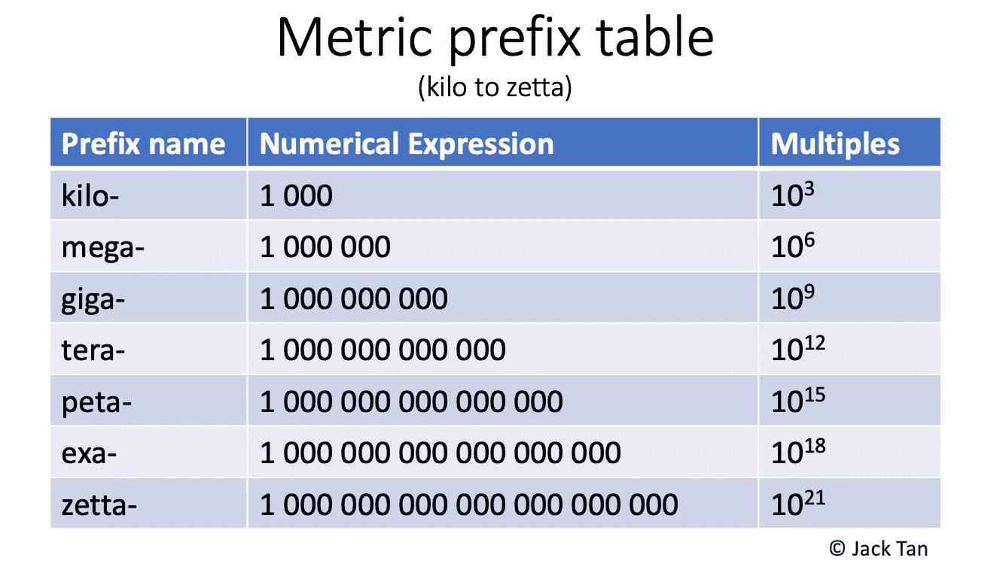
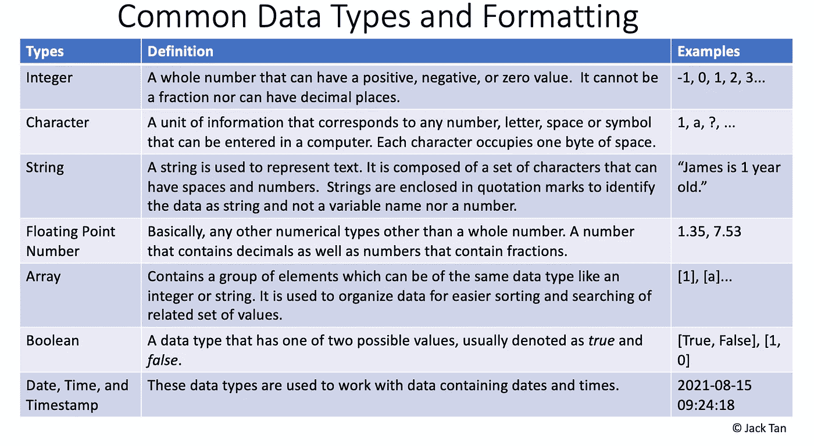
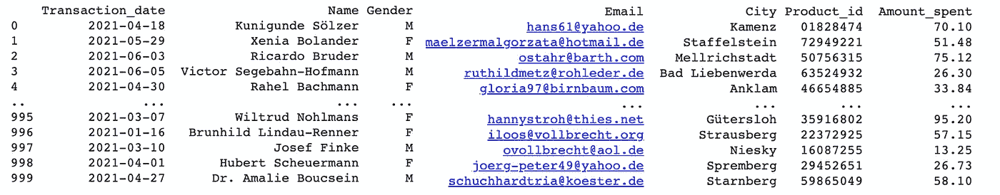

# 如何在 Python 中生成虚拟数据

> 原文：<https://towardsdatascience.com/how-to-generate-dummy-data-in-python-a05bce24a6c6?source=collection_archive---------9----------------------->

## 为找不到合适的数据集而沮丧？—为什么不自己创造呢？

乔尔·菲利普在 [Unsplash](https://unsplash.com?utm_source=medium&utm_medium=referral) 上的照片

每个数据科学项目都始于一组数据。

不管你是一名资深的数据科学家还是一名有抱负的数据爱好者，你都可能在某个时候寻找数据集来启动数据科学或机器学习项目。但通常情况下，寻找一组合适的数据可能是一个非常乏味的过程。虽然许多著名的数据存储库已经使成千上万的数据集易于访问，但它们大多是通用的，实际上需要一些调整和准备，以适应我们正在进行的数据项目。

这让我想到——如果找到一个样本数据集如此复杂，为什么不生成我自己的虚拟数据呢？这个疯狂的想法一开始让我有些反感，因为我认为编写自己的数据实际上也同样耗时。但是在我开始在几个项目中创建自己的数据之后，我发现了一个强大的 Python 库，它可以以直观的方式完成所有这些工作。

# **历史数据&常见的数据格式类型**

照片由 [Pietro Jeng](https://unsplash.com/@pietrozj?utm_source=medium&utm_medium=referral) 在 [Unsplash](https://unsplash.com?utm_source=medium&utm_medium=referral) 上拍摄

人类储存和分析数据的最早记录可以追溯到公元前 18，000 年左右，那时人们使用计数棒。*【1】*快进到 21 世纪，大多数现代数据都是以数字方式收集的，并且可以像滚雪球一样变成大量数据，称为大数据。在信息系统中，数据以字节为单位存储，例如千字节、兆字节等。据估计，2020 年全球创建、捕获和消费的数据总量为 59ZB (zettabyte ),预计到 2025 年将达到令人难以置信的 175ZB。*【2】*

Metrix 前缀表显示了 IT 系统中常用的乘法前缀。作者自我图解。

存储在计算机化系统中的数据，即存储在您的计算机或其他电子设备(如智能手机)中的数据，必须指定不同的数据类型。数据格式化的基本思想可以分为数字、字母或字母数字。根据[讲授计算机科学](https://teachcomputerscience.com/database-data-types/)，下表中可以看到一些常见的数据类型。

IT 系统中常用的数据类型和格式。作者自我图解。

# 在 Python 中生成假数据

照片由[马库斯·斯皮斯克](https://unsplash.com/@markusspiske?utm_source=medium&utm_medium=referral)在 [Unsplash](https://unsplash.com?utm_source=medium&utm_medium=referral) 拍摄

当然，要生成假数据，这个库必须被称为 [Faker](https://faker.readthedocs.io/en/master/) 。在本文中，我将带您浏览一些生成通用营销数据的片段，这些数据将包括一些常见的列(数据格式)，如:

*   交易日期(时间戳)
*   客户名称(字符串)
*   性别(布尔型)
*   电子邮件(字符串)
*   城市(字符串)
*   购买的产品 ID —条形码(字符串)
*   支出金额(浮动)

为了使 Python 代码可移植，笔记本是使用 [Google Colab](https://colab.research.google.com/notebooks/intro.ipynb) 构建的，完整的代码可以在 [GitHub](https://github.com/jackty9/Generating_Fake_Data_Python) 上找到。由于 Faker 不是一个标准库，您很可能必须首先安装它。在 Google Colab 中，这可以通过下面的两行代码来完成。

# **每一列的 Python 代码片段**

代码的逐行解释:

*   第 1–5 行:导入所需的库。`Faker`是本教程中用来生成大部分伪数据的主库。
*   第 7 行:定义客户的数量。要生成的行数。
*   第 11 行:声明一个空列表，用于传递生成的假数据。
*   第 13 行:为生成的假数据的每次迭代定义一个`for`循环。
*   第 15–18 行:为交易日期创建虚假数据—开始和结束日期被定义为日期的中间范围。
*   第 20–21 行:使用`faker`库创建假名字。名称也可以定制为只生成名或姓。更多细节可以在这里找到[。](https://faker.readthedocs.io/en/master/providers/faker.providers.person.html)
*   第 23–24 行:在“M”和“F”之间使用`random`库创建假性别。该列表还可以添加更多不同的性别选择选项。
*   第 25–27 行:使用 faker 库创建假的(ASCII 格式)电子邮件。其他格式的邮件可以在[这里](https://faker.readthedocs.io/en/master/providers/faker.providers.internet.html)找到。
*   第 29–30 行:使用 faker 库创建假城市。其他形式的称呼请参考[这里的](https://faker.readthedocs.io/en/master/providers/faker.providers.address.html#)。
*   第 32–33 行:创建 8 位条形码格式的假产品 id。其他格式可以在这里找到[。](https://faker.readthedocs.io/en/master/providers/faker.providers.barcode.html)
*   第 35–36 行:伪造客户的消费金额。参数被设置为只有两位小数，并且数量将始终为 1-100 之间的正数。
*   第 38 行——一个`for`循环的结束。该循环将继续 1000 次(在第 7 行中定义),以生成 1000 行假数据。
*   第 40 行:将生成的转换成熊猫数据帧。
*   第 42 行:显示笔记本中所有列的参数。
*   第 43 行:打印并显示数据帧。

生成的输出。作者自我图解。

# **奖励—导出为 CSV**

您可能希望导出或下载生成的假数据，以便在其他地方用于您的数据科学或机器学习项目。在 Google Colab 中，只用三行代码就可以轻松实现。导出的数据将是标准的 CSV 文件。

# **结论**

万岁，你已经走了这么远，现在你已经成功地生成了一个数据集，最适合你的数据处理需求。示例代码片段相当简单，但是已经涵盖了最常见的数据类型，如整数、浮点、字符串和日期。非常欢迎您使用和编辑代码的任何部分来生成您想要的数据集。

完整的笔记本可以在 Github 上的[这里](https://github.com/jackty9/Generating_Fake_Data_Python)找到。

喜欢我的文章吗？[在媒体上关注我](https://jackyeetan.medium.com/)，以便在我发布新文章时接收通知。😊

# **参考文献**:

[1] [每个人都应该阅读的大数据简史，世界经济论坛](https://www.weforum.org/agenda/2015/02/a-brief-history-of-big-data-everyone-should-read/)

[2] [世界数据解释，对话](https://theconversation.com/the-worlds-data-explained-how-much-were-producing-and-where-its-all-stored-159964)

感谢阅读这篇文章。如果你喜欢我的工作，请考虑加入 Medium 来支持我。谢谢大家！😊

<https://jackyeetan.medium.com/membership> 