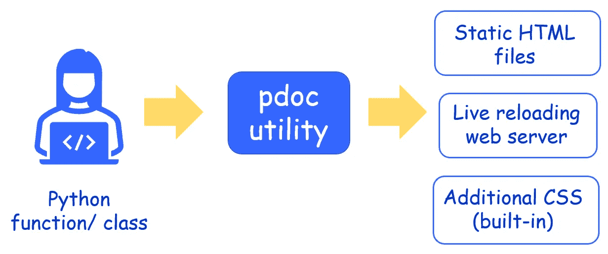
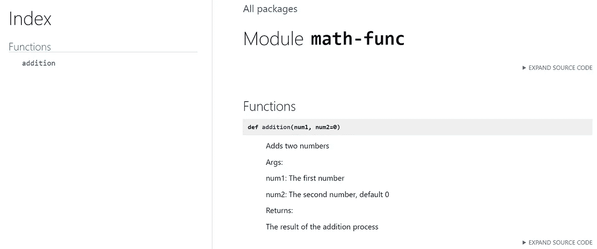
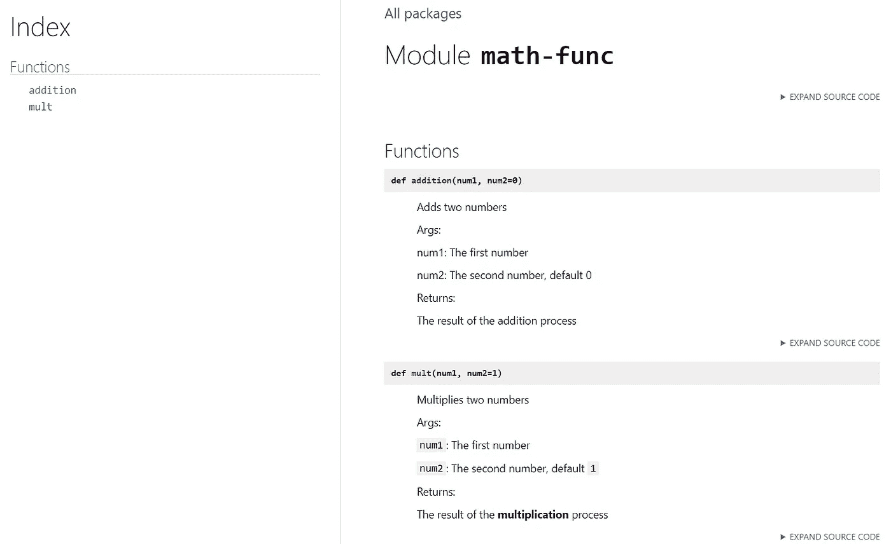
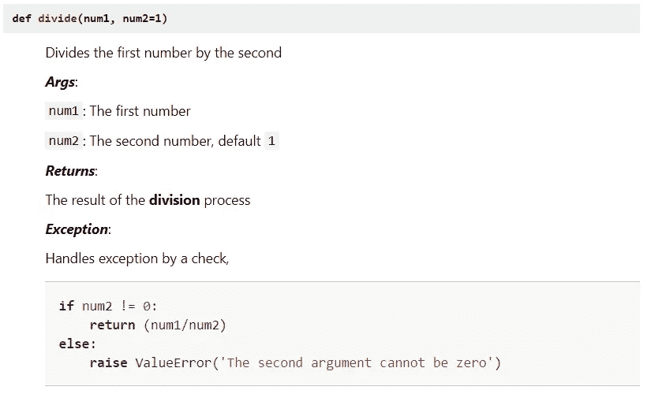
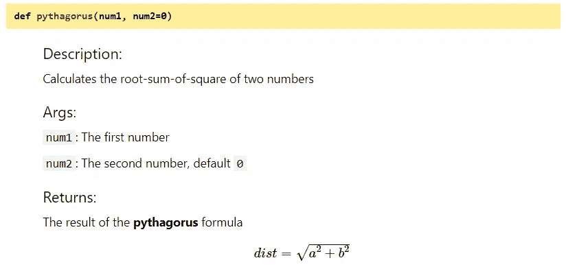
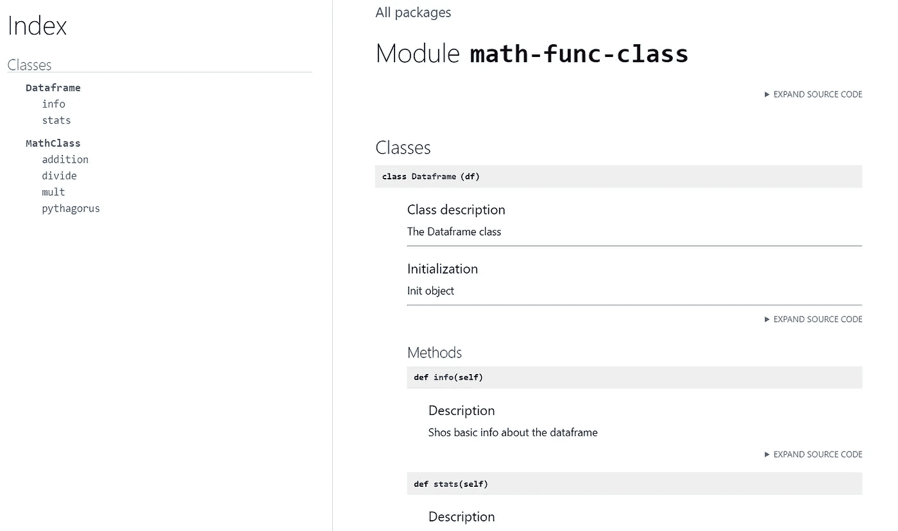
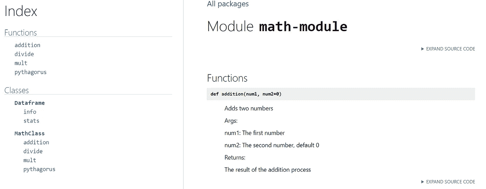

# 如何在几分钟内从 Docstrings 生成专业的 API 文档

> 原文：<https://towardsdatascience.com/how-to-generate-professional-api-docs-in-minutes-from-docstrings-aed0341bbda7?source=collection_archive---------3----------------------->

## 在一个小 Python 包的帮助下，生成高质量的文档变得简单而直观。包括降价和乳胶。


**图片来源** : [Pixabay](https://pixabay.com/photos/writing-pen-man-ink-paper-pencils-1149962/) (免费使用)

# 文档很重要

当我们使用一个新的库(或者第一百万次重用我们最喜欢的库)时，我们都喜欢好的和全面的文档，不是吗？

想象一下，如果他们从 Scikit-learn 或 TensorFlow 网站上拿走所有的文档，你会有什么感觉。你会感到很无力，不是吗？

文档很重要。高质量的文档(特别是对于一个开源项目)证明，

*   关心这个项目
*   关心最终用户或客户( [**你的代码被阅读的次数比它被编写的次数多得多**](https://retrocomputing.stackexchange.com/questions/15724/who-are-we-quoting-when-we-note-that-code-is-written-once-but-read-many-times) )
*   富有成效的思维，这样开发人员可以更有效地利用代码库进行调试和参考，否则用户很容易产生错误/问题( [**什么是富有成效的数据科学**](https://medium.com/productive-data-science/why-and-how-should-you-learn-productive-data-science-53377b473f37) )
*   倾向于将技术项目进行逻辑总结，即，不要将个人爱好项目停留在 Jupyter 笔记本级别，而是使其可重用并值得为更大的用户群分发( [**这样你就可以将自己与其他数据科学家区分开来**](/how-to-distinguish-yourself-from-hundreds-of-data-science-candidates-62457dd8f385) )

这里有一篇文章，里面有一些优秀的例子…

<https://nordicapis.com/5-examples-of-excellent-api-documentation/>  

但是，编写文档经常感觉像是一件苦差事。这是每个开发人员在大规模项目中经历的认知负荷之上的额外负担。

如果我们有一个工具可以生成**专业外观的文档**，也就是说，可以直接从我们编写的原始 Python 函数推送到 docs 服务器或网站供公众使用，那会怎么样？

在本文中，我们介绍了这样一个漂亮的小工具，并展示了一些基本的例子。

# ` pdoc3` —一个直观但功能强大的编写 Python 文档的工具

我们都为我们的数据科学项目和开源包编写了大量的 Python 函数并创建了大量的 Python 类，不是吗？其实即使是因果分析和爱好项目，我们也应该 [**把这种面向对象编程风格的习惯**](/how-a-simple-mix-of-object-oriented-programming-can-sharpen-your-deep-learning-prototype-19893bd969bd) 构建到我们的代码库中。

如果能够直接从这些函数和类定义中生成好看的 API 文档，而无需编写一行额外的 HTML/CSS 代码，那就太好了。


**图片来源**:作者创作

## 安装和基本使用

只要 pip 安装软件包，

```
pip install pdoc3
```

**注**:有一个**比较老的包叫** `**pdoc**`。你也可以用它来建立文档，这是这个项目的一个分支。但是这里我们使用的是更新的框架。

从一个简单的加法函数开始。假设它包含在本地工作区中名为`math-func.py`的文件中。

```
def addition(num1, num2=0):
    """
    Adds two numbers

    Args:

    num1: The first number

    num2: The second number, default 0

    Returns:

    The result of the addition process
    """

    return (num1+num2)
```

因此，实际的代码只是一个返回语句，但是 docstring 很长。

**这就是关键。文档字符串。**

docstring 是 pdoc 工作方式的核心。从他们的[网站](https://pdoc.dev/docs/pdoc.html)来看，它是“*命令行应用程序，可用于将项目文档呈现为静态 HTML 文件。它还包括一个实时重新加载的 web 服务器来预览更改*。

所以，上面的流程变成了，



**图片来源**:作者创作

那么，如何生成 web 预览呢？只需一个 CLI 命令。

`pdoc --http localhost:8080 math-func.py`

它在`localhost:8080`端口启动一个活动的 web 服务器。当您在浏览器中打开该页面时，

```
Starting pdoc server on localhost:8080
pdoc server ready at [http://localhost:8080](http://localhost:8080)
```

您的浏览器显示如下页面。首先，你会看到有两个链接的页面，当你点击`math-func`链接时，你会看到 API。



**图片来源**:作者创作

很酷，不是吗？但是看起来很基础。让我们看看我们是否能给它添加一些小铃铛和哨子。

## 降价——美化和可用性的关键

我是编写文档的 markdown 格式的忠实粉丝。你不是经常在 Github Readme 文档中使用它吗？pdoc 的伟大之处在于它允许在 docstring 中无缝集成 markdown 文本。

假设，我们将第二个函数`mult`添加到我们的`math-func.py`模块中，

```
def mult(num1, num2=1):
    """
    Multiplies two numbers

    Args:

    `num1`: The first number

    `num2`: The second number, default `1`

    Returns:

    The result of the **multiplication** process
    """

    return (num1*num2)
```

请注意对 docstring 的细微更改，其中有一些标记符号，如粗体的反勾号``…``和`** … **`。

现在，如果您只是保存这个文件，网页会自动重新载入您的更改。



**图片来源**:作者创作

请注意参数`num1`和`num2`是如何作为内联代码块呈现的，以及单词**乘法**是如何在 API 文档中以粗体显示的。这就是 markdown magic，就在你的 docstring 里面。

您甚至可以在 docstring 中显示带有三个反勾号的代码块。最终的 API(用于我们的下一个`divide`函数)，



**图片来源**:作者创作

我们所要做的就是把这个放到 docstring 中，

```
"""...Handles exception by a check,

    ```python
    if num2 != 0:
        return (num1/num2)
    else:
        raise ValueError('The second argument cannot be zero')
    ```

 """
```

请注意，在三个反勾号之后使用了**标识符** `**python**`，以便在 API 文档中以格式良好的方式呈现代码块。

## LaTeX math

您可以在 docstring 中包含基本的 LaTeX 数学表达式，并在 API doc 上漂亮地呈现它们。例如，我们用下面的 docstring 编写一个毕达哥拉斯距离计算函数，

```
def pythagorus(num1, num2=0): """
    ### Description:

    Calculates the root-sum-of-square of two numbers

    ### Args:

    `num1`: The first number

    `num2`: The second number, default `0`

    ### Returns:

    The result of the **pythagorus** formula

    $$dist = \\sqrt { a^2+b^2 }$$
    """
```

我们需要做以下两件事，

*   使用`$$ … $$`包装一个 LaTeX 表达式
*   使用两个反斜杠字符来表示 LaTeX 表达式中常见的反斜杠。这是为了处理反斜杠作为 Python docstring 中的转义字符的常见角色。

结果是，



**图片来源**:作者创作

## 建立函数索引

还要注意我们在页面左侧构建的函数索引。这就像一个目录，当你点击那些链接到相应的功能时，它会把你带到文档中的任何地方。这是一个模块一个模块构建的。这里我们的主模块当然是`math-func.py`文件。

您可能已经注意到，**索引是按字母顺序排序的**(根据函数名)。虽然在我们的源代码中，我们在`mult`函数之后添加了`divide`函数，但是它被索引在第二位。


**图片来源**:作者创作

# 其他选项和实用程序

我们在上一节中介绍了基本用法和选项。在这里，我们想要展示更多的全局选项和实用程序，它们可以用于更多的控制和可用性。

## 输出选项

你可以生成，

*   **HTML 页面**:带`pdoc --html <filename.py>` 。这会将模块 HTML 文件放在工作目录下的./html 文件夹中。您可以使用一个可选的目录标志将 HTML 文件放入其中。
*   **服务器**:带`pdoc --http HOST:PORT <filename.py>`在网页上显示 API 文档的实时预览，带自定义`HOST`和`PORT`。

## 对于类对象

你可以像函数一样用标准类对象构建文档。例如，我们将整个`math-func`代码转换成一个类，并在我们的模块中添加第二个`Dataframe`类。当我们为此生成文档时，它看起来像是，



**图片来源**:作者创作

## 一起

如果你把你的类和函数放在一个单独的 Python 脚本(模块)中，那么它会像这样显示，



**图片来源**:作者创作

## 程序化生成

从根本上说，`pdoc3`是一个 Python 包，因此您可以在 Python 代码中使用它以编程的方式生成文档。这是一个样板代码示例，

```
import pdocmodules = ['a', 'b']  # Public submodules are auto-imported
context = pdoc.Context()modules = [pdoc.Module(mod, context=context)
           for mod in modules]
pdoc.link_inheritance(context)def recursive_htmls(mod):
    yield mod.name, mod.html()
    for submod in mod.submodules():
        yield from recursive_htmls(submod)for mod in modules:
    for module_name, html in recursive_htmls(mod):
        ...  # Process
```

注意`mod.html()`本质上是一个在处理模块的文档字符串后返回原始 HTML 字符串的函数。这是使用`pdoc --html <filename.py>`命令渲染的内容。在上面的代码中，您直接使用您的代码检索它，并可以进一步操作它。

## 构建完整的模块

您可以使用 pdoc3 一次性构建一个完整的模块。为此，您只需将必要的文件放在通常的模块/子模块层次结构中，就像标准的 Python 包一样。

例如，我们可能有这样一个简单的目录结构(注意 Python 名称空间要求的`__init__.py`)目录`math-mod`，在这个目录中，我们将这些文件放在子目录中。


**图片来源**:作者创作

我们可以运行一行命令，

```
pdoc --http localhost:8080 -c latex_math=True math-mod
```

我们将得到下面的结构，


**图片来源**:作者创作

# 摘要

构建高质量的文档感觉起来像是软件项目中编程和技术问题解决部分的额外负担。数据科学也不例外。然而，伟大的数据科学和机器学习项目和框架是真正伟大的，因为它们因其广泛的 API 文档而易于任何人使用。

在本文中，我们展示了如何使用一个漂亮的小 Python 包来创建漂亮的 API 文档(包括 markdown 语法和 LaTeX math 渲染),就在舒适的 docstrings 函数中。

希望这能打破为您正在从事的下一个开源项目制作良好文档的障碍。

喜欢这篇文章吗？成为 [***中等会员***](https://medium.com/@tirthajyoti/membership) *继续* ***无限制学习*** *。如果您使用下面的链接，* ***，我将收取您的一部分会员费，而不会对您产生额外费用*** *。*

<https://medium.com/@tirthajyoti/membership> 