# 如何用 Python 生成罗马风格的马赛克

> 原文：<https://towardsdatascience.com/how-to-generate-roman-style-mosaics-with-python-11d5aa021b09?source=collection_archive---------15----------------------->

## [实践教程](https://towardsdatascience.com/tagged/hands-on-tutorials)

## 使用提供的代码制作自己的马赛克，并理解其背后的基本原理

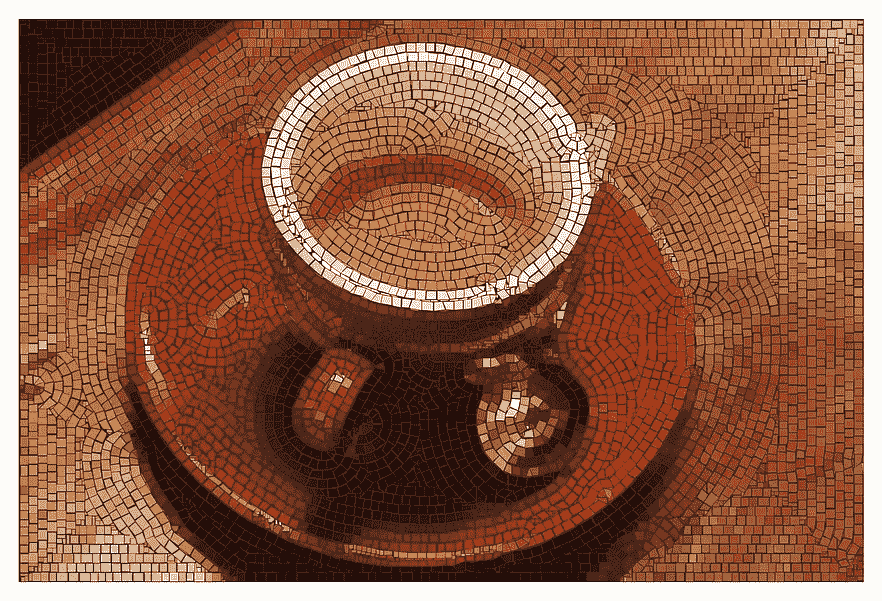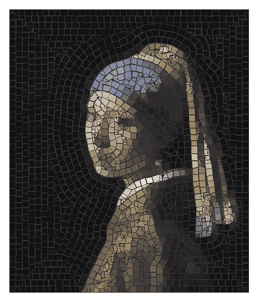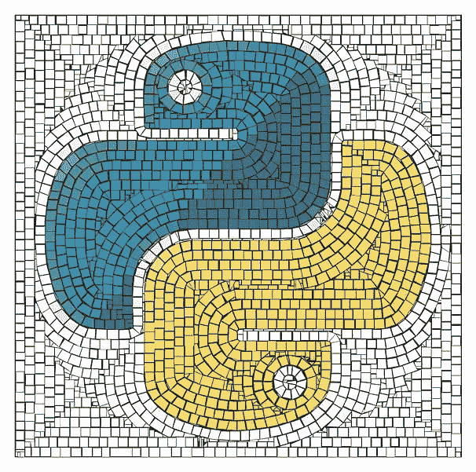

作者基于以下输入图像制作的图像:scikit-image 测试图像“咖啡”、维梅尔的[戴珍珠耳环的女孩](https://commons.wikimedia.org/wiki/File:Girl_with_a_Pearl_Earring.jpg)和 [Python 徽标](https://www.python.org/community/logos/)

古代的马赛克是由小块硬质材料如大理石、玻璃或石灰石组装而成的。这种材料的选择产生了极其持久的艺术作品，让我们深入了解几千年前的生活方式。但是马赛克也代表了现代概念。首先，它们是可持续的，因为它们是天然的、可重复使用的建筑材料。它们拥有高度的抽象性，这让它们看起来很有趣。这种效果会自动出现，因为马赛克中的元素数量受到严格限制。尽管有这种限制，对象应该是清晰可辨的。这是创建新马赛克的挑战，需要在放置瓷砖时遵守规则。

**可用算法**

当我搜索从输入图像中生成马赛克的工具时，我没有找到一个让我信服的工具。因此，我开始尝试神经风格转移，这产生了令人惊叹的马赛克，但仔细观察发现了许多不切实际的瓷砖。后来，我发现有几篇关于镶嵌计算的科学论文，并注意到一篇由迪·布拉希等人写的旧论文(2005 年的)。我决定修改已发布的方法，并用 Python 实现它。事实证明这比预期的要难，因为这项任务异常复杂。此外，我不得不即兴发挥了很多，因为算法的最后步骤没有详细解释。现在我想和所有对此感兴趣的人分享这个剧本。几行相关的代码就贴在这里，完整的代码可以在 [GitHub](https://github.com/yobeatz/mosaic) 上找到。

**让我们开始**

最初，我们加载一个源图像:

图像如下图所示。现在我们可以开始实现算法了。

**边缘检测**

最广为人知的马赛克( *opus 蠕虫状马赛克*)的基本设计原则是沿着视觉上重要的物体边缘放置瓷砖链。因此，我们的首要任务是从源图像中提取这些边缘特征。在该论文中指出，传统的边缘检测算法不能很好地工作，必须开发基于亮度水平的定制技术。这是 2005 年写的。如今，我们可以受益于深度学习领域的进步。[整体嵌套边缘检测](https://arxiv.org/abs/1504.06375) (HED)是在迪·布拉希的工作十年后发表的，可以使用 openCV 轻松实现。事实证明，在大多数情况下，HED 在检测相关轮廓方面表现得甚至更好。你可以在下面的比较中看到这一点，HED 产生的背景特征明显较少，但更好地保留了杯子的边缘。

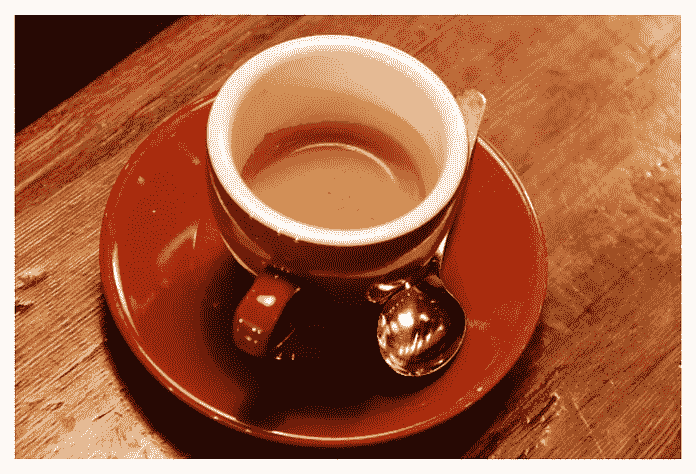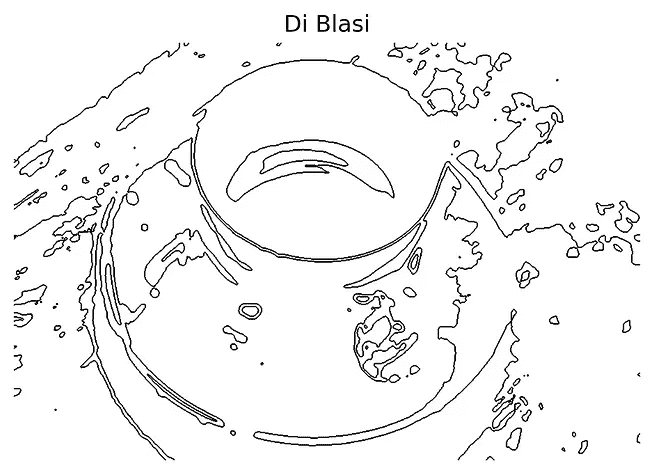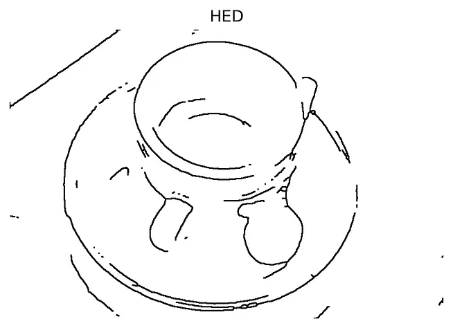

源图像是 scikit-image 的测试图像“咖啡”(Rachel Michetti)。作者的边缘检测图像。

**指导方针**

现在我们有了边缘，可以开始放瓷砖了。但是之后去哪里呢？让我们准备用瓷砖填充整个图像的说明。因此，我们构建了一套完整的平行于检测到的边缘的指导方针。为此，我们首先必须计算每个像素到最近边缘的距离。幸运的是， [SciPy](https://www.scipy.org/) 有正确的功能:

在 *img_edges* 中，已经检测到的边缘被编码为“1”并通过设置 *img_edges==0* 转换为“假”。您可以在下图中看到生成的图像。这里，像素越亮，它离边缘越远。

现在，我们可以使用我们关于边缘距离的新知识:我们移动 *half_tile* (即，一半的瓦片大小；由用户选择)远离边缘，并且逐行绘制指引线，同时总是精确地留出一串瓷砖将需要的空间:

结果如下所示。最终，瓷砖将沿着这些线居中放置。之后，我们再次使用距离矩阵来计算每个像素的梯度。我们稍后将需要这些数据来以正确的方向放置瓷砖。

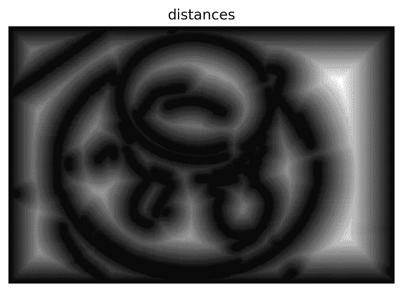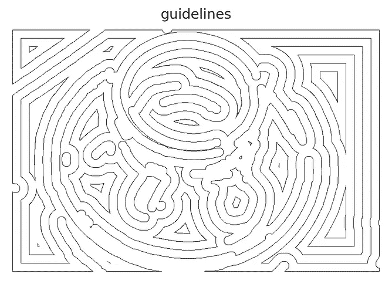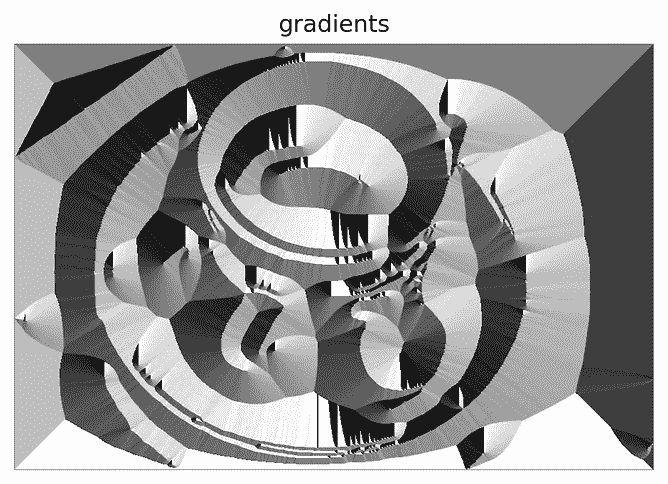

作者提供的图片(基于 scikit-image 测试图片“coffee”)

为了使指导方针对下面的步骤有用，我们必须将它们转换成有序的坐标列表。这不是一项容易的任务，但谢天谢地，SciPy 在这里又帮了大忙:

**瓷砖放置**

现在，我们可以通过沿着指引线绘制多边形来实际放置瓷砖。随着 [Shapely](https://github.com/Toblerity/Shapely) 的出现，有了一个用于创建和操作几何图形的令人敬畏的 python 库。

标准图块的放置如下完成:

*   创建第 1 条边作为长度为 2⋅ *半瓷砖*的线；以指引线为中心(下图中的虚线)
*   按照预先计算的渐变矩阵中的角度旋转侧边 1
*   在 2⋅ *half_tile* 像素的指导线上向前移动
*   以与第 1 面相同的方式创建第 2 面
*   通过取四个角点的[凸包](https://shapely.readthedocs.io/en/stable/manual.html#object.convex_hull)创建一个多边形(即两边的两个端点)
*   如果新牌与附近链的牌重叠，则只保留差异

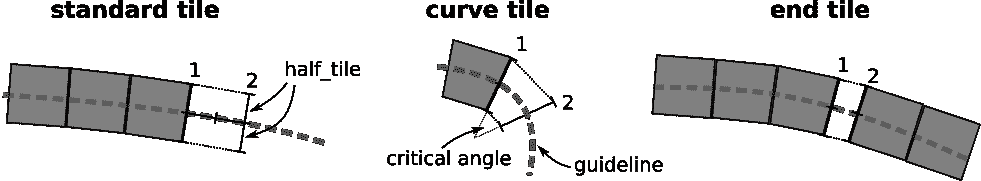

作者图片

如果沿着弯曲的指引线放置瓷砖，则选择较小的宽度，以便最终马赛克中的圆形对象看起来更好。如上图所示，一旦超过临界角，就绘制边 2。最后，指引线链的最后一个单幅图块(通常是一条闭合的线)被放入剩余的空间，因此可能也具有较小的宽度。

所有这些都是在一个循环中完成的，需要相当多的代码行。为了演示 Shapely 背后的简单原理，让我们画一个多边形:

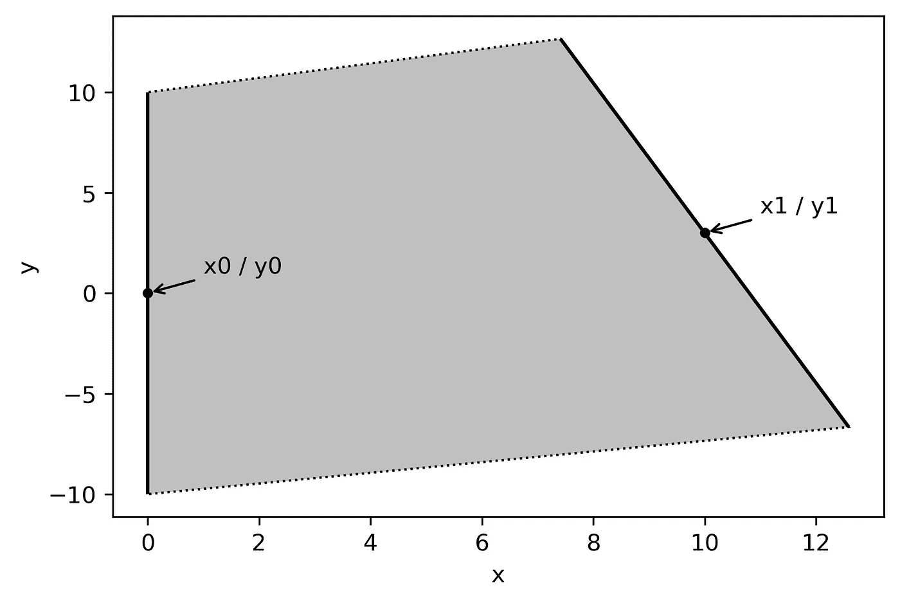

作者图片

在本例中, *line0* 创建在左侧，而 *line1* 创建在右侧。两条线都旋转指定的角度。最后提取两条直线的角点并合并成一个凸多边形。

现在让我们继续放置循环。在下图(左侧)中，您可以看到第一个链完成后的结果。标记的链也用彩色线标出。在右图中，所有链都填充了瓷砖。但我们还没有完成，因为我们有很多瓷砖之间的差距。

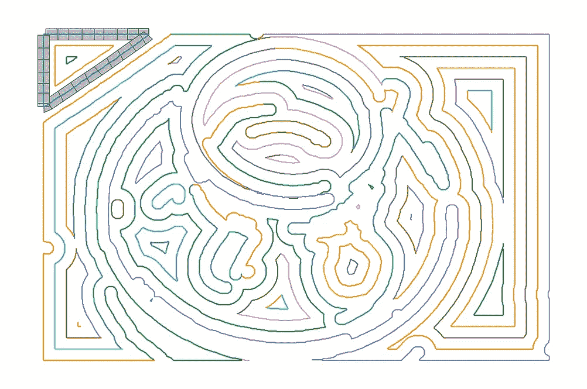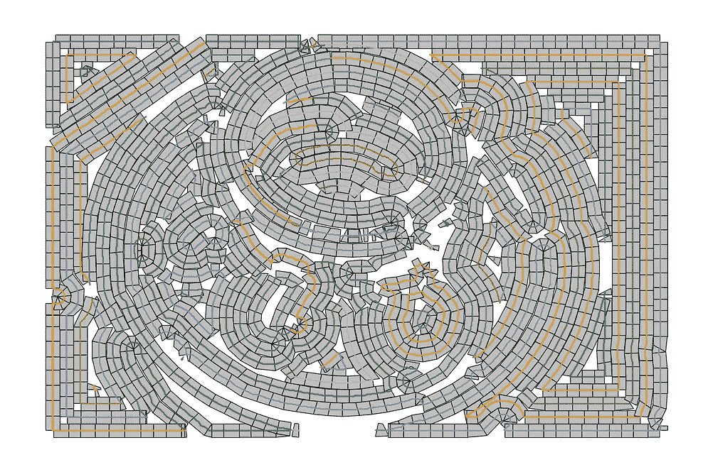

作者提供的图片(基于 scikit-image 测试图片“coffee”)

**平铺到缝隙中**

为了填补空白，我们使用了另一个伟大的 Python 库 [scikit-image](https://scikit-image.org/) 。为了找出差距，我们从绘制所有现有的图块开始:

这里， *x* 和 *y* 是多边形的角坐标。“Draw”将它们转换成多边形内所有像素的坐标 *rr* ， *cc* 。你可以在下面的左图中看到结果。从那里，我们再次计算到现有瓷砖的距离。然后，我们使用这些信息来定义差距内的第二套准则(右图)。

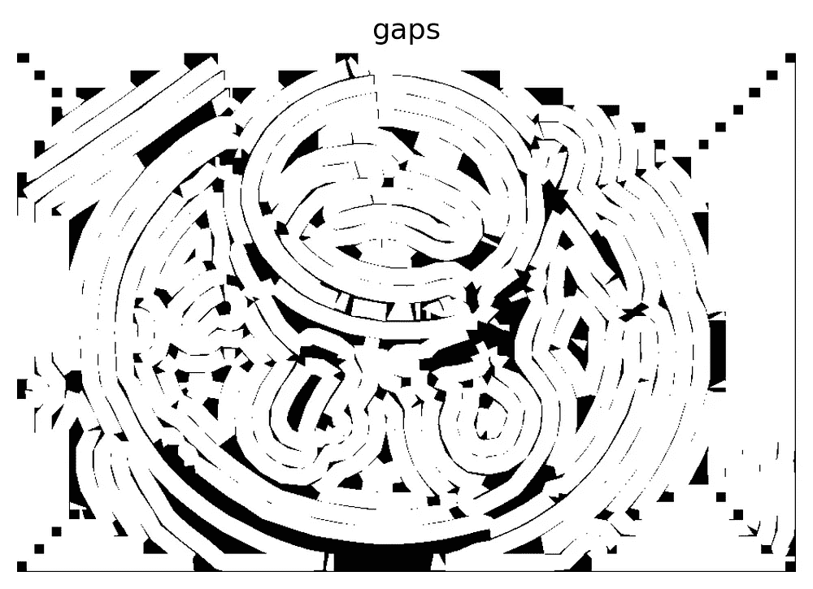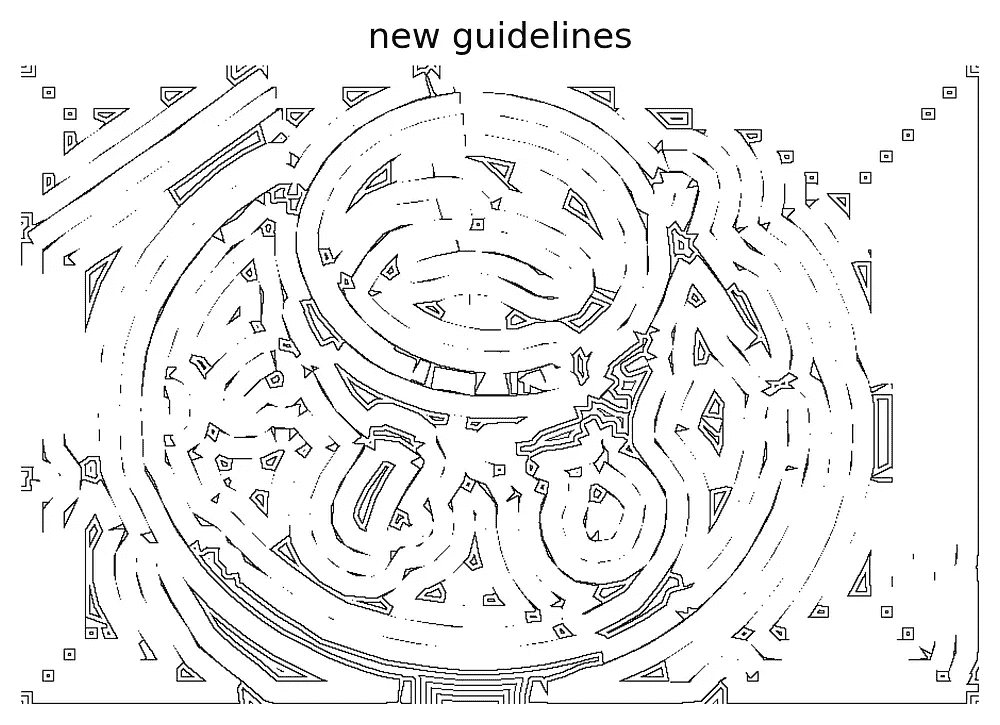

作者提供的图片(基于 scikit-image 测试图片“coffee”)

沿着新的指引线放置额外的图块后，所有必要的多边形都已创建。另一个任务是切掉突出图像边界的瓷砖。然后，我们来看看结果。在下图中，您可以看到整个区域都覆盖着瓷砖:

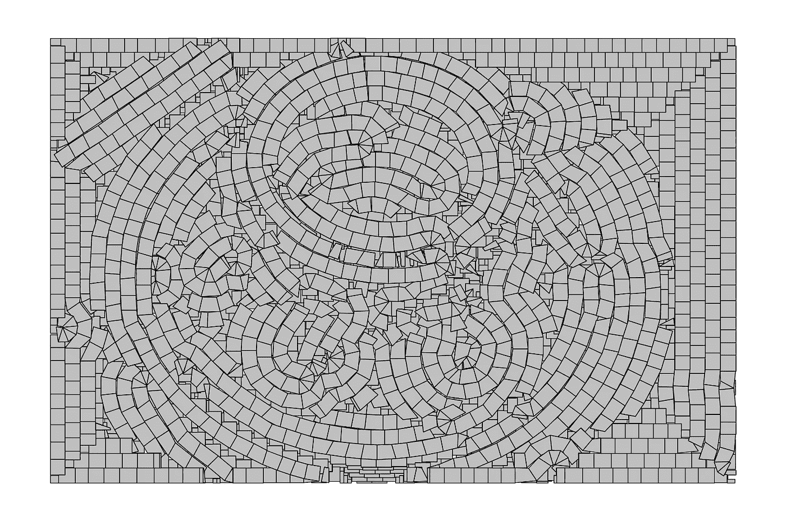

作者提供的图片(基于 scikit-image 测试图片“coffee”)

**处理凹面瓷砖**

不仔细看几乎看不出来，但是瓷砖的形状有一点不令人满意:有很多凹多边形！如果一个多边形的两个角点之间的一条线可以超出该多边形，则该多边形是凹的。它可以在放置后当它与附近多边形的重叠被移除时形成。这些形状不是很自然，因为实际上石头通常不是凹的，而是凸的。这就是为什么代码提供了将形状转换为凸形的选项。它实施两种策略(见下面的草图):

1.  移除尖状物:如果多边形的面积没有显著变化，则多边形的尖状物部分被简单地移除。去除尖峰后，面积必须比以前小。否则，存在与其他区块新重叠的风险。
2.  右图就是这种情况。如果删除标记的角，生成的多边形将比以前更大。相反，它被分成两个凸多边形。

方便的是，这两种策略都可以使用 shapely 例程来实现。

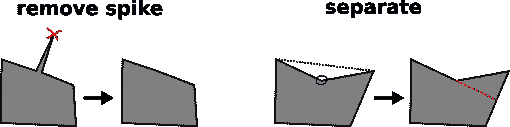

作者图片

**着色**

最后，所有的瓷砖都在适当的位置，并有一个凸起的形状。只是颜色不见了！我们只是从输入图像中复制它。最简单的方法是选择多边形中心的颜色值。由于在某些情况下可能会收集到奇怪的像素颜色，因此也可以对位于图块内部的所有像素的颜色进行平均。你得到的结果显示在右边。

一个缺点是，由此产生的马赛克看起来有点人工，因为不是现代照片中出现的所有颜色都可以用天然材料复制。因此，可以在真正的历史镶嵌画中找到的颜色的集合是预先收集的。您可以选择将所有颜色值更改为该源中最接近的对应值。在下面的例子(右侧)中，选择了来自 Ravenna 的源马赛克，由于使用了玻璃片，它仍然包含许多颜色。

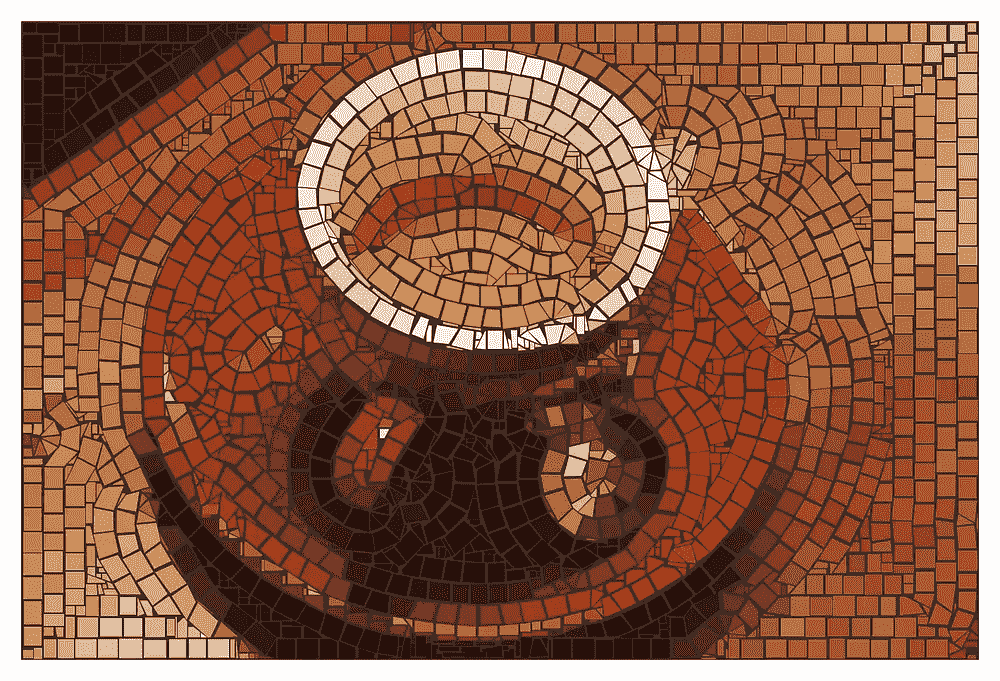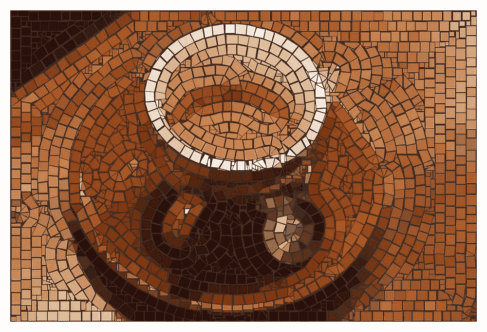

作者提供的图片(基于 scikit-image 测试图片“coffee”)

**完了！**

让我们再看几个生成的马赛克。

例如，我们可以尝试不同瓷砖尺寸的效果。在左图中，它设置为 15px，在右图中设置为 5px。较粗糙的图像需要 1107 个图块，较精细的图像需要 7069 个图块。

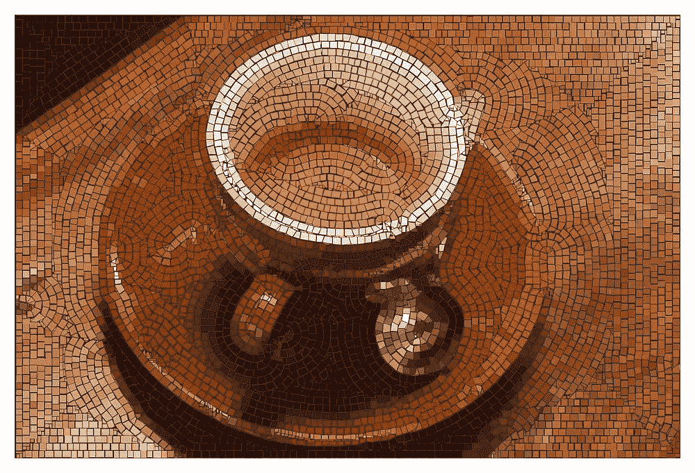

作者提供的图片(基于 scikit-image 测试图片“coffee”)

当然，我们可以选择任何类型的输入图像:

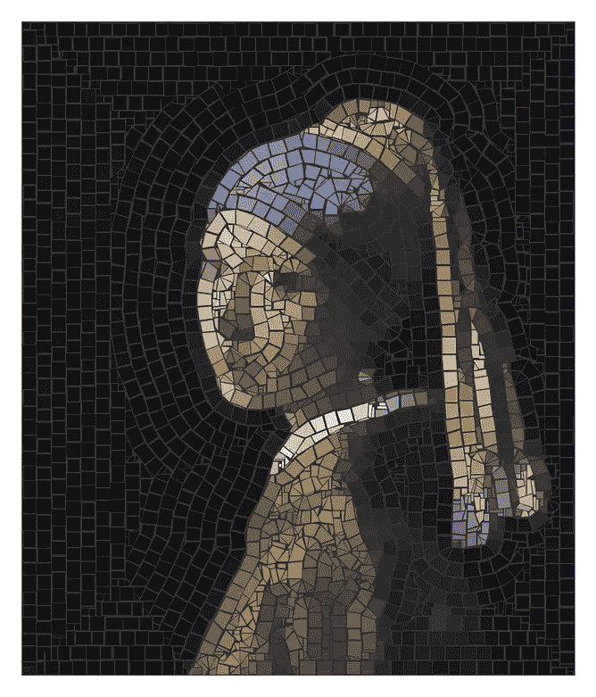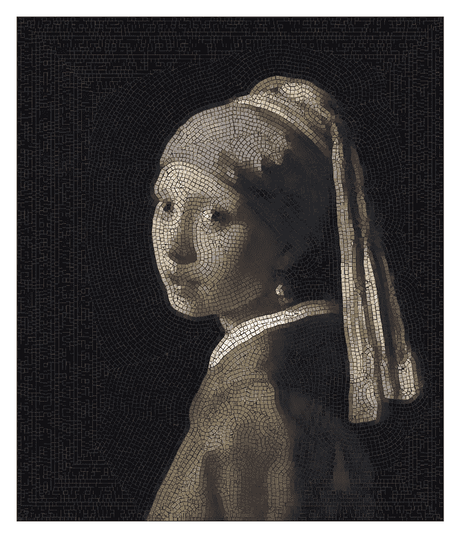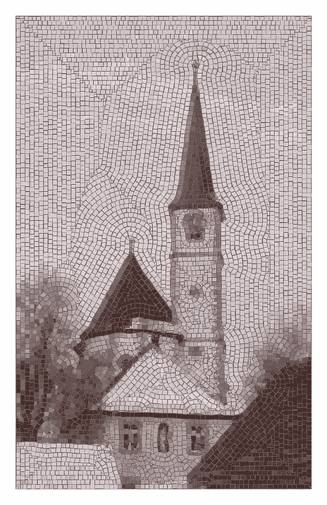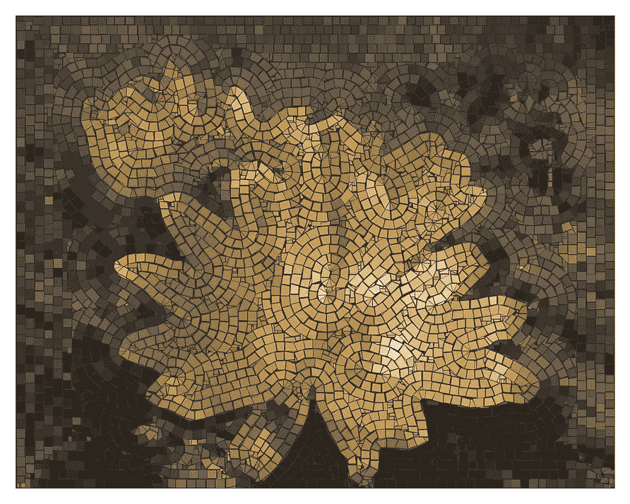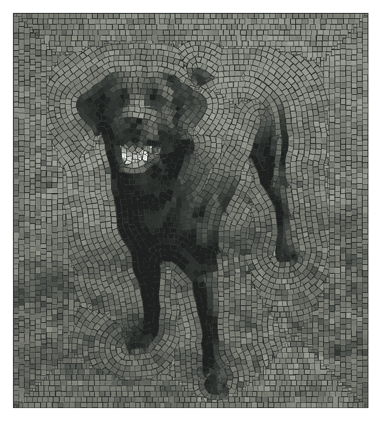

作者的图片基于:维米尔的[戴珍珠耳环的女孩](https://commons.wikimedia.org/wiki/File:Girl_with_a_Pearl_Earring.jpg)，塞巴斯蒂安·比茨的教堂照片，作者的花和狗的照片

如果你想自己尝试一下，从[这里](https://github.com/yobeatz/mosaic)获取代码。只需更改输入图像的路径并运行脚本。

最后，感谢 [Marat Kopytjuk](https://medium.com/u/891434466d3b?source=post_page-----11d5aa021b09--------------------------------) 审阅本文。