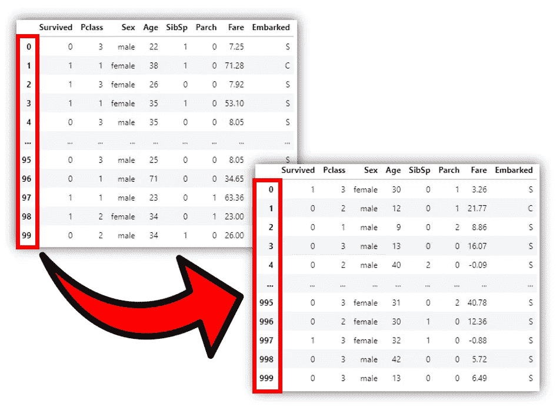
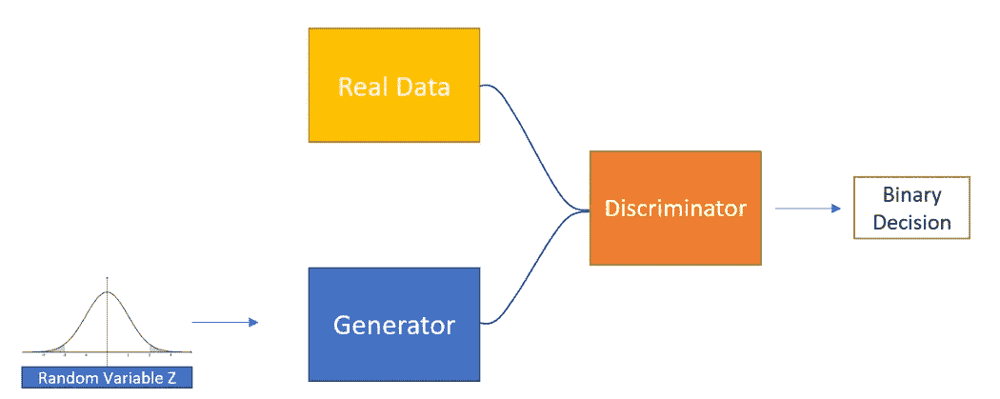
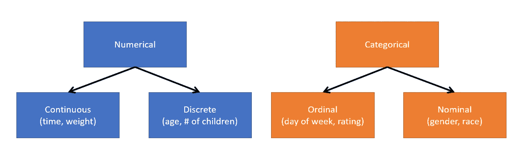
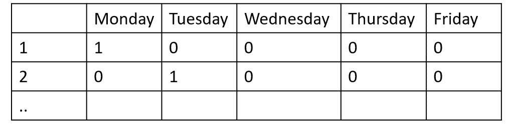
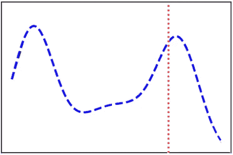
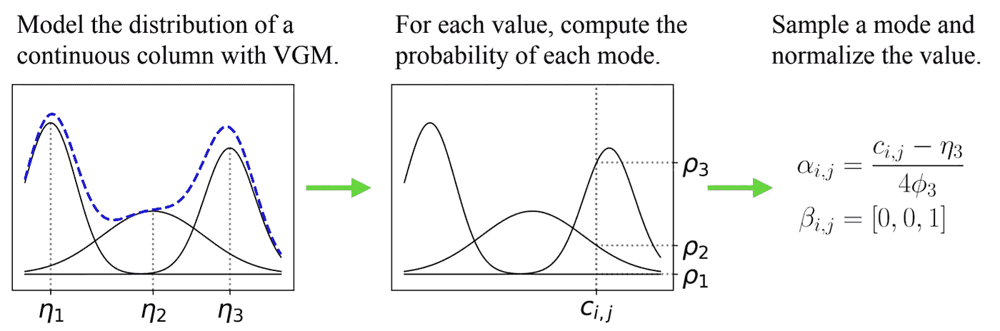
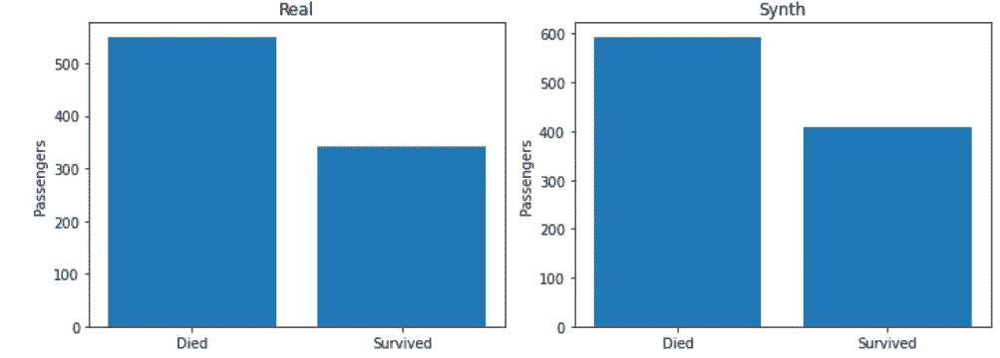
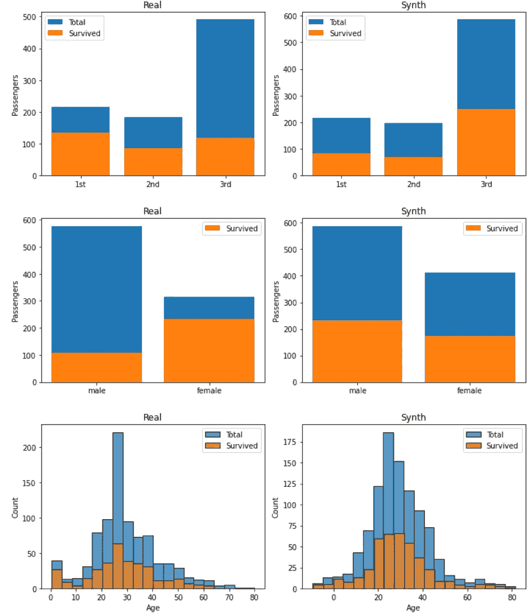

# 如何使用 CTGANs 生成表格数据

> 原文：<https://towardsdatascience.com/how-to-generate-tabular-data-using-ctgans-9386e45836a6?source=collection_archive---------6----------------------->

## [实践教程](https://towardsdatascience.com/tagged/hands-on-tutorials)，实用机器学习

## 对 CTGANs 如何工作的深入解释

作者图片

这篇文章的目的是填补互联网上的空白，很好地解释条件表格式 gan 是如何工作的。表格数据生成是一个不断发展的研究领域；CTGANs 的论文已经成为许多其他机器学习架构的基础，这些架构今天构成了该研究领域的艺术状态。

# 为什么要生成表格数据？

在我之前的两篇文章中，我探讨了如何使用生成式对抗网络(GANs)生成图像数据。在某种程度上，这些都是本文的基础。尽管图像数据非常直观，但实际上，工业和文学中最常用的数据是表格数据。表格数据是结构化的，在训练机器学习模型时通常更容易处理。然而，在生成表格数据时，要制作一个性能良好的模型，实际上会使事情变得复杂很多。

本文的目标是介绍 CTGANs 是如何工作的。为此，我将首先对 GANs 和表格数据做一个简单的解释。然后，我将介绍 CTGANs 最初论文中描述的体系结构。最后，我将介绍一个使用 Python 的示例实现。

# 重温甘斯

作者图片

gan 属于深度学习生成器网络的分支。这是一个监督学习问题，我们有一组真实的数据，我们想通过使用生成器来扩充这个数据集。GANs 学习生成样本，这与学习分布有着本质的不同(查看我关于 [**可微分生成网络**](/differentiable-generator-networks-an-introduction-5a9650a24823) 的文章了解更多细节)。

GANs 包括两个神经网络，生成器和鉴别器。生成器生成新数据，同时鉴别器尝试正确分类真实和虚假数据。

这两个网络在培训方面有对立的目标。鉴别器试图最大化其分类准确性(正确识别哪些图像来自生成器)，而生成器的目标是欺骗鉴别器。在学习结束时，生成器应该能够生成看起来非常像真实数据集的图像，以至于它们可以欺骗人类，让他们认为它们是真实的。

# 表列数据

正如我前面提到的，表格数据是结构化的。对于机器学习模型来说，非结构化数据(如文本或图像)更难学习。在大多数情况下，处理图像数据要复杂得多。但是，在生成表格数据时，您会发现算法会很快变得非常复杂。

## 表格数据的种类

表格数据可以是数字的，也可以是类别的。

作者图片

数字数据可以是连续的，也可以是离散的。连续数据在分辨率上没有限制。重量可以用吨、千克、克、毫克等来衡量。离散变量有唯一的数值。一个例子是你家孩子的数量。至于分类数据，有顺序数据(有顺序的分类数据，如星期几)和名义数据(没有顺序的分类数据)。

在文献中，离散数据、序数数据和名义数据都被归为一类，称为离散数据。这是因为当训练一个神经网络时，你不会将一周中的每一天作为一个向量{“星期一”、“星期二”…}。相反，你可以给它一个向量{0，1 …}。所以这意味着我们可以把离散数据和分类数据同等对待。

## 问题设置

一个表格数据集 *T* 可以说包含了 *Nd* 离散列和 *Nc* 连续列。表格数据生成的目标是训练生成器 *G* 学习从 *T.* 生成合成数据集 *Tsynth*

在文献中有两篇探索表格数据生成的关键基础论文，它们是徐磊等人的[tgan 和徐磊等人的](https://arxiv.org/abs/1811.11264)和[ctg an。在本文中，我将重点介绍 ctg an，这是一种已经在行业中起步的架构，在表格数据生成研究领域的发展中起到了关键作用。](https://arxiv.org/pdf/1907.00503.pdf)

# **ctg an—**提议的适应措施

为了完成表格数据生成的任务，可以训练一个普通的 GAN，但是，CTGANs 提出了两个修改，试图解决 GAN 在应用于表格数据时的两个问题。

## 连续数据的典型归一化

CTGANs 试图解决的第一个问题是标准化连续数据。

让我们先来看看离散数据是如何表示的。

离散数据很容易表示，因为它可以一次性编码。一键编码就是将离散变量中的每个类别归类到其自己的维度中的过程。在前面给出的工作日示例中，在一键编码后，我们有 5 列，每一列代表一周中的每一天，并带有类成员的二进制指示，而不是包含工作周中的某一天的向量。

作者图片

上面，第一个向量{1，0，0，0，0}表示星期一。第二个向量{0，1，0，0，0}代表星期二，依此类推。一种热编码为我们提供了一种规范化的方法来很好地表示离散变量。

然而，当涉及到连续数据时，很难表达连续变量所携带的所有信息。让我们看一个例子:

作者图片

假设我们有一个像上面这样的连续变量(蓝色分布)，我们想代表我们的样本(红色)。正如你所看到的，分布是相当复杂的，它有多种模式。因此，通过简单地给模型连续变量的值，我们可能会丢失一些信息，例如样本属于什么模式，以及它在该模式中的重要性。

作者提出了一个解决方案，他们称之为**特定于模式的规范化**，它将连续变量转换为包含我们上面描述的信息的向量。

特定于模式的归一化首先将 VGM(变分高斯混合模型)拟合到每个连续变量。高斯混合模型只是试图通过期望最大化来找到最佳的 k 高斯分布来表示数据。VGMs 可以通过一个权重阈值来决定适合数据的最佳高斯数(k)。

图片由[【徐磊】等人使用条件 GAN](https://arxiv.org/pdf/1907.00503.pdf)【1】对表格数据建模

一旦我们找到了 k 高斯分布，最好地模拟了我们的连续变量，我们可以评估样本在每个高斯分布。从那里我们可以决定样本属于什么分布(这个用β表示。最后，我们可以使用α项来表示样本在其分布中的值(样本在其高斯分布中有多重要)。

在论文的例子中，VGM 找到了 3 个高斯函数来表示连续变量(k=3)的分布。样本 c(红色)使用上述等式编码为β矢量{0，0，1}和α矢量。

就是这样，解决归一化问题，不是给模型连续变量，我们给它α和β。

## 离散数据的公平抽样

作者试图解决的关于 GANs 和表格数据的第二个问题与随机抽样和离散数据有关。

训练 GAN 发生器时，输入噪声来自先验分布(通常是多变量高斯分布)。以这种方式对离散变量进行采样可能会丢失有关其分布的信息。对于模型来说，以某种方式包括来自离散变量的信息作为输入，并且学习将该输入相应地映射到期望的输出，这将是有用的。本文提出的解决方案包括三个关键要素:c **条件向量、发电机损耗、采样训练。**

为了迫使生成器生成离散变量分布与训练数据相似的样本，除了随机噪声之外，输入中还必须包含一些关于所需离散变量的信息。所以他们选择包含一个**条件向量。**

**条件向量**允许我们强制生成器从选择的类别中生成一个样本。条件向量包含所有的离散列，one-hot 编码，其中除了一个离散列中的一个类别(我们希望生成的样本满足的条件)之外，所有的值都被设置为零。通过**抽样训练**选择条件。

CTGANs **采样训练**允许我们对条件进行采样，以生成**条件向量**，使得生成器生成的分布与训练数据中离散变量的分布相匹配。通过采样进行的训练如下:

*   首先，选择一个随机的离散列
*   从该离散列中，基于概率质量函数选择类别，该概率质量函数由该离散列中每个类别的出现频率构建。
*   条件被转换成条件向量，并用作生成器的输入

最终适应**发电机损耗。**发生器损耗适用于强制发生器在这种情况下生成样本。他们通过将条件向量和生成的样本之间的交叉熵添加到损失项来实现这一点。这迫使产生的样本遵守该条件。

# 应用示例

对于这个例子，我使用了 [Titanic 数据集](https://www.openml.org/d/40945)【2】。目标是生成看起来尽可能真实的数据。

作者图片

在上图中，左边是数据集中泰坦尼克号上死亡和幸存乘客的真实分布。右边是生成的分布。如您所见，CTGAN 学习生成类似于训练数据中的分布。

**ctg an 的问题**

虽然 CTGANs 可以学习训练数据的分布，但有时他们可能会错过这些和其他重要方面之间的相关性。

作者图片

左边的所有图像对应于真实数据的分布，右边的图像对应于虚假数据的分布。您可以看到生成器遗漏了训练数据中的关键关系。例如，在真实的数据中，你可以看到如果你是女性，你在泰坦尼克号中幸存的可能性会大得多。合成数据生成器不会捕获此信息。生成器的另一个大问题是它正在生成年龄为负的样本！

尽管有各种各样的理论，CTGANs 本身绝对不是完美的。尽管他们很好地捕捉到了每个变量分布的总体形状，但他们未能捕捉到它们之间共享的大量信息。

# **结论**

在本文中，我解释了一种生成表格数据的关键方法。条件表格式可能很难理解，但它为表格数据生成中的一些最大问题提供了一个非常漂亮的解决方案。

在文章的最后，我快速展示了将 vanilla CTGANs 算法应用于一个示例数据集的结果。CTGANs 并不完美，但可以通过多种方式进行改进。在以后的文章中，我将讨论源自 CTGANs 的其他架构，以及这些架构如何克服我们在本文中发现的一些缺陷。

# 支持我

希望这对你有所帮助，如果你喜欢，你可以 [**关注我！**](https://medium.com/@diegounzuetaruedas)

你也可以成为 [**中级会员**](https://diegounzuetaruedas.medium.com/membership) 使用我的推荐链接，获得我所有的文章和更多:[https://diegounzuetaruedas.medium.com/membership](https://diegounzuetaruedas.medium.com/membership)

# 你可能喜欢的其他文章

[可微发电机网络:简介](/differentiable-generator-networks-an-introduction-5a9650a24823)

[傅立叶变换:直观的可视化](/fourier-transforms-an-intuitive-visualisation-ba186c7380ee)

# 参考

[1]徐，l .和 Veeramachaneni，k .，2018。利用生成式对抗网络合成表格数据。*康奈尔大学*。

[2]数据集:《泰坦尼克号》——作者华金·范肖伦，作者:小弗兰克·e·哈勒尔，托马斯·卡森——[https://www.openml.org/d/40945](https://www.openml.org/d/40945)