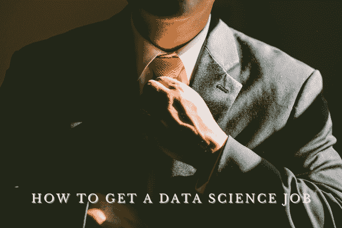
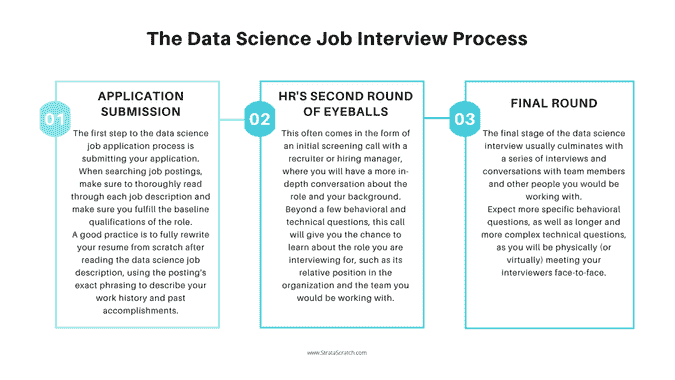
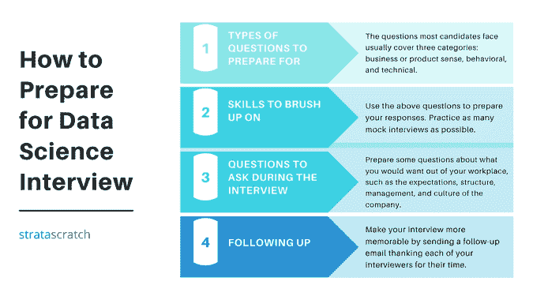

# 如何获得数据科学工作:终极指南

> 原文：<https://towardsdatascience.com/how-to-get-a-data-science-job-the-ultimate-guide-d5035d321d2c?source=collection_archive---------36----------------------->

## *在这里，我们提供了一个非常具体和实用的指南，告诉你如何在数据科学领域找到理想的工作*

图片来自 [Canva](https://canva.com/)

每个行业的数据需求都使数据科学成为发展最快的领域之一，任何数据科学职位都有可能成为高增长职业。与此同时，数据科学仍然是一个相对较新的领域，任何特定角色的职责、结构和需求在不同的行业和公司都可能有很大的不同。近年来，人们对获得数据科学领域的工作很感兴趣。那么你是怎么做到的呢？

# 如何获得数据科学工作？

## 闯入数据科学

对于那些希望在数据科学领域开始职业生涯的人来说，无论是刚刚开始职业生涯的人还是处于职业转变过程中的人，都需要考虑入门级数据科学角色需要什么样的基准。尽职调查你自己的技能和经验:你需要在哪些方面有所提高？数据科学非常强调计算、数学、统计和编程，虽然不是绝对必要的，但大学学位或高等学位对进入数据科学非常有帮助。

另一个重要的步骤是反思你的个人兴趣所在，以及这与你过去的经历有何不同。对于那些以前在其他领域有工作经验的人来说，哪些技能有可能延续下去？几乎每个行业都有广泛的数据需求和数据科学工作。这意味着，即使你过去没有明确的数据工作经验:你的专业知识仍然可以发挥作用，特别是如果你希望留在同一个行业，并且能够利用以前的经验。

虽然科技和信息行业中的数据科学最为人所知，但金融和医疗保健行业仍有许多数据需求，这两个行业本身就是主要行业。教育、酒店、娱乐甚至公共部门对数据科学工作的需求也越来越大，这意味着任何过去的经验都可能有助于你进入数据科学领域。医疗工作的经历意味着你可以为医疗保健数据方面的任何角色带来独特的视角。营销历史意味着你了解商业世界，可能特别适合商业分析师的职位，或者至少比一般的数据科学专业更适合，尽管他们有正式的数据科学背景。

请记住，数据科学是一个快速发展的行业，许多公司甚至在内部招聘他们的数据角色，其思维过程是，例如，在技术数据分析方面培训业务人员比教授数据科学家抽象业务概念更容易。

*查看我们在* [*上的博文如何从零开始学习数据科学*](https://www.stratascratch.com/blog/how-to-start-learning-data-science-from-scratch/?utm_source=blog&utm_medium=click&utm_campaign=medium) *！*

## 建筑地基

回到检查你的技能和经验，花点时间了解你自己的优势在哪里。数据科学涵盖一系列广泛的技能，对您可能缺乏的任何领域进行分类和研究非常重要。

网上有各种资源和教育平台，包括一些来自知名大学的资源和教育平台，涵盖了数据科学领域的各种概念，如 [Coursera](https://www.coursera.org/) 、[麻省理工学院开放式课件](https://ocw.mit.edu/courses/institute-for-data-systems-and-society/)、 [DataCamp](https://www.datacamp.com/) 等。不同的教育平台有不同的专业:大学附属课程通常涵盖数据科学的广泛介绍，像 DataCamp 这样的在线课程允许你深入了解个别概念并按照自己的速度学习，像 [StrataScratch](https://platform.stratascratch.com) 这样的在线课程专注于如何回答从真实的数据科学工作面试中提取的特定技术面试问题。

*查看我们关于* [*如何用 Python 学习数据科学的指南*](https://www.stratascratch.com/blog/how-to-learn-data-science-with-python/?utm_source=blog&utm_medium=click&utm_campaign=medium) *。在之前的一篇博客文章中，我们还介绍了* [*25 个数据科学训练营和课程来促进您的职业发展*](https://www.stratascratch.com/blog/25-data-science-bootcamps-and-courses-to-grow-your-career/?utm_source=blog&utm_medium=click&utm_campaign=medium) *。*

虽然一些[数据科学技术技能](https://www.stratascratch.com/blog/most-in-demand-data-science-technical-skills/?utm_source=blog&utm_medium=click&utm_campaign=medium)和要求，特别是对于更高级和更高级的数据科学角色，只有在多年的工作经验中才能获得，但大多数入门级数据科学角色仍然需要一些通用技能，任何有抱负的数据科学家都应该确保他们熟悉这些技能，如 Microsoft Excel、Python 和 SQL 等编码语言以及统计分析。

温习一下基础知识，确保你还记得来龙去脉，或者深入一些你不太熟悉或者有兴趣建立专业知识的特定领域。专业化很重要！请记住，数据科学是一个非常广阔的领域，光有一般知识是不够的。随着你职业生涯的进一步深入，目标是找到数据科学生产线的特定部分，并成为该领域的专家。

尽管主要是一个技术领域，数据科学领域仍然需要你能够推销自己，尤其是在招聘过程中。换句话说，确保你已经在网上建立了自己的形象。虽然 LinkedIn 是每个在职专业人士的基准标准，但数据科学的有志之士也应该立足于许多其他途径。在 GitHub 上发布项目或建立自己的网站作为数据科学博客或作品集。这有助于展示您在数据科学特定领域的兴趣和技能，或者只是展示您知道如何讲述故事以及传达您的想法和思维过程。

*还有，查看数据科学组合创意* [*这里*](https://www.stratascratch.com/blog/data-science-portfolio-project-ideas-that-can-get-you-hired/?utm_source=blog&utm_medium=click&utm_campaign=medium) *。*

让你自己和你的工作在网上可见对你的数据科学求职大有裨益。除了作为您可以在申请中提交的技能的额外见解来源，它还可以成为招聘人员根据可用信息联系您的机会，发送符合您技能组合的工作邀请，并节省您搜索合适的数据科学职位发布的时间和精力。除了潜在的全职工作，还可能出现其他咨询或兼职的机会。甚至在更远的将来，保持这种在线状态可以帮助你找到潜在的机会，即使你并没有主动寻找它们，招聘人员会主动联系你。

但回到最重要的部分:在网上展示意味着更多关于你自己的信息，以证明你的技能和经验，以及更多关于你的思维过程和工作风格的潜在见解，供公司在你更深入地寻找数据科学工作时查看。让我们更深入地了解这份关于如何获得数据科学工作的终极指南，并立即检查工作申请流程。

# 数据科学工作面试流程

大多数[数据科学公司](https://www.stratascratch.com/blog/ultimate-guide-to-the-top-5-data-science-companies/?utm_source=blog&utm_medium=click&utm_campaign=medium)将他们的申请流程分为三个部分:最初的申请提交，与招聘经理的通话，然后是与团队成员的最后一轮，整个过程持续几周。该流程因公司而异，每个数据科学面试的总次数或长或短都不相同。你申请数据科学工作的环境也会影响你的申请过程，例如，你是否被招聘人员看中，是否在内部申请，或者是否通过推荐被介绍到该职位。

*请注意，在《疫情》的拍摄过程中，任何采访都会有进一步的中断，很可能是虚拟场景。*

作者创造的形象

## 申请提交

显然，数据科学工作申请流程的第一步是提交申请。当搜索职位发布时，确保通读每一个职位描述，并确保你符合该职位的基本资格。确定公司正在寻找的品质，以及公司的产品和使命，并决定你的技能和经验是否符合该职位的要求。一个好的做法是，在阅读数据科学职位描述后，从头开始完全重写你的简历，使用公告的准确措辞来描述你的工作经历和过去的成就。

许多公司还要求在他们的数据科学职位发布中附上一封求职信，尽管这通常是一个好主意，你可以在提交的任何申请中附上一封求职信，以获得额外的机会来展示你的能力，更不用说只是表明你愿意付出努力并采取额外的步骤。使用求职信简要介绍你自己和你的背景，以及你的技能和成就如何与这个角色和公司相匹配。回到你对公司产品和使命的研究，描述你为什么想在那里工作，或者这个职位的哪些方面让你感兴趣。

最后，为了得到一份数据科学的工作，在你的申请中加入任何你的在线状态的链接，例如你的 LinkedIn、Github、portfolio、portfolio 等，引起人们对你过去项目中与你申请的职位职责相似的任何特定元素的注意。

## HR 的第二轮眼球

如果你在简历和求职信中有正确的技能和经验，符合数据科学职位发布的职责，你就可以进入流程的下一步，与真正的人交谈！这通常是以与招聘人员或招聘经理进行初步筛选电话的形式出现的，在这种情况下，你会就该职位和你的背景进行更深入的交谈。可能还有一个带回家作业的中间步骤，通常以编码评估的形式来测试你的数据分析和编码能力。

除了一些行为和技术问题之外，这个电话会给你一个机会去了解你正在面试的角色，比如它在组织中的相对位置和你将要工作的团队。你也可以借此机会询问面试过程的其余部分会是什么样子，甚至可能询问接下来会遇到什么样的[数据科学家面试问题](https://www.stratascratch.com/blog/data-science-interview-guide-questions-from-80-different-companies/?utm_source=blog&utm_medium=click&utm_campaign=medium)。

## 最后一轮

数据科学面试的最后阶段通常以与团队成员和其他同事的一系列面试和对话而告终。一些公司甚至要求你去他们的办公室，进行现场面试。在那里，你将有一个更深入的对话，探索你是如何工作的，你的特殊技能和背景。如果在面试过程的早期有一个编码评估，你也可能有机会在面试中回顾你的工作，解释你的思维过程和解决给定问题的方法。

期待更具体的行为问题，以及更长更复杂的技术问题，因为你将与你的面试官面对面(或虚拟地)见面。这意味着你有更多的机会通过问题和你的思考过程来交流和讨论。与未来潜在同事的面试过程中，这一阶段也是你深入了解工作和角色的机会。借此机会了解关于角色或责任的任何细节，以及更广泛的团队和公司文化。

# 如何准备数据科学工作面试

面试是一种独特的社交场合，许多人可能会觉得处理起来压力很大。做好面试的关键是保持冷静，并提前做好适当的准备。

为后勤工作做一个计划:带上多份最新的简历，提前 10 到 15 分钟到达，在前一天晚上计划好去面试地点的交通路线。在面试中，记住你的回答要集中和切题，直接回答被问到的问题。虽然背景当然很重要，但你在谈话中创造良好第一印象的时间也是有限的。注意不要离题。

对公司本身进行研究，尽最大努力了解他们的目标、文化和产品。能够用自己的话准确描述公司的工作。了解公司文化是帮助你决定面试时合适着装的关键，无论是正式的还是办公室便装。此外，像 [Glassdoor](https://www.glassdoor.com/Interview/index.htm) 这样的资源可以让你深入了解数据科学面试的结构，甚至确切地知道会问什么问题。

*我们在这里* *谈谈准备数据科学面试的最佳资源* [*。*](https://www.stratascratch.com/blog/4-resources-to-prepare-for-data-science-interviews/?utm_source=blog&utm_medium=click&utm_campaign=medium)

作者创造的形象

## 要准备的问题类型

数据科学面试问题通常分为三类:业务或产品意识、行为和技术。

商业或产品意识问题涵盖了你对所申请公司的了解和兴趣。对这家公司进行调查很重要，这样你就能了解他们在做什么，并能够谈论它，甚至为你可能看到的潜在问题提供解决方案。这类问题包括最基本的“你为什么想在这里工作？”与公司产品相关的特定场景。

行为问题有助于面试官更好地了解你如何在团队环境中工作、沟通和处理冲突。最典型的问题包括一般性的自我介绍，或者浏览你提交的简历。“告诉我一次……在哪里？”的变体也很常见。这些通常是你应该提前准备好的问题。

技术题涵盖统计分析和[编码密集题](https://www.stratascratch.com/blog/data-science-coding-interview-questions-with-5-technical-concepts/?utm_source=blog&utm_medium=click&utm_campaign=medium)，一般是最难准备的题型。查看在线资源，如 Glassdoor，查找该公司在该职位或类似职位的其他面试中提出的问题，以了解最近可能会提出的技术问题。更广泛地说，招聘启事，甚至是公司本身的公开信息，都可以给你关于面试官想要测试的特定技能的信息。

请记住，不同的公司对一个角色的实际要求有不同的标准，有些公司可能需要更专注于代码，而其他公司则需要广泛的统计能力或机器学习。

看看以上所有内容，你最需要复习的是哪些方面？

## 需要温习的技能

首先，重要的是建立(或重新建立)你对面试的总体感觉。特别是对于那些最近可能没有参加面试的人，无论是因为最近刚离开学校还是在以前的职位上花了相当多的时间，确保让自己熟悉工作面试的社交环境。我们已经讨论了需要准备的问题类型，您可以使用这些信息来准备对常见问题的回答。在模拟面试中找一个朋友来回答这些问题并给你反馈也是有帮助的。

接下来，花点时间想一想你对哪些数据科学概念和想法最有经验，谈论起来最舒服。另一方面，上一节中的哪些技术概念甚至是招聘启事本身让你有点不舒服，或者你回答起来没有那么自信？

即使对于那些没有那么多关于面试过程的公开数据的小公司，你仍然可以通过大量的在线教育资源进行具体数据科学概念的一般实践。在我们关于 [18 个最值得推荐的学习 Python 和 SQL 的数据科学平台](/18-of-the-most-recommended-data-science-platforms-to-learn-python-and-sql-f969f61b6d70)的博客文章中，我们比较了不同的教育平台。当你思考你在哪些方面最需要支持时，用它。

## 面试时要问的问题

请记住，面试过程的一部分就是你依次面试这家公司，以决定你是否觉得这家公司和这个职位非常适合你。相应地准备一些关于你想从工作场所得到什么的问题，比如公司的期望、结构、管理和文化。在面试过程的早期，你甚至可以选择询问面试过程其余部分的结构，包括接下来你要和谁谈话，甚至可能会问什么类型的问题。

当然，针对面试官给你的任何信息提出一些问题也很重要。你可以跟进面试官对你其他问题的任何回答，要求澄清公司结构或团队环境，并跟进他们提到的任何项目。

最后，记住你不需要把你的问题留到最后。面试应该是一种对话。特别是对于他们问你的任何技术问题，有时甚至是行为或产品问题，在回答之前要澄清你的任何不确定性。提出问题并澄清任何潜在的错误假设可能是给出一个好的、全面的答案并获得一份数据科学工作的关键。

## 后续行动

花点时间发一封跟进邮件，感谢每一位面试官的宝贵时间。除了礼貌之外，这也是一个让你的面试更令人难忘的机会，你可以在写作中提出具体的时刻，帮助你的面试官在以后的工作中记忆。这也是你加入任何额外想法的机会，比如你在谈话中没有提到的你的历史，或者任何比你最初所说的更完美的答案的额外想法。

# 摘要

数据科学是一个快速发展的职业，在每个行业都有机会，不仅仅是在技术领域。如果你想进入数据科学领域，任何以前的经验都可以继续。查看在线资源和教育平台，弥补你的知识缺口，特别是使用 Microsoft Excel、Python 和 SQL 的数据科学基础知识，以及统计学。当你进入面试过程时，记得做你的调查，彻底适应面试的社会环境。祝你好运！

*最初发表于*[*【https://www.stratascratch.com】*](https://www.stratascratch.com/blog/how-to-get-a-data-science-job-the-ultimate-guide/?utm_source=blog&utm_medium=click&utm_campaign=medium)*。*