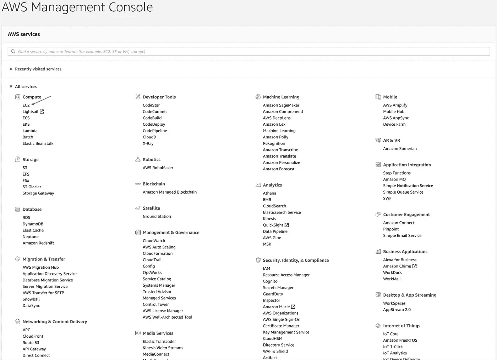
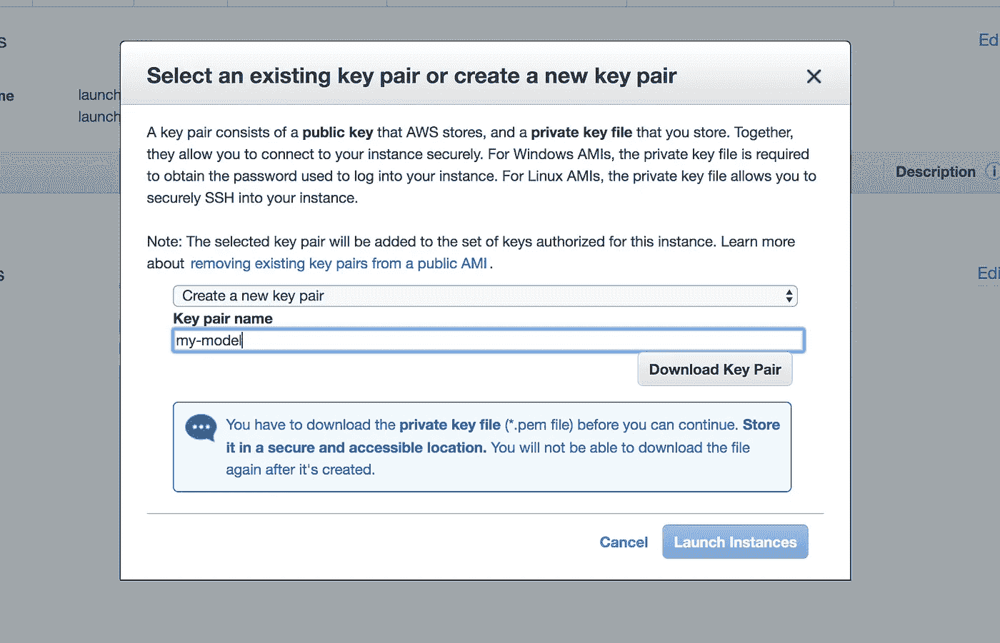
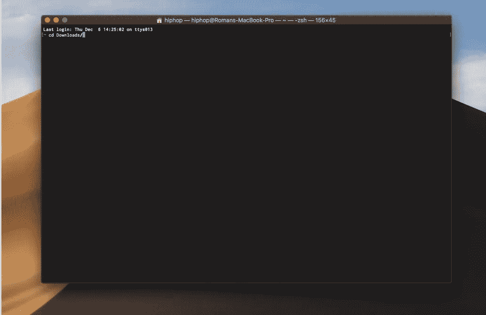
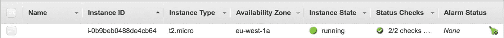
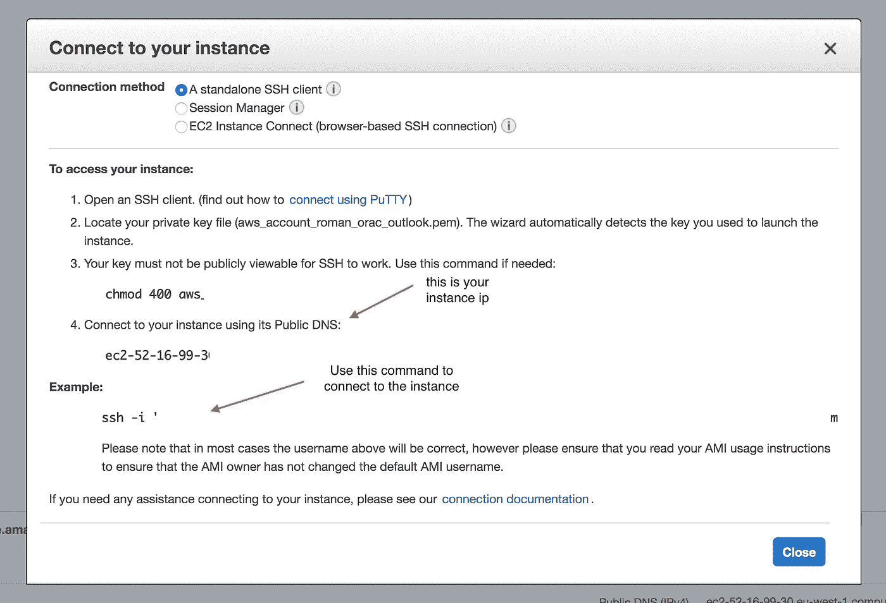
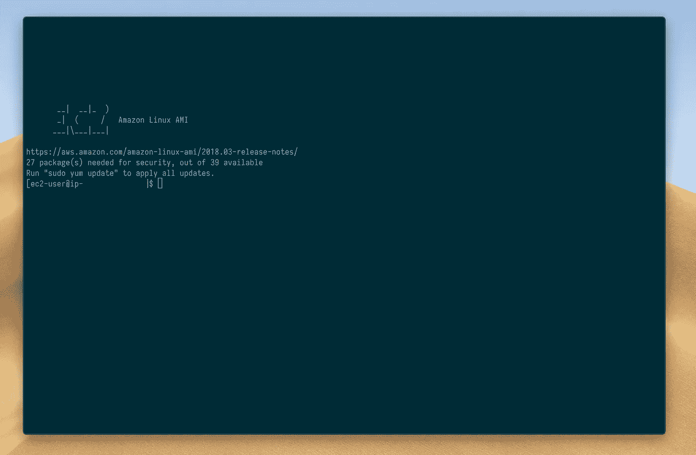
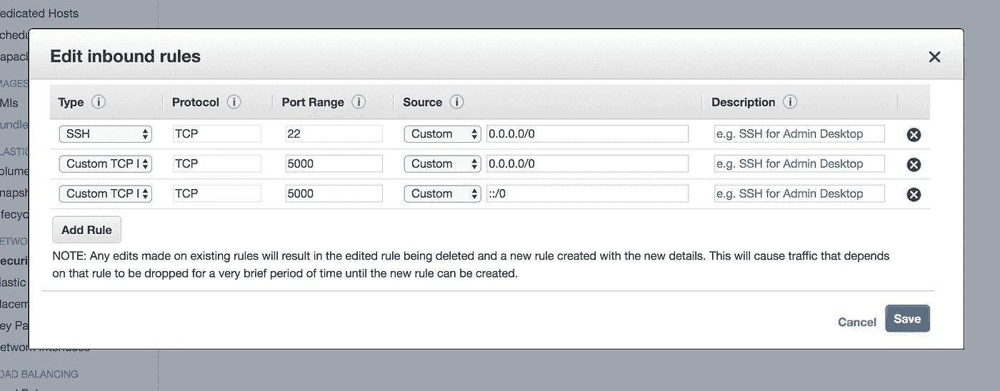
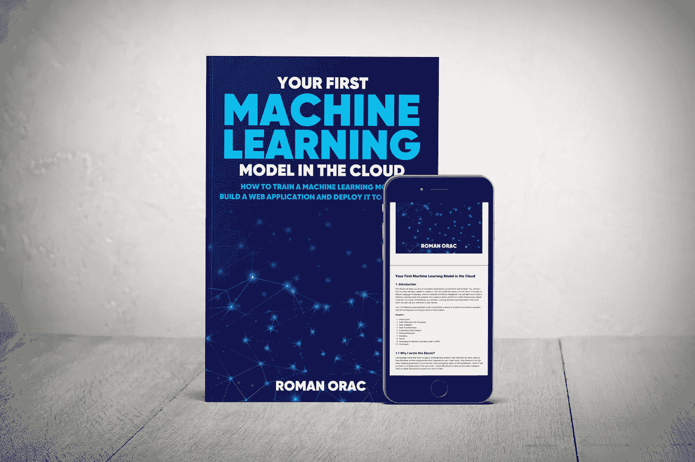

# 如何获得机器学习模型的免费服务器

> 原文：<https://towardsdatascience.com/how-to-get-a-free-server-for-a-machine-learning-model-efa35a1fe511?source=collection_archive---------26----------------------->

## 关于如何在世界任何地方启动和配置免费服务器的 10 步教程


保罗·花冈在 [Unsplash](https://unsplash.com?utm_source=medium&utm_medium=referral) 上的照片

拥有一台永远在线的服务器是向你未来的雇主展示你的参考资料或者在现实世界中测试你的机器学习模型的一个很好的方式。

在我们开始之前，我想披露我与亚马逊没有任何关系。你在本文中学到的方法应该也适用于其他云提供商(比如微软 Azure，谷歌云平台)。

我写这篇文章是因为我觉得你拥有这些知识很重要。我希望在我有太多时间和金钱的大学时代有人能教我这些。

## 通过阅读本文，您将了解到:

*   什么是 AWS？
*   如何创建 AWS 帐户？
*   如何在世界任何地方启动免费服务器？
*   如何配置服务器？
*   如何连接服务器？
*   关于如何编写服务器代码的一些提示。

# 什么是 AWS？


丹尼尔·埃勒杜特在 [Unsplash](https://unsplash.com?utm_source=medium&utm_medium=referral) 上的照片

亚马逊网络服务(AWS)是亚马逊的一家子公司，以按需付费的方式向个人、公司和政府提供按需云计算平台和 API。

这些云计算 web 服务提供了各种基本的抽象技术基础设施和分布式计算构件和工具。AWS 在全球范围内提供可靠、可扩展且廉价的云计算服务。

AWS 为新用户提供特别优惠。您可以免费运行一个小型服务器实例一年。

# 1.创建 AWS 帐户

首先创建一个[亚马逊网络服务账户](https://aws.amazon.com/)。你需要一张信用卡来注册。可能需要一些时间来验证。

# 2.登录 AWS

1.  登录您的 AWS 帐户。
2.  在 AWS 管理控制台中选择 EC2。



AWS 管理控制台(图片由作者提供)。

# 3.设置实例

1.  单击启动实例按钮。
2.  选择一个亚马逊机器镜像(AMI):
    选择亚马逊 Linux 2 AMI (HVM)，SSD 卷类型
3.  选择实例类型:
    通用 t2.micro 自由层合格
4.  单击查看并启动。
5.  复查实例启动:
    单击启动
6.  选择现有的密钥对或创建新的密钥对:
    在选择现有的密钥对选择框中选择:创建新的密钥对。
    在密钥对名称类型中:my-model。
    点击下载密钥对并启动实例。



选择密钥对对话框(图片由作者提供)。

# 4.连接到实例

1.  单击查看实例按钮。
2.  在您的个人计算机上打开终端(如果您使用的是 Windows，请打开命令提示符)并找到您之前下载的密钥(下载文件夹)。要在终端运行中移动到下载文件夹:

`cd Downloads`



带 cd 命令的终端(图片由作者提供)。

3.为您的密钥设置权限(如果您使用的是 Windows，请跳过此步骤):

`chmod 400 my-model.pem`

4.等待您的实例进入运行状态:



等待您的实例进入运行状态(图片由作者提供)。

# 5.连接到服务器

1.选择实例并单击 Connect 按钮(记住实例 IP，因为您稍后将需要它)。



连接到你的实例(图片作者)。

2.在个人机器的终端窗口上；从 AWS 上的**示例**(当您点击连接按钮时会看到此示例)中复制连接命令；并将其粘贴到您个人机器的终端上；以连接到 AWS 实例；它看起来应该如下所示:

`ssh -i "my-model.pem" ec2-user@XX-XX-XXX-XX.compute.amazonaws.com`

如果询问:您确定要继续连接吗(是/否)，请键入 yes？

当成功连接到 AWS 实例时，您应该看到以下 ASCII 图片:



连接 AWS 服务器(图片由作者提供)，

# 7.更新服务器

1.  必要时更新实例:`sudo yum update -y`。

# 8.开放端口

如果计划在实例上运行 web 服务器，请确保打开入站端口，以便能够从 web 浏览器访问它。在下面的例子中，我打开了用于 Flask Web 框架的端口 5000。

1.  单击 Services，选择 EC2，选择 Running instances 并向右滚动，然后单击您的实例的 Security Groups 链接:



编辑入站规则，如下图所示，然后单击保存(图片由作者提供)。

# 9.部署分析 Web 服务器

空服务器并不比没有服务器好多少。

要部署基于 pandas 的数据分析服务器，请参见:

[](/pandas-analytics-server-d64d20ef01be) [## 熊猫 Web API

### 这是一个开源项目，简化了熊猫与实时数据的连接，测试假设和可视化…

towardsdatascience.com](/pandas-analytics-server-d64d20ef01be) 

# 10.将机器学习模型部署到服务器



[你在云端的第一个机器学习模型](https://gumroad.com/l/mjyDQ)(图片作者提供)。

生产中的真实项目比在线课程的证书更有价值。这就是为什么我写了[你的第一个云端机器学习模型](https://gumroad.com/l/mjyDQ)。

[云中的第一个机器学习模型](https://gumroad.com/l/mjyDQ)将教你如何开发机器学习模型并将其部署到云中的服务器上。

# 在你走之前

```
- [How To Create Date Series in SQL](https://dataanalysis.substack.com/p/how-to-create-date-series-in-sql) [Article]- [Free skill tests for Data Scientists & Machine Learning Engineers](https://aigents.co/skills)- [Advance your Career in Cybersecurity (60% off) [Course]](https://imp.i115008.net/c/2402645/1024607/11298)- [Become a Cloud Developer using Microsoft Azure [Course]](https://imp.i115008.net/c/2402645/895504/11298)- [Master SQL, the core language for Big Data analysis [Course]](https://imp.i115008.net/c/2402645/828410/11298)
```

上面的一些链接是附属链接，如果你通过它们进行购买，我会赚取佣金。请记住，我链接课程是因为它们的质量，而不是因为我从你的购买中获得的佣金。

在[推特](https://twitter.com/romanorac)上关注我，在那里我定期[发关于数据科学和机器学习的推特](https://twitter.com/romanorac/status/1328952374447267843)。


照片由[Courtney hedge](https://unsplash.com/@cmhedger?utm_source=medium&utm_medium=referral)在 [Unsplash](https://unsplash.com/?utm_source=medium&utm_medium=referral) 上拍摄