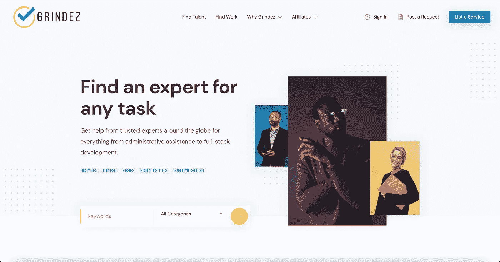

# 如何获得远程数据科学工作

> 原文：<https://towardsdatascience.com/how-to-get-a-remote-data-science-job-b813d3ff88ae?source=collection_archive---------36----------------------->

## 在 Gig 经济中利用数据科学的未来

曼尼·潘托贾在 [Unsplash](https://unsplash.com?utm_source=medium&utm_medium=referral) 上的照片

越来越少的人在办公室工作，越来越多的人在家办公，远程办公已经变得司空见惯。随着自由职业者和远程工作在数据科学和几乎每个行业中的转变，问题仍然存在…获得自由职业者或远程数据科学工作的最佳方式是什么？

自由职业者的经济经历了一个巨大的增长，有才华的个人寻找自己的时间工作。自由职业者可以自由选择他们想要的工作方式。从外面做自由职业看起来很令人惊讶，一个人怎么能呆在家里远离电脑或笔记本电脑工作呢？幸运的是，我计划给你一个我在零工经济中从事自由职业多年所经历的市场的概述，以及你可以做些什么来增加你被聘为自由职业数据科学家的机会。

什么是自由职业？在零工经济中，自由职业要求你拥有一项技能，你可以向客户提供这项技能，并以此赚取某种价值。如果你已经决定了你想赚钱的技能，那么你就可以开始成为自由职业者的旅程。另一件要记住的事情是，你是否打算远程工作，或者你是否愿意在办公室工作。自由职业也可以是一种体力职业。

我为全球不同的创业公司做自由撰稿人。薪酬越高的工作通常位于加州或纽约之外。我从事自由职业已经 7 年多了。我认为现在是开始自由职业的最佳时机。此外，不要害怕接受其他货币的任务。我被要求完成的一些最好的工作都是用比特币支付的，这种货币在未来会越来越多。

# 准备

自由职业者和远程工作看起来很棒。但是，为了保证一个光明的未来，准备工作是绝对必要的。有些事情要记住，你最有可能想要的是一个能让你以最佳状态工作的环境。对一些人来说，这是一个繁忙的咖啡馆，但对另一些人来说，这可能是图书馆里一个安静的地方。稳定的互联网和电力连接是必须的，尤其是如果你有最后期限。当你与客户一起规划项目时，你将如何与他们沟通？远程工作时，您不在现场，因此通常会有一点障碍。另一个要考虑的是你的社交生活。因为你不会有同事，如果你选择在安静的环境中工作，你不能依赖频繁的面对面聊天。

# 寻找职位和申请

既然你已经做好了准备，是时候利用你的努力、动力和技能了。幸运的是，自由职业者和偏远地区的机会数不胜数。有些人甚至用加密货币支付任务支出。大多数自由职业者和远程网站都提供工作通知，所以一定要设置好。

# [Grindez——完成任务](https://grindez.com/)

grindez.com

[Grindez](https://grindez.com) 是自由职业者的首选市场。Grindez 是由[ul ready](https://ualready.com/)打造的 p2p 工作平台。作为以加密货币支付为主机的求职市场，Grindez 通过智能合同将自由职业者和客户联系起来，实现了强大的保护和高效的托管支付——无论不同方位于何处。如果你熟悉任何一个大的和成熟的自由职业平台，那么你会对他们在自由职业者市场上的特色感到满意。

基本上它是如何工作的，你注册一个账户，然后列出清单。公司也会发布工作要求。

Grindez 提供的一个我最喜欢的功能是用 [**比特币和加密货币**](https://grindez.com/listing/) 支付。Grindez 提供与其他自由职业者市场类似的所有常见支付方式，但以加密货币支付任务总是很好。这些付款当然要遵循通常的托管方法，以确保卖方和买方的利益都得到照顾。
接下来，我最喜欢的功能之一是搜索提醒。基本上，当网站上有新的工作请求或符合工作标准的列表时，您会收到通知。

我很高兴 Grindez 提供实时列表统计，这样用户就可以看到每次新用户或现有用户查看列表。我最喜欢的另一个功能是 Grindez 的联盟计划。用户可以从他们推荐到网站的人完成的工作中赚取佣金。而且，Grindez 是实时工作的。即时给其他自由职业者或公司发消息的能力对于讨论重大事件或处理纠纷非常方便。

# 在您开始数据科学自由职业之旅之前

## 专攻任何事情

对每项技能的需求总是存在的。决定专注于哪项技能通常很困难，所以为什么不列出你拥有的每项技能呢？那么你肯定会被录用。

专攻某件事，真的是任何事，都能让你与潜在客户建立更多的信任，你也更容易被那些寻找确切服务的人接近。

## 清晰地交流

你的潜在顾客，尤其是你的客户是你的收入来源。始终保持清晰的沟通，尽可能提供诚实和最好的客户服务。如果你碰巧犯了一个错误，那就对雇主诚实。没有人希望自己的时间被浪费，所以要为自己的行为负责。

## 迎接挑战

当你和客户一起工作时，很容易被自己对项目前景的设想所束缚。然而，有时你完成的工作跟你的客户不一样。开诚布公地讨论你面临的挑战，你的挑战很可能不再困难。

## 为什么自由数据科学远程工作不一样？

数据科学与其他行业的不同之处通常在于经验上的差距。最大的数据科学雇主通常是大型科技公司或拥有大量数据集的公司，这些公司正在建设大型办公园区，很少提供远程工作。

# 总结了获得第一份工作的技巧

*   与试图雇佣你的人交流
*   按时高标准地完成工作
*   让客户知道我完成了
*   解释清楚我做了什么
*   如果适用，解释我没有做的事情
*   征求对工作的反馈
*   请求对我的后续工作评估给予积极反馈
*   建议我将来可以做的相关工作

# 最后的想法

如果你正在考虑从事自由职业，那么干得好！创办自己的公司并为自己工作是非常有益的，也是增长技能的好方法。从我自由职业的旅程开始，学习如何推销自己和接触新的机会是非常有趣的。你真正需要弄清楚的是，自由职业是否适合你，你将提供哪些技能，以及在哪里推销自己。一旦你搞清楚了这些，剩下的就容易了。

知识就是力量！分享你的知识，开源你的项目，加入一个社区(任何社区！)，也许只是发表一篇关于它的博文。

欢迎建设性的批评和反馈。可以在 Instagram [@nirholas](http://instagram.com/nirholas?ref=hackernoon.com) 、 [LinkedIn](http://linkedin.com/in/nixholas?ref=hackernoon.com) **、**和 [Twitter @nickresendez](https://twitter.com/nickresendez) 上联系到 Nicholas Resendez，了解新文章的更新。