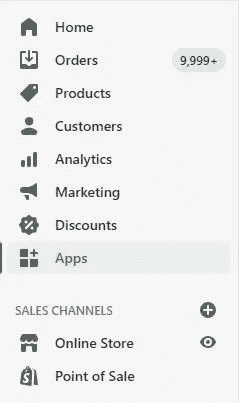
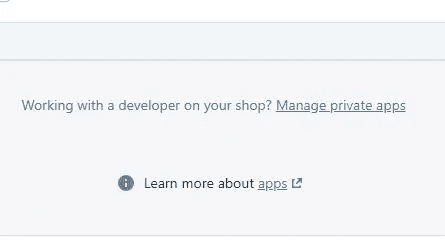
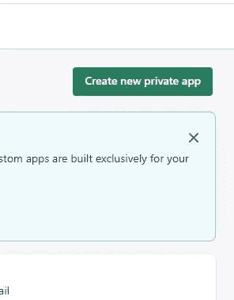
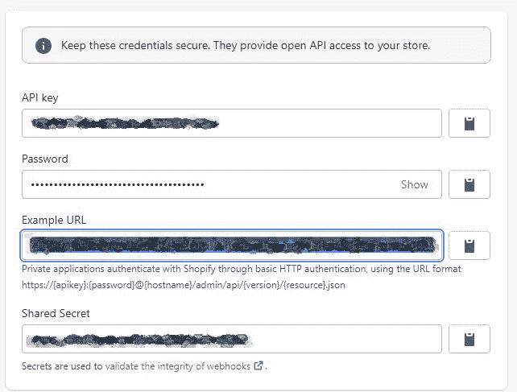
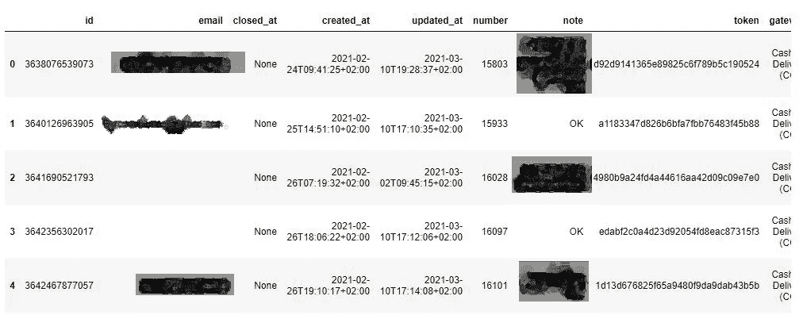

# 如何从 Shopify 获得所有订单

> 原文：<https://towardsdatascience.com/how-to-get-all-orders-from-shopify-69db163c7a2d?source=collection_archive---------13----------------------->

## Shopify API 调用入门


在 [Unsplash](https://unsplash.com/s/photos/shopping?utm_source=unsplash&utm_medium=referral&utm_content=creditCopyText) 上 [Cam Morin](https://unsplash.com/@camorin13?utm_source=unsplash&utm_medium=referral&utm_content=creditCopyText) 拍摄的照片

Shopify 是最著名的建立网上商店的平台之一。作为一名数据科学家，我多次被要求构建一些集成到 Shopify 中的东西，如订单的自动描述性分析、ERP 连接器等。我们要做的第一件事是从 Shopify 获取我们想要的所有信息，即订单及其信息。在本帖中，我们将向您展示如何设置一个私有应用程序，并使用它来获取 python 中超过 250 行限制的所有订单。

# 在 Shopify 中创建私人应用程序

首先，我们需要创建一个私有应用程序来获取 API URL。

第一步:导航到左边，点击**应用**



第二步:向下滚动，点击**管理私人应用**



第三步**:创建一个新的私人应用**



创建应用程序后，您可以获得我们将在示例 url 占位符中使用的 URL。



# 获取所有订单

现在，您应该有一个以下格式的 URL:

```
[https://{apikey}:{password}@{hostname}/admin/api/{version}/{resource}.json](https://{apikey}:{password}@{hostname}/admin/api/{version}/{resource}.json)
```

我们希望获得所有订单，所以我们需要在 URL 中添加一些变量。

*   **limit=250** ，这是我们能拿到的最大订单数。
*   **fulfillment _ status = unfully**，我们将获得所有未履行的订单，因此我们将使用未履行状态。您可以删除它，并获得已履行的订单。
*   **因为 _id=** ，这意味着我们想要从我们将提供的订单 id 开始的所有订单。我们将用它来超过 250 个订单的限制。

这里的技巧是在每次 API 调用后获取最旧的订单 ID，并在下一次调用 since_id 变量时使用它。然后，当 API 将返回少于我们的限制(250)时，我们停止循环并返回**订单**数据帧。

```
import pandas as pd
import numpy as np
import re
import requests def get_all_orders():
    last=0
    orders=pd.DataFrame()
    while True:
        url = f"https://{apikey}:{password}@{hostname}/admin/api/{version}/{resource}.json?limit=250&fulfillment_status=unfulfilled&since_id={last}"
        response = requests.request("GET", url)

        df=pd.DataFrame(response.json()['orders'])
        orders=pd.concat([orders,df])
        last=df['id'].iloc[-1]
        if len(df)<250:
            break
    return(orders)df=get_all_orders()
df.head()
```



# 最后的想法

个人认为 Shopify 有很多自由职业者数据科学家的机会。需要定制应用程序、API 或仅仅是分析，在大多数情况下，除了订单，你不需要任何其他信息。

以后我会写更多初学者友好的帖子。[在媒体上关注我](https://medium.com/@billybonaros)或[访问我的博客](https://predictivehacks.com/)了解他们。

我欢迎提问、反馈和建设性的批评，你可以通过推特(Twitter)或社交网站(Instagram)联系我。

*原载于*[*https://predictivehacks.com*](https://predictivehacks.com/how-to-get-all-orders-from-shopify-in-python/)