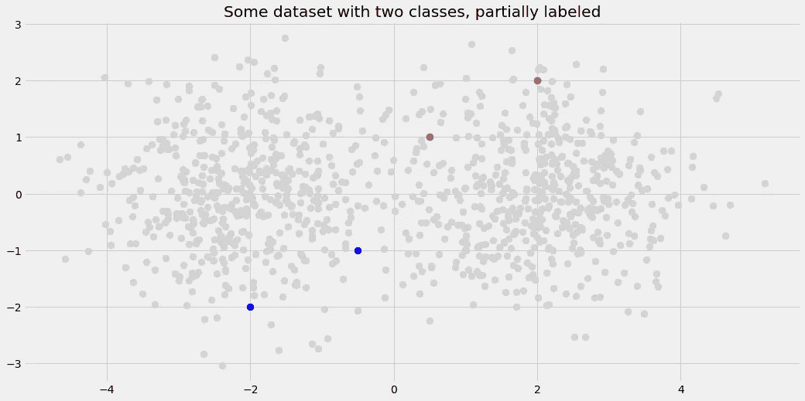
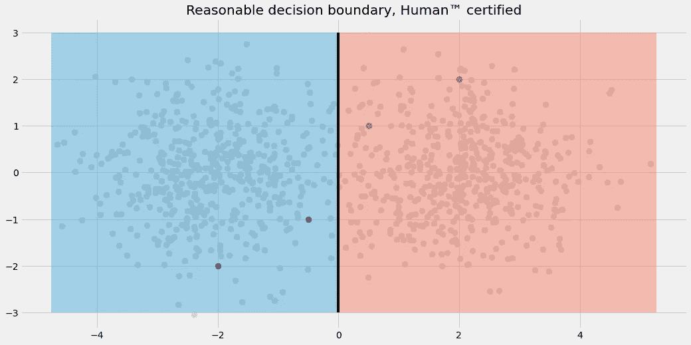
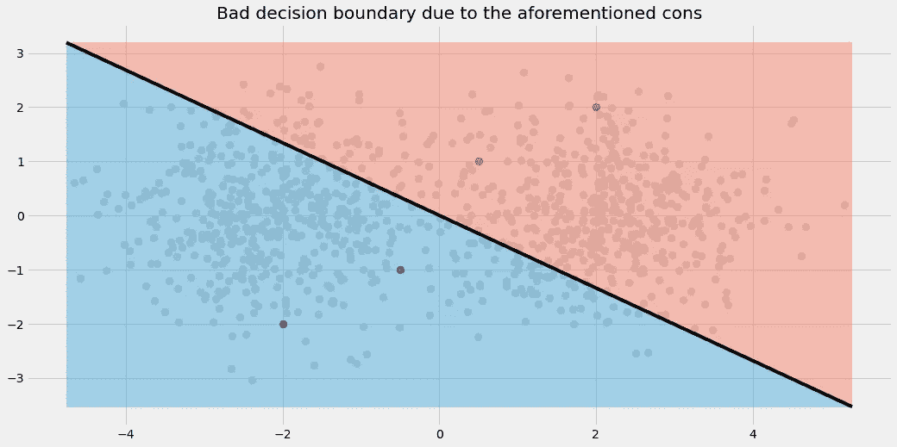
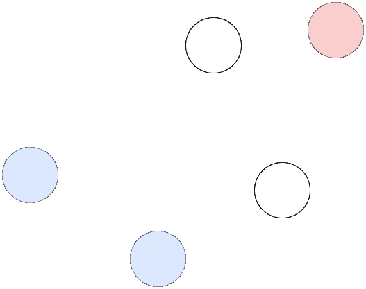
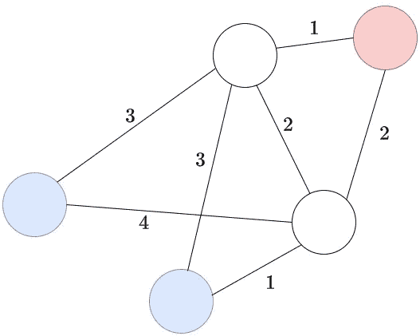
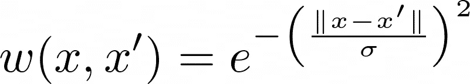
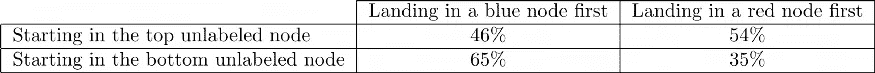
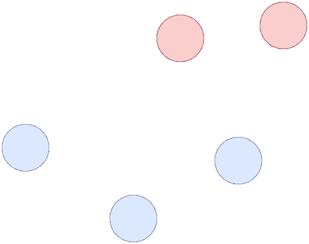

# 如何摆脱标签少:标签传播

> 原文：<https://towardsdatascience.com/how-to-get-away-with-few-labels-label-propagation-f891782ada5c?source=collection_archive---------3----------------------->

## [理解大数据](https://towardsdatascience.com/tagged/making-sense-of-big-data)

## 聪明一点，不要自己手动标注数百甚至数千个数据点。


照片由[布兰卡·帕洛玛·桑切斯](https://unsplash.com/@blancaplum?utm_source=medium&utm_medium=referral)在 [Unsplash](https://unsplash.com?utm_source=medium&utm_medium=referral) 上拍摄

# 介绍

美国数据科学家的一个经典任务是为某个问题建立分类模型。在一个完美的世界里，数据样本——包括它们相应的标签——是放在一个银盘里交给我们的。然后，我们使用机器学习技巧和*Mathematica*从数据中得出一些有用的见解。到目前为止一切顺利。

然而，在我们这个不完美却又美丽的世界里，经常发生的事情是以下之一:

1.  **我们得到一个极小的数据集，它至少是完全标记的。在这种情况下，构建模型可能会非常棘手。我们必须使用先进的特征工程，甚至可能使用贝叶斯方法和其他工具来解决这个问题。以 Kaggle 上的[过拟合挑战为例:训练集由 250 个训练样本和 200 个特征组成。玩得开心。](https://www.kaggle.com/c/overfitting/)**
2.  **我们得到了足够的数据，但却没有任何标签。嗯，运气不好。尝试聚类，但这不一定能解决您的分类问题。**
3.  **我们得到了足够的数据，但只是部分标注。这正是我们将在本文中讨论的内容！继续读。**

让我们假设从现在开始我们处于第三种情况:我们的数据集的大小相当不错，我们有几千个样本，甚至可能是一百万个。但是看着标签，挫败感油然而生— **只有一小部分数据被贴上了标签！**

在本文中，我将向您展示如何处理这些常见的情况。

# 天真的方法

接近这个设置的最简单的方法是把它转换成我们更熟悉的东西。具体来说:

> 丢弃未标记的数据点，并在剩余的完全标记但较小的数据集上训练分类器。

我们来分析一下这种做法。

## 赞成的意见

*   易于理解和实施
*   快速转换和快速训练，因为较少的样本意味着较少的计算

## 骗局

*   模型可能会过度适应剩余的数据
*   标记数据的过程中的偏差可能会导致模型的错误决策边界

虽然赞成一方的论点应该很容易理解，但让我们看一张图来更好地理解缺点。



图片由作者提供。

作为人类，我们可以清楚地看到有两个斑点。左边的应该是蓝色的，右边的应该是红色的。中间可能会有一些重叠，但总的来说，它们可以用一条直线很好地分开，即逻辑回归或线性 SVM。



图片由作者提供。

然而，如果我们丢弃未标记的数据并拟合逻辑回归，我们最终得到以下决策区域:



图片由作者提供。

不太好。由于过度拟合，结果并不差，因为逻辑回归是一个简单的模型。但是被标记的数据点的位置是**偏移的**，即**它们有一些奇怪的模式**，使分类器混淆。公平地说，如果标记的数据点在两个斑点的中心，逻辑回归会工作得更好。

当然，如果我们试图将随机森林和神经网络放在规模为 4 的训练集上，也会出现**过拟合问题**。我们可以得出结论:

> 简单地丢弃未标记的数据不是一个好主意。

现在让我们转向一种更智能的技术，它不仅允许我们整合已标记数据的知识，还允许我们整合未标记数据样本的特征。

> 这就是人们有时所说的**半监督学习**。

# 标签传播算法

标签传播是朱小金和邹斌·格拉马尼[1]在 2002 年提出的一个好主意。

**重要提示:**在这里，我对原始论文的想法做了一点改动，以便于解释和理解。这两种变体以及其他现有变体的主旨仍然是相同的。

从一个非常高的角度来看，它的工作原理如下:

## **1。以数据样本为节点构建一个图。在每对样本之间放一条加权边。样本越接近，权重越高。标签在这一点上并不重要。**

这迫切需要一个例子。让我们假设我们有另一个二维数据集，它只包含五个样本。有两个类别，一个样本没有标记。样本是我们图表的节点。



图片由作者提供。

现在，让我们建立一个完整的图形，即连接每个节点与任何其他节点。我们还用节点之间的距离(=样本)来注释边。你可以选择任何你喜欢的距离(即欧几里德距离)，它只是算法的另一个超参数。

**注意:**我省略了标记样本之间的边缘，因为它保持了可视化的清晰，并且算法无论如何都不需要那些。



图片由作者提供。

还记得我们说过**更接近的样本**之间应该有**更高的权重**吗？到目前为止，是反过来的！有几种方法可以解决这个问题，最简单的方法是:在所有数字前面加一个减号，或者(相乘)反转数字，例如 4 → 1/4=0.25。

作者在[1]中提出的是使用某种**高斯**函数，有时也称为**径向基函数** (rbf)。



图片由作者提供。

其中 *x* 和 *x* 为样本。如果两个样本非常接近，即| *x-x* '|约为 0，则它们的边权重约为 1。它们离得越远，重量越接近零。

*σ* 是一个您可以随意使用的超参数。例如，Scikit-learn 对它的缺省值是 *σ* = 20。

无论如何，现在让我们使用乘法逆运算。图表变成了


图片由作者提供。

这是第一步的结尾。

## 2.要获取未标记样本的标签，从该样本开始进行[随机漫步](https://upload.wikimedia.org/wikipedia/commons/f/f3/Random_walk_2500_animated.svg)。遍历的一个步骤包括从一个节点随机跳到相邻节点。具有较高权重的边被选择的概率较高。计算随机漫步首先进入蓝色节点的概率。如果大于 50%，将节点标记为蓝色，否则标记为红色。

这听起来比实际上更困难。例如，让我们从下方白色的未标记节点开始。为了继续，我们必须定义跳转到另一个未标记节点的概率，两个蓝色节点和红色节点中的一个。一个简单的方法是通过规范化。

有四个权重为 1(通向蓝色节点)、0.25(另一个蓝色节点)、0.5(另一个未标记的节点)和 0.5(红色节点)的外出边。所以，举个例子，我们只要把跳到红色节点的概率定义为 0.5/(1+0.25+0.5+0.5)=2/9。跳到更近的蓝色节点发生的概率为 1/(1+0.25+0.5+0.5)=4/9。剩下的你自己算。

使用这些概率，有很多理论涉及到如何计算先到达蓝色或红色节点的概率。你可以通过[马尔可夫链](https://en.wikipedia.org/wiki/Markov_chain)来实现，这是数学中一个迷人的领域。有一天我甚至可能会写一篇关于它的文章，但是现在，我只会给你提供结果。

人们可以计算任一颜色着陆的下列概率:



图片由作者提供。

有了这个结果，我们可以说上面的未标记节点可能属于红色类，而下面的节点应该是蓝色的。如果我们不想局限于某一类，我们也可以将这些概率作为软标签。



图片由作者提供。

这大概也是你直觉上已经预料到的，这就说明了这个方法。

现在让我们来看看这个方法的实际应用！

# 使用 scikit-learn 进行标签传播

使用标签传播很容易，这再次归功于 scikit-learn！在下面的片段中，我

1.  加载所有库和 MNIST 数据集，
2.  用一个 **-1** 屏蔽标签的 **90%** 周围，一个丢失标签的预期输入，然后
3.  使用标签传播来恢复我刚刚屏蔽的标签。

由于我们知道真正的标签，在这种情况下，我们甚至可以评估屏蔽集上的性能。但是，请注意，通常情况下，我们不能这样做。

```
import numpy as np
from sklearn.datasets import load_digits
from sklearn.metrics import classification_report
from sklearn.semi_supervised import LabelPropagation

np.random.seed(0)

X, y_true = load_digits(return_X_y=True)

n = len(y)
mask = np.random.choice(range(n), 9*n//10, replace=False)
y_missing = y_true.copy()
y_missing[mask] = -1 # -1 indicates a missing label

lp = LabelPropagation(gamma=.25) # rbf is the default, gamma = 1/σ²!
lp.fit(X, y_missing) # run the algorithm we described above

print(classification_report(y_true[mask], lp.transduction_[mask]))
```

输出如下所示:

```
 precision    recall  f1-score   support 0       0.98      0.99      0.98       161
           1       0.90      0.99      0.94       163
           2       1.00      0.96      0.98       159
           3       0.90      0.95      0.92       168
           4       0.98      0.97      0.97       159
           5       0.95      0.97      0.96       161
           6       0.99      0.98      0.98       166
           7       0.99      0.98      0.98       159
           8       0.91      0.85      0.88       160
           9       0.95      0.88      0.91       161

    accuracy                           **0.95**      1617
   macro avg       0.95      0.95      0.95      1617
weighted avg       0.95      0.95      0.95      1617
```

95%的准确率，我还能说什么？*太神奇了！*该算法只能访问 **10%** 数据的标签，但它几乎在所有情况下都能正确标记其他样本。当我第一次在 [scikit-learn 页面](https://scikit-learn.org/stable/auto_examples/semi_supervised/plot_label_propagation_digits.html)上看到这个例子的另一种形式时，我就开始相信了。我敢打赌，这可能对你的日常工作也很有用！

当然，这不是 100%正确的，但如果你不想自己标记数千甚至数百万个样品，这是一个有效的选择。

# 评论

作为最后的官方行为，让我给你指出一些有趣的细节。

## 与 KNN 的联系

仔细想想，标签传播感觉有点[*k*-最近邻 *-ish*](/understanding-by-implementing-k-nearest-neighbors-469d6f84b8a9) *，*不是吗？想象你训练了一个 KNN 分类器。在预测时间，一个没有标签的新点进入。你扫描你的整个训练数据集，并从中挑选最接近的点。离新点越近的点越重要。

正如我们所见，标签传播也是如此。两个样本 *x* 、 *x* 越近，它们之间的边在图中的权重就越大，你从 *x* 跳到 *x* 的概率就越高，反之亦然。相似之处是存在的，然而标签传播比最近邻居要复杂一些。

标签传播同时考虑了大量未标记的样本，它们相互帮助，在图形/数据集中的任何地方传播正确的标签。就 KNN 而言，每个样本都有其自身的特点。因此，从某种意义上说，标签传播是一种更智能的算法。虽然我们不应该把苹果和*梨*相提并论，正如我们在德国所说的:两种算法解决了不同的问题。

## 这些图表很大

假设您有一个由 1，000，000 个样本组成的数据集。在标签传播过程中创建的图形

> **1，000，000 * (1，000，000–1)/2 =**499，999，500，000

边缘。如果您将这些边的权重存储为 64 位浮点，那已经是 **4 TB** 了。内存太大，写入磁盘时速度太慢。请注意，这是我解释算法的方式，也是[scikit-learn](https://scikit-learn.org/stable/modules/generated/sklearn.semi_supervised.LabelPropagation.html)`[LabelPropagation](https://scikit-learn.org/stable/modules/generated/sklearn.semi_supervised.LabelPropagation.html)`的默认行为。

在这些情况下，您可以构建一个*不完整的*图。与其将每个样本节点与其他节点连接起来，不如将其与其 *k* 最近的邻居连接起来。(*又来了。*)

在这种情况下，只有 *k* * 1，000，000 条边，对于像 *k* =7 这样的小值，仍然很容易处理。您可以在 scikit-learn 中使用这种方法，通过设置`kernel='knn'`然后也玩弄`n_neighbors`参数。

# 结论

在本文中，我们研究了只有一小部分标记数据的数据集的问题。我们已经确定，丢弃未标记的数据点可能会导致灾难，需要更智能的方法，其中之一就是标记传播。

该算法通过构建一个图来工作，其中数据集的样本是节点，每对样本之间有一条边。对于一个未标记的样本，从那里开始随机游走，看看你大部分时间是在哪个类别的已标记样本中结束的。

我们已经看到，这种方法可以非常好地工作，用一个只有 10%标记数据的 MNIST 例子来证明。准确度高达 95%，这并不完美，但比另一种方法更好:手工标记剩余的 90%或 **1617** 样本。

但是等等……手工标注剩余的数据集实际上不是唯一的选择。今天我们没有谈到的另一条道路是**主动学习。**

无论如何，这是另一个时代的故事。

# 参考

[1]朱小金和邹斌·格拉马尼，[利用标签传播从有标签和无标签数据中学习](http://pages.cs.wisc.edu/~jerryzhu/pub/CMU-CALD-02-107.pdf) (2002)，技术报告-CALD-02-107，卡耐基梅隆大学

【更多】[sci kit-learn 标签传播用户指南](https://scikit-learn.org/stable/modules/semi_supervised.html#label-propagation)

我希望你今天学到了新的、有趣的、有用的东西。感谢阅读！

**作为最后一点，如果你**

1.  **想支持我多写点机器学习和**
2.  **无论如何都要计划获得中等订阅量，**

**为什么不通过此链接**<https://dr-robert-kuebler.medium.com/membership>****？这将对我帮助很大！😊****

***说白了，给你的价格不变，但大约一半的订阅费直接归我。***

**非常感谢，如果你考虑支持我的话！**

> ***有问题就在*[*LinkedIn*](https://www.linkedin.com/in/dr-robert-k%C3%BCbler-983859150/)*上写我！***