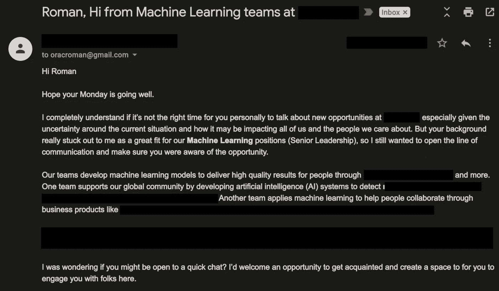

# 如何通过谷歌获得数据科学职位？

> 原文：<https://towardsdatascience.com/how-to-get-contacted-by-google-for-a-data-science-position-95b87f6683fd?source=collection_archive---------4----------------------->

## 最近，一家大型科技公司的招聘人员联系了我。为什么是现在而不是以前？关于如何增加机会的一些建议。


照片由[米切尔罗](https://unsplash.com/@mitchel3uo?utm_source=medium&utm_medium=referral)在 [Unsplash](https://unsplash.com?utm_source=medium&utm_medium=referral)

最近，一家大型科技公司的招聘人员联系了我。为什么是现在而不是以前？

在这篇文章中，我提出了我的理论，解释了为什么一位招聘人员联系我申请高级数据科学职位。你可以用我的理论(并进一步发展)来增加你被大型科技公司联系的机会。

> 许多软件开发人员梦想为大型科技公司工作。我哪里知道？我是其中之一。



我从一家大型科技公司收到的邮件。我故意混淆公司和产品的关键部分。

## **这里有几个你可能会感兴趣的链接:**

```
- [Complete your Python analyses 10x faster with Mito](https://trymito.io/) [Product]- [Free skill tests for Data Scientists & ML Engineers](https://aigents.co/skills) [Test]- [All New Self-Driving Car Engineer Nanodegree](https://imp.i115008.net/c/2402645/1116216/11298)[Course]
```

*你愿意多看一些这样的文章吗？如果是这样，你可以点击上面的任何链接来支持我。其中一些是附属链接，但你不需要购买任何东西。*

# 联系人


杰克逊·大卫在 [Unsplash](https://unsplash.com?utm_source=medium&utm_medium=referral) 上的照片

最近，一家大型科技公司的招聘人员联系了我。我的第一个想法是“这封邮件肯定是假的”。但它写得很好，没有拼写错误(这对于垃圾邮件来说是不寻常的)。

在谷歌上搜索了一下招聘人员后，我发现联系我的人实际上是一家大型科技公司的招聘人员。

然后我就想:**为什么他们现在联系我，以前从来不联系？**

# 梦想为一家大型科技公司工作


Johannes Plenio 在 [Unsplash](https://unsplash.com?utm_source=medium&utm_medium=referral) 拍摄的照片

2013 年，我大学毕业后，我的梦想是为一家大型科技公司工作。

为什么？因为他们雇佣精英中的精英。真的很难进。这似乎是一个巨大的挑战。

所以我和许多年轻的大学生一样。我润色了我的简历，调整了我的 LinkedIn 个人资料，申请了一个大的技术职位。

但我只听到蟋蟀的叫声。

[](/how-to-write-the-perfect-data-science-cv-72213d546ebf) [## 如何写出完美的数据科学简历

towardsdatascience.com](/how-to-write-the-perfect-data-science-cv-72213d546ebf) 

有些人可能会认为，我没有任何参考或经验，但这不是真的。我有一个受欢迎的开源数据科学项目，发表了一篇研究论文，GPA 也不错。

那么和以前有什么不同呢？

# 电话


照片由[汉娜·魏](https://unsplash.com/@herlifeinpixels?utm_source=medium&utm_medium=referral)在 [Unsplash](https://unsplash.com?utm_source=medium&utm_medium=referral) 上拍摄

起初，我不打算和招聘人员通话，因为我不打算申请这个职位。为什么？

嗯，大的科技公司通常会要求你搬迁。一个不成文的要求也是你需要额外努力——这两个在我目前的人生阶段都是不可接受的。**与朋友和家人共度时光对我来说更重要。**

然后我对自己说，我那么努力想过去面试。我应该接这个电话。了解他们要说什么，更重要的是，问**他们为什么决定联系我？**

我以为招聘人员会说:我们的一名工程师偶然发现了你关于 LSTMs 的文章，并说我们需要和这个人谈谈。但是后来我发现事实并非如此。

[](/lstm-for-time-series-prediction-de8aeb26f2ca) [## 时间序列预测的 LSTM

### 用 PyTorch 训练长短期记忆神经网络并预测比特币交易数据

towardsdatascience.com](/lstm-for-time-series-prediction-de8aeb26f2ca) 

# 为什么是我？


[LinkedIn 销售导航员](https://unsplash.com/@linkedinsalesnavigator?utm_source=medium&utm_medium=referral)在 [Unsplash](https://unsplash.com?utm_source=medium&utm_medium=referral) 上的照片

我的答案"**你为什么决定联系我？**”问题让我大吃一惊:**我们在** **LinkedIn** 上找到了你。

我差不多两年没碰我的 LinkedIn 个人资料了。哦，等等。我不久前改变了我的个人资料图片——但是没有成功😂

但是事情发生了变化，因为我开始在 LinkedIn 上收到许多有趣的工作邀请。

有些事情必须改变，但是是什么？这让我开始思考。

# 该理论


胡安·鲁米普努在 [Unsplash](https://unsplash.com?utm_source=medium&utm_medium=referral) 上拍摄的照片

思考了一段时间后，我想出了这个理论。我需要强调一下，**这个** **只是一个理论。我还没有事实证明这一点。但仔细想想还是很有道理的。**

通过定期在 Medium 上写博客，我开始在 LinkedIn 上收到许多连接请求。在我的中等个人资料描述中，有一个链接指向我的 LinkedIn 个人资料。

随着时间的推移，我在 LinkedIn 上的个人资料越来越多，我看到了用它来发布我的文章的潜力。通过定期发布文章，我的同事们很好奇:**罗曼对这些文章有什么企图？**这让我的个人资料和内容更受关注。

通过在 LinkedIn 上自我宣传，用户开始与我的内容和个人资料互动。这使得 LinkedIn 排名算法将我推向了更高的排名。因此，当招聘人员寻找高级数据科学家时，我在名单上名列前茅(或接近榜首)。

想想吧。

领英排名算法眼中的数据科学家哪个最好？

获得最多个人资料视图的人和他/她的内容获得最多的互动。LinkedIn 排名算法对数据科学或者编程一窍不通。它只知道内容参与和档案互动。

# 结论


[达维德·扎维亚](https://unsplash.com/@davealmine?utm_source=medium&utm_medium=referral)在 [Unsplash](https://unsplash.com?utm_source=medium&utm_medium=referral) 上的照片

关键是在 LinkedIn(或任何其他以就业为导向的在线服务)上进行自我推销，这样排名算法就会给你更高的排名。仅仅像我这么长时间以来所做的那样调整 LinkedIn 的个人资料是没有帮助的。

# 在你走之前

在 [Twitter](https://twitter.com/romanorac) 上关注我，在那里我定期[发布关于数据科学和机器学习的](https://twitter.com/romanorac/status/1328952374447267843)消息。


照片由[Courtney hedge](https://unsplash.com/@cmhedger?utm_source=medium&utm_medium=referral)在 [Unsplash](https://unsplash.com/?utm_source=medium&utm_medium=referral) 拍摄